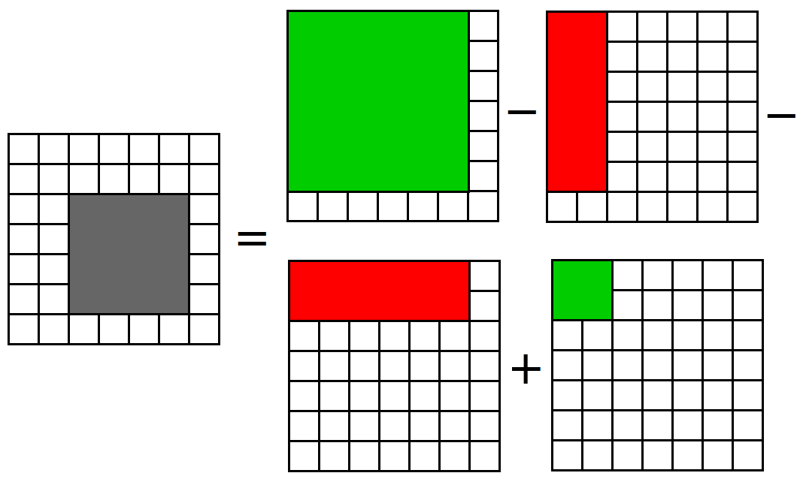

# Prefix Sum(前綴和)

## Elements of Prefix Sum

假設有序列 \\( A = (a_1,a_2,...,a_n) \\)，  
定義：  
\\( 
S_i=
\begin{cases}
  0, & \text{if i = 0 } \\\\
  \sum_{k=1}^{i}a_k, & \text{else}
\end{cases}
 \\)  
我們就把這樣的\\( S \\)，稱作前綴和(prefix sum)。 
   
同樣的，我們也可以定義：  
\\(
D_i=
\begin{cases}
  0, & \text{if i = 0  } \\\\
  a_1, & \text{if i = 1}\\\\
  a_i\ -\ a_{i-1}, & \text{else}
\end{cases}
\\)  
而這個\\(D \\)，我們就叫他差分(finite difference)。

觀察一下，會發現前綴合跟差分互為反運算。  

### 前綴和能拿來幹麻呢？  
對原序列\\( A \\)做前綴和後，我們就能夠很方便的求區間和。  
partial_sum(L，R) \\(=a_L +a_{L+1}+...+a_R =S_R-S_{L-1} \\)  
實際的用途我們會藉由題目來了解  

## Example

> [CSES - Static Range Sum Queries](https://cses.fi/problemset/task/1646)
> 
> 給定長度為 \\(n \\) 的序列\\(A \\), 有 \\(q \\) 筆詢問，對於每筆詢問 \\(a \\), \\(b \\)，求 \\(A \\) 的partial_sum(a,b)。

Solution

倘若使用最Naive的方法，對於每筆詢問，都從\\(A[a] \\)一直加到\\(A[b] \\)，時間複雜度是\\(O(nq) \\)，一定TLE。  
所以我們要先對A做前綴和，之後對每一筆詢問,都只要求\\(S[b]-S[a-1] \\)就好了。  
總時間複雜度：\\(O(n) + O(q) \\)  

> [CSES - Subarray Sums I](https://cses.fi/problemset/task/1660)
> 
> 給定長度為 \\(n \\) 的序列\\(A \\)和整數 \\(x \\),求有多少個subarray的和為\\( x \\)。  

Solution

先對原序列\\( A \\)做前綴和，由於序列中都是正整數，前綴和\\( S \\)為嚴格遞增。這時候就有兩種作法：  
1. \\( O(n) \\)掃過序列\\( S \\), 對所有\\( S_i \\), 找\\( S_i - x \\)是否存在於\\( S \\)中。由於\\( S \\)具有單調性，可以用binary_search搜尋。  
總時間複雜度：\\( O(n)\times O(logn) = O(nlogn) \\)  
2. 使用two_pointer， 可參考[Two Pointer(爬行法)](/two_pointer.md)
總時間複雜度：\\( O(n) \\)  

> [CSES - Forest Queries](https://cses.fi/problemset/task/1652/)
> 
> 詳見原題

Solution

建立一個二維的前綴和\\(S \\)，\\( S[i][j] \\)代表從\\( [1,1] \\)到\\( [i,j] \\)圍成的長方形中共有幾顆樹。對於每筆詢問\\( ([x_1,y_1],[x_2,y_2]) \\)，可發現答案為\\( S[x_2][y_2] - S[x_2][y_1-1] - S[x_1-1][y_2] + S[x_1-1][y_1-1] \\) (如圖)

至於前綴和\\( S \\)要怎麼建呢？  
可觀察上面的想法，得出\\( S[i][j] = S[i-1][j] + S[i][j-1] - S[i-1][j-1] \\)。  

根據類似的想法，可以將prefix sum的概念推廣到更高維度。  

## Summary

* prefix sum通常出現在求區間和的時候，不過也可能搭配其他的解題技巧，使問題沒有那麼明顯。  
* 能夠用BIT(Binary Index Tree)這種資料結構，使前綴和可以做到動態修改。  

## References
- [[競技程式設計一 上課講義] CP Techniques](https://docs.google.com/presentation/d/15MeF2bke3Jts8MipEHeTEyZAdrabMeeCfvZCbvuRSQ4/edit#slide=id.p)
- [OI wiki](https://oi-wiki.org/basic/prefix-sum/)