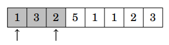
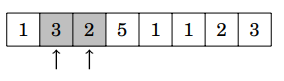
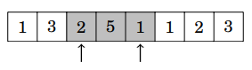
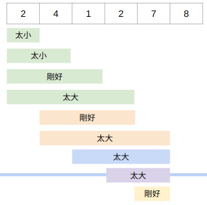

# Two Pointer(爬行法)

當資料具有某種單調性的時候，除了Binary Search，我們還可以用Two Pointers。  

Two Pointer的核心概念是這樣的：  
維護兩個pointer，而這兩個pointer只能往特定的方向走（要馬往前，要馬往後）  
以下是示意圖（兩個pointer都只能++)  
  



## Example

> [CSES - Subarray Sums I](https://cses.fi/problemset/task/1660)
> 
> 給定長度為 \\(n \\) 的序列\\(A \\)和整數 \\(x \\),求有多少個subarray的和為\\( x \\)。

<details><summary>Solution</summary>
使用two pointer：
    
```
for(int r = 0; r < n; r++){
    sum += A[r];
    while(sum > x){
       sum -= A[l++];
    }
    if(sum == x) ans++;
}
```

維護兩個index \\( l，r\\)，初始都為\\( 0 \\)，  
當sum太小了，讓\\(r\\)向前走，並把\\(r\\)指到的元素加進subarray，  
當sum太大了，讓\\(l\\)往前走，並把\\(l\\)指到的元素移除，直到sum不比x大為止，  
當sum 剛好等於 \\(x\\)的時候，ans++，並讓\\(r\\)繼續向前移動。  
    
舉個例子：

令\\(x = 7，A = {2,4,1,2,7,8}\\)，

因為我們知道，當subarray太大的時候，我們只有縮小他才可能是答案，  
同樣的，當subarray太小的時候，我們就不需要去考慮更小的情況。  
所以，相較於\\( O(n^2)\\)暴力枚舉所有區間，我們最多只需要\\(l,r\\)兩個pointer個掃過一次，\\(O(n) \\)的時間就可以了。  
 
</details>
    
> [CSES - Subarray Distinct Values](https://cses.fi/problemset/result/5117479/)
>
> 給定長度為\\( n\\)的序列\\( A\\)與整數\\( k\\)，求有多少個subarray的distinct value不超過\\(k\\)。  
    
<details><summary>Solution</summary>
    
維護一個資料結構，代表每個元素出現幾次，  
然後就可以利用Two Pointers來動態的移動subarray，同時插入/刪除元素。  
這裡使用std::map  

```
for(int r=0;r<n;r++) {
    if(count[A[r]]==0) now++;
    count[A[r]]++;
    while(now>k) {
        count[A[l]]--;
        if(count[A[l]] == 0)now--;
        l++; 
    }
    if(now == k) ans += (r - l + 1);
} 
```
\\(count\\)是一個map，\\(count[x]\\)代表\\(x\\)這個元素在subarray裡出現幾次，而\\(now\\)代表當前subarray內有幾個不同的元素。  
一樣two pointer的概念，當\\(now\\)比\\(k\\)小時，繼續將\\(r\\)向右移，加入元素。  
當\\(now\\)比\\(k\\)大時，一樣將\\(l\\)向右移，刪除元素，直到\\(now \ = \ k\\)為止。  
而當\\(now = k\\)時，因為我們知道區間\\([l,r]\\)的subarray的distinct value一定小於區間\\([l,r]\\),所以這些都是合法的解。  
時間複雜度:\\( O(n)\times O(logn) = O(nlogn) \\)  
    
</details>

## References
- CP handbook
- [[競技程式設計一 上課講義] CP Techniques](https://docs.google.com/presentation/d/15MeF2bke3Jts8MipEHeTEyZAdrabMeeCfvZCbvuRSQ4/edit#slide=id.p)