# KMP 演算法

Knuth-Morris-Pratt 演算法（簡稱為 KMP）可在一個字串\\(s\\)內快速的尋找一個字\\(t\\)的出現位置。KMP 的核心思想是利用已經匹配過的信息，避免對主串中已經比對過的位置進行重複比對。

## 前綴函數

給定一個長度為\\(n\\)的字串\\(S\\)，字串\\(S\\)的前綴函數定義為一個長度為\\(n\\)的陣列\\(\pi\\)，\\(\pi[i]\\)的定義為子字串\\(S[0……i]\\)的次長共同前後綴的長度，取次長的是因為字串\\(S\\)的最長共同前後綴等於\\(S\\)故沒有討論意義。在這裡定義\\(\pi [0]=0\\)。以\\(abaab\\)為例，前綴函數\\(\pi\\)為\\([0,0,1,1,2]\\)。

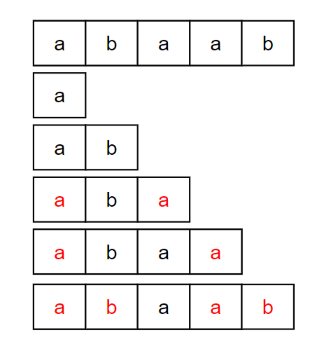

## 實作

前綴函數可以用動態規劃的方式建立，從\\(\pi[0],\pi[1]...\pi[k]\\)可以得出\\(\pi[k+1]\\)，請看以下圖例解釋。

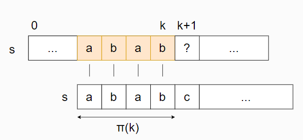

根據前綴函數的定義，長度為\\(\pi[k]\\)的前綴(也就是\\(s[0...\pi [k]-1]\\))是所有前綴中次長能夠匹配上\\(s[0……k]\\)的後綴。如上圖所示\\(s[0……k]\\)的次長共同前後綴為\\(abab\\)，也就是\\(\pi[k]=4\\)。

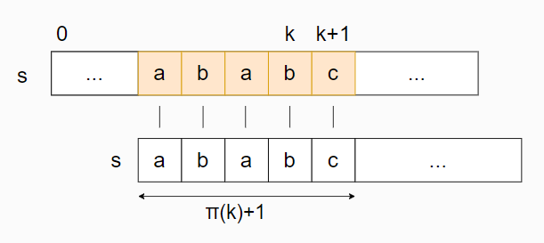

若\\(s[ \pi[k]]=s[k+1]\\) 則可以得出\\(\pi[k+1] = \pi[k]+1\\)，可以自己用反證法在這裡就不多作贅述。在上圖的例子中\\(s[ \pi[k]]=s[k+1]=c\\)故\\(\pi[k+1]=\pi[k]+1=4+1=5\\)。

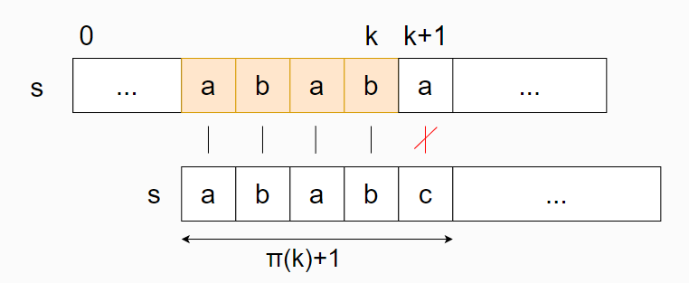

但如果\\(s[ \pi[k]]\neq s[k+1]\\)怎麼辦呢?

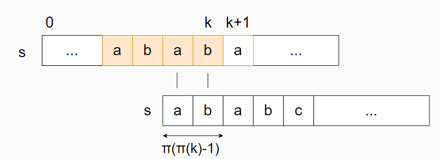

若\\(s[ \pi[k]]\neq s[k+1]\\)則我們可以將下面的\\(s\\)往右移並找到下一個次長共同前後綴來匹配上\\(s[0……k]\\)的後綴，也就是\\(\pi [ \pi[k]-1 ]\\)。在上圖的例子中\\(abab\\)的次長共同前後綴是\\(ab\\)因此可以直接透過向右移\\(\pi [ \pi[k]-1 ]\\)來繼續匹配\\(s[k+1]\\)。

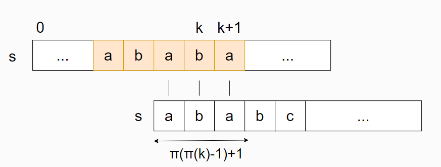

若\\(s[\pi [ \pi[k]-1 ]]=s[k+1]\\)則可以得出\\(\pi[k+1] = \pi [ \pi[k]-1 ]+1\\)。  
若\\(s[\pi [ \pi[k]-1 ]] \neq s[k+1]\\)則可以像上面的例子一樣找到下一個次長共同前後綴(直到前綴函數值為 0)最後得出\\(\pi[k+1]\\)。  
  
由於最多匹配\\(|s|\\)次，而且當匹配失敗時下面的\\(s\\)往右移時最多失敗次數不會超過字串長度\\(|s|\\)因此時間複雜度為\\( \mathcal{O}(|s|) \\)。下面為程式碼。

```cpp
vector<int> prefix_function(string s) {
    int n = (int)s.length();
    vector<int> pi(n);
    for (int i = 1; i < n; i++) {
        int j = pi[i-1];
        while (j > 0 && s[i] != s[j])
            j = pi[j-1];
        if (s[i] == s[j])
            j++;
        pi[i] = j;
    }
    return pi;
}
```

## 字串匹配問題

給定一個字串\\(S\\)和文字\\(t\\)，我們需要找到所有字串\\(S\\)出現在文字\\(t\\)的位置。接下來用\\(n\\)和\\(m\\)分別表示字串\\(S\\)和文字\\(t\\)的長度。  

第一種解法首先先介紹最常見的 KMP 演算法，先計算好\\(S\\)的前綴函數\\(\pi\\)並且用兩個指標來分別表示當下字串\\(S\\)和文字\\(t\\)比較的位置。

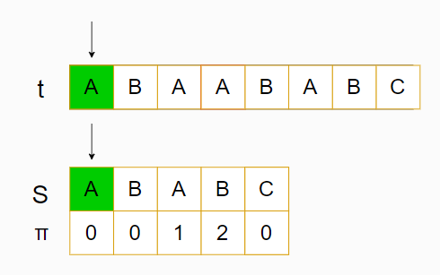

如上圖所示目前比較位置為\\(S[0],t[0]\\)，由於皆為\\(A\\)因此匹配成功兩個指標都可以往後一格。

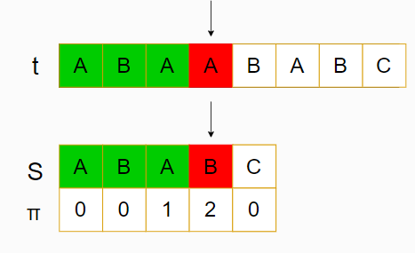

比到\\(S[3],t[3]\\)時\\(S[3]\neq t[3]\\)，這種時候該怎麼辦呢?

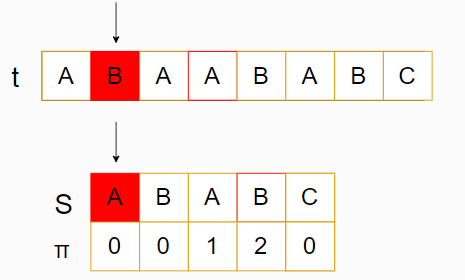

最暴力的方法就是將下面的\\(S\\)往右一格並且從\\(t[1]\\)開始比，但用眼睛都知道不可能成功畢竟一個是\\(A\\)一個是\\(B\\)，有沒有辦法直接右移到最有可能的位置呢?

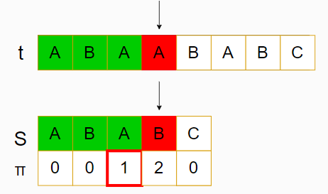

讓我回到匹配失敗前，我們已知道前三個位置是匹配成功的。這時候我們可以想到前綴函數的定義就是次長的共同前後綴因此\\(\pi[2]=1\\)的意思就是我們可以直接將\\(S[0]\\)對到\\(S[2]\\)的位置。

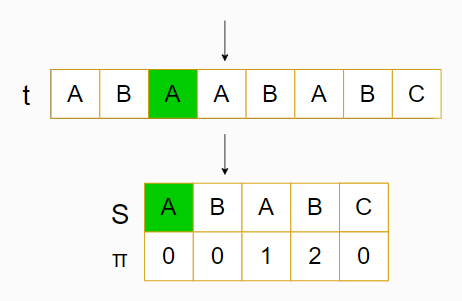

就像上圖所示，直接將\\(S\\)右移到使得\\(S[0]\\)對到剛剛\\(S[2]\\)的位置後繼續進行後面的匹配。以下為程式碼。

```cpp
vector<int> KMP(string a,string b){
 int i = 0 ,j = 0;
 vector<int> pi = prefix_function(b);
 vector<int> ans;
 while(i < a.size()){
  if(a[i] == b[j])i++,j++;
  else if(j > 0) j = pi[j-1];
  else           i++;
  if(j == b.size())ans.emplace_back(i-j);
 }
 return ans;
}
```

第二種解決這個問題可以先令一個字串為\\(S+ \\# +t\\)，其中\\(\\#\\)是個沒有出現在\\(S\\)和\\(t\\)中的分隔號。接下來算出此字串的前綴函數，由前綴函數的定義可以知道\\(\pi [ i ]\\)是子字串的次長共同前後綴的長度。由於有分隔號的存在因此長度不會超過\\(n\\)，然而\\(\pi [ i ] = n\\)時代表字串\\(S\\)完全出現並且終點位置為\\(i\\)。因此假設位置\\(i\\)時\\(\pi [ i ] = n\\)則代表字串\\(S\\)在文字\\(t\\)的\\(i-(n+1)-n+1=i-2n\\)位置出現。

```cpp
vector<int> find_string (string t, string S) {
  string cur = S + '#' + t;
  int m = t.size(), n = S.size();
  vector<int> ans;
  vector<int> pi = prefix_function(cur);
  for (int i = n + 1; i <= n + m; i++) {
    if (pi[i] == n)
      ans.push_back(i - 2 * n);
  }
  return ans;
}
```

時間複雜度為\\( \mathcal{O}(n+m) \\)。

## 應用

## 字串的邊界和週期

考慮以下兩個問題：

> [CSES - Finding Borders](https://cses.fi/problemset/task/1732)
>
> 一個邊界(border)的定義為字串中前綴等於後綴的部分且不能是整個字串，題目的輸入為一個長度為\\(n\\)的字串並且找出此字串的所有邊界長度。舉例說輸入為\\(abcababcab\\)，其邊界有\\(ab\\)和\\(abcab\\)因此輸出長度 2 和 5。
>
>- \\(1 \leq n \leq 10^6\\)

我們可以很輕易就想到用前綴函數來解決這個問題，根據題目給定的字串\\(S\\)構造 prefix function，根據定義其所有邊界的長度是\\(\pi[n-1]\\)、\\(\pi [ \pi[n-1] -1] \\)...一路遞迴到長度為 0。
<details><summary>AC code</summary>

```cpp

#include <bits/stdc++.h>
using namespace std;

vector<int> pi;
vector<int> prefix_function(string s) {
    int n = (int)s.length();
    vector<int> pi(n);
    for (int i = 1; i < n; i++) {
        int j = pi[i-1];
        while (j > 0 && s[i] != s[j])
            j = pi[j-1];
        if (s[i] == s[j])
            j++;
        pi[i] = j;
    }
    return pi;
}

void find_border(int j){
    if(j == 0)return;
    find_border(pi[j-1]);
    cout<<j<<" ";
}
int main() {
    string s ;
    cin>>s;
    pi = prefix_function(s);
    find_border(pi[s.size()-1]);
}

```

</details>
  
> [CSES - Finding Periods](https://cses.fi/problemset/task/1733)
>
> 一個週期(period)的定義為字串中一個前綴且此可以透過不斷重複此前綴來產生出整個字串，其中最後一段的重複可以是不完整的。題目的輸入為一個長度為\\(n\\)的字串並且找出此字串的所有週期的長度。舉例來說輸入為\\(abcabca\\)，其週期有\\(abc\\)、\\(abcabc\\)和 \\(abcabca\\)因此輸出長度 3、6 和 7。
>
>- \\(1 \leq n \leq 10^6\\)

這題的想法是觀察到邊界和週期是有關連的，若有一長度為\\(n\\)字串\\(S\\)有一個長度\\(r\\)的邊界則其對應到它有一個長度為\\(n-r\\)的週期。舉例來說\\(abcabca\\)的邊界有\\(a,abca\\)，所以對應到長度為\\(n-r\\)的週期分別是\\(abcabc,abc\\)。另外不要忘記字串\\(S\\)本身也是一個週期，並且由於\\(\pi[n-1] \\)是\\(S\\)的最長邊界故\\(n - \pi[n-1] \\)是其最短週期。
<details><summary>AC code</summary>

```cpp
#include <bits/stdc++.h>
using namespace std;

vector<int> pi;
vector<int> prefix_function(string s) {
    int n = (int)s.length();
    vector<int> pi(n);
    for (int i = 1; i < n; i++) {
        int j = pi[i-1];
        while (j > 0 && s[i] != s[j])
            j = pi[j-1];
        if (s[i] == s[j])
            j++;
        pi[i] = j;
    }
    return pi;
}

void find_period(int j,int len){
    if(j == 0){
        cout<<len;
        return;
    }
    cout<<len-j<<" ";
    find_period(pi[j-1],len);
}
int main() {
    string s ;
    cin>>s;
    pi = prefix_function(s);
    find_period(pi[s.size()-1],s.size());
}
```

</details>

## 字串中所有相異子字串的數量
>
> [CSES - Distinct Substrings](https://cses.fi/problemset/task/2105)
>
> 給定一個長度為\\(n\\)的字串，我們需要找到字串中所有相異子字串的數量。舉例來說題目輸入為\\(abaa\\)，輸出為 8 因為此字串共有 8 個相異子字串分別是\\(a, b, aa, ab, ba, aba, baa , abaa\\)。
>
>- \\(1 \leq n \leq 10^5\\)

這題用 KMP 可能會 TLE 因為時間複雜度會是\\( \mathcal{O}(n^2) \\)。若用 KMP 可以用迭代的方式解決此題，假設當前在\\(S\\)中有\\(k\\)個相異子字串，則在字串尾端插入字元\\(c\\)後會有些以\\(c\\)當結尾的新子字串出現，現在我們要計算出有哪些沒有出現過的新子字串。  

我們拿字串\\(t = S + c\\)並且反轉後得到\\(t'\\)則現在變成要解決有多少\\(t'\\)的前綴並沒有出現在其他地方。若我們算出了\\(t'\\)的前綴函數中的最大值\\(\pi_{max}\\)，則代表在\\(S\\)中最長的前綴是\\(\pi_{max}\\)並且所有更短的前綴也會隨之出現。因此當我們在字串尾端插入字元\\(c\\)後會出現\\(|S|+1- \pi_{max} \\)個新的子字串。  

在字串尾端插入字元\\(c\\)後計算出會有多少個新的子字串會花\\( \mathcal{O}(n) \\)，因此總時間複雜度為\\( \mathcal{O}(n^2) \\)，所以最好使用其他像是 suffix array 的方法解。

## 例題

> [Codeforces - Anthem of Berland](https://codeforces.com/contest/808/problem/G)
>
> 有一字串\\(s\\)由多個小寫字母、問號組成和一字串\\(t\\)由多個小寫字母組成，試問將所有問號替換成任何小字母使得字串\\(t\\)在\\(s\\)中出現最多次的次數為何?另外\\(t\\)可以互相重疊。
>
>- \\( |s|, |t| \leq 10^5\\)
>- \\(|s| \times |t| \leq 10^7 \\)

<details><summary>Solution</summary>

此題可以用 dp 搭配 kmp 解決。假設 \\(f_i\\) 為 \\(t\\) 在 \\(s\\) 前 \\(i\\)個位置中出現最多次的次數。首先\\(f_i\\)有可能從\\(f_{i-|t|}\\)來的，這表示\\(s[i-|t|+1] \sim s[i]\\)有一個完整的 \\(t\\)。  

除此之外我們還需要考慮到\\(t\\)是可以互相重疊，因此當前位置放的\\(t\\)可能不是完整的，而是和上一個\\(t\\)的後綴重疊而成的。因此我們可以用 kmp 中的前綴函數並從長度\\(|t|\\)開始往前找來保證前後綴的相等。  

假設有個長度為\\(k\\)的前後綴相等，我們再定義一個\\(g_i\\)來表示在 \\(s\\) 前 \\(i\\)個位置中強制在最後放一個\\(t\\)的最多出現次數。也就是\\(g_i = max \\{g_{i-(|t|-k)}+1,g_i\\} \\)。最後用\\(f_i = max \\{f_{i-1},g_i\\} \\)來表示放與不放\\(t\\)的情況。

```cpp
#include <bits/stdc++.h>
#define MAX 100005
using namespace std;
 
char s[MAX],t[MAX];
int n,m;
int pi[MAX],f[MAX],g[MAX];
 
bool check(int p){
    for(int j=1;j<=m;j++){
        if(s[p-j+1]!=t[m-j+1]&&s[p-j+1]!='?')return false;
    }
    return true;
}
 
int main()
{
    scanf("%s%s",s+1,t+1);
    n = strlen(s+1),m = strlen(t+1);
    for(int i = 2,j=0;i<=m;i++){
            while(j&&t[j+1]!=t[i])j=pi[j];
            if(t[j+1]==t[i])j++;
            pi[i]=j;
    }
    for(int i = 1;i<=n;i++){
        f[i] = f[i-1];
        if(check(i)){
            g[i] = f[i-m]+1;
            for(int j = pi[m];j;j = pi[j]){
                g[i]=max(g[i],g[i-(m-j)]+1);
            }
            f[i] = max(f[i],g[i]);
        }
    }
    cout<<f[n]<<endl;
    return 0;
}

```

</details>

> [Codeforces - MUH and Cube Walls](https://codeforces.com/problemset/problem/471/D)
>
> 有\\(A,B\\)兩個圖形，其中一個圖形可以看做多個寬度為 1 而高度不同的長方形排在一起。此題希望在\\(A\\)中找到最多\\(B\\)的出現次數，而且可以透過上下移動\\(B\\)來最大化在\\(A\\)中的匹配。

<details><summary>Solution</summary>

這題解法為把它看成字串匹配問題。由於可以把\\(B\\)上下移動因此重點是各個高度的差值，因此需要把高度陣列轉換成差值，例如\\([3,4,4,3,2]\\)變成\\([-1,0,1,1]\\)。接下來就把這\\(A,B\\)者兩個轉換過後的差值陣列拿去跑 KMP 字串配對即可。最後要記得特判若圖形只有一列高度的情況。

```cpp
#include <bits/stdc++.h>
using namespace std;
int s[2000000];
int prefix_function(int w, int n) {
    vector<int> pi(n);
    int counter = 0;
    for (int i = 1; i < n; i++) {
        int j = pi[i-1];
        while (j > 0 && s[i] != s[j])
            j = pi[j-1];
        if (s[i] == s[j])
            j++;
        pi[i] = j;
        if(pi[i] == w-1)counter++;
    }
 return counter;
}
int main() {
    int n,m;
    cin >> n >> m;
    vector<int>arr1(n), arr2(m);
    for(int i = 0 ; i < n; i++)cin >> arr1[i];
    for(int i = 0 ; i < m ; i++)cin >> arr2[i];
    if(m == 1){
        cout <<n <<'\n';
        return 0;
    }
    int sz = 0;
    for(int i = 1 ;i < m; i++)
        s[sz++] = arr2[i] - arr2[i-1];
    s[sz++] = 1e9;
    for(int i = 1 ; i < n; i++)
        s[sz++] = arr1[i] - arr1[i-1];
    cout << prefix_function(m, sz) << '\n';
}
```

</details>

> [Codeforces - Prefixes and Suffixes](https://codeforces.com/contest/432/problem/D)
>
> 給定一個長度為\\(n\\)的字串\\(S\\)，找出其所有前後缀相等的子字串長度並且在整個\\(S\\)的出現次數。

<details><summary>Solution</summary>

用 KMP 求得前缀函數後從\\( \pi [n-1]\\)往前跳找出所有的共同前後缀。接下來令\\(dp [i] \\)並定義為長度為\\(i\\)的前缀出現次數，也就是\\(dp[ \pi[i] ] += dp[i]\\)。

</details>

> [Codeforces - Lucky Common Subsequence](https://codeforces.com/contest/346/problem/B)
>
>給定兩個字串\\(s1,s2\\)和一個字串叫做\\(virus\\)，題目要求找出\\(s1,s2\\)的最常共同子序列(subsequence)且\\(virus\\)不能是其子字串(substring)。

<details><summary>Solution</summary>

此題為 KMP 搭配 DP 的題目，用 dp [ i ] [ j ] [ k ]表示\\(s1\\)前\\(i\\)個和\\(s2\\)前\\(j\\)個匹配到\\(virus\\)第\\(k\\)個字元的最大值，並且匹配失敗時可以用前綴函數使得我們不用從頭比較。

</details>

> [AtCoder - Prefix Concatenation](https://atcoder.jp/contests/abc257/tasks/abc257_g)
>
> 給定兩個字串\\(S,T\\)，求得最小值 k 使得用\\(k\\)個\\(S\\)的前綴相連能夠拚出\\(T\\)。舉例來說\\(S=aba,T=ababaab\\)則\\(T\\)可以寫成\\(ab+aba+ab\\)而這些都是\\(S\\)的前綴，由於拆成 3 個前綴是最小值因此輸出 3。

<details><summary>Solution</summary>

此題為 KMP 搭配 DP 的題目。令\\(S(i,j),T(i,j)\\)分別代表其\\([i,j]\\)的子字串，考慮\\(T(1,i)\\)的最小\\(k\\)可得\\(dp[i]\\)的轉換式，並且每次轉移時用 KMP 的前綴函數來找到最小的合法\\(j\\)。

</details>

## References

- [cp-algorithms - prefix function](https://cp-algorithms.com/string/prefix-function.html)
- [oi-wiki - kmp](https://oi-wiki.org/string/kmp/)
- [geekforgeeks-remove all occurences of a given substring](https://www.geeksforgeeks.org/remove-all-occurrences-of-string-t-in-string-s-using-kmp-algorithm/?ref=rp)
