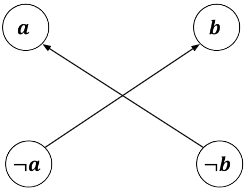
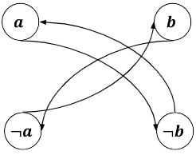

## 2-SAT problem

### Definition 
SAT(Boolean satisfiability problem)中文為滿足性問題，給定一個布林運算式，想辦法assign給每個布林變數一個值(True of False)，使得該運算式為True。

而K-SAT問題為：規定運算式的所有子句，最多只能有K個變數

對於K > 2，K-SAT問題已被證明為NP-Complete。
而對於2-SAT問題則存在多項式時間的算法

### Transfer 2-SAT to Graph Problem

對於一個2-SAT問題，根據每個clause的依賴性，可以轉為圖論問題，

舉例來說，考慮clause: \\( a \lor b\\)
若要讓此clause為真，則
若\\(a = false\\)，\\(b \\)必為\\( true \\)
若\\(b = false\\)，\\(a \\)必為\\( true \\)

所以轉成圖論可以這樣連：


再舉個例子： \\( a \oplus b\\)
若要此clause為真，則
若\\(a = false\\)，\\(b \\)必為\\( true \\)
若\\(b = false\\)，\\(a \\)必為\\( true \\)
若\\(a = true\\)，\\(b \\)必為\\( false \\)
若\\(b = true\\)，\\(a \\)必為\\( false \\)

### Aspvall, Plass & Tarjan Algorithm

成功的將2-SAT轉成圖之後，要怎麼找出一組可行的解呢？
或著，我們可以先想一下，在什麼情況下2-SAT問題可能無解？

Aspvall 證明了，一組2-SAT問題如果有解,若且唯若不存在布林變數\\( X\\), such that \\(X \\)跟\\( \neg X \\)處於同一SCC中。

於是我們就得到了一組\\( O(n) \\)檢查2-SAT是不是satisfiable的演算法。跑完Tarjan/Kosaraju找出所有SCC之後，對於所有變數\\(X \\)，檢查\\(X \\)跟\\( \neg X \\)是不是在同一個SCC中就好。

Aspvall 也證明了，一組2-SAT問題如果有解，一樣能用\\( O(n) \\)的時間找出一組可行解。

先對所有找到的SCC縮點，接著依照拓樸排序的順序assign值給SCC內的所有點，若\\( X \\)是\\( true\\)，則\\( \neg X\\)自動assign \\( false \\)。當所有Variable都被assign了一個值，就是一組可行解。

## Problems
> [CSES - Giant Pizza](https://cses.fi/problemset/task/1684)
> 詳見原題

<details><summary>Solution</summary>

可看出此題為2-SAT，其中每個人的願望都為以下形式\\( A \lor B \\), \\( A \\)可能為\\( a, \neg a \\), \\( B \\)可能為\\( b, \neg b \\)。

先檢查完所有點與它的negation不在同一SCC中之後，需要構造出一組解。這邊利用了\\( X \\)與\\( \neg X \\)的對稱性，在拓樸排序的過程中順便assign值給變數。

```
#include<bits/stdc++.h>
using namespace std;
#define int long long
const int N = 2e5+5;
#define neg(x) x > m ? x-m : x+m

int n,m,Time = 0,SCCID = 0;
vector<vector<int>> G(N), DAG(N);
vector<int> low(N,0),depth(N,0),inStack(N),SCC(N,-1);
stack<int> stk;
vector<int> solved(N,0), opp(N);
void DFS(int u, int fa) {
	depth[u] = low[u] = ++Time;
	stk.emplace(u);
	inStack[u] = 1;
	for(int v : G[u]) {
		if(!depth[v]) {
			DFS(v,u);
			low[u] = min(low[u], low[v]);
		}
		else if (inStack[v]) {
			low[u] = min(low[u], depth[v]);
		}
	}
	if(depth[u] == low[u]) {
		int x;
		do {
			x = stk.top();
			stk.pop();
			SCC[x] = SCCID;
			inStack[x] = 0;
		} while(x != u);
		++SCCID;
	}
	return ;
}
 
void Compress() {
    for(int u = 1;u <= n;u++) {
		for(int v : G[u]) {
			if(SCC[v] == SCC[u]) continue;
			DAG[SCC[u]].emplace_back(SCC[v]);
		}
	}
}
 
void add_edge_or(int u, int v) {
	G[neg(u)].emplace_back(v);
	G[neg(v)].emplace_back(u);
}

signed main() {
	cin>>n>>m;
	for(int i=0;i<n;i++) {
		char op1,op2;
		int u,v;
		cin>>op1>>u>>op2>>v;
		if(op1 == '-') u = neg(u);
		if(op2 == '-') v = neg(v);
		add_edge_or(u,v);
	}
	for(int i=1;i<=2*m;i++) {
		if(!depth[i]) DFS(i,i);
	}
	for(int i=1;i<=m;i++) {
		if(SCC[i] == SCC[neg(i)]) {
			cout<<"IMPOSSIBLE\n";
			return 0;
		}
      	else {
        	opp[SCC[i]] = SCC[neg(i)];
          	opp[SCC[neg(i)]] = SCC[i];
        }
	}
	Compress();
	for(int i=0;i<SCCID;i++) {
		if(solved[i] == 0) {
        	solved[i] = 1;
          	solved[opp[i]] = -1;
        }
	}
	for(int i=1;i<=m;i++) {
		if(solved[SCC[i]] == 1) cout<<"+ ";
		else if(solved[SCC[i]] == -1)cout<<"- ";
	}
}
```

</details>
    
> [hdu 3062 Party](http://acm.hdu.edu.cn/showproblem.php?pid=3062)
>有\\(n\\)對夫妻被邀請到一個聚會，每對夫妻只有一位可以出席。在\\(2n\\)個人中，有些人之間有矛盾，而有矛盾的人無法同時出現在聚會上，問聚會上有沒有可能出現\\(n\\)個人？
    
<details><summary>Solution</summary>

不難看出這是一個2-SAT的問題，只需要把一對夫妻視為一對\\( (X, \neg X) \\)，而每個矛盾關係都是\\( \oplus \\)。
    
</details>