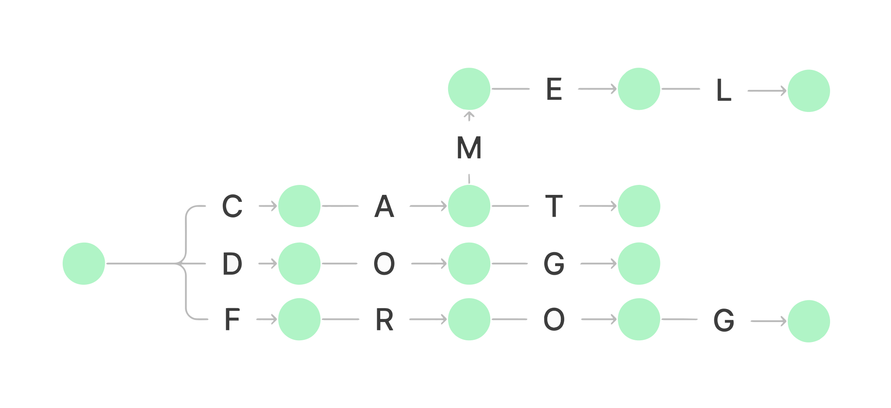
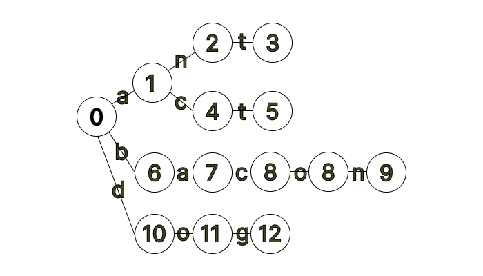
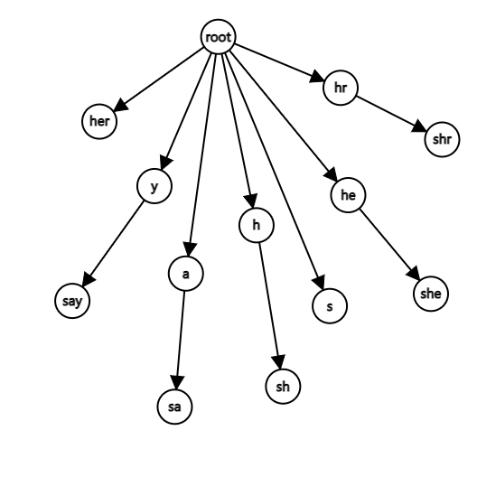

# AC自動機(AC Automaton)

## Introduction

AC自動機是結合Trie的結構(Data Structure)及KMP演算法(Algorithm)而形成的自動機，經常用於解決多模式匹配的問題。該一算法誕生於1975年的貝爾實驗室，由Alfred Aho和Margaret Corasick發表。了解AC自動機之前需先理解字典樹Trie如何使用，該算法使用KMP算法中Fail Function的概念，將其應用於Trie中作為失敗邊，藉著失敗邊達到更有效率的狀態轉移。

## 自動機理論
Trie的節點(Vertex)可以視為確定有限狀態自動機(Finite deterministic automaton)的狀態，藉由輸入的字母達到狀態轉移。

## Trie的實現
在一個Trie中節點的含意是某個模式串的前綴，或者我們也可以將其稱之為一種狀態(State)，一個節點即代表一個狀態。而邊則是代表狀態之間的轉移，對於長度為n的字串，可能出現的字元數為k的字串，一個簡單具有插入及搜尋操作的Trie可以如以下方式呈現，時間複雜度顯然是線性的 \\(O(n)\\)，但其空間複雜度可以至 \\(O(nk)\\)，占用過多的空間是Trie在實作上必須特別注意的一個點。
```c++=
const int K = 26;
struct Vertex {
    int next[K];
    bool leaf = false;
    Vertex() {
        fill(begin(next), end(next), 0);
    }
};

vector<Vertex> trie(1);

void insert(string const &s) {
    int v = 0;
    for (char ch : s) {
        int c = ch - 'a';
        if (trie[v].next[c] != 0) {
            trie[v].next[c] = trie.size();
            trie.emplace_back();
        }
        v = trie[v].next[c];
    }
    trie[v].leaf = true;
}

bool search(string const& s) {
    int v = 0;
    for(char ch : s) {
        int c = ch - 'a';
        v = trie[v].next[c];
        if(v == trie.size())
            return false;
    }
    return trie[v].leaf;
}

```


## 失配指針
AC自動機利用失配指針來協助多模式串的匹配，用途是在配對失敗的時候加速跳轉到下一個可能匹配的模式串。在AC自動機中，狀態u的失配指針指向另一個狀態v，其中v是u的最長後綴(所有後綴狀態中最長的一個)。

失配指針構建可以參考KMP的next指針的構建思想，考慮字典樹目前節點u，u的父節點p，p通過字符c可以狀態轉移至u，即p通過字符c有邊指向u，表示為trie[p,c]=u。假設深度小於u的所有節點的失配指針都已求得，則可以依下述求得當前節點u的失配指針:

1.若trie[fail[p], c]存在 : 將u的失配指針指向trie[fail[p],c]，等效於建立了p及fail[p]以字符c連接的子節點之間的連結。

2.若trie[fail[p], c]不存在 : 繼續尋找trie[fail[fail[p]],c]，直到失配指針到達根節點為止

3.若到達根節點trie[fail[p],c]依然不存在，則將失配指針指向根節點

## AC自動機的構建
AC自動機在建構之初會將將模式串建構成一個Trie，之後可以通過廣度優先搜尋(BFS, Breadth first search)遍歷已建構完成的Trie建構AC自動機，並同時建立失配指針。

1.trie[u].next[c] : trie的一條邊，同時也是從節點(狀態)u經由加入字符c所到達的節點(狀態)

2.隊列(queue)q : 用於以BFS遍歷字典樹

3.fail[u] : 節點(狀態)u的失配指針

```c++=
const int K = 26;
void build() {
    for (int i = 0; i < K; i++)
        if (trie[0].next[i]) q.push(trie[0].next[i]);
    while (!q.empty()) {
        int u = q.front(); q.pop();
        for (int i = 0; i < K; i++) {
            if (trie[u].next[i])
                fail[trie[u].next[i]] = trie[fail[u]].next[i], q.push(trie[u].next[i]);
            else
                trie[u].next[i] = trie[fail[u]].next[i];
        }
    }
}
```

利用BFS依序將字典樹的節點放入隊列中，依次求其fail指針，字典樹之根節點預設為0，並將根節點的孩子依次放入隊列中，若將根節點放入隊列中，之後的操作將會把根節點的值設為自己本身，因此此處須將根節點的孩子放入隊列中。

BFS過程：每次取出隊首的節點u（fail[u] 在之前的 BFS 過程中已求得），然后遍歷字符集：

1.如果trie[u].next[i] 存在，我们就將 trie[u].next[i] 的 fail 指針賦值為 trie[fail[u]].next[i]。

2.否則，令 trie[u].next[i] 指向 trie[fail[u]].next[i] 的狀態。

透過修改字典樹的結構，將原先不存在的字典樹狀態鏈結到fail指針的對應狀態，我們就能省去利用while迴圈進行跳轉的動作，原先必須透過不停地跳轉fail指針以找到節點u的對應節點，然後賦值，但是透過修改字典樹的操作，我們便能節省這一步驟，相當於用字典樹直接記住下一個能轉移的位置。因為此一步驟只會增加轉移關係，所以增加的轉移關係並不會影響原本的字典樹的狀態。

trie[S].next[c] 等同於在字串S後添加一個字符變成一個新字串S'。如果 S' 存在，說明存在一个模式串的前缀是 S'，否則我们讓 trie[S].next[c] 指向 trie[fail[S]].next[c]。由於 fail[S] 對應的字符串是 S 的後綴，因此 trie[fail[S]].next[c] 對應的字符串也是 S' 的後綴。

換言之在 Trie 上進行狀態轉移的時候，我們會從 S 轉移至 S'，相當于匹配了一個 S'；但在 AC 自動機上狀態轉移的時候，我们會從 S 轉移至 S' 的後綴，也就是我們匹配一个字符 c，然後捨棄 S 的部分前綴，而因為S是匹配的，所以捨棄S的前綴顯然是能匹配的。同理在fail指針之中，若文本串能匹配 S，則顯然它也能匹配 S 的後綴。故 fail 指針其實可以算是 S 的一個後綴集合。



## AC自動機的查找
```c++=
int query(string &str) {
    int u = 0, result = 0;
    for (int i = 1; str[i]; i++) {
        u = trie[u].next[str[i] - 'a'];
        for (int j = u; j && f[j] != -1; j = fail[j]) {
            result += f[j], f[j] = -1;
        }
    }
    return result;
}
```

節點 u 作為當前匹配到的節點，result 儲存即將回傳的答案。遍歷字串，使 u 在字點數上跟蹤字符。並利用 fail 指針找出所有匹配的模式串，累加到答案中。

## Fail Tree

我们將除了根節點的Fail指針外，其餘節點的Fail指針反向。可以證明，除去根節點的fail指針外，剩下的fail指針和節點將構成一棵樹！
我们可以發現Fail Tree將所有點組織成了一種特殊的形式 : 父節點是所有子節點的後綴
Fail Tree有個很好用的性質：如果某個節點在文本串中出現了一次，那麼它的所有祖先代表的字符串也出現了一次，這項性質可以幫助我們優化AC自動機的退化問題。



## 時間複雜度
令\\(|s_i|\\)為模板串的長度，\\(|S|\\)為文本串的長度，如果在構建fail指針時避免連接到空子孫，則時間複雜度為\\(O(\sum |s_i|+|S|)\\)，如果連了Trie圖，則時間複雜度為\\(O(\sum_{i=1}^K |s_i|+nK+|S|)\\)，其中 n 是 AC 自動機中節點的數目，K是字符集的大小(通常為26)。

## 完整程式碼
```c++=
const int MAXN = 2e5+5;
const int K = 26;

class ACM {
    private:
        struct Vertex {
            int next[K];
            Vertex() {
                fill(begin(next), end(next), 0);
            }
        };
        vector <Vertex> trie;
        vector <int> fail, f;
        queue <int> q;

    public:
        void init() {
            trie.resize(1);
            fail.resize(MAXN);
            f.resize(MAXN);
        }

        void insert(string const &s) {
            int v = 0;
            for (char ch : s) {
                int c = ch - 'a';
                if (trie[v].next[c] == 0) {
                    trie[v].next[c] = trie.size();
                    trie.emplace_back();
                }
                v = trie[v].next[c];
            }
            f[v]++;
        }

        void build() {
            for (int i = 0; i < 26; i++)
                if (trie[0].next[i]) q.push(trie[0].next[i]);
            while (!q.empty()) {
                int u = q.front(); q.pop();
                for (int i = 0; i < 26; i++) {
                    if (trie[u].next[i])
                        fail[trie[u].next[i]] = trie[fail[u]].next[i], q.push(trie[u].next[i]);
                    else
                        trie[u].next[i] = trie[fail[u]].next[i];
                }
            }
        }

        int query(string &str) {
            int u = 0, result = 0;
            for (int i = 0; str[i]; i++) {
                u = trie[u].next[str[i] - 'a'];
                for (int j = u; j && f[j] != -1; j = fail[j]) {
                    result += f[j], f[j] = -1;
                }
            }
            return result;
        }
};
```
## 例題
### P3808 【模板】AC 自動機（簡單版）
AC自動機的模板題，只要使用上面所述的AC自動機便可解出
```c++='
#include <iostream>
#include <vector>
#include <queue>

using namespace std;

const int MAXN = 2e6;
const int K = 26;

class ACM {
    private:
        struct Vertex {
            int next[K];
            Vertex() {
                fill(begin(next), end(next), 0);
            }
        };
        vector <Vertex> trie;
        vector <int> fail, f;
        queue <int> q;

    public:
        void init() {
            trie.resize(1);
            fail.resize(MAXN);
            f.resize(MAXN);
        }

        void insert(string const &s) {
            int v = 0;
            for (char ch : s) {
                int c = ch - 'a';
                if (trie[v].next[c] == 0) {
                    trie[v].next[c] = trie.size();
                    trie.emplace_back();
                }
                v = trie[v].next[c];
            }
            f[v]++;
        }

        void build() {
            for (int i = 0; i < 26; i++)
                if (trie[0].next[i]) q.push(trie[0].next[i]);
            while (!q.empty()) {
                int u = q.front(); q.pop();
                for (int i = 0; i < 26; i++) {
                    if (trie[u].next[i])
                        fail[trie[u].next[i]] = trie[fail[u]].next[i], q.push(trie[u].next[i]);
                    else
                        trie[u].next[i] = trie[fail[u]].next[i];
                }
            }
        }

        int query(string str) {
            int u = 0, result = 0;
            for (int i = 0; str[i]; i++) {
                u = trie[u].next[str[i] - 'a'];
                for (int j = u; j && f[j] != -1; j = fail[j]) {
                    result += f[j], f[j] = -1;
                }
            }
            return result;
        }
};

int main()
{
    cin.tie(nullptr); cout.tie(nullptr);
    ios_base::sync_with_stdio(false);
    ACM acm; acm.init();
    int n; cin >> n;
    for(int i = 0; i < n; ++i) {
        string pattern; cin >> pattern;
        acm.insert(pattern);
    }
    string mode; cin >> mode;
    acm.build();
    cout << acm.query(mode) << '\n';
}
```

### P3796 【模板】AC 自動機（加強版）
題目要求找出那些模式串在文本串T中出現最多次，故使用index數組紀錄節點 u 為結尾的字符串編號，並在查找的時候記錄下每個模式串出現的次數，並將出現次數紀錄在count數組中，最後查找count數組中與查找的最大值一樣數值的Index，並將其對應的模式串印出。
```c++=
#include <iostream>
#include <vector>
#include <queue>

using namespace std;

const int MAXN = 2e6;
const int K = 26;

class ACM {
    private:
        struct Vertex {
            int next[K];
            Vertex() {
                fill(begin(next), end(next), 0);
            }
        };
        vector <Vertex> trie;
        vector <int> fail, index, value, count;
        queue <int> q;

    public:
        void init() {
            trie.resize(1);
            fail.resize(MAXN);
            index.resize(MAXN);
            value.resize(MAXN);
            count.resize(MAXN);
        }

        void insert(string const &s, int id) {
            int v = 0;
            for (char ch : s) {
                int c = ch - 'a';
                if (trie[v].next[c] == 0) {
                    trie[v].next[c] = trie.size();
                    trie.emplace_back();
                }
                v = trie[v].next[c];
            }
            index[v] = id;
        }

        void build() {
            for (int i = 0; i < 26; i++)
                if (trie[0].next[i]) q.push(trie[0].next[i]);
            while (!q.empty()) {
                int u = q.front(); q.pop();
                for (int i = 0; i < 26; i++) {
                    if (trie[u].next[i])
                        fail[trie[u].next[i]] = trie[fail[u]].next[i], q.push(trie[u].next[i]);
                    else
                        trie[u].next[i] = trie[fail[u]].next[i];
                }
            }
        }

        int query(string str) {
            int u = 0, result = 0;
            for (int i = 0; str[i]; i++) {
                u = trie[u].next[str[i] - 'a'];
                for (int j = u; j; j = fail[j])
                    value[j]++;
            }
            for(int i = 0; i <= trie.size(); ++i) {
                if(index[i]) { 
                    result = max(result, value[i]);
                    count[index[i]] = value[i];
                }
            }
            return result;
        }
        int pattern(int id) {
            return count[id];
        }
};

void solve() 
{
    int n;
    while(cin >> n) {
        if(n == 0) return;
        ACM acm; acm.init();
        vector <string> patternlist(n);
        for(int i = 0; i < n; ++i) {
            cin >> patternlist[i];
            acm.insert(patternlist[i], i + 1);
        }
        string mode; cin >> mode;
        acm.build();
        int ans = acm.query(mode);
        cout << ans << '\n';
        for(int i = 0; i < n; ++i) {
            if(acm.pattern(i + 1) == ans)
                cout << patternlist[i] << '\n';
        }
    }
}

int main()
{
    cin.tie(nullptr); cout.tie(nullptr);
    ios_base::sync_with_stdio(false);
    int t = 1;
    while(t--) solve();
}
```
### P5357 【模板】AC 自動機（二次加強版）
這題需要求出每個模式串在文本串中出現幾次，在查找的時候紀錄每個被走過的節點 u 的次數，之後利用 DFS 走 fail 邊去推得每個模式串的出現次數。
```c++=
#include <iostream>
#include <vector>
#include <queue>

using namespace std;

const int MAXC = 2e5 + 5;
const int MAXN = 2e6 + 5;
const int K = 26;

struct ACM {
    struct Vertex {
        int next[K];
        int value;
        int fail;
        int head;
        deque <int> index;
    } node[MAXC];

    struct Edge {
        int head;
        int next;
    } edge[MAXC];

    int root;
    int ncnt;
    int ecnt;

    vector <int> count;

    ACM() { count.resize(MAXN); }

    void Insert(string &str, int i) {
        int u = root;
        for (int i = 0; str[i]; i++) {
             if (node[u].next[str[i] - 'a'] == 0)
                node[u].next[str[i] - 'a'] = ++ncnt;
            u = node[u].next[str[i] - 'a'];
        }
        node[u].index.push_back(i);
    }

    void Build() {
        deque <int> q;
        for (int i = 0; i < 26; i++)
            if (node[root].next[i]) q.push_back(node[root].next[i]);
        while (!q.empty()) {
            int u = q.front(); q.pop_front();
            for (int i = 0; i < 26; i++) {
                if (node[u].next[i]) {
                    node[node[u].next[i]].fail = node[node[u].fail].next[i];
                    q.push_back(node[u].next[i]);
                } 
                else {
                    node[u].next[i] = node[node[u].fail].next[i];
                }
            }
        }
    }


    void Query(string &str) {
        int u = root;
        for (int i = 0; str[i]; i++) {
            u = node[u].next[str[i] - 'a'];
            node[u].value++;
        }
    }

    void addEdge(int tail, int head) {
        ecnt++;
        edge[ecnt].head = head;
        edge[ecnt].next = node[tail].head;
        node[tail].head = ecnt;
    }

    void DFS(int u) {
        for (int e = node[u].head; e; e = edge[e].next) {
            int v = edge[e].head;
            DFS(v);
            node[u].value += node[v].value;
        }
        for (auto i : node[u].index) count[i] += node[u].value;
    }

    void FailTree() {
        for (int u = 1; u <= ncnt; u++) addEdge(node[u].fail, u);
        DFS(root);
    }

    int getF(int id) { return count[id]; }
}ACM;

void solve() 
{
    int n; cin >> n;
    for(int i = 0; i < n; ++i) {
        string pattern; cin >> pattern;
        ACM.Insert(pattern, i + 1);
    }
    ACM.Build();
    string mode; cin >> mode;
    ACM.Query(mode);
    ACM.FailTree();
    for(int i = 1; i <= n; ++i) cout << ACM.count[i] << '\n';
}

int main()
{
    cin.tie(nullptr); cout.tie(nullptr);
    ios_base::sync_with_stdio(false);
    int t = 1;
    while(t--) solve();
}
```
### P2414 [NOI2011] 阿狸的打字機
首先我們可以對所有的文字串建立一個AC自動機，若是處理每一個詢問都在AC自動機上跑匹配將會導致TLE，為了優化這種情況，我们利用Fail Tree的性質，問 y 中有幾個 x 等價於問Fail樹中的末節點子樹中有幾個屬於路徑上的節點。
我們將Fail樹建出来，處理DFS序列，對DFS序列建一个樹狀數組。按讀入順序遍歷此Trie，每到一個節點對樹狀數組中這個節點位置的DFS序+1，退出一個節點就-1，如此一來，當到達每個文本串的結尾節點時，在它的Trie樹上的樹鏈節點都被+1了，此時對於此文本串的每一個詢問就等同在樹狀數組上查詢它的子樹和。
因此，離線處理這些詢問，依照 y 分類這些詢問，每遍歷到一個字符串结尾的時候回答，這樣時間複雜度便是\\(O(nlogn)\\)。
```c++=
#include <iostream>
#include <algorithm>
#include <vector>
#include <queue>

using namespace std;
using ll = long long;

const int MAXN = 1e5 + 5;
const int K = 26;

vector<pair<int, int>> vec[MAXN];

int L[MAXN], R[MAXN], leaf[MAXN], val[MAXN], ans[MAXN], cal, tot, stot;
struct ACM {
    struct Vertex {
        int next[K];
        int fa;
        int fail;
    } node[MAXN];

    int root;

    vector <int> graph[MAXN];

    void Insert(string &operation) {
        int u = root;
        for (int i = 0; operation[i]; i++) {
            if(operation[i] == 'P') leaf[++stot] = u;
            else if(operation[i] == 'B') u = node[u].fa;
            else {
                if (node[u].next[operation[i] - 'a'] == 0) {
                    node[u].next[operation[i] - 'a'] = ++tot;
                    node[tot].fa = u;
                }
                u = node[u].next[operation[i] - 'a'];
            }
        }
    }

    void Build() {
        queue <int> q;
        for (int i = 0; i < 26; i++)
            if (node[root].next[i]) q.push(node[root].next[i]);
        while (!q.empty()) {
            int u = q.front(); q.pop();
            for (int i = 0; i < 26; i++) {
                if (node[u].next[i]) {
                    node[node[u].next[i]].fail = node[node[u].fail].next[i];
                    q.push(node[u].next[i]);
                } 
                else {
                        node[u].next[i] = node[node[u].fail].next[i];
                }
            }
        }
    }

    void DFS(int u) {
        L[u] = ++cal;
        for(auto v : graph[u])
            DFS(v);
        R[u] = cal;
    }

    void FailTree() {
        for(int u = 1; u <= tot; ++u) 
            graph[node[u].fail].push_back(u);
        DFS(root);
    }
}ACM;


void add(int x, int v) {
    for(int i = x; i <= cal; i += i & -i)
        val[i] += v;
}

int query(int x) {
    int result = 0;
    for(int i = x; i; i -= i & -i)
        result += val[i];
    return result;
}

int main() {
    cin.tie(nullptr); cout.tie(nullptr);
    ios_base::sync_with_stdio(false);
    string operation; cin >> operation;
    int n; cin >> n;
    for(int i = 0; i < n; i++) {
        int x, y; cin >> x >> y;
        vec[y].push_back({x, i});
    }
    ACM.Insert(operation);
    ACM.Build();
    ACM.FailTree();
    int u = 0, cnt = 0;
    for(auto op : operation) {
        if(op == 'P') {
            cnt++;
            for(int i = 0; i < vec[cnt].size(); i++) {
                int x = leaf[vec[cnt][i].first];
                ans[vec[cnt][i].second] += query(R[x]) - query(L[x] - 1);
            }
        } 
        else if(op == 'B') {
            add(L[u], -1);
            u = ACM.node[u].fa;
        } 
        else {
            u = ACM.node[u].next[op - 'a'];
            add(L[u], 1);
        }
    }
    for(int i = 0; i < n; i++) {
        cout << ans[i] << '\n';
    }
}
```


### Codeforces Educational Codeforces Round 70 (Rated for Div. 2) E. You Are Given Some Strings...
題目給定一個字符串 t ， 及 n 個模式串，設f(t,s)為 s 在 t 中出現的次數，求\\[ \sum_{i=0}^n \sum_{j=1}^n f(t,s_i+s_j) \\]。
在字符串 t 中枚舉劃分點 x ，求得有多少個字符串是當前 t[0, x] 的後綴，然後反向建立AC自動機，並再次枚舉劃分點 x ， 求得有多少個字符串是當前 t[x, n] 的後綴，個別建立fail樹，則答案可化簡為求\\[ \sum_{i=0}^{n-1} s_i*rs_{i+1}\\]，其中 \\(s_i\\) 和 \\(rs_i\\) ​​分別表示以 i 為結尾的前綴/後綴的匹配個數
```c++=
#include <iostream>
#include <algorithm>
#include <vector>
#include <queue>

using namespace std;
using ll = long long;

const int MAXC = 2e5 + 5;
const int MAXN = 2e6 + 5;
const int K = 26;

struct ACM {
    struct Vertex {
        int next[K];
        int value;
        int fail;
    } node[MAXC];

    int root;
    int ncnt;

    vector <int> count;
    vector <int> graph[MAXN];

    void Insert(string &str) {
        int u = root;
        for (int i = 0; str[i]; i++) {
            if (node[u].next[str[i] - 'a'] == 0)
                node[u].next[str[i] - 'a'] = ++ncnt;
            u = node[u].next[str[i] - 'a'];
        }
        node[u].value++;
    }

    void Build() {
        deque <int> q;
        for (int i = 0; i < 26; i++)
            if (node[root].next[i]) q.push_back(node[root].next[i]);
        while (!q.empty()) {
            int u = q.front(); q.pop_front();
            for (int i = 0; i < 26; i++) {
                if (node[u].next[i]) {
                    node[node[u].next[i]].fail = node[node[u].fail].next[i];
                    q.push_back(node[u].next[i]);
                } 
                else {
                    node[u].next[i] = node[node[u].fail].next[i];
                }
            }
        }
    }

    void DFS(int u, int f) {
        node[u].value += node[f].value;
        for(auto v : graph[u]) {
            if(v == f) continue;
            DFS(v, u);
        }
    }

    void FailTree() {
        for(int u = 1; u <= ncnt; ++u) {
            graph[u].push_back(node[u].fail);
            graph[node[u].fail].push_back(u);
        }
        DFS(root, root);
    }

}ACM1, ACM2;

int main()
{
    cin.tie(nullptr); cout.tie(nullptr);
    ios_base::sync_with_stdio(false);
    string mode; cin >> mode;
    int n; cin >> n;
    for(int i = 0; i < n; ++i) {
        string pattern; cin >> pattern;
        ACM1.Insert(pattern);
        reverse(pattern.begin(), pattern.end());
        ACM2.Insert(pattern);
    }
    ACM1.Build(); ACM2.Build();
    vector <ll> pre(mode.size()), suf(mode.size());
    ACM1.FailTree();
    int u = 0;
    for(int i = 0; i < mode.size(); ++i) {
        u = ACM1.node[u].next[mode[i] - 'a'];
        pre[i] = ACM1.node[u].value;
    }

    ACM2.FailTree();

    u = 0;
    for(int i = mode.size() - 1; i >= 0; --i) {
        u = ACM2.node[u].next[mode[i] - 'a'];
        suf[i] = ACM2.node[u].value;
    }
        
    ll ans = 0;

    for(int i = 0; i < mode.size() - 1; ++i) {
        ans += 1LL * pre[i] * suf[i + 1];
    }

    cout << ans << '\n';
}
```
### Codeforces Round 362 (Div. 1) D. Legen...
Barney 愛上了 Nora 想發給她一段長為 l (l < 10^14)的話（一個由小寫字母组成的字符串）讓她開心一下。
Nora有n個喜歡的話（n 個由小寫字母组成的字符串），每個字符串 i 有一個開心值 \\(a_i\\)，在 Barney 發過去的訊息中，此字符串出現了幾次就有幾個 \\(a_i\\) 的貢獻，給定這些字符串及他們各自的開心值，求長為為 l 的字符串中所能達到的最大開心值。
透過AC自動機構造一個鄰接矩陣，並利用Floyd演算法及跑矩陣快速冪。
在跑Floyd演算時要注意不能轉移的地方，並且不同的地方是此處轉移的方式並非乘積之和，而是和的最大值。
```c++=
#include <iostream>
#include <algorithm>
#include <cstring>
#include <vector>
#include <queue>

using namespace std;
using ll = long long;

const int MAXN = 205;
const int K = 26;

int tail = 0;

vector <int> arr(MAXN);

struct ACM {
    struct Vertex {
        int next[K];
        int value;
        int fail;
    } node[MAXN];

    int root;

    vector <int> graph[MAXN];

    void Insert(string &str, int id) {
        int u = root;
        for (int i = 0; str[i]; i++) {
            if (node[u].next[str[i] - 'a'] == 0)
                node[u].next[str[i] - 'a'] = ++tail;
            u = node[u].next[str[i] - 'a'];
        }
        node[u].value += arr[id];
    }

    void Build() {
        deque <int> q;
        for (int i = 0; i < 26; i++)
            if (node[root].next[i]) q.push_back(node[root].next[i]);
        while (!q.empty()) {
            int u = q.front(); q.pop_front();
            for (int i = 0; i < 26; i++) {
                if (node[u].next[i]) {
                    node[node[u].next[i]].fail = node[node[u].fail].next[i];
                    q.push_back(node[u].next[i]);
                } 
                else {
                    node[u].next[i] = node[node[u].fail].next[i];
                }
            }
        }
    }

    void DFS(int u, int f) {
        node[u].value += node[f].value;
        for(auto v : graph[u]) {
            if(v == f) continue;
            DFS(v, u);
        }
    }

    void FailTree() {
        for(int u = 1; u <= tail; ++u) {
            graph[u].push_back(node[u].fail);
            graph[node[u].fail].push_back(u);
        }
        DFS(root, root);
    }

}ACM;

struct Matrix
{
    ll matrix[MAXN][MAXN];
    Matrix(){ memset(matrix, -1, sizeof(matrix)); }
    inline friend Matrix operator*(const Matrix &A, const Matrix &B)
    {
        Matrix C;
        for(int i = 0;i <= tail; i++)
            for(int j = 0; j <= tail; j++)
                for(int k = 0; k <= tail; k++)
                    if(A.matrix[i][k] >=0 && B.matrix[k][j] >= 0) 
                        C.matrix[i][j] = max(C.matrix[i][j],A.matrix[i][k] + B.matrix[k][j]);
        return C;
    }
};

int main()
{
    cin.tie(nullptr); cout.tie(nullptr);
    ios_base::sync_with_stdio(false);
    int n; cin >> n;
    ll l; cin >> l;
    for(int i = 0; i < n; ++i)
        cin >> arr[i];
    for(int i = 0; i < n; ++i) {
        string pattern; cin >> pattern;
        ACM.Insert(pattern, i);
    }
    ACM.Build();
    ACM.FailTree();
    Matrix result, base;
    for(int i = 0; i <= tail; i++)
        for(int c = 0; c < 26; c++) {
            int u = ACM.node[i].next[c];
        result.matrix[i][u] = ACM.node[u].value;
    }
    base = result; l--;
    while(l)
    {
        if(l & 1) result = result * base;
        base = base * base;
        l >>= 1;
    }

    ll ans = 0;
    for(int i = 0; i <= tail; i++) 
        ans = max(ans, result.matrix[0][i]);
    cout << ans << '\n';
}
```

## Reference
- [[Tutorial] Aho-Corasick algorithm](https://cp-algorithms.com/string/aho_corasick.html)
- [[Tutorial] https://oi-wiki.org/string/ac-automaton/](https://oi-wiki.org/string/ac-automaton/)
- [[Tutorial] Aho-Corasick Algorithm for Pattern Searching](https://www.geeksforgeeks.org/aho-corasick-algorithm-pattern-searching/)
- [[Slides] Stanford's CS166 - Aho-Corasick Automata](http://web.stanford.edu/class/archive/cs/cs166/cs166.1166/lectures/02/Slides02.pdf)
- [[Problem] Luogu P3808 【模板】AC 自動機（簡單版）](https://www.luogu.com.cn/problem/P3808)
- [[Problem] Luogu P3796 【模板】AC 自動機（加強版）](https://www.luogu.com.cn/problem/P3796)
- [[Problem] Luogu P5357 【模板】AC 自動機（二次加強版）](https://www.luogu.com.cn/problem/P5357)
- [[Problem] Luogu P2414 [NOI2011] 阿狸的打字機](https://www.luogu.com.cn/problem/P2414)
- [[Problem] Codeforce](https://codeforces.com/contest/1202/problem/E)
- [[Problem] Codeforce](https://codeforces.com/problemset/problem/696/D)