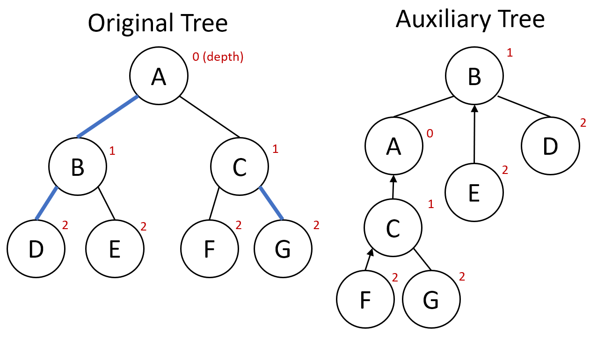
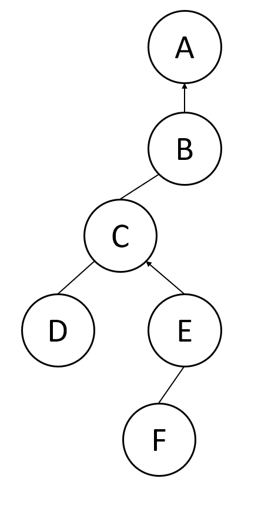
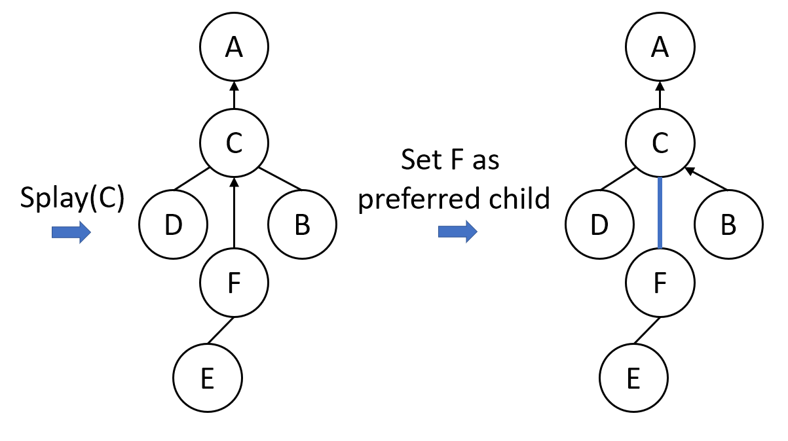
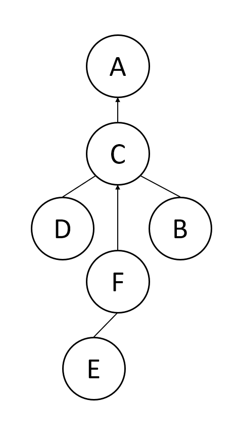
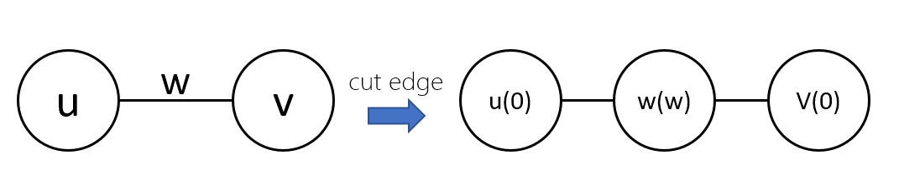

# Link-Cut Tree

## 介紹

Link Cut Tree 是一種樹狀的資料結構，主要用來解決 Dynamic connectivity 的問題，Link Cut Tree 支援以下操作：  

- 在兩個點之間建立一條邊
- 在兩個點之間斷開一條邊
- 查詢兩點之間是否存連通
  
Link Cut Tree 是以 Splay Tree 為基礎實作，因此尚未了解 Splay Tree 可以先回去參考 Splay Tree，本篇著重於介紹 Link cut tree。
  
以下文章將用 LCT 簡稱 Link Cut Tree。  

## LCT 實作

### 先備知識

#### Splay Tree

Splay Tree 是一種自平衡的二元搜尋樹，主要通過 Splay 操作讓最近被訪問的節點移動至樹的根部，並且 Splay 操作的時間複雜度為均攤 \\(O(\log n)\\)。

#### 輕重鏈剖分

輕重鏈剖分用來處理樹上的動態查詢，它的精髓在於將樹拆分成很多條鏈，使得樹上的操作可以有好的時間複雜度，LCT 也有使用到類似的技巧，因此建議先理解輕重鏈剖分後再回來看 LCT。

### 名詞定義

1. preferred child  
在 LCT 操作中，每個節點最多有一個 preferred child，代表一個特殊的子節點，這個節點的目的是用來保證操作的時間複雜度。  
2. preferred edge  
節點連接 preferred child 的邊稱為 preferred edge。  
3. preferred path  
一條全部由 preferred edge 所構成的 path 稱為 preferred path。  

### Auxiliary Tree  

以下使用輔助樹來稱呼 Auxiliary Tree。  

輔助樹的作用是用來維護訊息，在進行 LCT 操作時同時維護輔助樹的訊息，因此輔助樹能維護的訊息，就決定了 LCT 可以維護的訊息。  
LCT 利用 Splay Tree 作為輔助樹，在基本 LCT 的 Splay Tree 節點會維護以下訊息：  

1. 父節點 (子節點有邊指向父節點，但父節點不一定有邊指向子節點)
2. 左右小孩 (實作時用右小孩代表 preferred edge)
3. 在 Splay Tree Node 左邊的節點深度比自己小，右邊的節點深度比自己大
4. 因為 LCT 操作中要維護左右節點深度的性質，所以在某些特定的操作中需要將區間反轉，因此使用懶惰標記，讓翻轉區間能夠有好的時間複雜度

以下是一個簡單的 Splay Tree node：

```cpp
struct splay_node
{
    int child[2], parent;
    bool rev;
    splay_node() : parent(0), rev(0), child({0, 0}) {}
};
```

- ``child[0]`` 代表左小孩、``child[1]`` 代表右小孩
- ``parent`` 代表父親
- ``rev`` 代表區間反轉的懶惰標記

以下是一個原樹與輔助樹的對應關係：
圖解：左為原樹，原樹的粗邊代表 preferred edge。右為原樹所對應的輔助樹，輔助樹的表示法不唯一，粗邊代表 splay_node 的左右小孩，而帶有箭號的邊代表指向父節點的邊。

接下來就是這棵輔助樹的基本操作。

- ``splay()`` 以及 ``rotate()``  

Splay Tree 的基本操作。

```cpp
void rotate(int x) // balance splay tree
{
    int y = node[x].parent, z = node[y].parent, d = (node[y].child[1] == x);
    node[x].parent = z;
    if (!isroot(y))
        node[z].child[node[z].child[1] == y] = x;
    node[y].child[d] = node[x].child[d ^ 1];
    node[node[y].child[d]].parent = y;
    node[y].parent = x, node[x].child[d ^ 1] = y;
    up(y);
    up(x);
}
void splay(int x) // splay node x
{
    push_down(x);
    while (!isroot(x))
    {
        int y = node[x].parent;
        if (!isroot(y))
        {
            int z = node[y].parent;
            if ((node[z].child[0] == y) ^ (node[y].child[0] == x))
                rotate(x);
            else
                rotate(y);
        }
        rotate(x);
    }
}
```

這裡的 ``splay()`` 寫法跟一般的 Splay Tree 不太一樣，LCT 中的 splay 只要到當前這棵輔助樹的樹根即可，因此需要用到 ``isroot()`` 來判斷。

- ``isroot()``  
判斷當前節點是否為根。

```cpp
bool isroot(int x)
{
    return node[node[x].parent].child[0] != x && node[node[x].parent].child[1] != x;
}
```

如果父節點的左小孩跟右小孩都不是自己，就代表自己是輔助樹的根，換一種說法就是自己與父節點相連的邊不是 preferred edge。  

- ``push_down()``  
遞迴將祖先的懶惰標記往下推。

```cpp
void push_down(int x)
{
    if (!isroot(x))
        push_down(node[x].parent);
    down(x);
}
```

- ``down()``  
真正在做懶惰標記下推的部分。

```cpp
void down(int x)
{
    if (node[x].rev)
    {
        swap(node[x].child[0], node[x].child[1]);
        if (node[x].child[0])
            node[node[x].child[0]].rev ^= 1;
        if (node[x].child[1])
            node[node[x].child[1]].rev ^= 1;
        node[x].rev = 0;
    }
}
```

- ``up()``  
``up()`` 可以將子節點的訊息向上更新，可以自行修改成紀錄其他訊息，例如紀錄子樹大小。  
最基本的 LCT 沒有使用到。  

### LCT 專屬函式

- ``Access()``  
**LCT 中最重要的函式**  
``Access()`` 會把當前節點到 LCT 根結點上面所有的邊變成 preferred edge。  
操作方法：

1. 把當前節點 splay 到目前輔助樹的根
2. 把當前節點的 preferred edge 設定為上一次走到的節點
3. 維護節點訊息
4. 對父節點進行 ``Access()``  
重複執行 1~4，直到抵達 LCT 的根結點回傳。

```cpp
int access(int x)
{
    int last = 0;
    for (; x; last = x, x = node[x].parent)
    {
        splay(x);
        node[x].child[1] = last;
        up(x);
    }
    return last;
}
```

操作完成後 ``x`` 節點會與根結點存在同一棵輔助樹中。  

以下用一個例子來展示 ``access()``：  

假設原樹的輔助樹是上圖左側的樹，假設要執行的操作是 ``access(F)``，一開始要先 ``splay(F)``，讓 F 節點變成當前輔助樹的根。``splay(F)`` 後，要把節點的 preferred edge 設定為上次走到的節點，因為 F 是第一個節點，因此不需要動作，接下來繼續往上層更新，對父節點進行 ``access()``，因此接下來要 ``access(C)``。
先 ``splay(C)``，讓 C 變成輔助樹的根節點。把 C 的 preferred edge 設為 F (這裡為了展示所以將新的 preferred edge 變成粗邊)，所以 C 節點拋棄其中一個小孩，這裡展示的是拋棄 B 小孩。
最終 ``access(A)``，到達整棵樹的根結點，因此停止操作，最終 F 與根節點 A 的路徑為 preferred path，且 F 與 A 在同一棵輔助樹中。

- ``make_root()``  
將當前節點變為整棵樹的 root。操作方法：

1. 先利用 ``access()`` 將當前節點到根節點的邊都變成 preferred edge
2. ``splay()`` 當前節點，使他變成當前輔助樹的根  
當完成此操作後，會造成此節點到原本的根的路徑全部反轉，為了要維護**左邊的節點深度比自己小，右邊的節點深度比自己大**這個性質，必須將此區間反轉。  
3. 變更當前節點的懶惰標記 ``rev``

```cpp
void make_root(int x)
{
    access(x);
    splay(x);
    node[x].rev ^= 1;
}
```

- ``link()``
將兩個節點所在的樹合併，兩個節點必須在不同樹。操作方式：

1. 讓其中一個節點 ``x`` 變成根結點
2. 將 ``x`` 節點的父節點設為另一個節點

```cpp
void link(int x, int y)
{
    make_root(x);
    node[x].parent = y;
}
```

- ``cut()``
斷開兩個節點之間的邊，兩個節點之間必須有邊。操作方式：

1. 將其中一個節點 ``x`` 變成根結點
2. ``access()`` 另一個節點 ``y``，讓 ``x`` 和 ``y`` 在同一個輔助樹中
3. ``splay()`` 節點 ``y``，讓他變成輔助樹的根  
此時 ``x`` 節點會成為 ``y`` 節點的左小孩。4. 斷開 ``x`` , ``y`` 節點之間的連結

```cpp
void cut(int x, int y)
{
    make_root(x);
    access(y);
    splay(y);
    node[y].child[0] = 0;
    node[x].parent = 0;
}
```

另一種 ``cut()`` 操作是針對單一節點，斷開該節點與父節點的邊。操作方式：

1. 直接 ``access()`` 該節點，讓他與當前的根在同一個輔助樹中
2. ``splay()`` 該節點，讓該節點變成新的根結點
此時父節點位於左小孩的位置
3. 斷開該節點與父節點的連結

```cpp
void cut(int x)
{
    access(x);
    splay(x);
    node[node[x].child[0]].parent = 0;
    node[x].child[0] = 0;
}
```

- ``find_root()``
尋找此節點所在樹的根結點。操作方式：

1. 首先 ``access()`` 此節點，讓他和根結點在同一個輔助樹裡面
2. 根據 LCT 的性質，只要找到最左邊的節點代表深度最小，也就是根
3. 最後記得 ``splay()`` 找到的根

```cpp
int find_root(int x)
{
    int res = access(x);
    while (node[res].child[0])
        res = node[res].child[0];
    splay(res);
    return res;
}
```

### 各操作時間複雜度

LCT 的操作中，都是基於 ``access()`` 操作而完成的，因此只要能分析出 ``access()`` 複雜度就可以知道各個操作的時間複雜度。  

首先 ``access()`` 是由 ``splay()`` 以及迴圈所構成，``splay()`` 操作的時間複雜度是 \\( O(\log N) \\)，接下來只要分析出 ``splay()`` 會被執行幾次，也就是 preferred child 的改變數量，就可以知道時間複雜度了。  

這裡引入 Heavy-light decomposition 的定義，heavy edge 代表所連接的子節點位於最大的子樹中，light edge 代表所連接的子節點不是最大的子樹，在 LCT 中，每個節點只會有兩個子節點，因此 heavy edge 所連接的子節點具有以下性質：\\( size(子節點) > 1/2 size (父節點) \\)，因此我們將邊分為以下四種 heavy-prefered, heavy-unpreferred, light-preferred, light-unpreferred。

在每一次 ``splay()`` 後都會有一個邊被設為 preferred child，如果被設為 prefered child 的邊是 light edge，則這條路徑上最多只會有 \\(\log n\\)條 light edge，因此 ``splay()`` 最多只會被執行 \\(\log n\\)次，接下來討論如果被設為 prefered child 的邊是 heavy edge，因為最多有 \\(n - 1\\)條 heavy edge，因此在最糟的情況下，``splay()`` 會被執行 \\(n - 1\\)次，但在每次 ``access()`` 中，最多只有 \\(\log n\\)條邊從 light-unpreferred edge 變成 light-preferred edge，因此最多只有 \\(\log n\\)條邊從 heavy-preferede edge 變成 heavy-unprefered edge，假設有 \\(m\\) 次操作，花在 heavy edge 上的操作最多為 \\(m(\log n) + (n - 1)\\)，在足夠次數的操作時 (\\(m > n - 1\\))，時間複雜度為 \\(O(\log N) \\)。  

目前可以得出，最多會有 \\(O(\log N) \\) 次 ``splay()``，因此 ``access()`` 的上界變成了 \\( O(\log^2 N) \\)，``splay()`` 執行的次數等價於 preferred child 的改變數量，因此只要能夠讓改變的數量變成均攤 \\(O(1)\\)，就可以把 ``access()`` 的時間複雜度變為 \\(O(\log N) \\)。

利用 potential method，假設 \\(s(v)\\) 代表在 \\(v\\) 節點下的子樹大小，所以 potential function 就可以寫成 \\(\Phi = \sum_{v} \log s(v) \\)，根據 splay tree 的均攤分析，\\(cost(splay(v)) \leq 3(\log s(root(v)) - \log s(v)) + 1 \\)，假設在 ``splay()`` 後，\\(v\\) 是 \\(w\\) 的子節點，可以得到\\(s(v) \leq s(w)\\)，最終把 ``splay()`` 的操作與 preferred child 的改變數量加起來，得到\\(3(\log s(root(v)) - \log s(v)) + O(\log n)\\)，因此我們得到均攤 \\(O(\log N) \\)的時間複雜度。

需要更清楚的解釋可以參考 ([維基百科](https://en.wikipedia.org/wiki/Link/cut_tree))

有了 ``access()`` 的時間複雜度後，發現剩下的操作都是基於 ``access()`` 以及 ``splay()``，因此各個 LCT 操作的時間複雜度皆是\\( O(\log N) \\)

|操作|時間複雜度|
|-----|--------|
|``access()``|\\( O(\log N) \\)|
|``make_root()``|\\( O(\log N) \\)|
|``link()``|\\( O(\log N) \\)|
|``cut()``|\\( O(\log N) \\)|
|``find_root()``|\\( O(\log N) \\)|

### 最終模板

<details><summary> Template Code </summary>

```cpp
struct LCT
{
    struct splay_node
    {
        int child[2], parent;
        bool rev;
        splay_node() : parent(0), rev(0), child() {}
    };
    vector<splay_node> node;
    LCT(int _size) { node.resize(_size + 1); }
    bool isroot(int x)
    {
        return node[node[x].parent].child[0] != x && node[node[x].parent].child[1] != x;
    }
    void down(int x)
    {
        if (node[x].rev)
        {
            swap(node[x].child[0], node[x].child[1]);
            if (node[x].child[0])
                node[node[x].child[0]].rev ^= 1;
            if (node[x].child[1])
                node[node[x].child[1]].rev ^= 1;
            node[x].rev = 0;
        }
    }
    void push_down(int x)
    {
        if (!isroot(x))
            push_down(node[x].parent);
        down(x);
    }
    void up(int x) {}
    void rotate(int x)
    {
        int y = node[x].parent, z = node[y].parent, d = (node[y].child[1] == x);
        node[x].parent = z;
        if (!isroot(y))
            node[z].child[node[z].child[1] == y] = x;
        node[y].child[d] = node[x].child[d ^ 1];
        node[node[y].child[d]].parent = y;
        node[y].parent = x, node[x].child[d ^ 1] = y;
        up(y);
        up(x);
    }
    void splay(int x)
    {
        push_down(x);
        while (!isroot(x))
        {
            int y = node[x].parent;
            if (!isroot(y))
            {
                int z = node[y].parent;
                if ((node[z].child[0] == y) ^ (node[y].child[0] == x))
                    rotate(x);
                else
                    rotate(y);
            }
            rotate(x);
        }
    }
    int access(int x)
    {
        int last = 0;
        for (; x; last = x, x = node[x].parent)
        {
            splay(x);
            node[x].child[1] = last;
            up(x);
        }
        return last;
    }
    void make_root(int x)
    {
        access(x);
        splay(x);
        node[x].rev ^= 1;
    }
    void link(int x, int y)
    {
        make_root(x);
        node[x].parent = y;
    }
    void cut(int x, int y)
    {
        make_root(x);
        access(y);
        splay(y);
        node[y].child[0] = 0;
        node[x].parent = 0;
    }
    void cut(int x)
    {
        access(x);
        splay(x);
        node[node[x].child[0]].parent = 0;
        node[x].child[0] = 0;
    }
    int find_root(int x)
    {
        int res = access(x);
        while (node[res].child[0])
            res = node[res].child[0];
        splay(res);
        return res;
    }
};
```

</details>

## LCT 用途

> 有一個國家有很多城市，城市之間一開始沒有道路，但隨著時間會有道路新建成，也會有道路被拆掉  
問題是在任意時間點，要輸出 A, B 城市是否相連？

解題思路：  
一個國家有很多城市可以想像成一個森林，每個城市都是獨立的一棵樹，因此符合 LCT 是一個森林的性質。  
道路的新建可以用 LCT 的 ``link()`` 來達成  
道路的拆除可以用 LCT 的 ``cut()`` 來達成
所以只要能判斷 A, B 城市是否相連就可以回答問題了  
要判斷兩個城市是否相連其實就等同於兩個節點是否在同一棵樹上，所以我們只要看 A, B 節點的根是否一樣就可以達成  
  
時間複雜度分析：  
對於每一個操作都可以在\\( O(\log N) \\)的時間完成，因此總複雜度就是\\( O(Q \log N) \\)
  
參考題目：[DYNACON1](https://www.spoj.com/problems/DYNACON1/)
<details><summary> Solution Code </summary>

在 ``cut()`` 之前要先判斷有沒有邊存在，但在這一題他保證邊一定存在，因此可以大膽的給他 ``cut()`` 下去  

```cpp
#include <bits/extc++.h>
using namespace std;
// LCT template
int main()
{
    ios::sync_with_stdio(false);
    cin.tie(0);
    int n, q;
    cin >> n >> q;
    LCT lct(n);
    while (q--)
    {
        string str;
        int u, v;
        cin >> str >> u >> v;
        if (str[0] == 'a')
            lct.link(u, v);
        else if (str[0] == 'r')
            lct.cut(u, v);
        else if (lct.find_root(u) == lct.find_root(v))
            cout << "YES\n";
        else
            cout << "NO\n";
    }
    return 0;
}
```

</details>

> [SPOJ QTREE](https://www.spoj.com/problems/QTREE/)  
> 給你一棵\\( N \\)個節點的樹，每個邊有邊權\\( w \\)，然後會有\\( Q \\)筆操作。操作有兩種：  
>
>    1. 改動其中一條邊的邊權
>    2. 詢問節點\\( u \\)到節點\\( v \\)路徑上權重最大的邊
>
> - \\( N, Q \leq 10^4 \\)  
  
解題思路：這題可以使用輕重鏈剖分做，但這裡提供 LCT 的做法。(同時也可以比較一下這兩種作法的時間複雜度分別會是多少)  
在 LCT 中我們沒辦法維護邊權，因此我們可以利用**拆邊**的技巧，也就是將將一條邊變成一個點加上兩個邊，而那個點的權重變成原本邊的權重，可以參考下圖：  


解決邊權的問題後，但在建樹之前要先維護好節點的資訊  
對於每個節點，需要維護：  

1. 點權 (程式碼中利用 ``val`` 表示)
2. Splay Tree 點權的最大值 (程式碼中利用 ``mx`` 表示)  

因為需要維護最大值，因此需要改動 ``up()`` 函式，當前節點的最大值就是小孩的最大值跟自己的點權取 max

```cpp
void up(int x)
{
    node[x].mx = max(max(node[node[x].child[0]].mx, node[node[x].child[1]].mx), node[x].val);
}
```

對於題目的操作可以用下面方式達成：

1. 改動其中一條邊的邊權  
直接更改那條邊拆點後的點權即可  
2. 詢問路徑上最大的邊  
與 ``cut()`` 操作相似，先讓 ``u`` 節點變成根，再把 ``v`` 節點旋轉到根，``v`` 節點的值就是答案  

時間複雜度分析：  
建樹時需要建立\\( 2N - 2 \\)條邊，建邊時間複雜度為\\( O(\log N) \\)，因此建樹時時間複雜度是\\( O(N\log N) \\)  
對於每一個操作都可以在\\( O(\log N) \\)的時間完成，因此\\( Q \\)筆操作時間複雜度就是\\( O(Q \log N) \\)  
總時間複雜度為\\( O(N\log N + Q \log N) \\)

<details><summary> Solution Code </summary>

```cpp
#include <bits/extc++.h>
using namespace std;
struct splay_tree
{
    int child[2], parent;
    int val, mx;
    bool rev;
    splay_tree() : parent(0), rev(0), child(), val(0), mx(0) {}
};
struct LCT
{
    void up(int x)
    {
        node[x].mx = max(max(node[node[x].child[0]].mx, node[node[x].child[1]].mx), node[x].val);
    }
    /* other LCT template */
};

void solve()
{
    int n, u, v, w;
    cin >> n;
    LCT lct(2 * n);
    for (int i = 1; i < n; i++) // n + i represent ith edge
    {
        cin >> u >> v >> w;
        lct.node[n + i].val = w;
        lct.link(u, n + i);
        lct.link(n + i, v);
    }
    string op;
    while (true)
    {
        cin >> op;
        if (op == "DONE")
            break;
        else if (op == "CHANGE")
        {
            cin >> u >> w;
            u += n;
            lct.access(u);
            lct.splay(u);
            lct.node[u].val = w;
        }
        else
        {
            cin >> u >> v;
            lct.make_root(u);
            lct.access(v);
            lct.splay(v);
            cout << lct.node[v].mx << '\n';
        }
    }
}

int main()
{
    ios::sync_with_stdio(false);
    cin.tie(0);

    int t;
    cin >> t;
    while (t--)
    {
        solve();
    }
    return 0;
}
```

</details>

總結：  

- LCT 可以判斷連通性
- LCT 可以做路徑維護，因此可以維護路徑資訊
- LCT 可以動態切邊，因此當看到 **cut** 關鍵字的時候，或許可以想想看 LCT 可不可以做，因為大部分輕重鏈剖分可以做的題目，LCT 也都可以做

## 相關題目

[DYNALCA - Dynamic LCA](https://www.spoj.com/problems/DYNALCA/)
<details><summary> Solution Code </summary>

詢問 lca 時，先 ``access()`` 其中一個節點，再 ``access()`` 另一個節點，即可找到 lca  

```cpp
#include <bits/extc++.h>
using namespace std;
// LCT template
int main()
{
    ios::sync_with_stdio(false);
    cin.tie(0);

    int n, m, u, v;
    cin >> n >> m;
    LCT lct(n);
    while (m--)
    {
        string query;
        cin >> query;
        if (query == "link")
        {
            cin >> u >> v;
            lct.link(u, v);
        }
        else if (query == "cut")
        {
            cin >> u;
            lct.cut(u);
        }
        else if (query == "lca")
        {
            cin >> u >> v;
            lct.access(u);
            cout << lct.access(v) << '\n';
        }
    }

    return 0;
}
```

</details>

SPOJ-QTREE 系列題目：  

- [QTREE](https://www.spoj.com/problems/QTREE/)
- [QTREE2](https://www.spoj.com/problems/QTREE2/)
- [QTREE3](https://www.spoj.com/problems/QTREE3/)
- [QTREE4](https://www.spoj.com/problems/QTREE4/)
- [QTREE5](https://www.spoj.com/problems/QTREE5/)
- [QTREE6](https://www.spoj.com/problems/QTREE6/)
- [QTREE7](https://www.spoj.com/problems/QTREE7/)  
  
QTREE 系列題目可以參考這篇文章：[【Qtree】Query on a tree 系列 LCT 解法](https://blog.csdn.net/thy_asdf/article/details/50768620)  

- [CF 117E - Tree or not Tree](https://codeforces.com/problemset/problem/117/E)
- [CF 342E - Xenia and Tree](https://codeforces.com/problemset/problem/342/E)
- [CF 1344E - Train Tracks](https://codeforces.com/problemset/problem/1344/E)

## 參考資料

- [Link/cut tree - Wikipedia](https://en.wikipedia.org/wiki/Link/cut_tree)
- [Link Cut Tree - OI Wiki](https://oi-wiki.org/ds/lct/)
- [日月卦長的模板庫: [ link-cut tree ] 動態樹教學+模板](<http://sunmoon-template.blogspot.com/2015/11/link-cut-tree.html>)
- [Splay tree tutorial - Codeforces](https://codeforces.com/blog/entry/79524)
- [Link-cut tree tutorial - Codeforces](https://codeforces.com/blog/entry/80383)
- [【Qtree】Query on a tree 系列 LCT 解法](https://blog.csdn.net/thy_asdf/article/details/50768620)
