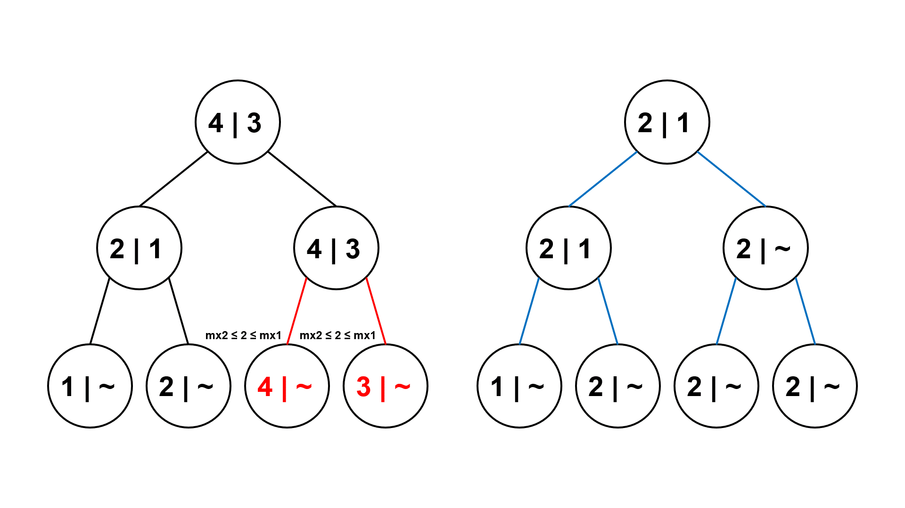

# Segment Tree Beats

## Introduction

Segment Tree Beats（簡稱 STB）是北京大學的吉如一提出的概念，發表在《区间最值操作与历史最值问题》[^note-1]中。

考慮以下問題：

> 例題 1. [HDU - Gorgeous Sequence](http://acm.hdu.edu.cn/showproblem.php?pid=5306)
>
> 給一個長度為 \\( n \\) 的序列 \\( A \\)，並對其進行 \\( m \\) 筆操作。操作有三種：
>
> 1. 給定 \\( L, R, x \\)，對所有 \\( i, (L \leq i \leq R) \\)，將 \\( A_i \\) 修改成 \\( min(A_i, x) \\)。
> 2. 給定 \\( L, R \\)，對所有 \\( i, (L \leq i \leq R) \\)，輸出\\( A_i \\)的最大值。
> 3. 給定 \\( L, R \\)，對所有 \\( i, (L \leq i \leq R) \\)，輸出\\( \sum_{i = L}^{R} A_i \\)。
>
> - \\( n, m \leq 10^6 \\)

因為在給一個節點打上區間取 \\( min \\) 標記時，我們無法快速更新區間和，所以這題無法透過傳統的懶惰標記來解決。

### 區間最值操作

考慮下面這一種解法：

對線段樹每一個節點除了維護區間和 \\( sum \\) 之外，還要額外維護區間中的最大值 \\( mx1 \\)，嚴格次大值 \\( mx2 \\) 以及最大值個數 \\( cmx \\)。

讓區間 \\( [L, R] \\) 對 \\( x \\) 取 \\( min \\)，我們先在線段樹中定位這個區間，對定位的每一個節點，我們開始暴力搜尋。搜尋到每一個節點時，我們分三種情況討論：

1. 當 \\( mx1 \leq x \\) 時，區間每個元素對 \\( x \\) 取 \\( min \\) 還是元素本身，不會對這個節點產生影響，直接退出。
2. 當 \\( mx2 < x < mx1 \\) 時，這一次修改只會影響到所有最大值，所以我們把區間和 \\( sum \\) 加上 \\( t \cdot (x - mx) \\)，將 \\( mx \\) 更新為 \\( x \\)，接著打上標記然後退出（只有發生狀況二才會打標記）。
3. 當 \\( mx2 \geq x \\) 時，我們無法直接更新這一個節點的資訊，所以在此時，我們對當前節點的左子節點與右子節點進行遞迴搜尋。

如下圖所示，左圖是一棵建立在 \\( [1, 4] \\) 上的線段樹，每一個節點紀錄的資訊的左側是區間最大值，右側是嚴格次大值。現在我們要讓區間 \\( [1, 4] \\) 對 \\( 2 \\) 取 \\( min \\)。那麼左圖中紅色邊表示搜尋時經過的邊，紅色字體的節點表示搜索終止的節點，右圖為更新後的線段樹。


從根結點 \\( 4 | 3 \\) 開始，由於 \\( mx2 \geq 2 \\)，屬於情況三，對子節點進行遞迴搜尋。


從根節點 \\( 4 | 3 \\) 出發向下走，遇到左子節點 \\( 2 | 1 \\)，由於 \\( mx1 \leq 2 \\)，屬於情況一，直接退出；遇到右子節點 \\( 4 | 3 \\)，由於 \\( mx2 \geq 2 \\)，屬於情況三，對子節點進行遞迴搜尋。


繼續從右子節點 \\( 4 | 3 \\) 向下遞迴搜尋，遇到左子節點 \\( 4 | -1 \\)，由於 \\( mx2 < 2 < mx1 \\)，屬於情況二，區間和被改為 \\( 4 + 1 \cdot (2 - 4) = 2 \\)，最大值被更新為 \\( 2 \\)，標記也被設為 \\( 2 \\)；遇到右子節點 \\( 4 | -1 \\)，由於 \\( mx2 < 2 < mx1 \\)，屬於情況二，同理。


接著向上更新標記，節點 \\( 4 | 3 \\) 的區間和更新為 \\( 2 + 2 = 4 \\)，最大值更新為 \\( 2 \\)，最小值更新為 \\( -1 \\)。


最後向上更新標記，根節點 \\( 4 | 3 \\) 的區間和更新為 \\( 2 + 2 = 4 \\)，最大值更新為 \\( 2 \\)，最小值更新為 \\( max(1, -1) = 1 \\)。



### 觀察性質

- 一個節點的區間次大值，相當於子樹中標記的最大值。
- 只有在 \\( mx2 \geq x \\) 時，我們會拜訪更多節點。換句話說，只有在子樹的所有標記都小於新標記，我們才打標記。

### 時間複雜度

現在我們來證明這個算法的時間複雜度是 \\( O((n + m)logn) \\)。

我們把最大值當作標記。接著如果一個點的標記值與父節點的標記值相同，就把此點的標記刪除，大致轉換如下圖所示（左圖紀錄的是線段樹中的最大值，右圖為轉換後的線段樹）：


在轉換之後，我們可以發現每一個位置實際的值等於從它對應的線段樹葉節點出發，向上走遇到的第一個標記值。這些標記滿足：每個點的標記值都嚴格大於子樹中的所有標記值。

定義標記類的概念：

1. 同一次區間取 \\( min \\) 產生的標記屬於同一類。
2. 同一個標記下傳產生的標記屬於同一類。
3. 否則屬於不同類。

接著定義權值 \\( w(T) \\)（\\( T \\) 為標記類）為在子樹中擁有至少一個屬於標記類 \\( T \\) 的節點數，也就是打標記時經過的點數；勢能 \\( \Phi(x) \\) 為線段樹中所有標記類的 \\( w(T) \\) 總和。

以上面的例子為例，階層為 \\( 3 \\) 的右邊兩個節點的標記屬於同一類，假設這類為 \\( T \\)，因為打標記時有經過兩個節點，所以 \\( w(T) \\)為 \\( 2 \\)。


依次分析三項對勢能產生影響的操作：添加新標記類、標記下傳、標記回收

1. 考慮一次區間取 \\( min \\) 操作，只會添加一個新的標記類 \\( T \\)，它的權值等於我們打標記時經過的節點數。線段樹深度是 \\( O( \lceil log(n + 1) \rceil ) = O(logn) \\)，打標記時經過的節點數最多也是 \\( O(logn) \\)，所以 \\( w(T) \\) 是 \\( O(logn) \\)。


2. 考慮一次標記下傳，只讓標記類 \\( T \\) 的權值 \\( w(T) \\) 增加 \\( O(1) \\)。
3. 當 \\( mx2 \geq x \\) 時，也就是情況三發生時，要進行遞迴搜尋，因為父節點的標記一定跟其中一個子節點一樣，所以每到一個節點至少回收一個標記，那麼 \\( \Phi(x) \\) 減少了 \\( O(1) \\)。


線段樹中最多存在 \\( n \\) 個標記，每個標記的權值 \\( w(T) \\) 是 \\( O(logn) \\)。因為 \\( \Phi(x) \\) 是 \\( n \\) 個標記權值總和，所以 \\( \Phi(x) \\) 的初始值是 \\( O(nlogn) \\)。

現在來計算 \\( m \\) 次區間取 \\( min \\) 操作的勢能變化量：

1. 添加 \\( m \\) 個新標記類，\\( \Phi(x) \\) 增加 \\( O(mlogn) \\)。
2. 標記下傳在一次操作中會進行 \\( O(logn) \\) 次，每次讓\\( \Phi(x) \\) 增加 \\( O(1) \\)。因此 \\( m \\) 次操作讓 \\( \Phi(x) \\) 總共增加 \\( O(mlogn) \\)。
3. 標記回收的時間複雜度不會超過打標記和標記下傳的時間複雜度之和，所以 \\( m \\) 次操作讓 \\( \Phi(x) \\) 總共減少 \\( O(mlogn) \\)。

勢能的總變化量為 \\( O(mlogn) \\)。

將勢能的初始值 \\( O(nlogn) \\) 加上變化量 \\( O(mlogn) \\)，得到這個算法時間複雜度是 \\( O((n + m)logn) \\)。

<details><summary> Solution Code </summary>

```cpp
struct STB {
    #define ls (u << 1)
    #define rs (u << 1 | 1)

    struct Node {
        ll sum;
        int l, r, mx1, mx2, cmx, tag;
    } T[N << 2];

    void pushup(int u) { // 向上更新標記
        T[u].sum = T[ls].sum + T[rs].sum;
        if (T[ls].mx1 == T[rs].mx1){
            T[u].mx1 = T[ls].mx1;
            T[u].cmx = T[ls].cmx + T[rs].cmx;
            T[u].mx2 = max(T[ls].mx2, T[rs].mx2);
        } else if (T[ls].mx1 > T[rs].mx1) {
            T[u].mx1 = T[ls].mx1;
            T[u].cmx = T[ls].cmx;
            T[u].mx2 = max(T[ls].mx2, T[rs].mx1);
        } else {
            T[u].mx1 = T[rs].mx1;
            T[u].cmx = T[rs].cmx;
            T[u].mx2 = max(T[ls].mx1, T[rs].mx2);
        }
    }

    void pushdown(int u) { // 下傳標記
        if (T[u].tag == -1) return;
        if (T[ls].mx1 > T[u].tag) {
            T[ls].sum += 1LL * T[ls].cmx * (T[u].tag - T[ls].mx1);
            T[ls].mx1 = T[ls].tag = T[u].tag;
        }
        if (T[rs].mx1 > T[u].tag) {
            T[rs].sum += 1LL * T[rs].cmx * (T[u].tag - T[rs].mx1);
            T[rs].mx1 = T[rs].tag = T[u].tag;
        }
        T[u].tag = -1;
    }

    void build(int u = 1, int l = 1, int r = N) { // 建樹
        T[u].tag = -1;
        T[u].l = l, T[u].r = r;
        if (l == r) {
            T[u].sum = T[u].mx1 = A[l];
            T[u].mx2 = -1;
            T[u].cmx = 1;
            return;
        }
        int mid = (l+r) >> 1;
        build(ls, l, mid);
        build(rs, mid+1, r);
        pushup(u);
    }

    void chmin(int L, int R, int x, int u = 1) {
        if (T[u].mx1 <= x) return; // 第1種狀況
        int l = T[u].l, r = T[u].r;
        if (L <= l && r <= R && T[u].mx2 < x) { // 第2種狀況
            T[u].sum += 1LL * T[u].cmx * (x - T[u].mx1);
            T[u].mx1 = T[u].tag = x;
            return;
        }
        pushdown(u);
        int mid = (l+r) >> 1;
        if (L <= mid) chmin(L, R, x, ls); // 繼續在子樹裡搜尋
        if (R > mid) chmin(L, R, x, rs);
        pushup(u);
    }

    pair<ll, int> query(int L, int R, int u = 1) {
        int l = T[u].l, r = T[u].r;
        if (L <= l && r <= R)
            return make_pair(T[u].sum, T[u].mx1);
        pushdown(u);
        ll sum = 0; int mx1 = 0;
        int mid = (l+r) >> 1;
        if (L <= mid) {
            auto r1 = query(L, R, ls);
            sum += r1.first;
            mx1 = max(mx1, r1.second);
        }
        if (mid < R) {
            auto r2 = query(L, R, rs);
            sum += r2.first;
            mx1 = max(mx1, r2.second);
        }
        return make_pair(sum, mx1);
    }
};
```

</details>

### 歷史最值問題

在資料結構問題中，我們通常需要對一個給定的數組 \\( A \\) 進行多次操作，然後進行一些詢問。有一少部分問題需要對歷史版本進行詢問，這類特殊的有關歷史版本的問題我們把它稱作歷史最值問題。歷史最值問題中的詢問可以分成以下三類：

#### 歷史最大值

當前位置下曾經出現過的數的最大值。定義一個輔助數組 \\( B \\)，最開始 \\( B \\) 數組與 \\( A \\) 數組完全相同。在每一次操作後，對每一個 \\( i \in [1, n] \\)，我們都進行一次更新，讓 \\( B_i = max(B_i, A_i) \\)。這時，我們將 \\( B_i \\) 稱作 \\( i \\) 這個位置的歷史最大值。

#### 歷史最小值

當前位置下曾經出現過的數的最小值。定義一個輔助數組 \\( B \\)，最開始 \\( B \\) 數組與 \\( A \\) 數組完全相同。在每一次操作後，對每一個 \\( i \in [1, n] \\)，我們都進行一次更新，讓 \\( B_i = min(B_i, A_i) \\)。這時，我們將 \\( B_i \\) 稱作 \\( i \\) 這個位置的歷史最小值。

#### 歷史版本和

定義一個輔助數組 \\( B \\)，最開始 \\( B \\) 數組中的所有數都是 \\( 0 \\)。在每一次操作後，對每一個 \\( i \in [1, n] \\)，我們都進行一次更新，讓 \\( B_i \\) 加上 \\( A_i \\)。這時，我們將 \\( B_i \\) 稱作 \\( i \\) 這個位置的歷史版本和。

### 可以用懶標記處理的問題

> 例題 4. [Tyvj - CPU 監控](http://www.tyvj.cn/p/1518)
>
> 給一個長度為 \\( n \\) 的序列 \\( A \\)，同時定義一個輔助數組 \\( B \\)，\\( B \\)開始與 \\( A \\) 完全相同。接下來對其進行 \\( m \\) 筆操作，操作有四種：
>
> 1. 給定 \\( l, r, x \\)，對所有 \\( i \in [l, r] \\)，將 \\( A_i \\) 修改成 \\( x \\)。
> 2. 給定 \\( l, r, x \\)，對所有 \\( i \in [l, r] \\)，將 \\( A_i \\) 加上 \\( x \\)。
> 3. 給定 \\( l, r \\)，對所有 \\( i \in [l, r] \\)，輸出 \\( A_i \\) 的最大值。
> 4. 給定 \\( l, r \\)，對所有 \\( i \in [l, r] \\)，輸出 \\( B_i \\) 的最大值。
>
> - \\( n, m \leq 10^5 \\)

剛接觸這個問題時，這個例題可能難度較高，所以我們先忽略第一種操作。

考慮使用傳統的懶標記來解決，首先如果只是詢問區間最大值，只需要使用區間加減這一個懶標記（用 \\( Add \\) 表示）就能解決。

現在考慮詢問區間歷史最大值的最大值。我們定義一種新的懶標記：歷史最大的加減標記（用 \\( Pre \\) 表示）。這個標記的定義是，從上一次把這個節點的標記下傳的時刻到當前時刻這一個時段中，這個節點中的 \\( Add \\) 標記值到達過的最大值。

## References

底下的資源包含許多例題，同學可以去參考看看。

- [A simple introduction to "Segment tree beats"](https://codeforces.com/blog/entry/57319)
- [Segment Tree Beats - USACO Guide](https://usaco.guide/adv/segtree-beats?lang=cpp)
- [Segment Tree Beats 学习笔记](https://www.cnblogs.com/Neal-lee/p/15695984.html)
- [Historic Information on Segment Trees](https://mzhang2021.github.io/cp-blog/historic-segtree)
- [区间最值操作 & 区间历史最值 - OI Wiki](https://oi-wiki.org/ds/seg-beats)
- [《区间最值操作与历史最值问题》- 国家集训队 2016 论文集](https://github.com/enkerewpo/OI-Public-Library/blob/master/IOI中国国家候选队论文/国家集训队2016论文集.pdf)

[^note-1]: [2016 集训队论文 - 吉如一《区间最值操作与历史最值问题》](http://www.doc88.com/p-6744902151779.html)
