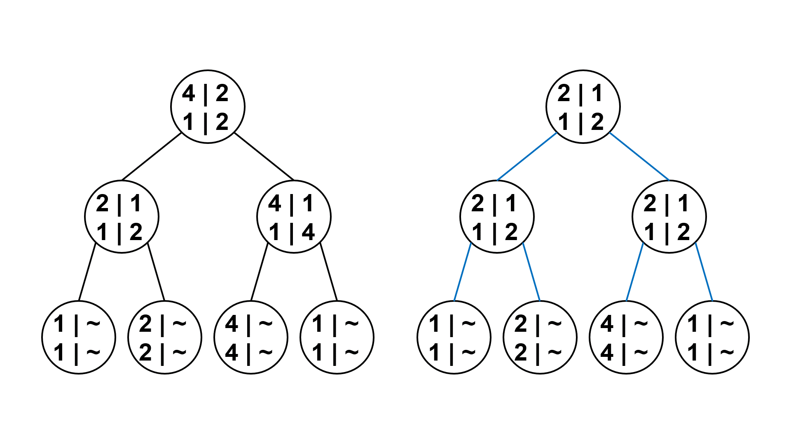

# Segment Tree Beats

## Introduction

Segment Tree Beats（簡稱 STB）是北京大學的吉如一提出的概念，發表在《区间最值操作与历史最值问题》[^note-1]中。

STB 可以達到下列兩個目的：

1. 將區間最值操作轉換成區間加減操作，在 \\( O( \log n) \\) 的時間複雜度內完成（區間最值操作指的是，給定 \\( L, R, x \\)，對所有 \\( i \in [L, R] \\)，將 \\( a_i \\) 修改成 \\( min(a_i, x) \\) 或 \\( max(a_i, x) \\)）。
2. 將歷史最值問題轉換成區間最值操作，在 \\( O(1) \\) 的時間複雜度內完成（這裡的歷史最值問題是指區間加減，詢問區間歷史最值的和）。

考慮以下問題：

> 例題 1. [HDU - Gorgeous Sequence](http://acm.hdu.edu.cn/showproblem.php?pid=5306)
>
> 給一個長度為 \\( n \\) 的序列 \\( a \\)，並對其進行 \\( m \\) 筆操作。操作有三種：
>
> 1. 給定 \\( L, R, x \\)，對所有 \\( i \in [L, R] \\)，將 \\( a_i \\) 修改成 \\( min(a_i, x) \\)。
> 2. 給定 \\( L, R \\)，對所有 \\( i \in [L, R] \\)，輸出 \\( a_i \\) 的最大值。
> 3. 給定 \\( L, R \\)，對所有 \\( i \in [L, R] \\)，輸出 \\( \sum_{i = L}^{R} a_i \\)。
>
> - \\( n, m \leq 10^6 \\)

因為在給一個節點打上區間取 \\( min \\) 標記時，我們無法快速更新區間和，所以這題無法透過傳統的懶惰標記來解決。

### 區間最值操作

考慮下面這一種解法：

對線段樹每一個節點除了維護區間和 \\( sum \\)、區間最大值 \\( mx1 \\) 之外，還要額外維護嚴格次大值 \\( mx2 \\) 以及最大值個數 \\( cmx \\)。

第二三種操作就是普通線段樹，直接更新就好。現在讓我們來考慮第一種操作。

讓區間 \\( [L, R] \\) 對 \\( x \\) 取 \\( min \\)，我們先在線段樹中定位這個區間，對定位的每一個節點，我們開始暴力搜尋。搜尋到每一個節點時，我們分三種狀況討論：

1. 當 \\( mx1 \leq x \\) 時，區間每個元素對 \\( x \\) 取 \\( min \\) 還是元素本身，不會對這個節點產生影響，直接退出。
2. 當 \\( mx2 < x < mx1 \\) 時，這一次修改只會影響到所有最大值，所以我們把區間和 \\( sum \\) 加上 \\( cmx \cdot (x - mx1) \\)，將 \\( mx1 \\) 更新為 \\( x \\)，接著打上區間取 \\( min \\) 標記然後退出（只有發生狀況二才會打標記）。
3. 當 \\( mx2 \geq x \\) 時，我們無法直接更新這一個節點的資訊，所以在此時，我們對當前節點的左子節點與右子節點進行遞迴搜尋。

標記下傳時，如果子節點的 \\( mx1 \\) 比當前標記還要大，就把子節點的 \\( mx1 \\) 和標記修改成當前標記，並更新區間和。

如下圖所示，左圖是一棵建立在 \\( [1, 4] \\) 上的線段樹，每一個節點紀錄的資訊的左側是區間最大值，右側是嚴格次大值。現在我們要讓區間 \\( [1, 4] \\) 對 \\( 2 \\) 取 \\( min \\)。那麼左圖中紅色邊表示搜尋時經過的邊，紅色字體的節點表示正在拜訪的節點，右圖為更新後的線段樹。


### 觀察性質

- 一個節點的嚴格次大值，子樹中一定存在點的區間最大值，和原來的嚴格次大值相等。以更新後的線段樹為例，根節點的嚴格次大值為 \\( 1 \\)，相當於子樹中階層為 \\( 3 \\) 最左邊節點的區間最大值。


- 狀況一和狀況二都與普通線段樹一樣，只有在狀況三（\\( mx2 \geq x \\)）時，我們會需要左右遞迴子樹，拜訪更多節點。換句話說，只有在子樹有兩種標記大於等於新標記，我們才有可能在子樹打標記。

- 打上區間取 \\( min \\) 標記時（狀況二發生時），此區間只有最大值受到影響，其他數維持不變。最大值被修改之後，原來是區間最大值的數依舊是區間最大值，原來不是區間最大值的數依舊不是。


### 時間複雜度

直覺上這個做法時間複雜度很差，不過事實上因為取 \\( min \\) 的性質，均攤下來後時間複雜度很好。

現在我們來證明這個算法的時間複雜度是 \\( O(m \log n) \\)。

觀察之前讓區間 \\( [1, 4] \\) 對 \\( 2 \\) 取 \\( min \\) 的操作，每一個節點上記錄的是區間最大值。給節點打完標記後，如果一個點的標記值與父節點的標記值相同，就把此點的標記刪除，大致流程如下圖所示（左圖中紅色邊表示搜尋時經過的邊，紅色字體的節點表示正在拜訪的節點，右圖為更新後的線段樹）：


我們可以發現每一個位置實際的值等於從它對應的線段樹葉節點出發，向上走遇到的第一個標記值。這些標記滿足：每個點的標記值都嚴格大於子樹中的所有標記值。

定義標記類的概念：

1. 同一次區間取 \\( min \\) 產生的標記屬於同一類。
2. 同一個標記下傳產生的標記屬於同一類。
3. 否則屬於不同類。

我們之後會使用記帳法做均攤分析。

接著定義權值 \\( w(T) \\)（\\( T \\) 為標記類）為在子樹中擁有至少一個屬於標記類 \\( T \\) 的節點數，也就是打標記時經過的點數；位能 \\( \Phi(x) \\) 為線段樹中所有標記類的 \\( w(T) \\) 總和。

以上面的例子為例，階層為 \\( 3 \\) 的右邊兩個節點的標記屬於同一類，假設這類為 \\( T \\)，因為打標記時有經過兩個節點，所以 \\( w(T) \\) 為 \\( 2 \\)。


依次分析三項對位能產生影響的操作：添加新標記類、標記下傳、標記回收

1. 考慮一次區間取 \\( min \\) 操作，只會添加一個新的標記類 \\( T \\)，它的權值等於我們打標記時經過的節點數。線段樹深度是 \\( O( \lceil \log n \rceil + 1 ) = O( \log n) \\)，打標記時經過的節點數最多也是 \\( O( \log n) \\)，所以 \\( w(T) \\) 是 \\( O( \log n) \\)，\\( \Phi(x) \\) 增加了 \\( O( \log n) \\)。


2. 考慮一次標記下傳，只讓標記類 \\( T \\) 的權值 \\( w(T) \\) 增加 \\( O(1) \\)，\\( \Phi(x) \\) 增加了 \\( O(1) \\)。
3. 當 \\( mx2 \geq x \\) 時，也就是狀況三發生時，要進行遞迴搜尋，因為父節點的標記一定跟其中一個子節點一樣，所以每到一個節點至少回收一個標記，那麼 \\( \Phi(x) \\) 減少了 \\( O(1) \\)。


### 透過均攤分析得到時間複雜度

定義均攤成本 \\( \hat c_i \\) 為實際成本 \\( c_i \\) 加上位能變化量 \\( \Phi(x_i) - \Phi(x_{i-1}) \\)，即 \\( \hat c_i = c_i + \Phi(x_i) - \Phi(x_{i-1}) \\)。

當一次操作的均攤成本大於實際成本時，位能變化量為正，可以將位能的正差額存起來。下次遇到均攤成本小於實際成本時，可以用儲存的位能支付不足的負差額。

總均攤成本必須大於總實際成本，即 \\( \sum \hat c_i \geq \sum c_i \\)。

現在來計算 \\( m \\) 次區間取 \\( min \\) 操作的位能變化量：

1. 添加 \\( m \\) 個新標記類，\\( \Phi(x) \\) 增加 \\( O(m \log n) \\)。
2. 標記下傳在一次操作中會進行 \\( O( \log n) \\) 次，每次讓 \\( \Phi(x) \\) 增加 \\( O(1) \\)。因此 \\( m \\) 次操作讓 \\( \Phi(x) \\) 總共增加 \\( O(m \log n) \\)。
3. 父節點對子節點進行標記回收，一定是父節點曾下傳標記給子節點，或曾打標記在子節點上。因此，標記回收的時間複雜度不會超過打標記和標記下傳的時間複雜度之和，所以 \\( m \\) 次操作讓 \\( \Phi(x) \\) 總共減少 \\( O(m \log n) \\)。

總位能變化量為 \\( O(m \log n) \\)。

接著計算 \\( m \\) 次區間取 \\( min \\) 操作的實際成本：

1. 添加 \\( m \\) 個新標記類，實際成本為 \\( O(m \log n) \\)。
2. 標記下傳在一次操作中會進行 \\( O( \log n) \\) 次，每次的實際成本為 \\( O(1) \\)。因此 \\( m \\) 次操作的實際成本為 \\( O(m \log n) \\)。
3. 標記回收的時間複雜度不會超過打標記和標記下傳的實際成本之和，所以 \\( m \\) 次操作的實際成本為 \\( O(m \log n) \\)。

總實際成本為 \\( O(m \log n) \\)。

總均攤成本為 \\( O(m \log n) \\)，得到這個算法時間複雜度是 \\( O(m \log n) \\)。

<details><summary> Solution Code </summary>

```cpp
struct STB {
    #define ls (u << 1)
    #define rs (u << 1 | 1)

    struct Node {
        ll sum;
        int l, r, mx1, mx2, cmx, tag;
    }T[N << 4];

    void pull(int u) {
        T[u].sum = T[ls].sum + T[rs].sum;
        if (T[ls].mx1 == T[rs].mx1) {
            T[u].mx1 = T[ls].mx1;
            T[u].cmx = T[ls].cmx + T[rs].cmx;
            T[u].mx2 = max(T[ls].mx2, T[rs].mx2);
        } else if (T[ls].mx1 > T[rs].mx1) {
            T[u].mx1 = T[ls].mx1;
            T[u].cmx = T[ls].cmx;
            T[u].mx2 = max(T[ls].mx2, T[rs].mx1);
        } else {
            T[u].mx1 = T[rs].mx1;
            T[u].cmx = T[rs].cmx;
            T[u].mx2 = max(T[ls].mx1, T[rs].mx2);
        }
    }

    void push(int u) {
        if (T[u].tag == -1) return;
        if (T[ls].mx1 > T[u].tag) {
            T[ls].sum += 1LL * T[ls].cmx * (T[u].tag - T[ls].mx1);
            T[ls].mx1 = T[ls].tag = T[u].tag;
        }
        if (T[rs].mx1 > T[u].tag) {
            T[rs].sum += 1LL * T[rs].cmx * (T[u].tag - T[rs].mx1);
            T[rs].mx1 = T[rs].tag = T[u].tag;
        }
        T[u].tag = -1;
    }

    void build(int u = 1, int l = 1, int r = n) {
        T[u].tag = -1;
        T[u].l = l, T[u].r = r;
        if (l == r) {
            T[u].sum = T[u].mx1 = a[l];
            T[u].mx2 = -1;
            T[u].cmx = 1;
            return;
        }
        int mid = (l+r) >> 1;
        build(ls, l, mid);
        build(rs, mid+1, r);
        pull(u);
    }

    void chmin(int L, int R, int x, int u = 1) {
        if (T[u].mx1 <= x) return;
        int l = T[u].l, r = T[u].r;
        if (L <= l && r <= R && T[u].mx2 < x) {
            T[u].sum += 1LL * T[u].cmx * (x - T[u].mx1);
            T[u].mx1 = T[u].tag = x;
            return;
        }
        push(u);
        int mid = (l+r) >> 1;
        if (L <= mid) chmin(L, R, x, ls);
        if (R > mid) chmin(L, R, x, rs);
        pull(u);
    }

    pair<ll, int> query(int L, int R, int u = 1) {
        int l = T[u].l, r = T[u].r;
        if (L <= l && r <= R)
            return {T[u].sum, T[u].mx1};
        push(u);
        ll sum = 0; int mx1 = 0;
        int mid = (l+r) >> 1;
        if (L <= mid) {
            auto r1 = query(L, R, ls);
            sum += r1.first;
            mx1 = max(mx1, r1.second);
        }
        if (mid < R) {
            auto r2 = query(L, R, rs);
            sum += r2.first;
            mx1 = max(mx1, r2.second);
        }
        return {sum, mx1};
    }
}stb;

int main() {
    scanf("%d", &t);
    while (t--) {
        scanf("%d%d", &n, &m);
        for (int i = 1; i <= n; i++) scanf("%d", &a[i]);
        stb.build();
        while (m--) {
            scanf("%d%d%d", &p, &x, &y);
            if (p == 0) {
                scanf("%d", &z);
                stb.chmin(x, y, z);
            }
            auto ans = stb.query(x, y);
            if (p == 1) printf("%d\n", ans.second);
            if (p == 2) printf("%lld\n", ans.first);
        }
    }
}
```

</details>

我們接著再看一題。

> 例題 2. [BZOJ - 最假女選手](https://bzoj.net/p/4695)
>
> 給一個長度為 \\( n \\) 的序列 \\( a \\)，並對其進行 \\( m \\) 筆操作。操作有六種：
>
> 1. 給定 \\( L, R, x \\)，對所有 \\( i \in [L, R] \\)，將 \\( a_i \\) 加上 \\( x \\)。
> 2. 給定 \\( L, R, x \\)，對所有 \\( i \in [L, R] \\)，將 \\( a_i \\) 修改成 \\( max(a_i, x) \\)。
> 3. 給定 \\( L, R, x \\)，對所有 \\( i \in [L, R] \\)，將 \\( a_i \\) 修改成 \\( min(a_i, x) \\)。
> 4. 給定 \\( L, R \\)，對所有 \\( i \in [L, R] \\)，輸出 \\( \sum_{i = L}^{R} a_i \\)。
> 5. 給定 \\( L, R \\)，對所有 \\( i \in [L, R] \\)，輸出 \\( a_i \\) 的最大值。
> 6. 給定 \\( L, R \\)，對所有 \\( i \in [L, R] \\)，輸出 \\( a_i \\) 的最小值。
>
> - \\( n, m \leq 5 \times 10^5 \\)
> - \\( | a_i | \leq 10^8 \\)

這題可以套用第一個範例題目的解法，維護維護區間 \\( max \\)、區間 \\( min \\)、區間加的標記，但實現起來會很複雜。因此，我們考慮將區間最值操作轉換為區間加減操作。

### 將區間最值操作轉換為區間加減操作

我們採用這樣的策略：

將一個區間的節點劃分為最大值、最小值和其他值三種。

對每一個節點維護區間和 \\( sum \\)、區間最大值 \\( mx1 \\)、次大值 \\( mx2 \\)、最大個數 \\( cmx \\)、最小值 \\( mn1 \\)、次小值 \\( mn2 \\)、最小個數 \\( cmn \\)。我們還需要維護區間加的標記。

不需要額外維護最大值、最小值的區間加標記，可以直接下傳最大值 \\( mx1 \\)、最小值 \\( mn1 \\)即可，這樣就不用遞迴修改整個區間。

現在讓我們來考慮第三種操作（區間取 \\( min \\) 操作）。

讓區間 \\( [L, R] \\) 對 \\( x \\) 取 \\( min \\)，我們先在線段樹中定位這個區間，對搜尋到的每一個節點，仿照第一個範例題目的解法，我們分三種狀況討論：

1. 當 \\( mx1 \leq x \\) 時，不會對這個節點產生影響，直接退出。
2. 當 \\( mx2 < x < mx1 \\) 時，我們把區間和 \\( sum \\) 加上 \\( cmx \cdot (x - mx1) \\)，將 \\( mx1 \\) 修改為 \\( x \\)，也讓 \\( mn1 \\) 和 \\( mn2 \\) 對 \\( x \\) 取 \\( min \\)（當一個區間的最大值和最小值相等時，也就是只有 \\( 1 \\) 個數，只需要將最大值和最小值修改成 \\( x \\)）。
3. 當 \\( mx2 \geq x \\) 時，我們對當前節點的左子節點與右子節點進行遞迴搜尋。

區間取 \\( max \\) 操作同理。

對於加減操作，直接將最大值、最小值和其他值同時加上 \\( x \\)，接著打上加標記然後退出（只有次大值、次小值存在時，才將其加上 \\( x \\)）。

如下圖所示，左圖是一棵建立在 \\( [1, 4] \\) 上的線段樹，每個節點上方那一列的左側是區間最大值，右側是嚴格次大值；下方那一列的左側是區間最小值，右側是嚴格次小值。現在我們要讓區間 \\( [3, 4] \\) 對 \\( 2 \\) 取 \\( min \\)。那麼左圖中紅色邊表示搜尋時經過的邊，紅色字體的節點表示正在拜訪的節點，右圖為更新後的線段樹。



接著讓區間 \\( [3, 4] \\) 的元素加上 \\( 1 \\)。在右子節點打上加標記，然後退出。


最後讓區間 \\( [4, 4] \\) 的元素加上 \\( 1 \\)。階層為 \\( 2 \\) 的右邊節點下傳區間加標記，接著發現其左子節點的 \\( mx2 < 3 < mx1 \\)，所以需要用 \\( 3 \\) 更新左子節點的最大值和最小值。


### 觀察性質

### 時間複雜度

現在我們來證明這個算法的時間複雜度是 \\( O(m \log^2 n) \\)。

我們可以修改一下標記類的定義：

1. 同一次區間取 \\( min \\) 產生的標記屬於同一類。
2. 同一次區間取 \\( max \\) 產生的標記屬於同一類。
3. 同一個標記下傳產生的標記屬於同一類。
4. 對於一次區間加減操作，考慮線段樹的任何一類，如果它跟修改區間只有部分重疊，我們就讓這一類分裂成兩類：一類是被修改的部分，一類是剩下的部分；否則這一類維持不變。

跟之前一樣，定義權值 \\( w(T) \\)（\\( T \\) 為標記類）為在子樹中擁有至少一個屬於標記類 \\( T \\) 的節點數，也就是打標記時經過的點數；位能 \\( \Phi(x) \\) 為線段樹中所有標記類的 \\( w(T) \\) 總和。

依次分析三項對位能產生影響的操作：添加新標記類、標記下傳、標記回收

1. 考慮添加一個新的標記類 \\( T \\)，它的權值最多是打標記時經過的節點數 O( \log n) \\)，增加了 \\( O( \log n) \\) 的位能。
2. 考慮一次標記下傳，分成兩種狀況討論：如果讓其他標記類分裂，那麼因為父節點有兩個子節點，所以添加了一個或兩個新標記類，增加 \\( O( \log n) \\) 的位能；如果沒有讓其他標記類分裂，只讓標記類 \\( T \\) 的權值增加 \\( O(1) \\)，\\( \Phi(x) \\) 增加了 \\( O(1) \\)。
3. 進行標記回收時，每經過一個節點都會讓標記類 \\( T \\) 的權值減少 \\( O(1) \\)，那麼 \\( \Phi(x) \\) 減少了 \\( O(1) \\)。

### 透過均攤分析得到時間複雜度

現在來計算 \\( m \\) 次操作的位能變化量：

1. 添加 \\( m \\) 個新標記類，\\( \Phi(x) \\) 增加 \\( O(m \log n) \\)。
2. 標記下傳在一次操作中會進行 \\( O( \log n) \\) 次，添加了 \\( O( \log n) \\) 個新標記類。因此 \\( m \\) 次操作添加了 \\( O(m \log n) \\) 個新標記類，每個新標記類增加了 \\( O( \log n) \\) 的位能，總共讓 \\( \Phi(x) \\) 增加 \\( O(m \log^2 n) \\)。
3. 標記回收的時間複雜度不會超過打標記和標記下傳的時間複雜度之和，所以 \\( \Phi(x) \\) 總共減少 \\( O(m \log^2 n) \\)。

總位能變化量為 \\( O(m \log^2 n) \\)。

接著計算 \\( m \\) 次區間取 \\( min \\) 操作的實際成本：

1. 添加 \\( m \\) 個新標記類，實際成本為 \\( O(m \log n) \\)。
2. 標記下傳在一次操作中會進行 \\( O( \log n) \\) 次，每次的實際成本為 \\( O(1) \\)。因此 \\( m \\) 次操作的實際成本為 \\( O(m \log n) \\)。
3. 標記回收的時間複雜度不會超過打標記和標記下傳的實際成本之和，所以 \\( m \\) 次操作的實際成本為 \\( O(m \log n) \\)。

總實際成本為 \\( O(m \log n) \\)。

總均攤成本為 \\( O(m \log^2 n) \\)，得到這個算法時間複雜度的上界是 \\( O(m \log^2 n) \\)。

<details><summary> Solution Code </summary>

```cpp
struct STB {
    #define ls (u << 1)
    #define rs (u << 1 | 1)

    struct Tuple {
        ll first;
        int second, third;
    };

    struct Node {
        ll sum, tag;
        int l, r, mx1, mx2, cmx, mn1, mn2, cmn;
    }T[N << 4];

    void pull(int u) {
        T[u].sum = T[ls].sum + T[rs].sum;
        if (T[ls].mx1 == T[rs].mx1) {
            T[u].mx1 = T[ls].mx1;
            T[u].cmx = T[ls].cmx + T[rs].cmx;
            T[u].mx2 = max(T[ls].mx2, T[rs].mx2);
        } else if (T[ls].mx1 > T[rs].mx1) {
            T[u].mx1 = T[ls].mx1;
            T[u].cmx = T[ls].cmx;
            T[u].mx2 = max(T[ls].mx2, T[rs].mx1);
        } else {
            T[u].mx1 = T[rs].mx1;
            T[u].cmx = T[rs].cmx;
            T[u].mx2 = max(T[ls].mx1, T[rs].mx2);
        }
        if (T[ls].mn1 == T[rs].mn1) {
            T[u].mn1 = T[ls].mn1;
            T[u].cmn = T[ls].cmn + T[rs].cmn;
            T[u].mn2 = min(T[ls].mn2, T[rs].mn2);
        } else if (T[ls].mn1 < T[rs].mn1) {
            T[u].mn1 = T[ls].mn1;
            T[u].cmn = T[ls].cmn;
            T[u].mn2 = min(T[ls].mn2, T[rs].mn1);
        } else {
            T[u].mn1 = T[rs].mn1;
            T[u].cmn = T[rs].cmn;
            T[u].mn2 = min(T[ls].mn1, T[rs].mn2);
        }
    }

    void pushmax(int u, int v) {
        int l = T[u].l, r = T[u].r;
        if (T[u].mx1 == T[u].mn1) {
            T[u].mx1 = T[u].mn1 = v;
            T[u].cmx = T[u].cmn = r - l + 1;
            T[u].sum = 1LL * T[u].cmx * v;
            T[u].mx2 = INT_MIN;
            T[u].mn2 = INT_MAX;
            return;
        }
        T[u].sum += 1LL * T[u].cmn * (v - T[u].mn1);
        T[u].mn1 = v;
        T[u].mx1 = max(T[u].mx1, v);
        T[u].mx2 = max(T[u].mx2, v);
    }

    void pushmin(int u, int v) {
        int l = T[u].l, r = T[u].r;
        if (T[u].mx1 == T[u].mn1) {
            T[u].mx1 = T[u].mn1 = v;
            T[u].cmx = T[u].cmn = r - l + 1;
            T[u].sum = 1LL * T[u].cmx * v;
            T[u].mx2 = INT_MIN;
            T[u].mn2 = INT_MAX;
            return;
        }
        T[u].sum += 1LL * T[u].cmx * (v - T[u].mx1);
        T[u].mx1 = v;
        T[u].mn1 = min(T[u].mn1, v);
        T[u].mn2 = min(T[u].mn2, v);
    }

    void pushadd(int u, int v) {
        T[u].mx1 += v;
        if (T[u].mx2 != INT_MIN) T[u].mx2 += v;
        T[u].mn1 += v;
        if (T[u].mn2 != INT_MAX) T[u].mn2 += v;
        int l = T[u].l, r = T[u].r;
        T[u].sum += 1LL * (r - l + 1) * v;
        T[u].tag += v;
    }

    void push(int u) {
        if (T[u].tag) {
            pushadd(ls, T[u].tag);
            pushadd(rs, T[u].tag);
            T[u].tag = 0;
        }
        if (T[ls].mx1 > T[u].mx1 && T[ls].mx2 < T[u].mx1) {
            pushmin(ls, T[u].mx1);
        }
        if (T[rs].mx1 > T[u].mx1 && T[rs].mx2 < T[u].mx1) {
            pushmin(rs, T[u].mx1);
        }
        if (T[ls].mn1 < T[u].mn1 && T[ls].mn2 > T[u].mn1) {
            pushmax(ls, T[u].mn1);
        }
        if (T[rs].mn1 < T[u].mn1 && T[rs].mn2 > T[u].mn1) {
            pushmax(rs, T[u].mn1);
        }
    }

    void build(int u = 1, int l = 1, int r = n) {
        T[u].tag = 0;
        T[u].l = l, T[u].r = r;
        if (l == r) {
            T[u].sum = T[u].mx1 = T[u].mn1 = a[l];
            T[u].mx2 = INT_MIN;
            T[u].mn2 = INT_MAX;
            T[u].cmx = T[u].cmn = r - l + 1;
            return;
        }
        int mid = (l+r) >> 1;
        build(ls, l, mid);
        build(rs, mid+1, r);
        pull(u);
    }

    void add(int L, int R, int x, int u = 1) {
        int l = T[u].l, r = T[u].r;
        if (R < l || r < L) return;
        if (L <= l && r <= R) {
            pushadd(u, x);
            return;
        }
        push(u);
        int mid = (l+r) >> 1;
        if (L <= mid)
            add(L, R, x, ls);
        if (mid < R)
            add(L, R, x, rs);
        pull(u);
    }

    void chmax(int L, int R, int x, int u = 1) {
        if (T[u].mn1 >= x) return;
        int l = T[u].l, r = T[u].r;
        if (L <= l && r <= R && T[u].mn2 > x) {
            pushmax(u, x);
            return;
        }
        push(u);
        int mid = (l+r) >> 1;
        if (L <= mid) chmax(L, R, x, ls);
        if (R > mid) chmax(L, R, x, rs);
        pull(u);
    }

    void chmin(int L, int R, int x, int u = 1) {
        if (T[u].mx1 <= x) return;
        int l = T[u].l, r = T[u].r;
        if (L <= l && r <= R && T[u].mx2 < x) {
            pushmin(u, x);
            return;
        }
        push(u);
        int mid = (l+r) >> 1;
        if (L <= mid) chmin(L, R, x, ls);
        if (R > mid) chmin(L, R, x, rs);
        pull(u);
    }

    Tuple query(int L, int R, int u = 1) {
        int l = T[u].l, r = T[u].r;
        if (L <= l && r <= R)
            return {T[u].sum, T[u].mx1, T[u].mn1};
        push(u);
        ll sum = 0; int mx1 = INT_MIN, mn1 = INT_MAX;
        int mid = (l+r) >> 1;
        if (L <= mid) {
            auto r1 = query(L, R, ls);
            sum += r1.first;
            mx1 = max(mx1, r1.second);
            mn1 = min(mn1, r1.third);
        }
        if (mid < R) {
            auto r2 = query(L, R, rs);
            sum += r2.first;
            mx1 = max(mx1, r2.second);
            mn1 = min(mn1, r2.third);
        }
        return {sum, mx1, mn1};
    }
}stb;

int main() {
    scanf("%d", &n);
    for (int i = 1; i <= n; i++) scanf("%d", &a[i]);
    stb.build();
    scanf("%d", &m);
    while (m--) {
        scanf("%d%d%d", &p, &x, &y);
        auto ans = stb.query(x, y);
        if (p == 1) scanf("%d", &z), stb.add(x, y, z);
        if (p == 2) scanf("%d", &z), stb.chmax(x, y, z);
        if (p == 3) scanf("%d", &z), stb.chmin(x, y, z);
        if (p == 4) printf("%lld", ans.first);
        if (p == 5) printf("%d", ans.second);
        if (p == 6) printf("%d", ans.third);
    }
}
```

</details>

### 歷史最值問題

我們通常需要對一個序列 \\( a \\) 進行多次操作，然後進行一些詢問。對歷史版本進行的詢問，稱為歷史最值問題。我們先來介紹三類歷史最值問題：

#### 歷史最大值

當前位置下曾經出現過的數的最大值。定義一個輔助數組 \\( b \\)，最開始 \\( b \\) 數組與 \\( a \\) 數組完全相同。在每一次操作後，對每一個 \\( i \in [1, n] \\)，我們都進行一次更新，讓 \\( b_i = max(b_i, a_i) \\)。這時，我們將 \\( b_i \\) 稱作 \\( i \\) 這個位置的歷史最大值。


#### 歷史最小值

當前位置下曾經出現過的數的最小值。定義一個輔助數組 \\( b \\)，最開始 \\( b \\) 數組與 \\( a \\) 數組完全相同。在每一次操作後，對每一個 \\( i \in [1, n] \\)，我們都進行一次更新，讓 \\( b_i = min(b_i, a_i) \\)。這時，我們將 \\( b_i \\) 稱作 \\( i \\) 這個位置的歷史最小值。


#### 歷史版本和

定義一個輔助數組 \\( b \\)，最開始 \\( b \\) 數組中的所有數都是 \\( 0 \\)。在每一次操作後，對每一個 \\( i \in [1, n] \\)，我們都進行一次更新，讓 \\( b_i = b_i + a_i \\)。這時，我們將 \\( b_i \\) 稱作 \\( i \\) 這個位置的歷史版本和。

### 使用懶標記維護的問題

> 例題 3. [BZOJ - CPU 監控](https://bzoj.net/p/3064)
>
> 給一個長度為 \\( n \\) 的序列 \\( a \\)，同時定義一個輔助數組 \\( b \\)，\\( b \\) 開始與 \\( a \\) 完全相同。接下來對其進行 \\( m \\) 筆操作，操作有四種：
>
> 1. 給定 \\( L, R, x \\)，對所有 \\( i \in [L, R] \\)，將 \\( a_i \\) 修改成 \\( x \\)。
> 2. 給定 \\( L, R, x \\)，對所有 \\( i \in [L, R] \\)，將 \\( a_i \\) 加上 \\( x \\)。
> 3. 給定 \\( L, R \\)，對所有 \\( i \in [L, R] \\)，輸出 \\( a_i \\) 的最大值。
> 4. 給定 \\( L, R \\)，對所有 \\( i \in [L, R] \\)，輸出 \\( b_i \\) 的最大值。
>
> 在每一次操作後，我們都進行一次更新，讓 \\( b_i = max(b_i, a_i) \\)。
>
> - \\( n, m \leq 10^5 \\)

先忽略操作一。

在每個節點維護維護當前最大值 \\( mx \\) 之外，還要額外維護歷史最大值 \\( hmx \\)，區間加標記 \\( add \\) 以及歷史最大加標記 \\( hadd \\)。

如果只是詢問區間最大值，只需要維護區間加標記 \\( add \\) 就能解決。

現在考慮歷史區間最大值。歷史最大加標記 \\( hadd \\)，代表從上一次把這個節點的標記下傳的時刻到當前時刻的時段中，\\( add \\) 標記值到達過的最大值。

### 標記下傳

當節點 \\( u \\) 的標記下傳到他的子節點 \\( s \\) 時，更新子節點的標記：

\\( hadd_s = max(hadd_s, add_s + hadd_u) \\)

\\( add_s = add_s + add_u \\)

至於區間歷史最大值資訊的更新也類似，只需要將當前的區間最大值加上 \\( hadd_u \\) 然後與原來的歷史最大值進行比較即可：

\\( hmx_s = max(hmx_s, mx_s + hadd_u) \\)

\\( mx_s = mx_s + add_u \\)

### 加入區間覆蓋

現在考慮操作一。

節點的標記可以分成兩部分：第一部分是區間加減，第二部分是區間覆蓋。

將標記換成 \\( (add, cov) \\)，表示將當前節點先加上 \\( add \\) 再全部變成 \\( cov \\)。

- 當一個區間已經被覆蓋，節點中的所有數變成完全相同，區間加操作可以直接加到 \\( cov \\) 上。

還需要維護 \\( (hadd, hcov) \\)，表示當前區間在第一階段時的最大加標記是 \\( hadd \\)，在第二階段時的最大覆蓋標記是 \\( hcov \\)。

- 當一個區間已經被覆蓋，區間加操作可以將當前的 \\( cov \\) 加上 \\( hadd \\) 的值，與原來的 \\( hcov \\) 進行比較即可。

當節點 \\( u \\) 的標記下傳到他的子節點 \\( s \\) 時，如果子節點已被覆蓋，更新子節點的標記：

\\( hcov_s = max(hcov_s, cov_s + hadd_u) \\)

\\( cov_s = cov_s + add_u \\)

在這裡每一個節點紀錄的資訊的第一列由左至右是 \\( mx \\)，\\( add \\)，\\( cov \\)，第二列由左至右是 \\( hmx \\)，\\( hadd \\)，\\( hcov \\)。


如下圖所示，左圖是一棵建立在 \\( [1, 4] \\) 上的線段樹。現在我們要將區間 \\( [3, 4] \\) 修改成 \\( 2 \\)。那麼左圖中紅色邊表示搜尋時經過的邊，紅色字體的節點表示正在拜訪的節點，右圖為更新後的線段樹。


接著讓區間 \\( [3, 4] \\) 的元素加上 \\( 1 \\)。本來是下傳區間加標記，但因為右子節點已被覆蓋，所以直接將 \\( 1 \\) 累加在右子節點的 \\( cov \\) 上。


最後讓區間 \\( [4, 4] \\) 的元素加上 \\( 1 \\)。因為右子節點已經被覆蓋，所以下傳覆蓋標記給子節點，變成子節點被覆蓋。接著下傳加標記，因為子節點已被覆蓋，所以直接將 \\( 1 \\) 累加在 \\( cov \\) 上。


### 時間複雜度

這個算法的時間複雜度跟傳統線段樹一樣，是 \\( O(m \log n) \\)。

<details><summary> Solution Code </summary>

```cpp
struct STB {
    #define ls (u << 1)
    #define rs (u << 1 | 1)

    struct Node {
        int l, r, mx, hmx, add, hadd, cov, hcov;
    }T[N << 4];

    void pull(int u) {
        T[u].mx = max(T[ls].mx, T[rs].mx);
        T[u].hmx = max(T[ls].hmx, T[rs].hmx);
    }

    void pushcover(int u, int v, int hv) {
        T[u].mx = v;
        T[u].hmx = max(T[u].hmx, hv);

        T[u].cov = v;
        T[u].hcov = max(T[u].hcov, hv);
    }

    void pushadd(int u, int v, int hv) {
        if (T[u].cov != INT_MIN) {
            pushcover(u, T[u].cov + v, T[u].cov + hv);
            return;
        }
        T[u].mx += v;
        T[u].hmx = max(T[u].hmx, T[u].mx + hv);

        T[u].add += v;
        T[u].hadd = max(T[u].hadd, T[u].add + hv);
    }

    void push(int u) {
        if (T[u].add) {
            pushadd(ls, T[u].add, T[u].hadd);
            pushadd(rs, T[u].add, T[u].hadd);
            T[u].add = T[u].hadd = 0;
        }
        if (T[u].cov != INT_MIN) {
            pushcover(ls, T[u].cov, T[u].hcov);
            pushcover(rs, T[u].cov, T[u].hcov);
            T[u].cov = T[u].hcov = INT_MIN;
        }
    }

    void build(int u = 1, int l = 1, int r = n) {
        T[u].cov = T[u].hcov = INT_MIN;
        T[u].l = l, T[u].r = r;
        if (l == r) {
            T[u].mx = T[u].hmx = a[l];
            return;
        }
        int mid = (l+r) >> 1;
        build(ls, l, mid);
        build(rs, mid+1, r);
        pull(u);
    }

    void add(int L, int R, int x, int u = 1) {
        int l = T[u].l, r = T[u].r;
        if (R < l || r < L) return;
        if (L <= l && r <= R) {
            pushadd(u, x, x);
            return;
        }
        push(u);
        int mid = (l+r) >> 1;
        if (L <= mid)
            add(L, R, x, ls);
        if (mid < R)
            add(L, R, x, rs);
        pull(u);
    }

    void cover(int L, int R, int x, int u = 1) {
        int l = T[u].l, r = T[u].r;
        if (R < l || r < L) return;
        if (L <= l && r <= R) {
            pushcover(u, x, x);
            return;
        }
        push(u);
        int mid = (l+r) >> 1;
        if (L <= mid)
            cover(L, R, x, ls);
        if (mid < R)
            cover(L, R, x, rs);
        pull(u);
    }

    pair<int, int> query(int L, int R, int u = 1) {
        int l = T[u].l, r = T[u].r;
        if (L <= l && r <= R)
            return {T[u].mx, T[u].hmx};
        push(u);
        int mx = INT_MIN; int hmx = INT_MIN;
        int mid = (l+r) >> 1;
        if (L <= mid) {
            auto r1 = query(L, R, ls);
            mx = max(mx, r1.first);
            hmx = max(hmx, r1.second);
        }
        if (mid < R) {
            auto r2 = query(L, R, rs);
            mx = max(mx, r2.first);
            hmx = max(hmx, r2.second);
        }
        return {mx, hmx};
    }
}stb;

int main() {
    scanf("%d", &n);
    for (int i = 1; i <= n; i++) scanf("%d", &a[i]);
    stb.build();
    scanf("%d", &m);
    while (m--) {
        scanf(" %c%d%d", &p, &x, &y);
        auto ans = stb.query(x, y);
        if (p == 'Q') printf("%d\n", ans.first);
        if (p == 'A') printf("%d\n", ans.second);
        if (p == 'P') {
            scanf("%d", &z);
            stb.add(x, y, z);
        }
        if (p == 'C') {
            scanf("%d", &z);
            stb.cover(x, y, z);
        }
    }
}
```

</details>

## References

底下的資源包含許多例題，同學可以去參考看看。

- [a simple introduction to "Segment tree beats"](https://codeforces.com/blog/entry/57319)
- [Segment Tree beats - USaCO Guide](https://usaco.guide/adv/segtree-beats?lang=cpp)
- [Segment Tree beats 学习笔记](https://www.cnblogs.com/Neal-lee/p/15695984.html)
- [Historic Information on Segment Trees](https://mzhang2021.github.io/cp-blog/historic-segtree)
- [区间最值操作 & 区间历史最值 - OI Wiki](https://oi-wiki.org/ds/seg-beats)
- [《区间最值操作与历史最值问题》- 国家集训队 2016 论文集](https://github.com/enkerewpo/OI-Public-Library/blob/master/IOI中国国家候选队论文/国家集训队2016论文集.pdf)

[^note-1]: [2016 集训队论文 - 吉如一《区间最值操作与历史最值问题》](http://www.doc88.com/p-6744902151779.html)
