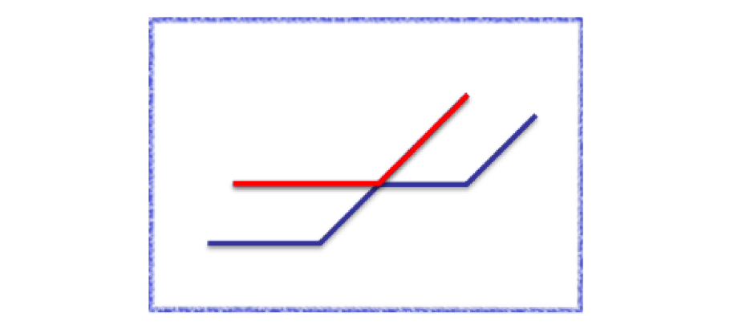

# Segment Tree Beats

## Introduction

Segment Tree Beats（簡稱 STB）是北京大學的吉如一提出的概念，發表在《区间最值操作与历史最值问题》[^note-1]中。

考慮以下問題：

> 例題 1. [HDU - Gorgeous Sequence](http://acm.hdu.edu.cn/showproblem.php?pid=5306)
>
> 給一個長度為 \\( n \\) 的序列 \\( A \\)，並對其進行 \\( m \\) 筆操作。操作有三種：
>
> 1. 給定 \\( l, r, x \\)，對所有 \\( i, (l \leq i \leq r) \\)，將 \\( A_i \\) 修改成 \\( min(A_i, x) \\)。
> 2. 給定 \\( l, r \\)，對所有 \\( i, (l \leq i \leq r) \\)，輸出\\( A_i \\)的最大值。
> 3. 給定 \\( l, r \\)，對所有 \\( i, (l \leq i \leq r) \\)，輸出\\( \sum_{i = l}^{r} A_i \\)。
>
> - \\( n, m \leq 10^6 \\)

因為在給一個節點打上區間取 \\( min \\) 標記時，我們無法快速更新區間和，所以這題無法透過傳統的懶惰標記來解決。

### 區間最值操作

考慮下面這一種解法：

對線段樹每一個節點除了維護區間和 \\( num \\) 之外，還要額外維護區間中的最大值 \\( mx1 \\)，嚴格次大值 \\( mx2 \\) 以及最大值個數 \\( cmx \\)。

讓區間 \\( [L, R] \\) 對 \\( x \\) 取 \\( min \\)，我們先在線段樹中定位這個區間，對定位的每一個節點，我們開始暴力搜尋。搜尋到每一個節點時，我們分三種情況討論：

1. 當 \\( mx1 \leq x \\) 時，顯然這一次修改不會對這個節點產生影響，直接退出。
2. 當 \\( mx2 < x < mx1 \\) 時，顯然這一次修改只會影響到所有最大值，所以我們把 \\( num \\) 加上 \\( t \cdot (x - mx) \\)，將 \\( mx \\) 更新為 \\( x \\)，接著打上標記然後退出。
3. 當 \\( mx2 \geq x \\) 時，我們無法直接更新這一個節點的資訊，所以在此時，我們對當前節點的左子節點與右子節點進行遞迴搜尋。

如下圖所示，左圖是一棵建立在 \\( [1, 4] \\) 上的線段樹，每一個節點紀錄的資訊的左側是區間最大值，右側是嚴格次大值。現在我們要讓區間 \\( [1, 4] \\) 對 \\( 2 \\) 取 \\( min \\)。那麼左圖中紅色邊表示搜尋時經過的邊，紅色字體的節點表示搜索終止的節點，右圖為更新後的線段樹。


如果進行實作的話，可以發現這個算法的運行效率非常高。實際上可以證明它的時間複雜度是 \\( O(mlogn) \\)。

首先我們把最大值看作標記，對線段樹每一個節點，記錄一個標記值，它的值等於它所包含的區間中的最大值。接著如果一個點的標記值與父節點的標記值相同，就把此點的標記刪除，大致轉換如下圖所示（左圖紀錄的是線段樹中的最大值，右圖為轉換後的線段樹）：


在轉換之後，線段樹中最多存在 \\( n \\) 個標記。這些標記滿足每一個點的標記值都大於它子樹中的所有標記值。每一個位置實際的值等於從它對應的線段樹葉節點出發，向上走遇到的第一個標記值。

觀察上述算法，可以發現我們維護的區間次大值，相當於子樹中標記的最大值。而上述算法的 DFS 過程，相當於打上新的標記後，為了滿足標記值隨深度遞減的性質，在子樹中回收掉值大於它的標記，即標記回收。現在我們來證明標記回收的時間複雜度。

首先我們定義標記類的概念：

1. 同一次區間取 \\( min \\) 標記產生的標記屬於同一類。
2. 同一個標記下傳產生的新標記屬於同一類。
3. 不滿足前兩個條件的任意兩個標記屬於不同類。

接著定義每一類標記的權值等於這一類標記加上線段樹根節點在線段樹上形成的虛樹大小（即所有子樹中存在此類標記的節點個數），定義勢函數 \\( \Phi(x) \\) 為線段樹中所有標記類的權值總和。

考慮一次區間取 \\( max \\) 操作，我們添加了一個新的標記類，它的權值等於我們打標記時經過的節點數，時間複雜度是 \\( O(logn) \\)。

考慮一次標記下傳，顯然我們只讓此類標記的權值增加 \\( 1 \\)。

考慮 DFS 的過程，我們一旦開始進行暴力 DFS，那麼表示這個點的子樹中一定存在需要回收的標記，而在回收之後這個點的子樹中一定不存在這一類標記，所以我們經過每一個節點，一定存在一類標記權值減少了 \\( 1 \\)，那麼勢函數必定隨之減少了 \\( 1 \\)。

因為標記下傳只發生在我們在線段樹上定位區間時，所以標記下傳的總次數是 \\( O(mlogn) \\)的，而打標記時對勢函數產生的總貢獻也是 \\( O(mlogn) \\)的，所以勢函數總的變化量只有 \\( O(mlogn) \\)。

因為回收標記的時間複雜度不會超過打標記和標記下傳的時間複雜度之和，所以我們就證明了回收標記的複雜度是 \\( O(mlogn) \\)。

<details><summary> Solution Code </summary>

```cpp
#include <algorithm>
#include <cctype>
#include <cstdio>
using namespace std;
const int N = 1e6 + 6;

char nc() {
    static char buf[1000000], *p = buf, *q = buf;
    return p == q && (q = (p = buf) + fread(buf, 1, 1000000, stdin), p == q)
               ? EOF
               : *p++;
}

int rd() {
    int res = 0;
    char c = nc();
    while (!isdigit(c)) c = nc();
    while (isdigit(c)) res = res * 10 + c - '0', c = nc();
    return res;
}

int t, n, m;
int a[N];
int mx[N << 2], se[N << 2], cn[N << 2], tag[N << 2];
long long sum[N << 2];

void pushup(int u) {  // 向上更新標記
    const int ls = u << 1, rs = u << 1 | 1;
    sum[u] = sum[ls] + sum[rs];
    if (mx[ls] == mx[rs]) {
        mx[u] = mx[rs];
        se[u] = max(se[ls], se[rs]);
        cn[u] = cn[ls] + cn[rs];
    } else if (mx[ls] > mx[rs]) {
        mx[u] = mx[ls];
        se[u] = max(se[ls], mx[rs]);
        cn[u] = cn[ls];
    } else {
        mx[u] = mx[rs];
        se[u] = max(mx[ls], se[rs]);
        cn[u] = cn[rs];
    }
}

void pushtag(int u, int tg) {  // 單純打標記，不暴搜
    if (mx[u] <= tg) return;
    sum[u] += (1ll * tg - mx[u]) * cn[u];
    mx[u] = tag[u] = tg;
}

void pushdown(int u) {  // 下傳標記
    if (tag[u] == -1) return;
    pushtag(u << 1, tag[u]), pushtag(u << 1 | 1, tag[u]);
    tag[u] = -1;
}

void build(int u = 1, int l = 1, int r = n) {  // 建樹
    tag[u] = -1;
    if (l == r) {
        sum[u] = mx[u] = a[l], se[u] = -1, cn[u] = 1;
        return;
    }
    int mid = (l + r) >> 1;
    build(u << 1, l, mid), build(u << 1 | 1, mid + 1, r);
    pushup(u);
}

void modify_min(int L, int R, int v, int u = 1, int l = 1, int r = n) {
    if (mx[u] <= v) return;
    if (L <= l && r <= R && se[u] < v) return pushtag(u, v);
    int mid = (l + r) >> 1;
    pushdown(u);
    if (L <= mid) modify_min(L, R, v, u << 1, l, mid);
    if (mid < R) modify_min(L, R, v, u << 1 | 1, mid + 1, r);
    pushup(u);
}

int query_max(int L, int R, int u = 1, int l = 1, int r = n) {  // 查詢最值
    if (L <= l && r <= R) return mx[u];
    int mid = (l + r) >> 1, r1 = -1, r2 = -1;
    pushdown(u);
    if (L <= mid) r1 = query_max(L, R, u << 1, l, mid);
    if (mid < R) r2 = query_max(L, R, u << 1 | 1, mid + 1, r);
    return max(r1, r2);
}

long long query_sum(int L, int R, int u = 1, int l = 1, int r = n) {  // 數值
    if (L <= l && r <= R) return sum[u];
    int mid = (l + r) >> 1;
    long long res = 0;
    pushdown(u);
    if (L <= mid) res += query_sum(L, R, u << 1, l, mid);
    if (mid < R) res += query_sum(L, R, u << 1 | 1, mid + 1, r);
    return res;
}

void go() {  // 根據題意
    n = rd(), m = rd();
    for (int i = 1; i <= n; i++) a[i] = rd();
    build();
    for (int i = 1; i <= m; i++) {
        int op, x, y, z;
        op = rd(), x = rd(), y = rd();
        if (op == 0)
            z = rd(), modify_min(x, y, z);
        else if (op == 1)
            printf("%d\n", query_max(x, y));
        else
            printf("%lld\n", query_sum(x, y));
    }
}

signed main() {
    t = rd();
    while (t--) go();
    return 0;
}
```

</details>

我們接著再看一題。

> 例題 2. Picks loves segment tree
>
> 給一個長度為 \\( n \\) 的序列 \\( A \\)，並對其進行 \\( m \\) 筆操作。操作有三種：
>
> 1. 給定 \\( l, r, x \\)，對所有 \\( i, (l \leq i \leq r) \\)，將 \\( A_i \\) 修改成 \\( min(A_i, x) \\)。
> 2. 給定 \\( l, r \\)，對所有 \\( i, (l \leq i \leq r) \\)，將\\( A_i \\) 加上 \\( x \\)（\\( x \\) 可能為負數）。
> 3. 給定 \\( l, r \\)，對所有 \\( i, (l \leq i \leq r) \\)，輸出\\( \sum_{i = l}^{r} A_i \\)。
>
> - \\( n, m \leq 3 \times 10^5 \\)

因為加上了區間加減，區間最大值、嚴格次大值和最大值還是可以維護的，所以我們考慮沿用剛才的作法，只需把標記換成二元組 \\( (add, v) \\)，表示將當前節點維護的區間先加上 \\( add \\) 再與 \\( v \\) 取最小值。合併標記時，先給當前節點加上一個標記，除了更新當前節點的區間加標記 \\( add \\)，還需要把它加到 \\( v \\) 上。當節點 \\( x \\) 下傳標記到它的子節點 \\( ch \\) 時，我們把子節點的標記更新為 \\( (add_{ch} + add_x, min(v_{ch} + add_x, v_x)) \\) 即可。

接著我們來證明複雜度。因為有了區間加減這一個操作，剛才的證明就難以沿用了，但可以參考大致的想法。

我們可以修改一下標記類的定義：

1. 同一次區間取 \\( min \\) 標記產生的標記屬於同一類。
2. 同一個標記下傳產生的新標記都屬於原來那一類。
3. 對於一次區間加減操作，對於線段樹的任何一類，如果它被修改區間完全包含或者和修改區間完全相離，那麼這一類就不變；否則我們就讓這一類分裂成兩類：一類是被修改的部分，一類是剩下的部分。

重新定義每一類標記的權值等於這一類標記在線段樹上所有節點形成的虛樹大小（不包含根節點），定義輔助函數 \\( \Phi(x) \\) 為線段樹中所有標記類的權值總和。

這樣一次區間加減操作對輔助函數的影響只有單次 \\( O(logn) \\) 的標記下傳（分裂標記時勢能函數只會減少）；一次標記下傳只會讓輔助函數增加 \\( O(1) \\)；一次打標記只會讓輔助函數增加 \\( O(logn) \\)。

考慮 DFS 的過程，我們先透過線段樹定位數個節點，然後從這些節點開始 DFS。我們對每一個開始節點考慮每一類會被回收的標記：如果這一類標記只有一部分在這個子樹中，那麼我們每經過一個節點都會讓這個標記的權值減一；而如果這一類標記全部都在子樹中，回收的過程相當於先花一些代價定位這一類標記的 LCA，然後再在標記的虛數上進行回收。

所以我們可以將複雜度分成兩部分，第一部分昰減少輔助函數時花費的時間複雜度，這是 \\( O(mlogn) \\) 的；第二部分的複雜度是定位某一類標記的 LCA 時產生的複雜度，每一類標記都有可能對這一部分的複雜度產生 \\( O(mlogn) \\) 的貢獻，因為標記的總數只有 \\( O(mlogn) \\)，所以標記的類數也是 \\( O(mlogn) \\)的，因此這一部分的複雜度的一個上界是 \\( O(mlog^2n) \\)。

至此，我們證明了這一個算法的複雜度的上界是 \\( O(mlog^2n) \\)。實際上這個上界是比較鬆的，吉如一老師猜想標記的總類數是線性的，即這一個算法的時間複雜度是 \\( O(mlogn) \\) 的，然而到目前為止還沒有好的方法可以證明。

觀察例題 \\( 2 \\) 的時間複雜度證明，我們發現在證明時並沒有使用到區間加減操作的具體性質，所以將區間加減操作替換成其他的修改操作，上述的證明仍然成立。

<details><summary> Solution Code </summary>

```cpp
#include <bits/stdc++.h>

#define NS (500005)
#define LS(a) (a << 1)
#define RS(a) (a << 1 | 1)

using namespace std;

typedef long long LL;

template<typename _Tp> inline void IN(_Tp& dig) {
    char c; bool flag = 0; dig = 0;
    while (c = getchar(), !isdigit(c)) if (c == '-') flag = 1;
    while (isdigit(c)) dig = dig * 10 + c - '0', c = getchar();
    if (flag) dig = -dig;
}

int n, m, A[NS];

struct N {LL m1, m2, sum, tag; int cnt;} e[NS << 2];

void tmin(int a, LL d) {
    e[a].sum -= 1ll * (e[a].m1 - d) * e[a].cnt, e[a].m1 = d;
}

void tadd(int a, int l, LL d) {
    e[a].m1 += d, e[a].m2 += d;
    e[a].sum += 1ll * l * d, e[a].tag += d;
}

void pup(int a) {
    int l = LS(a), r = RS(a);
    e[a].sum = e[l].sum + e[r].sum;
    if (e[l].m1 == e[r].m1) {
        e[a].m1 = e[l].m1, e[a].cnt = e[l].cnt + e[r].cnt;
        e[a].m2 = max(e[l].m2, e[r].m2);
        return;
    }
    if (e[l].m1 < e[r].m1) swap(l, r);
    e[a].m1 = e[l].m1, e[a].cnt = e[l].cnt, e[a].m2 = max(e[r].m1, e[l].m2);
}

void pdown(int L, int R, int a) {
    int l = LS(a), r = RS(a);
    if (e[a].tag) {
        int Mid = (L + R) >> 1;
        tadd(l, Mid - L + 1, e[a].tag), tadd(r, R - Mid, e[a].tag);
        e[a].tag = 0;
    }
    if (e[a].m1 < e[l].m1) tmin(l, e[a].m1);
    if (e[a].m1 < e[r].m1) tmin(r, e[a].m1);
}

void Build(int l, int r, int a) {
    if (l == r) {
        e[a].sum = e[a].m1 = A[l], e[a].m2 = -1e17, e[a].cnt = 1;
        return;
    }
    int mid = (l + r) >> 1;
    Build(l, mid, LS(a)), Build(mid + 1, r, RS(a)), pup(a);
}

void Up_Min(int l, int r, int d, int L, int R, int a) {
    if (d >= e[a].m1) return;
    if (l <= L && R <= r && d > e[a].m2) {tmin(a, d); return;}
    pdown(L, R, a);
    int Mid = (L + R) >> 1;
    if (l <= Mid) Up_Min(l, r, d, L, Mid, LS(a));
    if (r > Mid) Up_Min(l, r, d, Mid + 1, R, RS(a));
    pup(a);
}

void Up_Add(int l, int r, int d, int L, int R, int a) {
    if (l <= L && R <= r) {tadd(a, R - L + 1, d); return;}
    pdown(L, R, a);
    int Mid = (L + R) >> 1;
    if (l <= Mid) Up_Add(l, r, d, L, Mid, LS(a));
    if (r > Mid) Up_Add(l, r, d, Mid + 1, R, RS(a));
    pup(a);
}

LL Query(int l, int r, int L, int R, int a) {
    if (l <= L && R <= r) return e[a].sum;
    pdown(L, R, a);
    LL res = 0; int Mid = (L + R) >> 1;
    if (l <= Mid) res = Query(l, r, L, Mid, LS(a));
    if (r > Mid) res += Query(l, r, Mid + 1, R, RS(a));
    return res;
}

int main() {
    IN(n), IN(m);
    for (int i = 1; i <= n; i += 1) IN(A[i]);
    Build(1, n, 1);
    for (int C = 1, o, a, b, c; C <= m; C += 1)
    {
        IN(o), IN(a), IN(b);
        if (o == 1) IN(c), Up_Min(a, b, c, 1, n, 1);
        else if (o == 2) IN(c), Up_Add(a, b, c, 1, n, 1);
        else printf("%lld\n", Query(a, b, 1, n, 1));
    }
    return 0;
}
```

</details>

### 將區間最值操作轉換為區間加減操作

觀察我們在例題 \\( 2 \\) 使用的算法，我們發現在打上區間取 \\( min \\) 標記時，這一個區間只有最大值會受到這一個標記的影響，而其他數都維持不變。同時在最大值被修改之後，原來昰最大值的所有數依然還昰區間最大值，原來不是區間最大值的所有數依然不是區間最大值。

我們可以把線段樹中的每一個節點所維護的區間分成兩類，一類是這個區間中的最大值，一類是這個區間中的其他數。區間最大值標記只會打在 \\( mx2 < v < mx1 \\) 的節點上，可以看成只針對最大值的加減操作；而區間加操作對這兩類值都生效。在標記下傳時，需要根據兩個子節點的最大值情況進行討論，最大值的標記只能下傳到最大值較大的子節點中（兩子節點最大值相同時同時下傳）。

至此，我們得到了以一個 \\( log \\) 的代價，將區間最值操作轉化為區間加減操作的方法。

> 例題 3. [BZOJ - 最假女選手](https://darkbzoj.tk/problem/4695)
>
> 給一個長度為 \\( n \\) 的序列 \\( A \\)，並對其進行 \\( m \\) 筆操作。操作有六種：
>
> 1. 給定 \\( l, r, k \\)，對所有 \\( i, (l \leq i \leq r) \\)，將\\( A_i \\)加上 \\( k \\)。
> 2. 給定 \\( l, r \\)，對所有 \\( i, (l \leq i \leq r) \\)，將 \\( A_i \\) 修改成 \\( max(A_i, x) \\)。
> 3. 給定 \\( l, r \\)，對所有 \\( i, (l \leq i \leq r) \\)，將 \\( A_i \\) 修改成 \\( min(A_i, x) \\)。
> 4. 給定 \\( l, r \\)，對所有 \\( i, (l \leq i \leq r) \\)，輸出 \\( \sum_{i = l}^{r} A_i \\)。
> 5. 給定 \\( l, r \\)，對所有 \\( i, (l \leq i \leq r) \\)，輸出 \\( A_i \\) 的最大值。
> 6. 給定 \\( l, r \\)，對所有 \\( i, (l \leq i \leq r) \\)，輸出 \\( A_i \\) 的最小值。
>
> - \\( n, m \leq 5 \times 10^5 \\)
> - \\( | A_i | \leq 10^8 \\)

我們將一個區間的節點劃分為最大值、最小值和其他值三種。在每個節點維護區間和 \\( sum \\)、區間最大值 \\( mx1 \\)、次大值 \\( mx2 \\)、最大個數 \\( cmx \\)、最小值 \\( mn1 \\)、次小值 \\( mn2 \\)、最小個數 \\( cmn \\)。我們還需要維護區間 \\( max \\)、區間 \\( min \\)、區間加的標記。我們採用這樣的策略：

1. 我們認為區間加的標記是最優先的，其他兩種標記地位相等。
2. 對一個節點加上一個 \\( k \\) 標記，除了用 \\( k \\) 更新最大值、最小值和其他值，我們用這個 \\( k \\) 更新區間 \\( max \\)、區間 \\( min \\)、區間加的標記。
3. 對於區間取 \\( min \\) 操作，在線段樹上暴力搜尋找到 \\( mx2 < k < mx1 \\) 的節點，這些節點的區間最大值都應改成 \\( k \\)，只對最大值加上 \\( k - mx1 \\) 即可。
4. 區間取 \\( max \\) 操作同理。

另外，如果一個區間的值域很小（只有 \\( 1 \\) 個數或 \\( 2 \\) 個數），可能會發生一個值既是最大值又是次小值的情況，也就是發生了數域的重合。這種情況要特判，分辨到底該被哪個標記作用。

<details><summary> Solution Code </summary>

```cpp
#include <cstdio>
#include <iostream>
using namespace std;

int rd() {
    char act = 0;
    int f = 1, x = 0;
    while (act = getchar(), act < '0' && act != '-');
    if (act == '-') f = -1, act = getchar();
    x = act - '0';
    while (act = getchar(), act >= '0') x = x * 10 + act - '0';
    return x * f;
}

const int N = 5e5 + 5, SZ = N << 2, INF = 0x7fffffff;

int n, m;
int a[N];

struct data {
    int mx, mx2, mn, mn2, cmx, cmn, tmx, tmn, tad;
    long long sum;
} t[SZ];

void pushup(int u) {
    const int lu = u << 1, ru = u << 1 | 1;
    t[u].sum = t[lu].sum + t[ru].sum;
    if (t[lu].mx == t[ru].mx) {
        t[u].mx = t[lu].mx, t[u].cmx = t[lu].cmx + t[ru].cmx;
        t[u].mx2 = max(t[lu].mx2, t[ru].mx2);
    } else if (t[lu].mx > t[ru].mx) {
        t[u].mx = t[lu].mx, t[u].cmx = t[lu].cmx;
        t[u].mx2 = max(t[lu].mx2, t[ru].mx);
    } else {
        t[u].mx = t[ru].mx, t[u].cmx = t[ru].cmx;
        t[u].mx2 = max(t[lu].mx, t[ru].mx2);
    }
    if (t[lu].mn == t[ru].mn) {
        t[u].mn = t[lu].mn, t[u].cmn = t[lu].cmn + t[ru].cmn;
        t[u].mn2 = min(t[lu].mn2, t[ru].mn2);
    } else if (t[lu].mn < t[ru].mn) {
        t[u].mn = t[lu].mn, t[u].cmn = t[lu].cmn;
        t[u].mn2 = min(t[lu].mn2, t[ru].mn);
    } else {
        t[u].mn = t[ru].mn, t[u].cmn = t[ru].cmn;
        t[u].mn2 = min(t[lu].mn, t[ru].mn2);
    }
}

void push_add(int u, int l, int r, int v) {
    // 更新加法標記的同时，更新 \\( min \\) 和 \\( max \\) 標記
    t[u].sum += (r - l + 1ll) * v;
    t[u].mx += v, t[u].mn += v;
    if (t[u].mx2 != -INF) t[u].mx2 += v;
    if (t[u].mn2 != INF) t[u].mn2 += v;
    if (t[u].tmx != -INF) t[u].tmx += v;
    if (t[u].tmn != INF) t[u].tmn += v;
    t[u].tad += v;
}

void push_min(int u, int tg) {
    // 注意比較 \\( max \\) 標記
    if (t[u].mx <= tg) return;
    t[u].sum += (tg * 1ll - t[u].mx) * t[u].cmx;
    if (t[u].mn2 == t[u].mx) t[u].mn2 = tg;
    if (t[u].mn == t[u].mx) t[u].mn = tg;
    if (t[u].tmx > tg) t[u].tmx = tg;  // 更新取 \\( max \\) 標記
    t[u].mx = tg, t[u].tmn = tg;
}

void push_max(int u, int tg) {
    if (t[u].mn > tg) return;
    t[u].sum += (tg * 1ll - t[u].mn) * t[u].cmn;
    if (t[u].mx2 == t[u].mn) t[u].mx2 = tg;
    if (t[u].mx == t[u].mn) t[u].mx = tg;
    if (t[u].tmn < tg) t[u].tmn = tg;
    t[u].mn = tg, t[u].tmx = tg;
}

void pushdown(int u, int l, int r) {
    const int lu = u << 1, ru = u << 1 | 1, mid = (l + r) >> 1;
    if (t[u].tad)
        push_add(lu, l, mid, t[u].tad), push_add(ru, mid + 1, r, t[u].tad);
    if (t[u].tmx != -INF) push_max(lu, t[u].tmx), push_max(ru, t[u].tmx);
    if (t[u].tmn != INF) push_min(lu, t[u].tmn), push_min(ru, t[u].tmn);
    t[u].tad = 0, t[u].tmx = -INF, t[u].tmn = INF;
}

void build(int u = 1, int l = 1, int r = n) {
    t[u].tmn = INF, t[u].tmx = -INF;  // 取極限
    if (l == r) {
        t[u].sum = t[u].mx = t[u].mn = a[l];
        t[u].mx2 = -INF, t[u].mn2 = INF;
        t[u].cmx = t[u].cmn = 1;
        return;
    }
    int mid = (l + r) >> 1;
    build(u << 1, l, mid), build(u << 1 | 1, mid + 1, r);
    pushup(u);
}

void add(int L, int R, int v, int u = 1, int l = 1, int r = n) {
    if (R < l || r < L) return;
    if (L <= l && r <= R) return push_add(u, l, r, v);
    int mid = (l + r) >> 1;
    pushdown(u, l, r);
    add(L, R, v, u << 1, l, mid), add(L, R, v, u << 1 | 1, mid + 1, r);
    pushup(u);
}

void tomin(int L, int R, int v, int u = 1, int l = 1, int r = n) {
    if (R < l || r < L || t[u].mx <= v) return;
    if (L <= l && r <= R && t[u].mx2 < v) return push_min(u, v);
    int mid = (l + r) >> 1;
    pushdown(u, l, r);
    tomin(L, R, v, u << 1, l, mid), tomin(L, R, v, u << 1 | 1, mid + 1, r);
    pushup(u);
}

void tomax(int L, int R, int v, int u = 1, int l = 1, int r = n) {
    if (R < l || r < L || t[u].mn >= v) return;
    if (L <= l && r <= R && t[u].mn2 > v) return push_max(u, v);
    int mid = (l + r) >> 1;
    pushdown(u, l, r);
    tomax(L, R, v, u << 1, l, mid), tomax(L, R, v, u << 1 | 1, mid + 1, r);
    pushup(u);
}

long long qsum(int L, int R, int u = 1, int l = 1, int r = n) {
    if (R < l || r < L) return 0;
    if (L <= l && r <= R) return t[u].sum;
    int mid = (l + r) >> 1;
    pushdown(u, l, r);
    return qsum(L, R, u << 1, l, mid) + qsum(L, R, u << 1 | 1, mid + 1, r);
}

long long qmax(int L, int R, int u = 1, int l = 1, int r = n) {
    if (R < l || r < L) return -INF;
    if (L <= l && r <= R) return t[u].mx;
    int mid = (l + r) >> 1;
    pushdown(u, l, r);
    return max(qmax(L, R, u << 1, l, mid), qmax(L, R, u << 1 | 1, mid + 1, r));
}

long long qmin(int L, int R, int u = 1, int l = 1, int r = n) {
    if (R < l || r < L) return INF;
    if (L <= l && r <= R) return t[u].mn;
    int mid = (l + r) >> 1;
    pushdown(u, l, r);
    return min(qmin(L, R, u << 1, l, mid), qmin(L, R, u << 1 | 1, mid + 1, r));
}

int main() {
    n = rd();
    for (int i = 1; i <= n; i++) a[i] = rd();
    build();
    m = rd();
    for (int i = 1; i <= m; i++) {
        int op, l, r, x;
        op = rd(), l = rd(), r = rd();
        if (op <= 3) x = rd();
        if (op == 1)
            add(l, r, x);
        else if (op == 2)
            tomax(l, r, x);
        else if (op == 3)
            tomin(l, r, x);
        else if (op == 4)
            printf("%lld\n", qsum(l, r));
        else if (op == 5)
            printf("%lld\n", qmax(l, r));
        else
            printf("%lld\n", qmin(l, r));
    }
    return 0;
}
```

</details>

### 歷史最值問題

在資料結構問題中，我們通常需要對一個給定的數組 \\( A \\) 進行多次操作，然後進行一些詢問。有一少部分問題需要對歷史版本進行詢問，這類特殊的有關歷史版本的問題我們把它稱作歷史最值問題。歷史最值問題中的詢問可以分成以下三類：

#### 歷史最大值

當前位置下曾經出現過的數的最大值。定義一個輔助數組 \\( B \\)，最開始 \\( B \\) 數組與 \\( A \\) 數組完全相同。在每一次操作後，對每一個 \\( i \in [1, n] \\)，我們都進行一次更新，讓 \\( B_i = max(B_i, A_i) \\)。這時，我們將 \\( B_i \\) 稱作 \\( i \\) 這個位置的歷史最大值。

#### 歷史最小值

當前位置下曾經出現過的數的最小值。定義一個輔助數組 \\( B \\)，最開始 \\( B \\) 數組與 \\( A \\) 數組完全相同。在每一次操作後，對每一個 \\( i \in [1, n] \\)，我們都進行一次更新，讓 \\( B_i = min(B_i, A_i) \\)。這時，我們將 \\( B_i \\) 稱作 \\( i \\) 這個位置的歷史最小值。

#### 歷史版本和

定義一個輔助數組 \\( B \\)，最開始 \\( B \\) 數組中的所有數都是 \\( 0 \\)。在每一次操作後，對每一個 \\( i \in [1, n] \\)，我們都進行一次更新，讓 \\( B_i \\) 加上 \\( A_i \\)。這時，我們將 \\( B_i \\) 稱作 \\( i \\) 這個位置的歷史版本和。

接下來，我們將歷史最值問題按照難度從低到高分成四類進行討論。

### 可以用懶標記處理的問題

> 例題 4. [Tyvj - CPU 監控](http://www.tyvj.cn/p/1518)
>
> 給一個長度為 \\( n \\) 的序列 \\( A \\)，同時定義一個輔助數組 \\( B \\)，\\( B \\)開始與 \\( A \\) 完全相同。接下來對其進行 \\( m \\) 筆操作，操作有四種：
>
> 1. 給定 \\( l, r, x \\)，對所有 \\( i \in [l, r] \\)，將 \\( A_i \\) 修改成 \\( x \\)。
> 2. 給定 \\( l, r, x \\)，對所有 \\( i \in [l, r] \\)，將 \\( A_i \\) 加上 \\( x \\)。
> 3. 給定 \\( l, r \\)，對所有 \\( i \in [l, r] \\)，輸出 \\( A_i \\) 的最大值。
> 4. 給定 \\( l, r \\)，對所有 \\( i \in [l, r] \\)，輸出 \\( B_i \\) 的最大值。
>
> - \\( n, m \leq 10^5 \\)

剛接觸這個問題時，這個例題可能難度較高，所以我們先忽略第一種操作。

考慮使用傳統的懶標記來解決，首先如果只是詢問區間最大值，只需要使用區間加減這一個懶標記（用 \\( Add \\) 表示）就能解決。

現在考慮詢問區間歷史最大值的最大值。我們定義一種新的懶標記：歷史最大的加減標記（用 \\( Pre \\) 表示）。這個標記的定義是，從上一次把這個節點的標記下傳的時刻到當前時刻這一個時段中，這個節點中的 \\( Add \\) 標記值到達過的最大值。

當第 \\( i \\) 個節點的標記下傳到他的子節點 \\( l \\)，不難發現標記是可以合併的：\\( Pre_l = max(Pre_l, Add_l + Pre_i), Add_l = Add_l + Add_i \\)。至於區間歷史最大值資訊的更新也與標記的合併類似，只需要將當前的區間最大值加上 \\( Pre_i \\) 然後與原來的歷史最大值進行比較即可。

現在回到原題，我們觀察在修改操作過程中，被影響到的節點的變化：如果一個節點沒有發生標記下傳，那麼最開始它一直被區間加減操作所影響，這時我們可以用上面描述的 \\( Pre \\) 標記來記錄，直到某一時刻，這個節點被區間覆蓋標記影響了，瞭那麼這時這個節點中的所有數都變得完全相同，之後的所有區間加減修改，對這個節點而言，與區間覆蓋操作並沒有不同。

因此每一個節點受到的標記可以分成兩個部分：第一個部分昰區間加減，第二個部分是區間覆蓋。因此我們可以用 \\( (x, y) \\) 來表示歷史最值標記，它的定義是當前區間在第一階段時最大的加減標記是 \\( x \\)，在第二階段時最大的覆蓋標記是 \\( y \\)。顯然這個標記昰可以進行合併與更新的。到此我們就使用最傳統的懶標記方法解決了這個問題，時間複雜度是 \\( O(mlogn) \\)。

<details><summary> Solution Code </summary>

```cpp
#include <bits/stdc++.h>
using namespace std;
typedef long long ll;

char nc() {
    static char buf[1000000], *p = buf, *q = buf;
    return p == q && (q = (p = buf) + fread(buf, 1, 1000000, stdin), p == q)
               ? EOF
               : *p++;
}

ll rd() {  // LLONG_MIN LMAX=9,223,372,036,854,775,807
    ll s = 0, w = 1;
    char ch = nc();
    while (ch < '0' || ch > '9') {
        if (ch == '-') w = -1;
        ch = nc();
    }
    while (ch >= '0' && ch <= '9') s = s * 10 + ch - '0', ch = nc();
    return s * w;
}

const int N = 1e5 + 7;

struct Tree {
    int mx, _mx;  // 區間最大值 區間歷史最大值
    int ad, _ad;  // 區間加標記 區間階段歷史最大加標記
    int st, _st;  // 區間修改值 區間階段歷史最大修改標記
} g[N * 4];

int a[N];
int n, m;
#define ls u * 2
#define rs u * 2 + 1
#define mid (l + r) / 2

void pushup(int u) {
    g[u].mx = max(g[ls].mx, g[rs].mx);
    g[u]._mx = max(g[ls]._mx, g[rs]._mx);
}

void pushadd(int u, int v, int _v) {
    g[u]._mx = max(g[u]._mx, g[u].mx + _v), g[u].mx += v;
    if (g[u].st == INT_MIN)
        g[u]._ad = max(g[u]._ad, g[u].ad + _v), g[u].ad += v;
    else
        g[u]._st = max(g[u]._st, g[u].st + _v), g[u].st += v;
}

void pushset(int u, int v, int _v) {
    g[u]._mx = max(g[u]._mx, _v), g[u].mx = v;
    g[u]._st = max(g[u]._st, _v), g[u].st = v;
}

void pushdown(int u, int l, int r) {
    if (g[u].ad || g[u]._ad)
        pushadd(ls, g[u].ad, g[u]._ad), pushadd(rs, g[u].ad, g[u]._ad),
                g[u].ad = g[u]._ad = 0;
    if (g[u].st != INT_MIN || g[u]._st != INT_MIN)
        pushset(ls, g[u].st, g[u]._st), pushset(rs, g[u].st, g[u]._st),
                g[u].st = g[u]._st = INT_MIN;
}

void build(int u = 1, int l = 1, int r = n) {
    g[u]._st = g[u].st = INT_MIN;
    if (l == r) {
        g[u].mx = a[l];
        g[u]._mx = a[l];
        return;
    }
    build(ls, l, mid), build(rs, mid + 1, r);
    pushup(u);
}

int L, R;

void add(int v, int u = 1, int l = 1, int r = n) {
    if (R < l || r < L) return;
    if (L <= l && r <= R) return pushadd(u, v, max(v, 0));
    pushdown(u, l, r);
    add(v, ls, l, mid), add(v, rs, mid + 1, r);
    pushup(u);
}

void tset(int v, int u = 1, int l = 1, int r = n) {
    if (R < l || r < L) return;
    if (L <= l && r <= R) return pushset(u, v, v);
    pushdown(u, l, r);
    tset(v, ls, l, mid), tset(v, rs, mid + 1, r);
    pushup(u);
}

int qmax(int u = 1, int l = 1, int r = n) {
    if (R < l || r < L) return INT_MIN;
    if (L <= l && r <= R) return g[u].mx;
    pushdown(u, l, r);
    return max(qmax(ls, l, mid), qmax(rs, mid + 1, r));
}

int qmaxh(int u = 1, int l = 1, int r = n) {
    if (R < l || r < L) return INT_MIN;
    if (L <= l && r <= R) return g[u]._mx;
    pushdown(u, l, r);
    return max(qmaxh(ls, l, mid), qmaxh(rs, mid + 1, r));
}

int main() {
    n = rd();
    for (int i = 1; i <= n; ++i) a[i] = rd();
    build();
    int m = rd(), z;
    for (int i = 1; i <= m; ++i) {
        char op = nc();
        while (op == ' ' || op == '\r' || op == '\n') op = nc();
        L = rd(), R = rd();
        if (op == 'Q')
            printf("%d\n", qmax());
        else if (op == 'A')
            printf("%d\n", qmaxh());
        else if (op == 'P')
            add(rd());
        else
            tset(rd());
    }
    return 0;
}
```

</details>

> 例題 5. [UOJ -【清华集训 2015】V](http://uoj.ac/problem/164)
>
> 給一個長度為 \\( n \\) 的序列 \\( A \\)，同時定義一個輔助數組 \\( B \\)，\\( B \\)開始與 \\( A \\) 完全相同。接下來對其進行 \\( m \\) 筆操作，操作有五種：
>
> 1. 給定 \\( l, r \\)，對所有 \\( i \in [l, r] \\)，將 \\( A_i \\) 修改成 \\( max(A_i - x, 0) \\)。
> 2. 給定 \\( l, r \\)，對所有 \\( i \in [l, r] \\)，將 \\( A_i \\) 加上 \\( x \\)。
> 3. 給定 \\( l, r \\)，對所有 \\( i \in [l, r] \\)，將 \\( A_i \\) 修改成 \\( x \\)。
> 4. 給定 \\( i \\)，輸出 \\( A_i \\) 的值。
> 5. 給定 \\( i \\)，輸出 \\( B_i \\) 的值。
>
> 每一次操作後，對所有 \\( i \\)，將 \\( B_i \\) 修改成 \\( max(B_i, A_i) \\)。
>
> - \\( n, m \leq 5 \times 10^5 \\)

首先我們定義一種標記 \\( (a, b) \\)，表示給這個區間中的所有數先加上 \\( a \\)，然後再對 \\( b \\) 取 \\( max \\)。不難發現題目中涉及的三種操作都可以用這個標記來表示，分別為 \\( (-x, 0) \\)、\\( (x, -inf) \\)、\\( (-inf, x) \\)，\\( inf \\)是一個事先假設足夠大的數。

考慮合併兩個標記 \\( (a, b) \\) 與 \\( (c, d) \\)，那麼顯然得到的就是 \\( (a + c, max(b+c, d)) \\)。因此對於詢問 \\( 4 \\)，我們只需要把詢問的葉節點到根路徑上的所有標記都下傳到葉節點，就能直接得到答案了。

現在考慮歷史最大標記。我們可以把標記給看成一個函數，每一個數字對應的函數值表示這個數在作用了這個標記後的答案，在這個問題中，標記 \\( (a, b) \\) 相當於是一個分段函數，第一段是一條與 \\( x \\) 軸平行的直線，第二段是一條斜率為 \\( 1 \\) 的直線。

在更新歷史最大標記時，我們相當於把兩個標記的圖像同時放到一個坐標系中，然後取出上方的那一段。下圖展示的是標記合併時可能出現的一種情況，藍色的部分是原來的兩個標記，紅色部分是更新後得到的標記。



因為在更新標記之後形式和原來相同，所以這個歷史最值標示是可以維護的。對於詢問 \\( 4 \\)，我們只需要把所有相關的標記給下傳下去，就能得到答案了。時間複雜度是 \\( O(mlogn) \\)。

<details><summary> Solution Code </summary>

```cpp
#include<iostream>
#include<stdio.h>
#include<string.h>
#include<algorithm>
#include<math.h>
#define fo(i,a,b) for(i=a;i<=b;i++)
using namespace std;
typedef long long ll;
const ll maxn=5e5+7,inf=999999999999999;
ll i,j,k,l,n,m,o,r,x,y;
ll a[maxn];
struct node{
    ll a,b,da,db;
    void operator +=(node &x){
        da=max(da,a+x.da);db=max(db,max(b+x.da,x.db));
        a=max(a+x.a,-inf);b=max(b+x.a,x.b);
    }
}t[maxn*4],now;
void build(ll x,ll l,ll r){
    t[x]=(node){0,-inf,0,-inf};
    if(l==r){
        t[x].a=a[l];
        return;
    }
    ll mid=(l+r)/2;
    build(x*2,l,mid);build(x*2+1,mid+1,r);
}
void down(ll x){
    t[x*2]+=t[x];t[x*2+1]+=t[x];
    t[x]=(node){0,-inf,0,-inf};
}
void change(ll x,ll l,ll r,ll y,ll z){
    if(l==y&&r==z){t[x]+=now;return;}
    ll mid=(l+r)/2;
    down(x);
    if(z<=mid)change(x*2,l,mid,y,z);
    else if(y>mid)change(x*2+1,mid+1,r,y,z);
    else change(x*2,l,mid,y,mid),change(x*2+1,mid+1,r,mid+1,z);
}
void find(ll x,ll l,ll r,ll y){
    if(l==r){now=t[x];return;}
    down(x);ll mid=(l+r)/2;
    if(y<=mid)find(x*2,l,mid,y);else find(x*2+1,mid+1,r,y);
}
int main(){
    scanf("%lld%lld",&n,&m);
    fo(i,1,n)scanf("%lld",&a[i]);
    build(1,1,n);
    while(m--){
        scanf("%lld",&o);
        if(o<=3){
            scanf("%lld%lld%lld",&l,&r,&x);
            if(o==1)now=(node){x,-inf,x,-inf};
            else if(o==3)now=(node){-inf,x,-inf,x};
            else now=(node){-x,0,-x,0};
            change(1,1,n,l,r);
        }
        else{
            scanf("%lld",&x);
            find(1,1,n,x);
            if(o==4)printf("%lld\n",max(now.a,now.b));
            else printf("%lld\n",max(now.da,now.db));
        }
    }
}
```

</details>

### 無法用懶標記處理的單點問題

這裡的單點問題除了詢問單點的歷史最值之外，也包含區間詢問歷史最小值的最小值與區間詢問歷史最大值的最大值。因為這兩個區間詢問的處理方法與單點完全相同，所以把它們歸入單點問題之中。

> 例題 6. [UOJ - 元旦老人与数列](http://uoj.ac/problem/169)
>
> 給一個長度為 \\( n \\) 的序列 \\( A \\)，同時定義一個輔助數組 \\( B \\)，\\( B \\)開始與 \\( A \\) 完全相同。接下來對其進行 \\( m \\) 筆操作，操作有四種：
>
> 1. 給定 \\( l, r \\)，對所有 \\( i \in [l, r] \\)，將 \\( A_i \\) 修改成 \\( max(A_i, x) \\)。
> 2. 給定 \\( l, r \\)，對所有 \\( i \in [l, r] \\)，將 \\( A_i \\) 加上 \\( x \\)。
> 3. 給定 \\( l, r \\)，對所有 \\( i \in [l, r] \\)，輸出 \\( A_i \\) 的最小值。
> 4. 給定 \\( l, r \\)，對所有 \\( i \in [l, r] \\)，輸出 \\( B_i \\) 的最小值。
>
> 每一次操作後，對所有 \\( i \\)，將 \\( B_i \\) 修改成 \\( min(B_i, A_i) \\)。
>
> - \\( n, m \leq 3 \times 10^5 \\)

這題涉及到區間最值操作，我們已經對區間最值操作進行了深入的研究。

因為在這個問題中，區間最值操作的方向與歷史最值詢問的方向是相反的（一個是取 \\( max \\)，一個是歷史最小值），所以標記無法合併。如下圖所示，兩個紅色標記合併出來的部分是下方的藍色曲線，它的段數會隨著更新次數線性增長，這是不能被接受的，因此我們無法沿用例題 \\( 5 \\) 的懶標記做法。


我們可以沿用把先前把區間最值操作轉換為區間加減操作的方法。將線段樹中每一個節點所控制的位置分成最小值與非最小值兩部分，這樣要處理的就只有區間加減操作了：這時的歷史最值標記是可以輕鬆維護的。具體來說，維護下面幾個標記：

1. 最小值加減標記
2. 最小值歷史最小的加減標記
3. 非最小值加減標記
4. 非最小值歷史最小的加減標記

前兩個標記是指修改最小值的，所以下傳時要判斷當前節點是否包含區間最小值。到此我們就解決了這個問題，時間複雜度是 \\( O(mlog^2n) \\)。

<details><summary> Solution Code </summary>

```cpp
#include<iostream>
#include<algorithm>
#include<cstdio>
#include<cstring>
#define inf 2147483647
using namespace std;
const int Mx=1000010;
int n,m,root,a[Mx],l[Mx],r[Mx];
int tot,lson[Mx],rson[Mx],val[Mx],lazy[Mx],sum[Mx],Mnhis[Mx];
int Val[Mx],Lazy[Mx],Sum[Mx];  //次小值 

inline int read() {
    int x=0,f=1;char ch=getchar();
    while(ch<'0'||ch>'9') { if(ch=='-') f=-1; ch=getchar(); }
    while(ch>='0'&&ch<='9') { x=x*10+ch-'0'; ch=getchar(); }
    return x*f;
}

void pushup(int x) {
    int L=lson[x],R=rson[x];
    Mnhis[x]=min(Mnhis[L],Mnhis[R]);
    val[x]=min(val[L],val[R]);
    if(val[L]!=val[R])
        Val[x]=min(max(val[L],val[R]),min(Val[L],Val[R]));
    else
        Val[x]=min(Val[L],Val[R]);
}

void build(int &x,int L,int R) {
    x=++tot,l[x]=L,r[x]=R;
    if(L==R)
        val[x]=a[L],Val[x]=inf,Mnhis[x]=val[x];
    else {
        int mid=(L+R)/2;
        build(lson[x],L,mid);
        build(rson[x],mid+1,R);
        pushup(x);
    }
}

void Push(int x,int i,bool flag) {
    int la=lazy[i],La=Lazy[i],su=sum[i],Su=Sum[i];
    if(!flag) la=La,su=Su;
    Mnhis[x]=min(Mnhis[x],val[x]+su);
    val[x]+=la; if(Val[x]!=inf) Val[x]+=La;
    sum[x]=min(sum[x],lazy[x]+su),Sum[x]=min(Sum[x],Lazy[x]+Su);
    lazy[x]+=la,Lazy[x]+=La;
}

void pushdown(int x) {
    if(!lazy[x]&&!Lazy[x]&&sum[x]>=0&&Sum[x]>=0) return ;
    int L=lson[x],R=rson[x];
    if(val[L]==val[R]) Push(L,x,1),Push(R,x,1);
    if(val[L]<val[R]) Push(L,x,1),Push(R,x,0);
    if(val[L]>val[R]) Push(L,x,0),Push(R,x,1);
    lazy[x]=Lazy[x]=sum[x]=Sum[x]=0;
}

void Add(int x,int ll,int rr,int c) {
    int L=l[x],R=r[x];
    if(L>rr||R<ll) return ;
    if(ll<=L&&rr>=R) {
        val[x]+=c; if(Val[x]!=inf) Val[x]+=c;
        lazy[x]+=c,Lazy[x]+=c;
        sum[x]=min(sum[x],lazy[x]),Sum[x]=min(Sum[x],Lazy[x]);
        Mnhis[x]=min(Mnhis[x],val[x]);
    }
    else {
        pushdown(x);
        Add(lson[x],ll,rr,c);
        Add(rson[x],ll,rr,c);
        pushup(x);
    }
}

void Max(int x,int ll,int rr,int c) {
    int L=l[x],R=r[x];
    if(L>rr||R<ll) return ;
    if(ll<=L&&rr>=R&&Val[x]>c) {
        if(val[x]<c) {
            lazy[x]+=c-val[x];
            val[x]=c;
        }
    }
    else {
        pushdown(x);
        Max(lson[x],ll,rr,c);
        Max(rson[x],ll,rr,c);
        pushup(x);
    }
}

int Query(int x,int ll,int rr,bool flag) {
    int L=l[x],R=r[x];
    if(L>rr||R<ll) return inf;
    if(ll<=L&&rr>=R) {
        if(flag) return Mnhis[x];
        else return val[x];
    }
    else {
        pushdown(x);
        int ans=min(Query(lson[x],ll,rr,flag),Query(rson[x],ll,rr,flag));
        pushup(x);
        return ans;
    }
}

int main() {
    scanf("%d%d",&n,&m);
    for(int i=1;i<=n;i++) a[i]=read();;
    build(root,1,n);
    for(int i=1,num,x,y,z;i<=m;i++) {
        scanf("%d%d%d",&num,&x,&y);
        if(num==1) z=read(),Add(root,x,y,z);
        if(num==2) z=read(),Max(root,x,y,z);
        if(num==3) printf("%d\n",Query(root,x,y,0));
        if(num==4) printf("%d\n",Query(root,x,y,1));
    }
    return 0;
}
```

</details>

### 無區間最值操作的區間問題

這裡所指的問題主要是以下三個：區間加減，詢問區間歷史最小值的和；區間加減，詢問區間歷史最大值的和；區間加減，詢問區間歷史版本和的和。

這三個問題都不能使用懶標記來進行維護，而且也不像區間最值操作一樣被我們所熟知。接下來將分別對這三個問題介紹轉換方法。

#### 歷史最小值

設 \\( A_i \\)為當前數組，\\( B_i \\) 為歷史最小值。定義一個輔助數組 \\( C_i \\)，每一個時刻都讓 \\( C_i = A_i - B_i \\)。我們對 \\( A_i \\) 加上數 \\( x \\) 時，如果 \\( B_i \\) 沒有發生變化，相當於給 \\( C_i \\) 加上了 \\( x \\)。具體來說，區間加減操作相當於將 \\( C_i \\) 變成了\\( max(C_i + x, 0) \\)，這是一個我們熟悉的操作。

考慮區間和這個詢問，只要能夠求出 \\( A_i \\) 和 \\( C_i \\) 的區間和，直接相減便能得到答案。前者是基礎的線段樹問題，後者我們已經在先前研究過了。到此我們得到一種 \\( O(mlog^2n) \\) 的算法。

#### 歷史最大值

處理方法與歷史最小值類似。設 \\( A_i \\)為當前數組，\\( B_i \\) 為歷史最大值。同樣定義一個輔助數組 \\( C_i \\)，每一個時刻都讓 \\( C_i = A_i - B_i \\)。這時區間加減操作相當於將 \\( C_i \\) 變成\\( min(C_i + x, 0) \\)，直接求和即可。

時間複雜度 \\( O(mlog^2n) \\)。

#### 歷史版本和

設 \\( A_i \\)為當前數組，\\( B_i \\) 為歷史版本和，同時我們讓 \\( t \\) 為當前結束的操作數（不包括當次操作）。定義一個輔助數組 \\( C_i \\)，每一個時刻都讓 \\( C_i = B_i - t \cdot A_i \\)。

可以發現對於區間加減沒有影響到的位置，\\( B_i \\) 都不會發生變化。當我們給 \\( A_i \\) 加上 \\( x \\) 時，相當於給 \\( C_i \\) 減去了 \\( x \cdot t \\)。於是我們就把歷史版本和轉換成簡單的區間加減詢問區間和的問題，直接用懶標記即可。

時間複雜度 \\( O(mlogn) \\)。

### 有區間最值操作的區間問題

經過上面的討論後，這最後一類算法已經有了雛型：只需要先把區間最值操作轉換成區間加減操作，再使用上一小節中的方法來進行求解就能得到答案了。

> 例題 7. 賽格蒙特彼茨
>
> 給一個長度為 \\( n \\) 的序列 \\( A \\)，同時定義一個輔助數組 \\( B \\)，\\( B \\)開始與 \\( A \\) 完全相同。接下來對其進行 \\( m \\) 筆操作，操作有三種：
>
> 1. 給定 \\( l, r \\)，對所有 \\( i \in [l, r] \\)，將 \\( A_i \\) 修改成 \\( max(A_i, x) \\)。
> 2. 給定 \\( l, r \\)，對所有 \\( i \in [l, r] \\)，將 \\( A_i \\) 加上 \\( x \\)。
> 3. 給定 \\( l, r \\)，對所有 \\( i \in [l, r] \\)，輸出 \\( B_i \\) 的和。
>
> 每一次操作後，對所有 \\( i \\)，將 \\( B_i \\) 修改成 \\( min(B_i, A_i) \\)。
>
> - \\( n, m \leq 10^5 \\)

首先，我們使用上一小節中的方法，把詢問轉化成維護數組 \\( A \\) 和數組 \\( C \\) 的區間和。接著我們對數組 \\( A \\) 維護區間最小值和次小值，從而把區間取 \\( max \\) 操作轉換成對區間最小值的加減操作，這樣就能維護數組 \\( A \\) 的區間和了。

然後，我們來考慮怎麼對 \\( C \\) 維護區間和，影響到 \\( C \\) 的操作有：對所有 \\( i \in [l, r] \\)，將 \\( C_i \\) 修改成 \\( max(C_i, x) \\)（接下來稱為第一類操作）；對所有 \\( i \in [l, r] \\)，如果 \\( A_i \\) 是這個區間中 \\( A \\) 的最小值，那麼將 \\( C_i \\) 修改成 \\( max(C_i, x) \\)（接下來稱為第二類操作）。

我們對線段樹每一個節點維護所有 \\( A \\) 的值是最小值的位置中，\\( C_i \\) 的最小值、次小值、最小值個數，以及所有 \\( A \\) 的值不是最小值的位置中，\\( C_i \\) 的最小值、次小值、最小值個數，然後對 \\( C \\) 進行修改時，分別進行暴力 DFS 即可。

最後我們來證明這個算法的時間複雜度。我們把數組 \\( A \\) 的部分稱為第一層，數組 \\( C \\) 的部分稱為第二層。首先第一層的複雜度之前已經證明是 \\( O(mlog^2n) \\) 的，所以我們接下來只考慮第二層的複雜度。

仿照先前的方法，首先我們先把第二層的最小值轉換成標記。可以對 \\( A \\) 的值等於最小值的所有位置，以及 \\( A \\) 的值不等於最小值的所有位置分別轉換成標記（接下來我們把這兩個分別稱為第一棵樹和第二棵樹）。如下圖所示，上方是原樹，兩側分別為 \\( A \\) 和 \\( C \\) 的最小值，下方左圖是第一棵樹，右圖是第二棵樹：


可以發現任何時刻，任何一個出現在第二棵樹的標記一定在第一棵樹中出現過，所以兩棵樹上出現過的標記總數的數量級和第一棵樹是相同的，所以我們只需要對第一棵樹進行分析就行了。

因為第一棵樹的定義是依賴數組 \\( A \\) 的，所以如果在原樹中某一節點的最小值和其父節點不同，那麼在第一棵樹中這個位置到它父親的轉移是不存在的，我們需要刪掉這條邊（在圖中用虛線表示）。因此在轉換後第一棵樹被剖成了數個連通塊，每一個連通塊都至少存在一個葉節點且滿足標記值隨著深度的增加而遞增的性質。

因為直接對第一棵樹進行標記回收及區間加減時和數組 \\( A \\) 並沒有什麼區別，所以我們只考慮數組 \\( A \\) 中進行暴力 DFS 時產生的影響。在暴力 DFS 時，我們不僅對第一棵樹進行了數次子樹加減操作，還合併了數個連通塊。不過如果我們在 DFS 的同時對標記進行下傳，那麼在合併兩個連通塊時，處在下方的連通塊的根結點和上方連通塊的根結點之間的路徑上應該沒有任何標記，所以這時直接把兩個連通塊合併起來，是不影響標記隨著深度遞增的限制的。

先前我們證明了暴力 DFS 時經過的節點數的一個上界是 \\( O(mlog^2n) \\)，因此在第一棵樹中標記下傳的次數的上界是 \\( O(mlog^2n) \\)，標記總數是 \\( O(mlog^2n)的 \\)。沿用之前的證明，我們可以得到這個算法的一個複雜度上界是 \\( O(mlog^3n) \\)。

不難發現這個上界是非常鬆的，實際上在目前的數據中，暴力 DFS 的次數都遠遠沒有達到 \\( O(mlog^3n) \\) 的級別，所以吉如一老師猜想應該存在更低的上界的證明，但是目前還沒有得到更好的證明方法，所以目前用 \\( O(mlog^3n) \\)作為上界來衡量這個算法的運行效率。

至此，我們得到一個 \\( O(mlog^3n) \\) 的算法來解決這題。不難發現上述的證明對更多層的嵌套依然有效，假如我們有 \\( K \\) 個數組進行嵌套，那麼沿用上述算法可以得到一個 \\( O(2^k \cdot mlog_{K+1}n) \\) 複雜度的算法。

### 總結

STB 可以達到下列兩個目標：

1. 將區間最值操作轉換成區間加減操作，在 \\( O(logn) \\) 的時間複雜度內完成
2. 將歷史最值問題轉換成區間最值操作，在 \\( O(1) \\) 的時間複雜度內完成

## Exercises

> [Codeforces 438D The Child and Sequence](https://codeforces.com/contest/438/problem/D)
> 給定一個序列 \\( a_i \\)，並對其進行 \\( m \\) 筆操作。操作有三種：
>
> 1. 給定 \\( l, r \\)，請輸出區間總和 \\( a[l]+...+a[r] \\)
> 2. 給定 \\( l, r \\)，對區間 \\( [l, r] \\) 的每一個數取模，即 \\( a_i = a_i mod x \\)
> 3. 給定 \\( k, x \\)，將 \\( a[k] \\) 的值改為 \\( x \\)

我們在這題只需要總和 \\( sum \\)、最大值\\( max \\)。`update_mod` 處理操作 \\( 2 \\)，`update_set` 處理操作 \\( 3 \\)。

因為操作 \\( 3 \\) 只更改 \\( a[k] \\) 的值，`update_set` 可以進一步優化為判斷 \\( k \\) 與當前節點區間中點位置 \\( tm \\) 的大小關係，如果 \\( k \\) 小於等於 \\( tm \\)，只更新左子節點。否則只更新右子節點。

```cpp
#include <bits/stdc++.h>
using namespace std;
using ll = long long;

const int MAXN = 100001;

int N;
ll a[MAXN];

struct node {
    ll sum; // 總和
    ll max; // 最大值
} T[MAXN * 4];

void merge(int t) {
    T[t].sum = T[t << 1].sum + T[t << 1 | 1].sum;
    T[t].max = max(T[t << 1].max, T[t << 1 | 1].max);
}

void build(int t = 1, int tl = 0, int tr = N - 1) {
    if (tl == tr) {
        T[t].sum = T[t].max = a[tl];
        return;
    }
    int tm = (tl + tr) >> 1;
    build(t << 1, tl, tm);
    build(t << 1 | 1, tm + 1, tr);
    merge(t);
}

void update_mod(int l, int r, ll v, int t = 1, int tl = 1, int tr = N) {
    if (r < tl || tr < l || v > T[t].max) { return; }
    if (tl == tr) {
        int val = T[t].max % v;
        T[t].sum = T[t].max = val;
        return;
    }
    int tm = (tl + tr) / 2;
    update_mod(l, r, v, t * 2, tl, tm);
    update_mod(l, r, v, t * 2 + 1, tm + 1, tr);
    merge(t);
}

void update_set(int k, ll v, int t = 1, int tl = 1, int tr = N) {
    if(r < tl || tr < l) { return; }
    if(tl == tr) {
        T[t].sum = T[t].max = v;
        return;
    }
    int tm = (tl + tr) / 2;
    if(k <= tm) {
        update_set(k, v, t * 2, tl, tm);
    } else {
        update_set(k, v, t * 2 + 1, tm + 1, tr);
    }
    merge(t);
}

ll query(int l, int r, int t = 1, int tl = 1, int tr = N) {
    if(r < tl || tr < l) { return 0; }
    if(l <= tl && tr <= r) { return T[t].sum; }
    int tm = (tl + tr) / 2;
    return query(l, r, t * 2, tl, tm) +
           query(l, r, t * 2 + 1, tm + 1, tr);
}

int main() {
    int Q;
    cin >> N >> Q;
    for (int i = 1; i <= N; i++) { cin >> a[i]; }
    build();
    while(Q--) {
        int t;
        cin >> t;
        if (t == 1) {
            int l, r;
            cin >> l >> r;
            cout << query(l, r) << '\n';
        } else if (t == 2) {
            int l, r;
            ll x;
            cin >> l >> r >> x;
            update_mod(l, r, x);
        } else if (t == 3) {
            int k;
            ll x;
            cin >> k >> x;
            update_set(k, x);
        }
    }
}
```

> [洛谷 P6242【模板】線段樹 3](https://www.luogu.com.cn/problem/P6242)
>
> 給定一個序列 \\( A_i \\)、輔助序列 \\( B_i \\)，並對其進行 \\( m \\) 筆操作。操作有三種：
>
> 1. 給定 \\( l, r, k \\)，對區間\\( [l, r] \\)的每一個數加上 \\( k \\)，即 \\( A_i = A_i + k \\)
> 2. 給定 \\( l, r, v \\)，對區間 \\( [l, r] \\) 的每一個數取最小值，即\\( A_i = min(A_i, v) \\)
> 3. 給定 \\( l, r \\)，請輸出區間總和\\( a[l]+...+a[r] \\)
> 4. 給定 \\( k, x \\)，對於區間 \\( [l, r] \\) 的每個 \\( i \\)，請輸出 \\( A_i \\) 的最大值
> 5. 給定 \\( l, r \\)，對於區間 \\( [l, r] \\) 的每個 \\( i \\)，請輸出 \\( B_i \\) 的最大值
>
> 每次操作後，將 \\( B_i \\) 設為 \\( max($B_i$, $A_i$) \\)
>
> - \\( 1 \leq n, m \leq 5 \times 10^5 \\)
> - \\( -5 \times 10^8 \leq A_i \leq 5 \times 10^8 \\)
> - \\( -2000 \leq k \leq 2000 \\)
> - \\( -5 \times 10^8 \leq v \leq 5 \times 10^8 \\)

```cpp
#include <bits/stdc++.h>
using namespace std;
using ll = long long;

const int N = 200021;
int n, m, A[N];

struct SegmentTreeBeats {
    struct node {
        int mx_a, smx, cnt, mx_b;
        ll sum, add_a1, add_a2, add_b1, add_b2;
    } t[N<<2];

    void pushup(int x) {
        t[x].mx_a = max(t[x*2].mx_a, t[x*2+1].mx_a);
        t[x].mx_b = max(t[x*2].mx_b, t[x*2+1].mx_b);
        t[x].sum = t[x*2].sum + t[x*2+1].sum;
        if(t[x*2].mx_a == t[x*2+1].mx_a) t[x].smx = max(t[x*2].smx, t[x*2+1].smx);
        else if(t[x*2].mx_a > t[x*2+1].mx_a) t[x].smx = max(t[x*2].smx, t[x*2+1].mx_a);
        else t[x].smx = max(t[x*2].mx_a, t[x*2+1].smx);
        t[x].cnt = (t[x*2].mx_a >= t[x*2+1].mx_a) * t[x*2].cnt + (t[x*2+1].mx_a >= t[x*2].mx_a) * t[x*2+1].cnt;
    }

    void addtag(int x, int l, int r, ll A, ll b, ll c, ll d) {
        t[x].sum += A*t[x].cnt + c*(r-l+1-t[x].cnt);
        t[x].mx_b = max((ll)t[x].mx_b, t[x].mx_a + b);
        t[x].add_b1 = max(t[x].add_b1, t[x].add_a1 + b);
        t[x].add_b2 = max(t[x].add_b2, t[x].add_a2 + d);
        t[x].mx_a += A, t[x].add_a1 += A, t[x].add_a2 += c;
        if(t[x].smx > -Inf) t[x].smx += c;
    }

    void pushdown(int x, int l, int r) {
        int mid = (l+r)>>1, mx = max(t[x*2].mx_a, t[x*2+1].mx_a);
        ll add_a1 = t[x].add_a1, add_a2 = t[x].add_a2, add_b1 = t[x].add_b1, add_b2 = t[x].add_b2;
        if(t[x*2].mx_a == mx) addtag(x*2, l, mid, add_a1, add_b1, add_a2, add_b2);
        else addtag(x*2, l, mid, add_a2, add_b2, add_a2, add_b2);
        if(t[x*2+1].mx_a == mx) addtag(x*2+1, mid+1, r, add_a1, add_b1, add_a2, add_b2);
        else addtag(x*2+1, mid+1, r, add_a2, add_b2, add_a2, add_b2);
        t[x].add_a1 = t[x].add_b1 = t[x].add_a2 = t[x].add_b2 = 0;
    }

    void build(int x, int l, int r) {
        if(l == r){
            t[x].sum = t[x].mx_a = t[x].mx_b = A[l];
            t[x].smx = -Inf, t[x].cnt = 1;
            return;
        }
        int mid = (l+r)>>1;
        build(x*2, l, mid), build(x*2+1, mid+1, r);
        pushup(x);
    }

    void update_add(int x, int l, int r, int L, int R, int k) {
        if(l >= L && r <= R){ addtag(x, l, r, k, k, k, k); return; }
        int mid = (l+r)>>1;
        pushdown(x, l, r);
        if(mid >= L) update_add(x*2, l, mid, L, R, k);
        if(mid < R) update_add(x*2+1, mid+1, r, L, R, k);
        pushup(x);
    }

    void update_min(int x, int l, int r, int L, int R, int val) {
        if(t[x].mx_a <= val) return;
        if(l >= L && r <= R && t[x].smx < val){ addtag(x, l, r, val-t[x].mx_a, val-t[x].mx_a, 0, 0); return; }
        int mid = (l+r)>>1;
        pushdown(x, l, r);
        if(mid >= L) update_min(x*2, l, mid, L, R, val);
        if(mid < R) update_min(x*2+1, mid+1, r, L, R, val);
        pushup(x);
    }

    ll query(int x, int l, int r, int L, int R, int id) {
        if(l >= L && r <= R) return id == 1 ? t[x].sum : (id == 2 ? t[x].mx_a : t[x].mx_b);
        int mid = (l+r)>>1;
        pushdown(x, l, r);
        ll A = (mid >= L) ? query(x*2, l, mid, L, R, id) : (id == 1 ? 0 : -Inf);
        ll b = (mid < R) ? query(x*2+1, mid+1, r, L, R, id) : (id == 1 ? 0 : -Inf);
        return (id == 1 ? A+b : max(A, b));
    }
} T;

int main() {
    cin>>n>>m;
    for(int i = 1; i <= n; i++) cin>>A[i];
    T.build(1, 1, n);
    int type, l, r, k;
    while(m--) {
        cin>>type>>l>>r;
        if(type == 1) {
            cin>>k, T.update_add(1, 1, n, l, r, k);
        } else if(type == 2) {
            cin>>k, T.update_min(1, 1, n, l, r, k);
        } else {
            cout<< T.query(1, 1, n, l, r, type-2) <<endl;
        }
    }
}
```

> [Codeforces 1290E Cartesian Tree](https://codeforces.com/problemset/problem/1290/E)
>
> 給定一個長度為 \\( n \\) 的序列\\( a_i \\)，對於區間 \\( [1, n] \\) 的每個 \\( k \\)，用前\\( k \\) 小的值建造笛卡爾樹，求所有子樹大小的總和。
>
> - \\( 1 \leq n \leq 150000 \\)

\\( l_i, r_i \\) 分別為 \\( a_i \\) 左右最後一個比其小的數的位置，節點 \\( i \\) 的子樹大小為 \\( r_i - l_i + 1 \\)。分開維護 \\( l_i \\) 和 \\( r_i \\)，以 \\( r_i \\) 為例，當 \\( k \\) 增加 \\ ( 1 \\)，\\( k+1 \\) 插入序列時，\\( pos_{k+1} \\) 左側的 \\( r_i \\) 被更新成 \\( min(r_i, pos_{k+1}) \\)，右側的 \\( r_i \\) 被更新成 \\( r_i+1 \\)。可以使用 STB 維護區間總和。

時間複雜度是\\( O(nlog^2n) \\)。

```cpp
#include <bits/stdc++.h>
using namespace std;
using ll = long long;

const int N = 160000;

int n;
int a[N], pos[N];

struct STB {
    struct node {
        ll sum;
        ll max1, max2, cnt, num, tag = -1;
        ll lazy;
    } T[N<<2];

    void merge(int t) {
        T[t].max1 = max(T[t*2].max1, T[t*2+1].max1);
        T[t].num = T[t*2].num + T[t*2+1].num;
        T[t].sum = T[t*2].sum + T[t*2+1].sum;
        if(T[t*2].max1 == T[t*2+1].max1) {
            T[t].max2 = max(T[t*2].max2, T[t*2+1].max2);
        }
        else if(T[t*2].max1 > T[t*2+1].max1) {
            T[t].max2 = max(T[t*2].max2, T[t*2+1].max1);
        }
        else {
            T[t].max2 = max(T[t*2].max1, T[t*2+1].max2);
        }
        T[t].cnt = (T[t*2].max1 >= T[t*2+1].max1) * T[t*2].cnt + (T[t*2+1].max1 >= T[t*2].max1) * T[t*2+1].cnt;
    }

    void push_add(int t, int k) {
        T[t].sum += (ll)k * T[t].num;
        if(T[t].num) {
            T[t].max1 += k;
            T[t].lazy += k;
            if(T[t].max2 > 0) T[t].max2 += k;
            if(~T[t].tag) T[t].tag += k;
        }
    }

    void push_min(int t, int k) {
        if(T[t].max1 <= k) { return; }
        T[t].sum -= (ll)T[t].cnt * (T[t].max1 - k);
        T[t].max1 = k;
        T[t].tag = k;
    }

    void push_down(int t) {
        if(T[t].lazy) {
            push_add(t*2, T[t].lazy);
            push_add(t*2+1, T[t].lazy);
        }
        if(~T[t].tag) {
            push_min(t*2, T[t].tag);
            push_min(t*2+1, T[t].tag);
        }
        T[t].tag = -1, T[t].lazy = 0;
    }

    void insert(int t, int tl, int tr, int pos, int val) {
        if(tl == tr) {
            T[t].sum = T[t].max1 = val;
            T[t].cnt = T[t].num = 1;
            return;
        }
        int tm = (tl+tr)>>1;
        push_down(t);
        if(tm >= pos) insert(t*2, tl, tm, pos, val);
        else insert(t*2+1, tm+1, tr, pos, val);
        merge(t);
    }

    void update(int l, int r, int k, int id, int t = 1, int tl = 1, int tr = n) {
        if(l > r) return;
        if(id && T[t].max1 <= k) return;
        if(l <= tl && tr <= r){
            if(id && T[t].max2 < k) {
                push_min(t, k);
                return;
            }
            if(!id) {
                push_add(t, k);
                return;
            }
        }
        int tm = (tl+tr)>>1;
        push_down(t);
        if(tm >= l) update(l, r, k, id, t*2, tl, tm);
        if(tm < r) update(l, r, k, id, t*2+1, tm+1, tr);
        merge(t);
    }
} LB, RB;

struct Fenwick {
    int t[N];
    void update(int pos, int k) {
        while(pos <= n) t[pos] += k, pos += (pos&-pos);
    }
    int get(int pos) {
        int ret = 0;
        while(pos) ret += t[pos], pos -= (pos&-pos);
        return ret;
    }
} T;

int main() {
    cin>>n;
    for(int i = 1; i <= N; i++) cin>>a[i], pos[a[i]] = i;

    for(int i = 1; i <= N; i++) {
        RB.update(pos[i]+1, n, 1, 0);
        RB.update(1, pos[i]-1, T.get(pos[i]), 1);
        LB.update(1, n-pos[i]+1, -1, 0);
        LB.update(1, n-pos[i]+1, n-T.get(pos[i])-1, 1);
        RB.insert(1, 1, n, pos[i], i);
        LB.insert(1, 1, n, n-pos[i]+1, n);
        cout<< RB.T[1].sum - ((ll)i*(n+1) - LB.T[1].sum) + i <<"\n";
        T.update(pos[i], 1);
    }
}
```

> [Codeforces 1572F Stations](https://codeforces.com/problemset/problem/1572/F)
>
> 給定 \\( n \\) 座城市，每座城市有 \\( 2 \\) 個屬性 \\( h_i, w_i \\)，第 \\( i \\) 座城市可以向第 \\( j \\) 座城市廣播，如果對於所有的 \\( k \\) 在區間 \\( [i, j] \\) 中，滿足 \\( max{h_k} < h_i\\)。一開始 \\( h_i = 0 \\) 且 \\( w_i = i \\)。
>
> 其發生 \\( q \\) 次事件，事件有 \\( 2 \\) 種：
>
> 1. 給定 \\( c_i, g_i \\)，將城市 \\( c_i \\) 的 \\( h \\) 變成全局嚴格最大值，並修改其 \\( w \\) 為 \\( g_i \\)
> 2. 給定 \\( l_i, r_i \\)，請輸出區間 \\( [l_i, r_i] \\) 的每座城市可以覆蓋到的城市數量 \\( b_i \\) 之總和
>
> - \\( 1 \leq n \leq 200000 \\)

每個城市覆蓋的區域是一個從 \\( i \\) 開始的區間，而維護區間右端點是一個單點修改，區間取 \\( min \\) 問題，另外用一棵線段樹維護區間覆蓋，因為 STB 裡可直接對值進行修改，所以修改時可以順帶在另一棵線段樹上進行區間修改，即打\\( tag \\) 時維護即可。詢問時直接在線段樹查詢區間和。

時間複雜度是 \\( O(nlog^2n) \\)。

```cpp
#include <bits/stdc++.h>
using namespace std;
using ll = long long;

const int N = 200021;

int n, q;

struct SegmentTree{
    struct node {
        ll sum;
        ll lazy;
    } t[N<<2];

    void push_down(int x, int l, int r) {
        int mid = (l+r)>>1;
        t[x*2].sum += (mid-l+1) * t[x].lazy, t[x*2].lazy += t[x].lazy;
        t[x*2+1].sum += (r-mid) * t[x].lazy, t[x*2+1].lazy += t[x].lazy;
        t[x].lazy = 0;
    }

    void update(int x, int l, int r, int L, int R, ll k) {
        if(L > R) return;
        if(l >= L && r <= R){ t[x].sum += (r-l+1) * k, t[x].lazy += k; return; }
        int mid = (l+r)>>1;
        push_down(x, l, r);
        if(mid >= L) update(x*2, l, mid, L, R, k);
        if(mid < R) update(x*2+1, mid+1, r, L, R, k);
        t[x].sum = t[x*2].sum + t[x*2+1].sum;
    }

    ll get(int x, int l, int r, int L, int R) {
        if(l >= L && r <= R) return t[x].sum;
        int mid = (l+r)>>1; ll ret = 0;
        push_down(x, l, r);
        if(mid >= L) ret += get(x*2, l, mid, L, R);
        if(mid < R) ret += get(x*2+1, mid+1, r, L, R);
        return ret;
    }
} BIT;

struct Segment_Tree_Beats {
    struct node {
        int mx, smx, cnt, tag = -1;
    } t[N<<2];

    void push_up(int x) {
        t[x].mx = max(t[x*2].mx, t[x*2+1].mx);
        if(t[x*2].mx == t[x*2+1].mx) t[x].smx = max(t[x*2].smx, t[x*2+1].smx);
        else if(t[x*2].mx > t[x*2+1].mx) t[x].smx = max(t[x*2].smx, t[x*2+1].mx);
        else t[x].smx = max(t[x*2].mx, t[x*2+1].smx);
        t[x].cnt = (t[x*2].mx >= t[x*2+1].mx) * t[x*2].cnt + (t[x*2+1].mx >= t[x*2].mx) * t[x*2+1].cnt;
    }

    void addtag(int x, int k, bool frt) {
        if(t[x].mx <= k) return;
        if(frt) BIT.update(1, 1, n, k+1, t[x].mx, -t[x].cnt);
        t[x].mx = t[x].tag = k;
    }

    void push_down(int x){
        if(~t[x].tag)
            addtag(x*2, t[x].tag, 0), addtag(x*2+1, t[x].tag, 0);
        t[x].tag = -1;
    }

    void insert(int x, int l, int r, int pos, int val){
        if(l == r){
            BIT.update(1, 1, n, l, t[x].mx, -t[x].cnt), BIT.update(1, 1, n, l, val, 1);
            t[x].mx = val, t[x].cnt = 1; return;
        }
        int mid = (l+r)>>1;
        push_down(x);
        if(mid >= pos) insert(x*2, l, mid, pos, val);
        else insert(x*2+1, mid+1, r, pos, val);
        push_up(x);
    }

    void update(int x, int l, int r, int L, int R, int k) {
        if(t[x].mx <= k || L > R) return;
        if(l >= L && r <= R && t[x].smx < k){ addtag(x, k, 1); return; }
        int mid = (l+r)>>1;
        push_down(x);
        if(mid >= L) update(x*2, l, mid, L, R, k);
        if(mid < R) update(x*2+1, mid+1, r, L, R, k);
        push_up(x);
    }
} T;

int main() {
    cin>>n>>q;
    for(int i = 1; i <= n; i++) T.insert(1, 1, n, i, i);
    int type, c, g, l, r;
    while(q--) {
        cin>>type;
        if(type == 1) {
            cin>>c>>g;
            T.insert(1, 1, n, c, g), T.update(1, 1, n, 1, c-1, c-1);
        } else cin>>l>>r, cout<< BIT.get(1, 1, n, l, r) <<"\n";
    }
}
```

## References

底下的資源包含許多例題，同學可以去參考看看。

- [A simple introduction to "Segment tree beats"](https://codeforces.com/blog/entry/57319)
- [Segment Tree Beats - USACO Guide](https://usaco.guide/adv/segtree-beats?lang=cpp)
- [Segment Tree Beats 学习笔记](https://www.cnblogs.com/Neal-lee/p/15695984.html)
- [Historic Information on Segment Trees](https://mzhang2021.github.io/cp-blog/historic-segtree)
- [《区间最值操作与历史最值问题》- 国家集训队 2016 论文集](https://github.com/enkerewpo/OI-Public-Library/blob/master/IOI中国国家候选队论文/国家集训队2016论文集.pdf)

[^note-1]: [2016 集训队论文 - 吉如一《区间最值操作与历史最值问题》](http://www.doc88.com/p-6744902151779.html)
