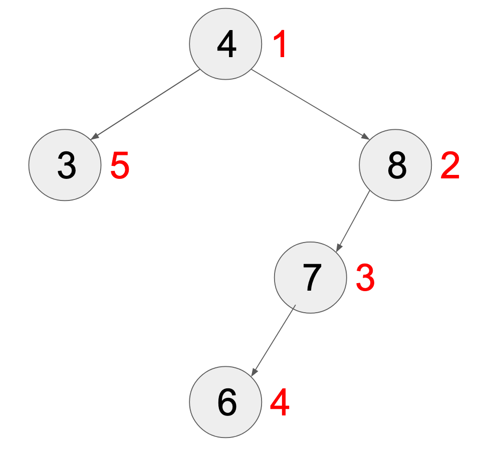
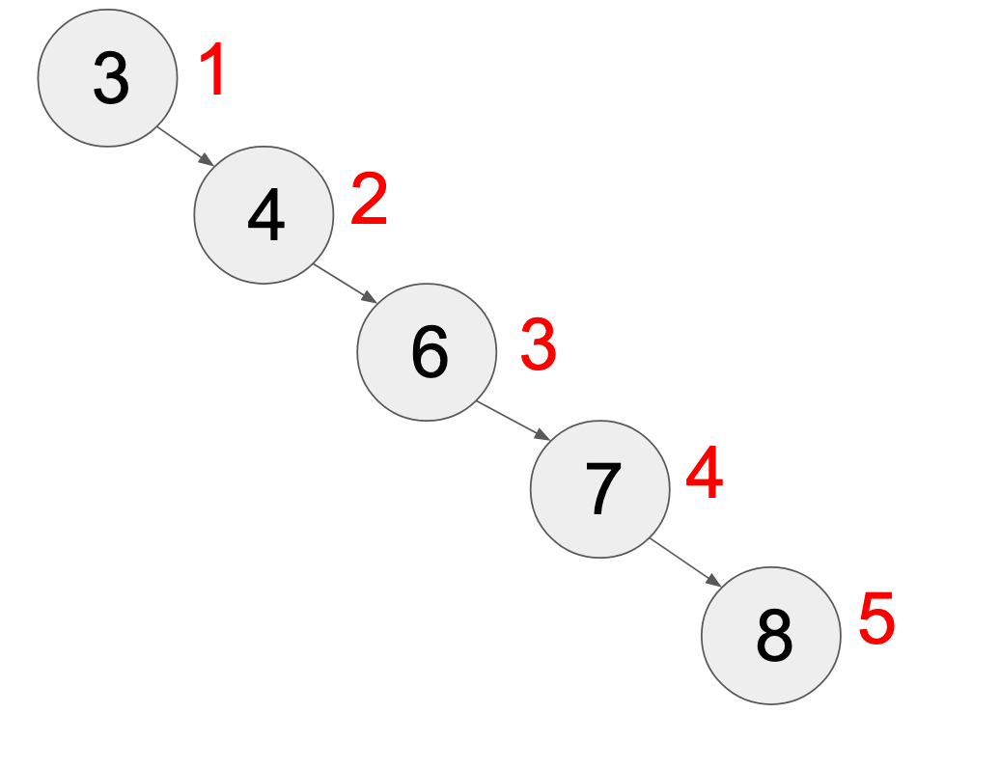

# Treap

## 概念

\\(Treap = Binary\ Search\ Tree\ +\ Heap\\)
	
### Binary Search Tree

對於任何一顆二元搜尋樹 (Binary Search Tree)，都會滿足以下性質

**對任意節點來說：**
* 若其左子樹非空，則左子樹中所有節點的值均小於其自身的值
* 若其右子樹非空，則右子樹上所有節點的值均大於其自身的值

### Heap

對於任何一顆Heap，都會滿足以下性質

**對任意節點來說：**
* 他的所有子節點的值都會小於等於（或大於等於）其自身的值

### Self-Balancing Binary Search Tree

在這裡會建議讀者如果對於上面提到的 Binary Search Tree 和 Heap 還不熟悉的話，可以先去學習這兩個資料結構，再來看這篇會比較容易理解 Treap 的原理以及特性。

對於一般的 Binary Search Tree 來說，它的樹高會根據你插入的順序不同而有所差異，假如我要連續把 \\(N\\) 個數字放入 BST 內，那最糟糕的情況就是樹高可能會達到 \\(N\\) ，而 BST 的每個操作（插入、刪除等）都是基於它的樹高而定，所以這種情況下每次操作的時間複雜度都會是很慘的 \\(O(N)\\) 。

所以為了解決這種情況，我們會透過一些操作讓樹高盡量維持在 \\(\log N\\) ，而這樣的操作就叫做 `平衡` ，像是 C++ 內建的 `set`, `map` 都是平衡的二元搜尋樹，所以他們的操作（插入、刪除等）時間複雜度都會是 \\(O(\log N)\\)

而平衡一棵二元樹的方式有很多，根據每個方法的不同實作的難度也會有所差異，但他們的共同特色就是樹高都會維持在 \\(\log N\\) ，已確保每個操作的時間複雜度不會太糟。

Treap 自己本身就是一棵平衡的 Binary Search Tree，而他的平衡方式就是透過每個節點的 Heap 性質去維護平衡，而維護方式一共有兩種，第一種是旋轉，第二種就是我們後面會提到的 Split & Merge，而第一種因為實作難度較高較不實用所以不會在本篇提到，比賽中最常見的平衡二元樹（不包含 C++ 內建的資料結構）就是 Split-Merge Treap ，因為他很好寫（跟其他平衡樹相比），然後能做到的事情也很多。

### Why Heap

為什麼是透過 Heap 的性質去維護平衡性呢？因為如果我們在平衡二元樹上的每個節點多記錄一個 "時間" ，會發現這個時間滿足最小堆的性質。
假如說有一個序列 `A = {4, 8, 7, 6, 3}` ，我們把這個序列的數字依序放入二元搜尋樹，則構造出來的 BST 如下圖所示：



節點上的值為 BST 的 key 值，而節點旁邊的數字則是那個 key 插入的順序。

而我們知道 BST 的樹高會根據插入的順序不同而有所不同，如果按照數字小到大的順序插入的話 `{3, 4, 6, 7, 8}` ，樹高會是最糟糕的 \\(O(N)\\) ，如下圖所示：



所以我們就是透過把插入的順序隨機化，也就是隨機給予每個節點插入的 "時間"，這個時間我們稱之為 `priority` ，而因為插入的時間會有最小堆的性質，所以只要好好的維護 `priority` 的 Heap 性質，就可以讓樹高維持在期望的 \\(\log N\\)

## Split-Merge Treap

### 概念

Split-Merge Treap (以下簡稱 Treap) 就是透過 Split 還有 Merge 這兩個操作搭配節點隨機賦予的 Priority 值去維護樹的平衡性。
而下面則會介紹我們是如何將隨機值賦予給 Treap 的節點，以及如何透過這兩個操作去維護一顆 Treap。

### 節點

Treap 本身就是一棵 BST ，而樹上每個節點都會維護一個 key 值，而這個 key 在最前面有提到過，Treap 就是 BST + Heap，而 BST 就是負責維護節點的 key 有二元搜尋樹的性質，而 Heap 就是負責維護 priority 值有最大堆/最小堆的性質。

你可以根據題目需求去決定 Treap 上每個節點的 key 要維護哪些東西，也可以自行修改 key 的型態。

最後我們會證明，只要維護好 Heap 的性質，樹高就會是期望的 \\( N\log N \\) ，其中 \\(N\\) 是節點數量。

```cpp!
struct node{
    node *l = NULL,*r = NULL;
    int key;
    int pri = rand();//在新建一個節點時 priority 值就已經隨機賦予了。
    node(T x):key(x){}
    ~node(){
        for(auto &i:{l,r})
            delete i;
    }
};
```

### 合併

`merge(node *a,node *b)`
依照Heap的性質，去合併兩個節點，這裡是以最大堆為示範 (最大堆和最小堆都不會影響樹的高度，只要他是一個 heap ，且 priority 的值是隨機賦予的就可以了) 。

```cpp!
node *merge(node *a,node *b){
    if(!a or !b)return a?:b;
    if(a->pri>b->pri){
        a->r = merge(a->r,b);
        return a;
    }
    else{
        b->l = merge(a,b->l);
        return b;
    }
}
```

### 分裂

`split_by_key(node *t,int k,node *&a,node *&b)`

依照 key (k) 的大小，去將一棵 Treap (t) 分裂成兩棵 Treap (a, b)，並滿足 \\(a.key\le k\\) ， \\(b.key>k\\)。

```cpp!
void split_by_key(node *t,int k,node *&a,node *&b){
    if(!t){
		a = b = NULL;
		return;
	}
    if(k<=t->key){
        b = t;
        split_by_key(t->l,k,a,b->l);
    }
    else{
        a = t;
        split_by_key(t->r,k,a->r,b);
    }
}
```

### 插入

插入一個 key (k)，並且還要維持二元搜尋樹的性質，可以先用 `split_by_key` 分裂出兩棵 Treap (a,b)，滿足 \\(a.key\le k\\) ， \\(b.key\gt k\\)，然後再新增一個節點，節點的 key 為 k，將該節點和 a 合併，再和 b 合併，這樣就可以維持 \\(a.key\le k\lt b.key\\) 了。

這裡要注意合併的順序，新節點要放在 a 的右邊，合併完後這棵 Treap 在放到 b 的左邊，這樣才能維護二元搜尋樹的性質，因為我們在 merge 的前提是 merge(a, b) a 的 key 值都 \\( < \\) b 的 key 值。

```cpp!
void insert(node *&t,int k){
    node *a,*b;
    split_by_key(t,k,a,b);
    t = merge(merge(a,new node(k)),b);
}
```

### 刪除

刪除跟插入類似，依照 key (k) 去分裂出三個 Treap (a, b, c)，滿足 \\(a.key < b.key = k < c.key \\) ，然後刪掉 b 就好了。

```cpp!
void erase(node *&t,int k){
    node *a,*b,*c;
    split_by_key(t,k-1,a,b);
    split_by_key(b,k,b,c);
    t = merge(a,c);
    delete b;
}
```

### 序列第k小

前面的 `split_by_key` 可以依照 key (k) 的大小分裂出兩個 Treap (a, b)，其中\\(a.key \le k\\) ，而 `order_of_key` (查排名) 就是要詢問 Treap (a) 的 size 大小是多少，所以我們可以在節點的部分多維護一個 size

為了避免讀取到空指標的 size 成員，我們可以寫一個函式來計算一棵 Treap 的 size，如果該指標為空就回傳 0 ，否則回傳該指標的 size。

而 `find_by_order` 就是找第 k 小的值，對於一個 Treap (t) ，如果 t 的左子樹大小 +1 等於 k 的話，那 t 的 key 就是第 k 小的值，如果左子樹大小 \\(\ge k\\) 的話，就遞迴往左去找第 k 小，否則就往右去找。

整合的程式碼如下

```cpp!=
template<class T>
struct Treap{
	struct node{
		node *l = NULL,*r = NULL;
		T key;
		int pri = rand(),sz = 1;
		node(T x):key(x){}
		~node(){
			for(auto &i:{l,r})
				delete i;
		}
		void pull(){
			sz = 1;
			for(auto i:{l,r})
				if(i)sz+=i->sz;
		}
	};
	node *root = NULL;
	node *merge(node *a,node *b){
		if(!a or !b)return a?:b;
		if(a->pri>b->pri){
			a->r = merge(a->r,b);
			a->pull();
			return a;
		}
		else{
			b->l = merge(a,b->l);
			b->pull();
			return b;
		}
	}
	void split_by_key(node *t,T k,node *&a,node *&b){
		if(!t){a = b = NULL;return;};
		if(t->key<=k){
			a = t;
			split_by_key(t->r,k,a->r,b);
			a->pull();
		}
		else{
			b = t;
			split_by_key(t->l,k,a,b->l);
			b->pull();
		}
	}
	int size(node *t){
		return t?t->sz:0;
	}
	int size(){
		return size(root);
	}
	void insert(T k){
		node *a,*b;
		split_by_key(root,k,a,b);
		root = merge(merge(a,new node(k)),b);
	}
	void erase(T k){
		node *a,*b,*c;
		split_by_key(root,k-1,a,b);
		split_by_key(b,k,b,c);
		root = merge(a,c);
		delete b;
	}
	T find_by_order(node *t,int x){
		if(size(t->l)+1==x)return t->key;
		if(size(t->l)>=x)return find_by_order(t->l,x);
		return find_by_order(t->r,x-size(t->l)-1);
	}
	T find_by_order(int x){
		return find_by_order(root,x);
	}
	int order_of_key(node *t,T k){
		if(t->key==k)return size(t->l)+1;
		if(t->key<k)return size(t->l)+1+order_of_key(t->r,k);
		return size(t->l,k);
	}
	int order_of_key(T k){
		return order_of_key(root,k);
	}
};
```

~~然後你會發現這些操作內建pbds的tree都有支援，完全不必手刻~~

### Range Queries

上面我們多維護了一個 size 就可以知道一顆 Treap 的大小，就算是 split 或是 merge 都可以透過 pull 這個函式去好好地維護，那假如我們今天想維護的是常見的區間和、區間最大值、區間最小值呢？一樣可以透過類似的方式去維護，這裡以最小值來做示範。

```cpp!
struct node{
    node *l = NULL,*r = NULL;
    T key,mn;
    int pri = rand(),sz = 1,lz = 0;
    node(T x):key(x),mn(x){}
    ~node(){
        for(auto &i:{l,r})
            delete i;
    }
    void pull(){
        sz = 1,mn = key;
        for(auto i:{l,r})
            if(i)sz+=i->sz,mn = min(mn,i->mn);
    }
};
```

因為我們現在是要對序列做操作，所以不再用序列的值去滿足二元搜尋樹性質，而是用序列的 index。
而一個值的 index 就是他前面有幾個數字，這裡我們可以透過左子樹的 size 去得知，那一顆 Treap 該如何按照 index 插入一個值呢？這裡要介紹一個操作叫 `split_by_size`，也就是按照大小去將一顆Treap分裂成兩顆。

這裡為了方便就直接把函式取為 `split` ，因為當Treap應用在序列操作的時候就已經不需要 `split_by_key` 這個東西了。

```cpp!
void split(node *t, int k, node *&a, node *&b){
    if(!t){
		a = b = NULL;
		return;
	}
    if(size(t->l) + 1 <= k){
        a = t;
        split(t->r, k - size(t->l) - 1, a->r, b);
        a->pull();
    }
    else{
        b = t;
        split(t->l, k, a, b->l);
        b->pull();
    }
}
```

而區間詢問就是把包含那個區間的 Treap 給分裂出來，然後詢問那顆 Treap 的最小值是多少就好了，因為在 split 時 pull 就已經幫我們維護了 Treap 的最小值了，詢問完後再把 Treap 給 merge 回去就好。

```cpp!
int query_min(int l,int r){
    node *a,*b,*c;
    split(root,l,a,b);
    split(b,r-l+1,b,c);
    int ans = b->mn;
    root = merge(a,merge(b,c));
    return ans;
}
```

單點修改就是直接把那個位置的 Treap 給分裂出來，然後修改那個點的 key 之後再 merge 回去。

```cpp!
void update(int x,int k){
    node *a,*b,*c;
    split(root,x,a,b);
    split(b,1,b,c);
    b->key = k;
    root = merge(a,merge(b,c));
}
```

### Lazy Tag

如果要區間修改的話，那我們就在節點多紀錄一個懶人標記，懶人標記代表的是：目前這個Treap的值還沒被真的修改，但如果要進行詢問時，就把懶人標記往下推給他的孩子，順便修改他的值。

為了達到往下推這個動作，我們在多寫一個 `push` 函式。

這裡用區間加值做示範

```cpp!
struct node{
    node *l = NULL, *r = NULL;
    int key, sum, add = 0;
    int pri = rand(),sz = 1;
    node(T x):key(x),sum(x){}
    ~node(){
        for(auto &i:{l,r})
            delete i;
    }
    void push(){
        if(!add)return;
        sum += add * sz, key += add;
        for(auto &i:{l,r})
            if(i)i->add+=add;
        add = 0;
    }
    void pull(){
        sz = 1,sum = key;
        for(auto i:{l,r})
            if(i)sz += i->sz, sum += i->sum;
    }
};
```

有了 push 之後，就要記得在 split 跟 merge 之前都先把懶標給 push 下去
因為我們幾乎每個操作都是仰賴 split 跟 merge 這兩個函式，所以只要在這兩個函式進行 push 跟 pull 就可以好好地維護了。

```cpp!
node *merge(node *a,node *b){
    if(!a or !b)return a? a : b;
    if(a->pri>b->pri){
        a->push();
        a->r = merge(a->r,b);
        a->pull();
        return a;
    }
    else{
        b->push();
        b->l = merge(a,b->l);
        b->pull();
        return b;
    }
}
void split(node *t,int k,node *&a,node *&b){
    if(!t){
		a = b = NULL;
		return;
	}
    t->push();
    if(size(t->l)+1<=k){
        a = t;
        split(t->r,k-size(t->l)-1,a->r,b);
        a->pull();
    }
    else{
        b = t;
        split(t->l,k,a,b->l);
        b->pull();
    }
}
```

而區間加值就是把那個區間的 Treap 給分裂出來，然後加上值後打上懶標 merge 回去就好了

```cpp!
void update(int l, int r, int k){
    node *a,*b,*c;
    split(root, l, a, b);
    split(b, r - l + 1, b, c);
    b->add += k;
    root = merge(a, merge(b, c));
}
```

### 區間翻轉

上述這些操作線段樹都可以做到，那Treap有哪些操作是線段樹做不到的呢？有！就是經典的區間翻轉。

由於一顆Treap可以透過swap交換兩顆子樹，然後一樣用打懶標的方式，讓子樹的子樹也進行交換，這樣就可以達到區間翻轉了。

要注意翻轉的懶標比較特別，rev = 1/0，代表轉 or 不轉。

push跟區間翻轉的程式碼如下

#### push
```cpp!
void push(){
    if(!rev)return;
    swap(l,r);
    for(auto &i:{l,r})
        if(i)i->rev ^= 1;
    rev = 0;
}
```

#### reverse

```cpp!
void reverse(int l,int r){
    node *a,*b,*c;
    split(root,l,a,b);
    split(b,r-l+1,b,c);
    b->rev^=1;
    root = merge(a,merge(b,c));
}
```

### O(N)建樹

#### 笛卡爾樹介紹

https://vjudge.net/problem/HDU-1506

#### Build

#### 例題

[Codeforces 167E Wizards and Roads](https://codeforces.com/contest/167/problem/D)

### 深度期望複雜度證明

## 例題

* [Luogu Splay和Treap習題](https://www.luogu.com.cn/training/14422#problems)
* [POJ 3580](https://vjudge.net/problem/POJ-3580)
* [UVa 12538](https://vjudge.net/problem/UVA-12538)
* [HDU 1754](https://vjudge.net/problem/HDU-1754)
* [HDU 2795](https://vjudge.net/problem/HDU-2795)
* [HDU 1394](https://vjudge.net/problem/HDU-1394)
* [HDU 1890](https://vjudge.net/problem/HDU-1890)
* [Codeforces 702F](https://codeforces.com/problemset/problem/702/F)
* [Codeforces 863D](https://codeforces.com/contest/863/problem/D)
* [CSES 2072](https://cses.fi/problemset/task/2072)
* [CSES 2073](https://cses.fi/problemset/task/2073)
* [CSES 2074](https://cses.fi/problemset/task/2074)
* [CSES 2075](https://cses.fi/problemset/task/2075)
* https://tioj.ck.tp.edu.tw/problems/1169
* https://zerojudge.tw/ShowProblem?problemid=b491
* https://www.luogu.com.cn/problem/P4309
* https://www.luogu.com.cn/problem/P2596
* https://codeforces.com/gym/102787
* https://zerojudge.tw/ShowProblem?problemid=h925
* https://tioj.ck.tp.edu.tw/problems/1975

## 參考資料

* https://oi-wiki.org/ds/treap/
* https://oi-wiki.org/ds/cartesian-tree/
* https://oi-wiki.org/ds/persistent-balanced/
* https://cp-algorithms.com/data_structures/treap.html
* https://usaco.guide/adv/treaps?lang=cpp
* https://www.luogu.com.cn/blog/85514/fhq-treap-xue-xi-bi-ji
* https://codeforces.com/blog/entry/84017
* https://codeforces.com/blog/entry/108601
