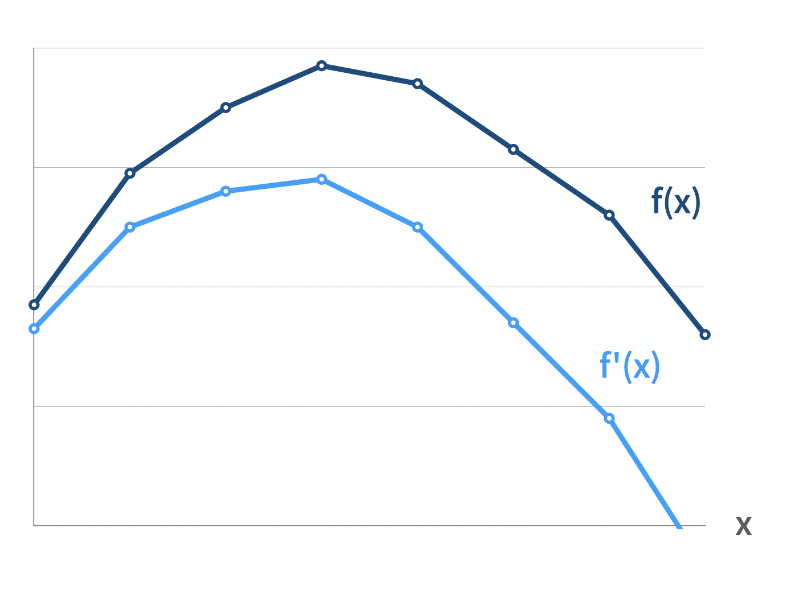
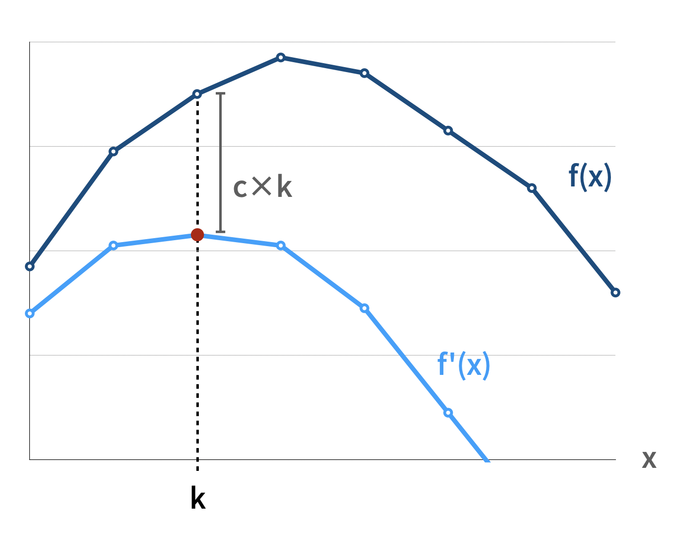
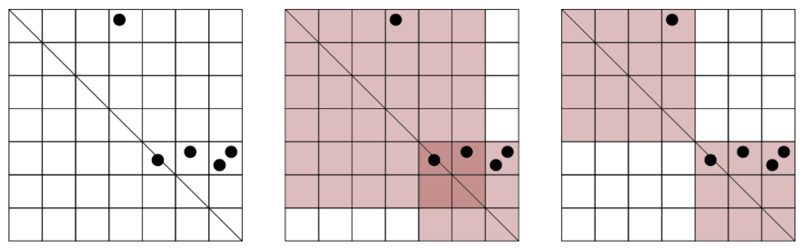

# Aliens 優化

## 前言

在此章節中，我們將了解一項 DP 優化技巧 - Aliens 優化（又稱 Aliens Trick）。

事實上，這樣的技巧最早是在 2012 年，由王欽石在中國國家集訓隊的「[淺析一類二分方法](http://www.doc88.com/p-949564862405.html)」中提出，因此，此方法又稱為「WQS 二分」。而自 IOI 2016 的 [Aliens](https://ioinformatics.org/files/ioi2016problem6.pdf) 這道題開始，讓這樣的技巧開始受到關注，也因此在近幾年得名並流行起來。

我們直接來看一道例題：

> [TIOJ - 2039. AI-666 賺多少（高中全國賽題目）](https://tioj.ck.tp.edu.tw/problems/2039)
>
> 給定一個長度為 \\(N\\) 的價格序列，此序列的第 \\(i\\) 個元素代表股票在第 \\(i\\) 天的價格，和一個整數 \\(k\\)。
>
> 試求在最多只能完成 \\(k\\) 筆交易的情況下，所能獲得的最大利潤（亦即最多買賣各 \\(k\\) 次）。
>
> 註：不能同時有多筆交易，每次購買前必須賣出手上的股票。
>
> \\(N \le 2 \times 10^6, k \le N\\)

對這道題目而言，我們假設有一函數 \\(f\\)，\\(f(x)\\) 代表至多進行 \\(x\\) 次交易所能獲得的最大利潤。該題希望能夠求在最多只能完成 \\(k\\) 筆交易的情況下，所能獲得的最大利潤為何，因此，該題所求即為 \\(f(k)\\)。

假設我們捨棄掉最多只能完成 \\(k\\) 筆交易的限制，即可以用 \\(O(N)\\) 的時間來求得當交易次數沒有限制時，能夠獲得的最大利潤為何。這代表對於上述函數 \\(f\\)，我們能夠在有效率的時間找到函數 \\(f\\) 的極值，但對於題目所求的 \\(f(k)\\)，我們卻沒有一個足夠有效率的做法，能夠找到 \\(f(k)\\) 的值為何。

不過，若是函數 \\(f\\) 是一[凹函數](https://zh.wikipedia.org/zh-tw/%E5%87%B9%E5%87%BD%E6%95%B0)，我們便可以應用 Aliens 優化的技巧來解決此問題。註：「凹函數 Concave function」一詞具有歧義，此處指的是該函數於整數上的每一點之切線斜率呈非嚴格遞減之關係。

接下來，我們將實際透過 Aliens 優化的技巧來實際解決此問題。

## 使用 Aliens 優化

在此題使用 Aliens 優化時，我們可以想像成將每次交易賣出的時刻，再對每個交易減掉一個類似「手續費」的值，並以二分搜的方式尋找最適合的「手續費」。

由於「手續費」的不同，將會使得獲得最高利潤時，所耗費的交易次數將會有所不同。我們透過找尋一個適合的「手續費」，使得最後找到的最佳解恰好交易至多 \\(k\\) 次時，再將所扣掉的手續費加回來得到原所求。

### 模板

```cpp
long long aliens() {
    long long lb = -1e10, rb = 1e10;
    long long val, k;
    while (lb+1 < rb) {
        long long c = (lb+rb) >> 1;
        tie(val, k) = check(c);
        if (k >= r) lb = c;
        else rb = c;
    }
    tie(val, k) = check(lb);
    return val+lb*r;
}
```

### 實作

<details><summary> Sample Code </summary>

\\(dp_0(i)\\) 及 \\(dp_1(i)\\) 代表第 \\(i\\) 個時刻時，手上未持有及持有股票的最大利潤。以及 pair 中存的值分別為最大值及最大值發生位置。

在 solve 函式中，我們使用二分搜來找 \\(c\\) 值（手續費），找到在每次交易需要再扣掉這樣一個 \\(c\\) 值，並且沒有 \\(k\\) 次限制下的情況之最大利潤為何。如果在這樣的情況求得的最大利潤之交易次數不超過 \\(k\\) 次，則該值將為可行解之一。

然而，在此題進行 Aliens 優化的實作過程中，需要特別留意所找到的 \\(c\\) 值：二分搜的過程中，我們嘗試要找到最小的 \\(c\\) 值。若沒有確保此事，將有可能導致極值位置錯誤。

```cpp
#include <bits/stdc++.h>
using namespace std;
using ll = long long;

const int N = 2e6+10;

ll n, k;
ll p[N];
pair<ll, ll> dp0[N], dp1[N];

pair<ll, ll> findMax(ll c) {
    dp0[0] = {0, 0};
    dp1[0] = {-p[0], 0};
    for (int i=1; i<n; i++) {
        dp0[i] = max(dp0[i-1], {dp1[i-1].first+p[i]-c, dp1[i-1].second-1});
        dp1[i] = max(dp1[i-1], {dp0[i-1].first-p[i], dp0[i-1].second});
    }
    dp0[n-1].second = -dp0[n-1].second;
    return dp0[n-1];

}

void solve() {
    ll lb = 0, rb = 1e6;
    ll val, r;
    while (lb < rb) {
        ll c = (lb+rb) >> 1;
        tie(val, r) = findMax(c);
        if (k >= r) rb = c;
        else lb = c+1;
    }
    tie(val, r) = findMax(lb);
    cout << val+k*lb << endl;
}

int main() {
    cin.tie(0); ios::sync_with_stdio(0);
    cin >> n >> k;
    for (int i=0; i<n; i++) {
        cin >> p[i];
    }
    solve();
    return 0;
}
```

</details>

### 小結



由於我們可以在有效率的時間內找到函數 \\(f\\) 的極值，Aliens 優化的概念大略是：我們令一個新函數 \\(f'(x)=f(x)-cx\\)（其 \\(c\\) 即為上述例題之手續費 \\(c\\) 值），並用相同的方法求 \\(f'\\) 函數的極值為何。



然而若 \\(f'\\) 函數的極值發生在 \\(k\\)（紅色點），則我們可以得到在原函數 \\(f\\) 上的 \\((k, f(k))\\) 點之切線斜率為 \\(c\\)。利用新函數 \\(f'\\) 求得的極值 \\(f'(k)\\)，只要再把 \\(f'(k)\\) 加上被扣掉的 \\(ck\\)，便可以藉此回推出所求的 \\(f(k)\\) 為何。

然而，若是函數 \\(f\\) 是一凹函數的情況成立，我們便可以以二分搜的方式，找尋適合的 \\(c\\) 值來調整新函數。

因此，統整在此題使用 Aliens 優化技巧的步驟：

- 給定一函數 \\(f\\) 及整數 \\(k\\)，欲求 \\(f(k)\\)
- 二分搜 c 值並令一新函數 \\(f'(x)=f(x)-cx\\)
- 確認 \\(f'\\) 的極值是否為 \\(f'(k)\\)
- 將 \\(f'(k)\\) 加回 \\(ck\\) 來回推 \\(f(k)\\)

接下來，將使用另一道需要經過轉化才能看出 Aliens 優化性質的例題，以與上述相似的步驟來解決問題。

## 轉化題目並使用 Aliens 優化

> [AtCoder ABC218 - H. Red and Blue Lamps](https://atcoder.jp/contests/abc218/tasks/abc218_h)
>
> 有 \\(N\\) 盞編號為 \\(1 \sim N\\) 的燈排成一排，我們要將其中 \\(R\\) 盞燈點亮為紅色的，其餘 \\(N-R\\) 盞燈點亮為藍色的。
>
> 對於每個相鄰的燈，給定獎賞值 \\(A_i\\) (\\(i = 1, 2, ..., N-1\\) )，代表若第 \\(i\\) 個及第 \\(i+1\\) 個燈為不同顏色時，將獲得的獎賞值。
>
> 求可獲得的最大獎賞值為何。
>
> - \\(N \le 2 \times 10^5\\)
> - \\(R \le N-1\\)

事實上，這題也有 Greedy 或利用 Divide and Conquer，在 \\(O(N \log N)\\) 的解法（[官方解法](https://atcoder.jp/contests/abc218/editorial/2633)）。不過，在這個章節中，我們將嘗試使用 Aliens 優化來解決此問題。

在此題的敘述中，由於僅有相鄰的燈為不同顏色時，才能夠獲得相應的獎賞值。

因此，可以觀察到，若是紅色的燈連續出現兩次以上是沒有意義的，我們可以藉此假設紅色燈的數量小於一半，如果紅色燈的數量大於一半，則反轉兩種顏色。這樣一來，可以將題目轉化成以下敘述：

> [AtCoder ABC218 - H. Red and Blue Lamps](https://atcoder.jp/contests/abc218/tasks/abc218_h) 轉化版
>
> 有 \\(N\\) 個編號為 \\(1 \sim N\\) 的燈排成一排，我們要將 \\(R\\) 盞燈點亮，且使得任兩盞被點亮的燈不相鄰。
>
> 每當我們點亮第 \\(i\\) 盞燈，將會獲得 \\(A_{i-1}+A_i\\) 的收益。
>
> 求最大收益為何。
>
> \\(N \le 2 \times 10^5 , R \le \lfloor \frac{N}{2} \rfloor\\)

而 Aliens 優化的技巧可以如何應用在這樣的問題呢？我們將使用此例題，先藉著未經優化的做法來觀察問題，並使用此優化技巧來分析並解決此問題。

### 未經優化的做法

首先，我們可以輕鬆地觀察到，這樣的問題可以用較為直覺的 DP 解決：

令 \\(f(i,\ j)\\) 代表自第 \\(1\\) 盞燈至欲點亮第 \\(i\\) 盞燈止，已點亮 \\(j\\) 盞燈的最大總獎賞值，再進一步令 \\(f_0(i,\ j)\\) 代表沒點亮第 \\(i\\) 盞燈，\\(f_1(i,\ j)\\) 代表有點亮；\\(A_i\\) 代表上述所提到的獎賞值。

我們可以得到下列轉移式：

\\(f_0(i,\ j) = max(f_0(i-1,\ j),\ f_1(i-1,\ j))\\)

\\(f_1(i,\ j) = (A_{i-1}+A_i)+f_0(i-1,\ j-1)\\)

答案將會是 \\(max(f_0(N-1,\ R),\ f_1(N-1, R))\\)。而這樣的 DP 作法使時間複雜度來到 \\(O(NR)\\)，不理想的時間複雜度將使得無法通過此題。

### 觀察問題

現在，我們回到前文經過轉化的題目：將 \\(R\\) 盞燈點亮，且使得任兩盞被點亮的燈不相鄰。假設我們可以點亮任意盞燈，則我們令 \\(g(x)\\) 是點亮 \\(x\\) 盞燈所能獲得的最佳收益，再加上了只能點亮恰好 \\(R\\) 盞燈的限制後，原題的所求便是 \\(g(R)\\) 的值。

我們可以發現 \\(g\\) 函數定義在整數上是一個凹函數，這也說明了若點亮的燈太少，將會使得得以獲得的最大總獎賞值有所降低。此例題作者提供的[題解](https://atcoder.jp/contests/abc218/editorial/2634)中，有提供該函數為凹函數的證明。

雖然我們目前並沒有一個足夠有效率的方法來找到 \\(g(R)\\) 的值，不過，假設 \\(g(x)\\) 的極值發生在 \\(x=k\\)，我們能夠在 \\(O(N)\\) 的時間內，找到 \\(g(k)\\) 以及 k 的值為何。

令 \\(f(i)\\) 代表自第 \\(1\\) 盞燈至欲點亮第 \\(i\\) 盞燈止的最大總獎賞值，再進一步令 \\(f_0(i)\\) 代表沒點亮第 \\(i\\) 盞燈，\\(f_1(i)\\) 代表有點亮。

求得 \\(g(x)=max(f_0(N-1),\ f_1(N-1))\\) 極值的轉換式如下：

\\(f_0(i) = max(f_0(i-1),\ f_1(i-1))\\)

\\(f_1(i) = (A_{i-1}+A_i)+f_0(i-1)\\)

有了這樣的性質，我們可以再度以另一個角度來思考這個問題：

> 有 \\(N\\) 個編號為 \\(1 \sim N\\) 的燈排成一排，我們要將某幾盞燈點亮，且使得任兩盞被點亮的燈不相鄰。
>
> 每當我們點亮第 \\(i\\) 盞燈，將會獲得 \\(A_{i-1}+A_i\\) 的收益，但每點亮一盞燈，將需加上一個支出 c。
>
> 當最大值發生時最多點亮了幾盞燈？

因此，此問題變轉換成求出 \\(g'(x)=g(x)-cx\\) 最大值發生時的 \\(k'\\) 為何。

和前文使用相同的做法，這樣的問題我們可以使用 DP 在 \\(O(N)\\) 的時間內解出。

加入具有支出 \\(c\\) 的條件後，我們可以得到類似的轉換式如下：

\\(f_0(i) = max(f_0(i-1),\ f_1(i-1))\\)

\\(f_1(i) = (A_{i-1}+A_i)+f_0(i-1)-c\\)

對於原本的凹函數 \\(g(x)\\)，在整數上當 \\(x\\) 愈大時，對於通過 \\((x,\ g(x))\\) 的切線斜率呈遞減關係。

假設我們利用上述方法，找到了 \\(g'(x)=g(x)-cx\\) 之極值發生的位置在 \\(k'\\)，那麼將這樣的關係在二維平面上觀察，就像是存在一條斜率為 \\(c\\) 的直線（如圖中綠色線），與 \\(g\\) 函數的圖形相切於 \\((k',\ g(k'))\\)。

藉由簡單的反推，由於 \\(g'(x)=g(x)-cx\\)，我們也能將求得的極值 \\(g'(k')\\) 加回 \\(cx\\)，便能求得 \\(g(k')\\) 的值。

統整以上敘述，我們目前已掌握的資訊有：

- 有一凹函數 \\(g(x)\\) ，代表點亮 \\(x\\) 盞燈所能獲得的最佳收益（\\(g(R)\\) 即為原題所求）
- 雖不能直接求出 \\(g(R)\\)，但可在 \\(O(N)\\) 求出 \\(g(x)\\) 的極值 \\(g(k)\\) 與 k
- 令一新函數 \\(g'(x)=g(x)-cx\\)，也可以用同樣方法求得其極值 \\(g'(k')\\)，並藉由反推求得 \\(g(k')\\) 的值。

接下來，我們要推導如何利用這些資訊與方法，來去求出 \\(g(R)\\) 的值。

### 解決問題 - 使用 Aliens 優化

從上面的敘述可以得知，我們已知如何在 \\(g\\) 函數上找到其極值。因此，若令一新函數 \\(g'(x)=g(x)-cx\\)，我們可以用一樣的方法找到 \\(g'\\) 函數的極值。

透過類似的做法，現在，我們要使用二分搜來找尋合適的 \\(c\\) 值，藉此構造出 \\(g'\\) 函數並找尋其極值。假如 \\(g'\\) 函數的極值恰好為 \\(g'(R)\\)，這樣一來，我們僅需要將該值加上 \\(cR\\)，即可以找到原本的所求 \\(g(R)\\)。

### 實作

<details><summary> Sample Code </summary>

- \\(dp_0(i)\\)、\\(dp_1(i)\\)
  - 代表自第 \\(0\\) 盞燈至欲點亮第 \\(i\\) 盞燈止的最大總獎賞值
  - 分別代表第 \\(0\\) 盞燈未被點亮及有被點亮
  - Pair 中存的值分別為最大值及最大值發生位置。
- 有關二分搜的上下界
  - 為了找到通過 \\(R,\ g(R)\\) 之切線斜率（即為 \\(g(R+1)-g(R)\\)，原則上二分搜的範圍須包含該函數的差分最大值。

```cpp
#include <bits/stdc++.h>
using namespace std;
using ll = long long;

const int N = 2e5+5;
ll n, r;
ll a[N], p[N];
pair<ll, ll> dp0[N], dp1[N];

pair<ll, ll> findMax(ll c) {
    dp0[0] = {0, 0};
    dp1[0] = {a[0]-c, 1};
    for (int i=1; i<n; i++) {
        dp0[i] = max(dp0[i-1], dp1[i-1]);
        dp1[i] = {dp0[i-1].first+(a[i]+a[i-1]-c), dp0[i-1].second+1};
    }
    return max(dp0[n-1], dp1[n-1]);
}

void solve() {
    r = min(r, n-r);
    ll lb = -1e10, rb = 1e10;
    ll val, k;
    while (lb+1 < rb) {
        ll c = (lb+rb) >> 1;
        tie(val, k) = findMax(c);
        if (k >= r) lb = c;
        else rb = c;
    }
    tie(val, k) = findMax(lb);
    cout << val+lb*r << endl;
}

int main() {
    cin.tie(0); ios::sync_with_stdio(0);
    cin >> n >> r;
    for (int i=0; i<n-1; i++) cin >> a[i];
    solve();
    return 0;
}
```

</details>

### 結論

對於此題目使用 Aliens 優化技巧的想法，以更直覺的說法解釋，這樣的做法就像是：在原本的題目中，限制了我們所能做的操作次數，然而當沒有限制操作次數時，則我們可以在有效率的時間內獲得答案。

所以，利用上述特性，既然我們無法限制調整操作次數，那麼我們便嘗試調整獎賞值，使得調整後的獎賞值在沒有限制操作次數的問題中，最佳解的操作次數正好落在所要求的次數。

以上述的題目為例，因為有了要將特定顏色的燈點亮恰好 \\(R\\) 盞的限制，使用較為簡單的 DP 做法，我們仍得用 \\(O(NR)\\) 的時間複雜度來解決問題。透過該技巧，我們能夠藉此少了一個維度 \\(R\\)，並透過二分搜找尋 \\(c\\) 值，來讓時間複雜度變成 \\(O(N\log c)\\)。

總結 Aliens 優化：我們可以將相似的問題看成是給定一凹函數 \\(f\\) 與常數 R，欲求得 \\(f(R)\\) 值為何的問題。藉此，我們可以二分搜的方式找尋 \\(c\\) 值，來構造出一個新函數 \\(f'(x)=f(x)-cx\\)，並檢驗新函數的 \\(f'\\) 的極值是否落在 \\(f'(R)\\)。若是，則透過加回 \\(cx\\) 來回推原所求之 \\(f(R)\\)。

事實上，在本文的參考文獻（IOICamp Handout）中，有提到將題目轉換成上述函數後，其凹凸性的證明並不容易（本文例題作者提供的[題解](https://atcoder.jp/contests/abc218/editorial/2634)中，有提供該函數為凹函數的證明）。因此，很多時候必須得靠一些直覺來確認題目是否存在該性質，或在賽中不知道如何證明的情況下，得需要嘗試利用較小的 case 來嘗試對拍驗證。

## 其他範例

> [Tree I（「WQS 二分」論文例題）](https://www.luogu.com.cn/problem/P2619)
>
> 給定一張無向的帶權圖，圖上的每條邊是黑色或白色。求一棵邊權和最小的生成樹之權重和，其白色邊的數目恰巧為 \\(K\\)。
>
> \\(|V| \le 5 \times 10^4, |E| \le 10^5\\)

令 \\(f(x)\\) 代表恰好包含 \\(x\\) 條白色邊且邊權和最小的生成樹權重和，我們會發現這個函數和上述例題不太一樣。

若先捨棄生成樹的白色邊需恰好為 \\(K\\) 的限制，這樣一來，該題便是基本的最小生成樹問題，而該問題也從找尋最大值變成最小值了，這樣一來還能使用 Aliens 優化來解決此題嗎？

相似地，\\(f(x)\\) 的斜率具有單調遞增的特性，於是我們一樣可以用類似的方法，以二分搜的方式尋找相應新函式的最小值（[此題的證明](https://www.cnblogs.com/CreeperLKF/p/9045491.html)）。

上述的例題中，我們會將獎賞值減掉某一個值；而在此題中，我們可以將白色邊的權重加上某一個值，使得整個題目就像是把一個凹函數倒過來一般。

令 \\(f'(x)=f(x)+cx\\)，代表我們將每一條白色邊都加上一個權重 \\(c\\)。同樣地，透過動態找尋適合的 \\(c\\) 值，使得找到新函式的最小值後，再確認最小值發生位置是否為 \\(K\\)，並藉此回推原題所求生成樹的權重和為何。

在此題應用到 Aliens 優化的情境中，將每一條白色邊都加上一個權重 \\(c\\) 的部分，就像是透過動態調整了白色邊的權值，使得剛好調整到了一個最佳的平衡點，使得經調整過後的圖之最小生成樹，恰好能夠包含 \\(K\\) 條白色邊。

<details><summary> Sample Code </summary>

實作幾乎和上述例題相同：先用二分搜找白色邊需加上的權重 \\(c\\) 值，並使用 Kruskal's Algorithm 找最小生成樹時，先將所有白色邊的權重加上二分搜得來的 \\(c\\)，再去確認所得的最小生成樹之白色邊數量是否大於等於 \\(K\\)。

然而這題須留意的部分是，求最小生成樹在排序邊時，若兩條邊的權重一樣，需將白色邊排在前面，否則將會導致黑色邊優先先取，導致最小生成樹包含的白色邊數量比預期的少。

```cpp
#include <bits/stdc++.h>
using namespace std;

const int N = 1e5+10;

int n, m, r;
int djs[N];

struct Edge {
    int x, y, w, c;
} p[N];

int find(int x) {
    return (x == djs[x] ? x : djs[x] = find(djs[x]));
}

bool uni(int x, int y) {
    int fx = find(x);
    int fy = find(y);
    if (fx == fy) return false;
    djs[fx] = fy;
    return true;
}

pair<int, int> findMin(int c) {
    for (int i=0; i<m; i++) {
        if (!p[i].c) p[i].w += c;
    }
    sort(p, p+m, [](Edge a, Edge b) {
        return a.w == b.w ? a.c < b.c : a.w < b.w;
    });  
    for (int i=0; i<n; i++) djs[i] = i;
    int ans = 0, edge = 0;
    for (int i=0, j=0; i<m && j<n-1; i++) {
        if (uni(p[i].x, p[i].y)) {
            ans += p[i].w;
            j++;
            if (!p[i].c) edge++;
        }
    }
    for (int i=0; i<m; i++) {
        if (!p[i].c) p[i].w -= c;
    }
    return {ans, edge};
}

void solve() {
    int lb = -200, rb = 200;
    int val, k;
    while (lb+1 < rb) {
        int c = (lb+rb) >> 1;
        tie(val, k) = findMin(c);
        if (k >= r) lb = c;
        else rb = c;
    }
    tie(val, k) = findMin(lb);
    cout << val-r*lb << endl;
}

int main() {
    cin.tie(0); ios::sync_with_stdio(0);
    cin >> n >> m >> r;
    for (int i=0; i<m; i++) {
        cin >> p[i].x >> p[i].y >> p[i].w >> p[i].c;
    }
    solve();
    return 0;
}
```

</details>

## Exercises

> [TIOJ - 1961. [IOI 2016] Aliens](https://tioj.ck.tp.edu.tw/problems/1961)
>
> 給定一個 \\(M \times M\\) 的二維網格平面，其中，有 \\(N\\) 個點散落在該平面的格子上（可能有複數個點在同一個格子）。
>
> 現在，我們要用 \\(K\\) 個任意大小的正方形將平面上的 \\(N\\) 個點全部都覆蓋到，這些正方形必須完整覆蓋平面上的網格，且正方形的對角線必須與平面的主對角線重合。
>
> 求此 \\(K\\) 個正方形的最小網格覆蓋面積為何？
>
> \\(1 \le n \le 10^5, 1 \le m \le 10^6\\)



範例測資一說明：二維網格平面大小 \\(M = 7\\)，有 \\(N = 5\\) 個點散落在平面上，要使用 \\(K = 2\\) 個正方形將所有 \\(N = 5\\) 個點進行覆蓋，則下列第二張圖覆蓋面積為 41（重複覆蓋並不重複計算），第三張圖覆蓋面積為 25（最佳解）。

<details><summary> Aliens 優化想法 </summary>

令 \\(f(i, j)\\) 代表使用 \\(i\\) 個正方形來覆蓋前 \\(j\\) 個點的最小覆蓋面積，再令 \\(g(x) = f(x, N)\\)，我們可以在 \\(O(N)\\) 的時間內求得 \\(g\\) 函數的最小值（即沒有僅能使用 \\(K\\) 個正方形進行覆蓋的限制下，要覆蓋所有點的最小面積）。

我們令一新函數 \\(g'(x) = g(x) + cx\\)，這象徵著一旦多使用了一個正方形，我們必須要加上另一個額外的成本（面積），藉此來二分搜找尋合適的 \\(c\\) 值來構造 \\(g'\\) 函數，並確認所構造的 \\(g'\\) 函數的最小值，再用相似的方法來回推原所求 \\(g(K)\\) 的值。

</details>

---

> [TIOJ - 1986. 郵局設置問題 EXTREME](https://tioj.ck.tp.edu.tw/problems/1986)
>
> 給定 \\(N\\) 個居民的家距離遠點的距離（都在原點的同一側呈一直線）。
>
> 選擇在某 \\(K\\) 個居民的家設立郵局，求每一戶居民到最近郵局的距離最短距離和。
>
> \\(K \le N \le 3 \times 10^5\\)

---

> [Codeforces - 1279F. New Year and Handle Change](https://codeforces.com/problemset/problem/1279/F)
>
> 給定一個包含大小寫英文字母，長度為 \\(n\\) 的字串 \\(S\\)，現在，我們可以對字串進行以下操作：選擇一個區間 \\([i, i+l-1]\\) 並將此區間中的小寫字母全部變成大寫，大寫字母全部變成小寫。
>
> 在最多只能做 \\(k\\) 次操作的情況下，令 \\(x\\) 與 \\(y\\) 分別為大小寫字母的數量，求 \\(min(x,\ y)\\) 的值為何。
>
> \\(1 \le n, k, l \le 10^6, l \le n\\)

---

> [CS Academy - Or Problem](https://csacademy.com/contest/archive/task/or-problem/statement/)
>
> 給定一個長度為 \\(N\\) 的序列，並要將其切分成 \\(K\\) 個非空子序列。
>
> 定義一個子序列的獎賞值為其所有元素 bitwise or 的值，求切分過後的序列之最大獎賞值和為何。
>
> \\(K \le N \le 2 \times 10^5\\)

## Reference

- IOICamp 2022 Handout
- [淺析一類二分方法 - 王欽石](http://www.doc88.com/p-949564862405.html)
- [AtCoder ABC218 Editorial](https://atcoder.jp/contests/abc218/editorial/2634)
- [Aliens 優化 - wiwiho 的競程筆記](https://cp.wiwiho.me/aliens/)
- [Alien Optimization - Swiss Olympiad in Informatics](https://soi.ch/wiki/alien-optimization/)
- [Aliens 優化 - 建中資訊培訓講義](https://tioj.ck.tp.edu.tw/uploads/attachment/5/51/10.pdf)
- [Dynamic Programming optimization: the Aliens trick - Blue Zebra Games](https://medium.com/@bluezebragames/dynamic-programming-optimization-the-aliens-trick-9138176287cf)
- [[学习笔记]WQS 二分/凸优化 - Prutekoi's Blog](https://prutekoi.github.io/post/xue-xi-bi-ji-wqs-er-fen-tu-you-hua/)
- [【学习笔记】WQS 二分详解及常见理解误区解释 - ikrvxt](https://blog.csdn.net/emm_titan/article/details/124035796)
- [关于 WQS 二分算法以及其一个细节证明 - Creeper_LKF](https://www.cnblogs.com/CreeperLKF/p/9045491.html)
- [【luogu P2619】Tree I（wqs 二分）（最小生成树）- SSL_TJH](https://blog.csdn.net/weixin_43346722/article/details/122914673)
- [Educational Codeforces Round 79 Editorial](https://codeforces.com/blog/entry/72577)
- [为什么排序时权值一样白边优先 - luogu P2619](https://www.luogu.com.cn/discuss/502037)
- [進階 DP，DP 優化 - justinlai2003](https://slides.com/justinlai2003/dp-dp)
