# Convex Hull Optimization

## Introduction

中文稱作斜率優化，是其中一種常見的 DP 優化。

先考慮以下例題：

> [CSES - Monster Game I](https://cses.fi/problemset/task/2084/)
>
> 有 \\(n\\) 個關卡，每關有一個怪物，通關時必須從第一關開始依序通關。打敗一關的怪物需消耗 \\(sf\\) 的 cost，\\(s\\) 為怪物血量，\\(f\\) 為能力值，其中 \\(s\\) 隨 \\(i\\) 遞增、\\(f\\) 隨 \\(i\\) 遞減。你會有一個起始的能力值，每到一關，你可以選擇是否打敗該關怪物，並將能力值更新為 \\(f_i\\)。求打敗第 \\(n\\) 關怪物的最小 cost。
>
> - \\(1\leq n\leq 2\times 10^5\\)

考慮 \\(O(n^2)\\) 的做法，令 \\(f(i)\\) 為殺掉第 \\(i\\) 關怪物所需花的最少時間。

轉移式為：\\(F(i)=\underset{i>j}{\min}(F(j)+f_j\times s_i)\\)

但是這個複雜度無法解決此題。

### 斜率單調 & 查詢單調

我們觀察一下可以發現，其實並不是所有的候選人 \\(j\\) 都有可能成為轉移來源。由於 \\(f_j\\) 是遞減的，因此對於\\(j_2>j_1\\)，若有一個 \\(i_1\\) 使得 \\(f_{j_1}s_{i_1}+F(j_1)>f_{j_2}s_{i_1}+F(j_2)\\)，那麼對於任一個 \\(i_2>i_1\\)，\\(f_{j_1}s_{i_2}+F(j_1)>f_{j_2}s_{i_2}+F(j_2)\\)也是成立的（因為\\(s_i\\)遞增），意即在 \\(i_1\\) 之後 \\(j_1\\) 就再也不會被取到了，因為至少有 \\(j_2\\) 做為更好的轉移來源。

我們再觀察一次轉移式：\\(F(i)=\underset{i>j}{\min}(F(j)+f_j\times s_i)\\)。形式其實類似於 \\(y=ax+b\\)，其中 \\(a\\) 與 \\(b\\) 只和 \\(j\\) 有關、\\(x\\) 與 \\(y\\) 只和 \\(i\\) 有關。以剛剛的轉移式來說，對應關係如下：

\\[y=F(i)\\]
\\[x=s_i\\]
\\[a=f_j\\]
\\[b=F(j)\\]

因此對於所有的 \\(j\\)，我們可以將所有的 \\(y=ax+b\\) 在座標平面上畫出來。這時我們的題目便轉變成：給定一個 \\(x\\)，我們要在一個線集中找出最小的 \\(y\\)。

接下來便要思考如何找最小值。如果要代入每一條直線再取極值才能找到答案，並不會優化複雜度，但我們可以來觀察一下這個線集，應該會長類似這個樣子：

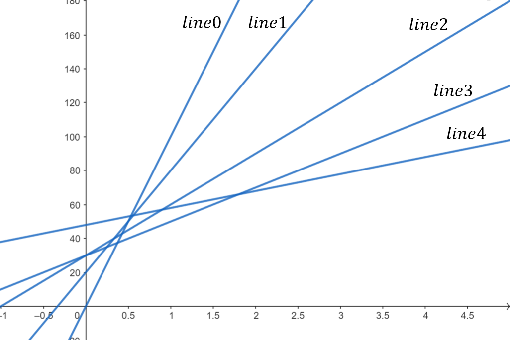

可以發現這是一個斜率不斷遞減的線集（從算式中也能看出，作為斜率的 \\(f_j\\) 是遞減的）。對於每個 \\(x\\)，我們都能在這個線集中找到對應的最小值，如果我們將它們通通標出來，可以發現會形成一個上凸包：


將不在凸包上的線拿掉後：

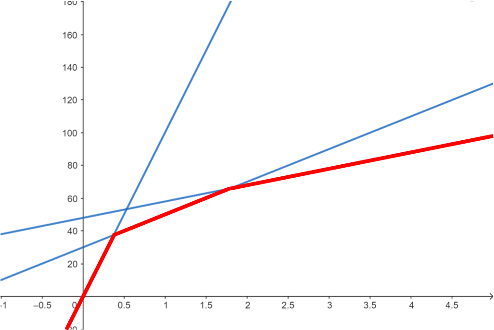

對任何 \\(x'\\) 而言，\\(x=x'\\) 與這個上凸包的交點便是所求的最小值。要找到這個交點，我們必須維護這個凸包，並支援兩種操作：

- 查詢：對於 \\(x=s_i\\)，我們要能找出其與凸包的交點。

    由於查詢具單調性，以此題而言，查詢遞增且我們要找最小值，我們取的直線斜率一定會越來越小。因此我們可以只考慮目前斜率最大的直線，並確認目前直線與 \\(x=s_i\\) 的交點是否真的是最小值。確認的方法便是比較當前交點以及下一條直線（斜率第二大的直線）與 \\(x=s_i\\) 的交點，若下一條直線能讓我們得到更好的答案，我們就要把當前斜率最大的直線丟掉。反之，斜率最大的直線與 \\(x=s_i\\) 的交點就是我們要找的最小值。

    比較兩條直線提供的答案：

    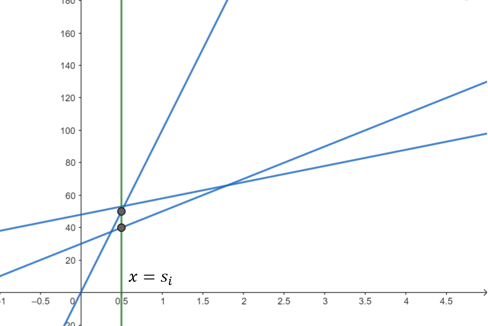

    下一條直線提供的答案更小，因此我們刪除斜率最大的直線：

    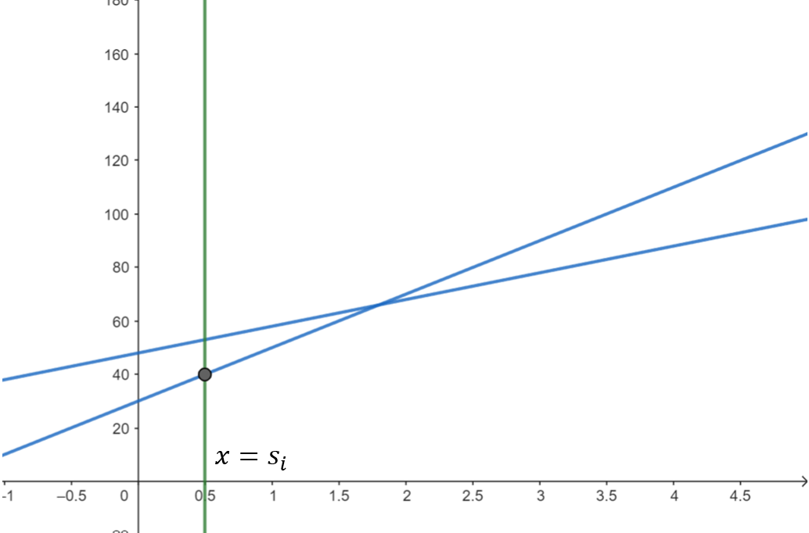

- 插入：插入一條新的線

    插入似乎相對直觀，只是畫一條新的線在凸包上。由於斜率單調，插入直線時我們只要將直線插入凸包最右（左）邊就好。但我們考慮下列情況：

    原本的線集：

    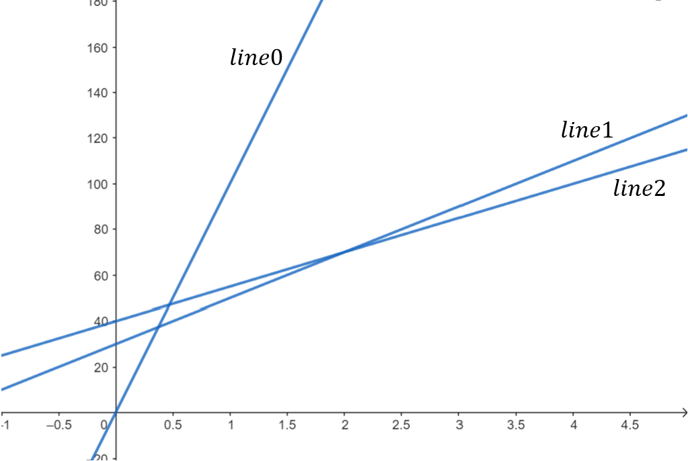

    加入新的直線：

    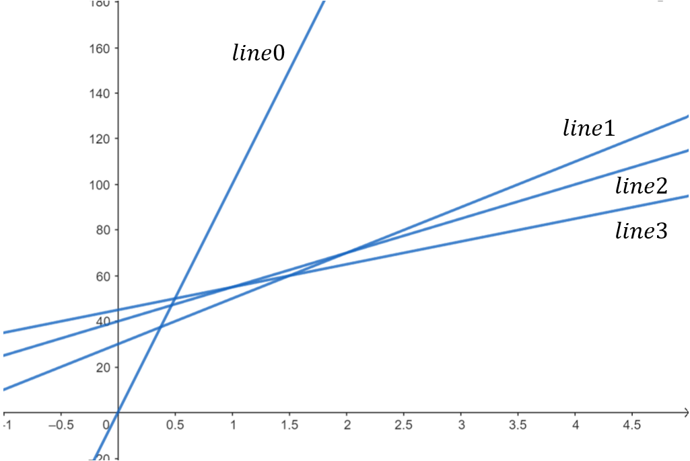

    在我們加入新的直線後，有一些直線便不在凸包上了，意即它們不可能成為任何查詢的答案。這時我們要將它們移出凸包，否則會取到錯誤的答案。

綜合上述，我們可以使用單調隊列，開一個 deque 完成這兩項操作。具體而言，每算完一個 \\(F(i)\\)，便將 pair \\((f_i, F(i))\\) 插入隊列尾端，分別代表直線的 \\(a\\) 與 \\(b\\)。插入之前，我們要檢查是否有直線在這次插入後，再也不會被當成答案。檢查的方式是看 deque 中的倒數第二條線與當前要插入的直線的交點，以及 deque 中的倒數第二條線與 deque 中的最後一條線的交點。若前者有更小的 \\(x\\) 座標，則 deque 中的最後一條線永遠不會被取到，要 pop 掉。

此圖中，\\(line1\\) 為 deque 中的倒數第二條線；\\(line2\\) 為 deque 中的最後一條線；\\(line3\\) 為新加入的直線。在這裡，\\(line1\\) 與 \\(line3\\) 的交點有更小的 \\(x\\) 座標，因此 \\(line2\\) 要被刪掉：


在查詢最小值時，我們不斷比較隊列中第一個與第二個元素，如果將當前的 \\(x\\) 代入兩條直線後，發現代入第二條直線有更好的解，則將第一條直線 pop 掉。

這麼一來複雜度便降到 \\(O(n)\\)。

<details><summary> Solution Code </summary>

```cpp
#include <bits/stdc++.h>
using namespace std;

typedef pair<int, int> pii;
typedef long long ll;
typedef pair<ll, ll> pll;
#define X first
#define Y second
#define pf pop_front 
#define pb pop_back
#define eb emplace_back
#define N 200005

ll s[N], f[N];
ll dp[N];

ll cal(ll x, pll line){
    return x * line.X + line.Y;
}
bool cmp(pll line1, pll line2, pll line3){
    return (line3.Y - line1.Y) * (line1.X - line2.X) <= (line2.Y - line1.Y) * (line1.X - line3.X); 
}

int main(){
    int n;
    cin >> n >> f[0];
    for(int i = 1; i <= n; i++){
        cin >> s[i];
    }
    for(int i = 1; i <= n; i++){
        cin >> f[i];
    }
    deque <pll> dq;
    dq.eb(f[0], 0);
    for(int i = 1; i <= n; i++){
        while(dq.size() >= 2 && cal(s[i], dq[0]) > cal(s[i], dq[1])) dq.pf();
        dp[i] = cal(s[i], dq[0]);
        pll line(f[i], dp[i]);
        while(dq.size() >= 2 && cmp(dq[dq.size() - 2], dq[dq.size() - 1], line)) dq.pb();
        dq.eb(line);
    }
    cout << dp[n] << "\n";
    return 0;
}
```

</details>

<br>

---

我們來看一個稍微複雜的例題。

> [TIOJ 1676 - 烏龜疊疊樂](https://tioj.ck.tp.edu.tw/problems/1676)
>
> 給定一個長度為 \\(n\\) 的陣列與一個整數 \\(k\\)，你可以將陣列切成數段連續的區間，區間大小不能超過 \\(k\\)，求切完之後的最大價值。
> 一段長度為 \\(x\\)、為整個陣列由左至右數來第 \\(m\\) 個區間，其價值被定義為 \\((m-1)\times \Sigma^r_{i=l}a_i-x^2\\)。其中 \\(l\\)、\\(r\\) 分別為區間左右界、\\(a_i\\) 為陣列中第 \\(i\\) 個值。
>
> - \\(1 \leq k \leq n \leq 500000\\)

一樣，我們先試著列出轉移式。令 \\(F(i)\\) 為前 \\(i\\) 個數字貢獻的價值（同時第 \\(i\\) 個元素為區間右界）。

轉移式為：\\(F(i)=\underset{i>j}{\max}(F(j)-(i-j)^2+suf(i+1))\\)

其中 \\(suf(k)\\) 是後綴和，範圍從 \\(k\\) 到 \\(n\\)。

除了 \\(suf(i+1)\\) 這一項外，其他部分還蠻直觀的。而 \\(suf(i+1)\\) 這一項對應到題目的 \\((m-1)\times \Sigma^r_{i=l}a_i\\)，我們看一張示意圖以更好理解 \\(suf(i+1)\\) 的意義：

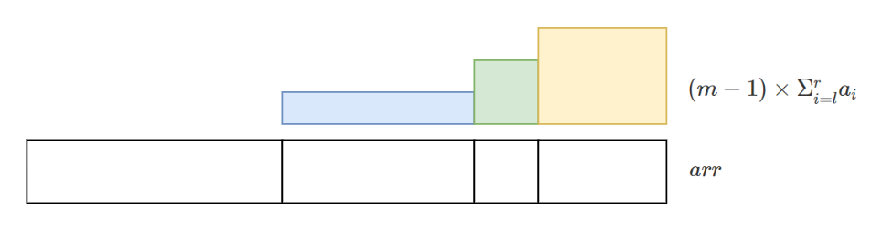

上面的示意圖對每個區間畫出了其 \\((m-1)\times \Sigma^r_{i=l}a_i\\) 的值。我們可以將它們重新分割變成下面這樣：

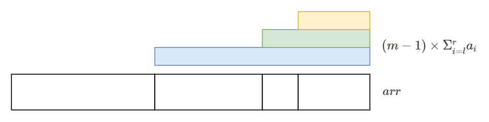

可以發現這每一塊其實就是一段後綴，而且每個後綴的起點對應到每個區間的起點（除了第一個區間不考慮）。我們轉移式中的 \\(i\\) 是區間終點，因此 \\(i+1\\) 便對應到區間起點。而所有的 \\(suf(i+1)\\) 加起來，就對應到所有區間的 \\((m-1)\times \Sigma^r_{i=l}a_i\\)，這個部分的總和。

瞭解轉移式的推導後，我們回來觀察這個轉移式。它看起來與 \\(y=ax+b\\) 的形式不太像，但我們試著將它展開：

\\(F(i)=\underset{i>j>i-k}{\max}(F(j)-(i-j)^2+suf(i+1))\\)

\\(=\underset{i>j>i-k}{\max}(F(j)-i^2+2ij-j^2+suf(i+1))\\)

\\(=\underset{i>j>i-k}{\max}(F(j)-j^2+2ij)-i^2+suf(i+1)\\)

可以發現 \\(max\\) 裡面的部分變成 \\(y=ax+b\\) 的形式了：
\\[y=F(i)\\]
\\[x=2i\\]
\\[a=j\\]
\\[b=F(j)-j^2\\]

這麼一來就可以使用剛剛提到的技巧了！但仔細觀察一下，這個轉移式與上一個例題有兩個不同的地方：

1. 上一題是取 \\(min\\)、這一題是取 \\(max\\)，同時斜率從遞減變為遞增。

    其實概念是差不多的，我們一樣把線畫出來觀察一下：

    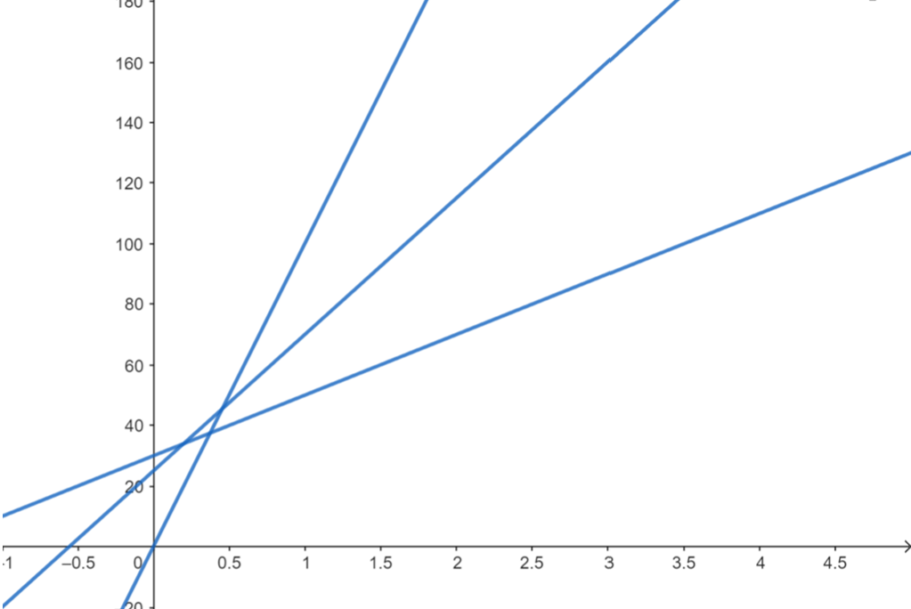

    標記凸包：

    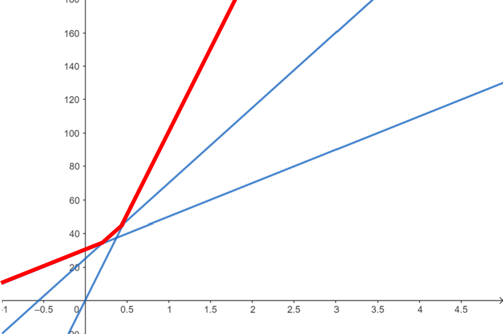

    可以發現我們只是從在上凸包中尋找答案，改為在下凸包中尋找答案而已。實作上來說，我們只要在比較哪個答案比較好時，改成越大的答案越好就好。也就是下面這份 code 的第二行，後面比較時要使用小於（這邊的 \\(x\\)、\\(a\\)、\\(b\\)，意義同 \\(y=ax+b\\) 中的 \\(x\\)、\\(a\\)、\\(b\\)）。

    ```cpp
    for(ll i = 1; i <= n; i++){
        while(dq.size() >= 2 && cal(x[i], dq[0]) < cal(x[i], dq[1])) dq.pf();
        dp[i] = cal(x[i], dq[0]);
        pll line(a[i], b[i]);
        while(dq.size() >= 2 && cmp(dq[dq.size() - 2], dq[dq.size() - 1], line)) dq.pb();
        dq.eb(line);
    }
    ```

2. 轉移範圍有限制，只能從往前 \\(k-1\\) 個轉移點來轉移。

    看起來也不是什麼大問題，好像只需要在 pop deque 前端的直線時，將過期的線也 pop 掉就好。

    這邊假設 deque 裡面的每個元素由 \\(a\\)、\\(b\\)、\\(idx\\) 組成，\\(a\\)、\\(b\\) 代表直線的資訊，\\(idx\\) 代表轉移點的 index。

    ```cpp
    for(ll i = 1; i <= n; i++){
        while(dq.size() >= 1 && dq[0].idx < i - k) dq.pf();
        while(dq.size() >= 2 && cal(x[i], dq[0]) < cal(x[i], dq[1])) dq.pf();
        dp[i] = cal(x[i], dq[0]);
        pll line(a[i], b[i]);
        while(dq.size() >= 2 && cmp(dq[dq.size() - 2], dq[dq.size() - 1], line)) dq.pb();
        dq.eb(line);
    }
    ```

    但這樣真的解決了嗎？我們考慮一下下面這種情況：

    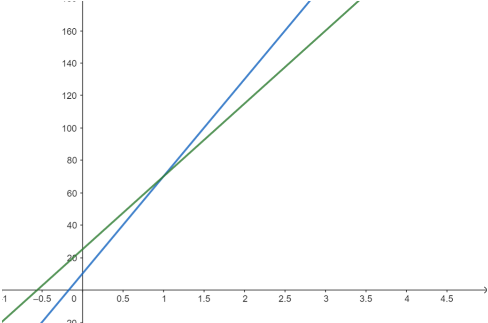

    我們現在要求最大值、且斜率遞增。假設現在我們要插入一條新直線（紅色）：

    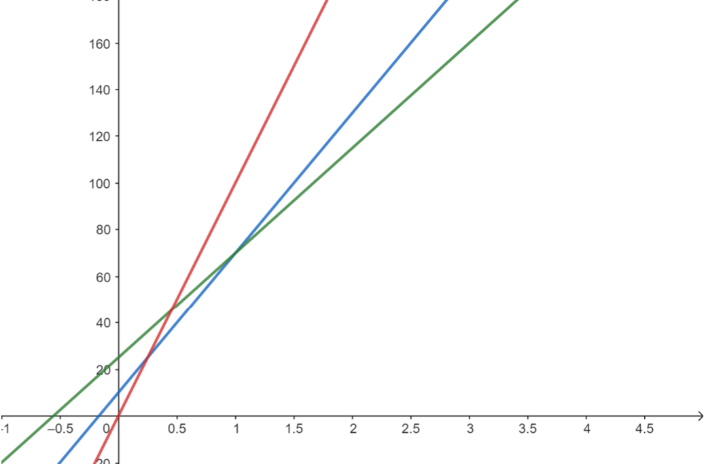

    依照前一個例題的概念，藍色線上的所有點都不在凸包上，我們應該要移除它。這邊將它變虛線表示移除。

    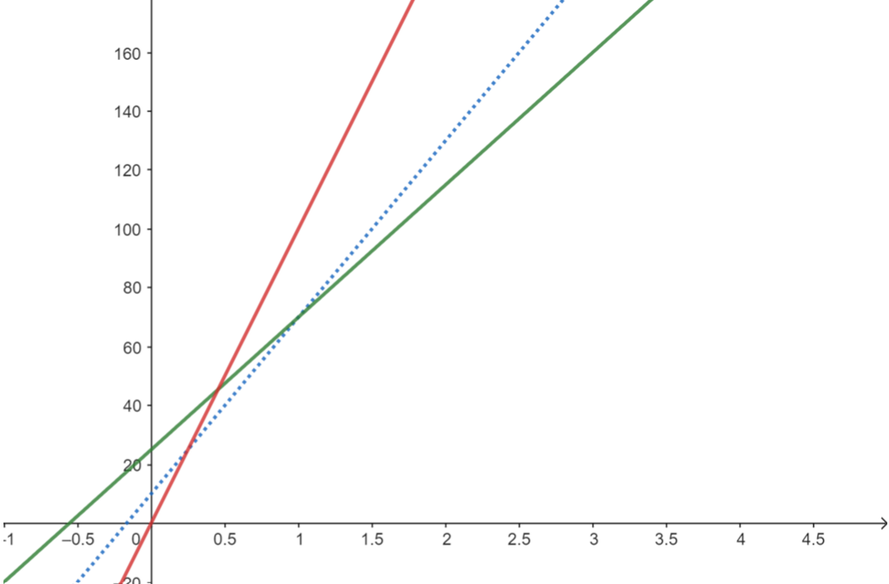

    接下來我們要進行下一個查詢：

    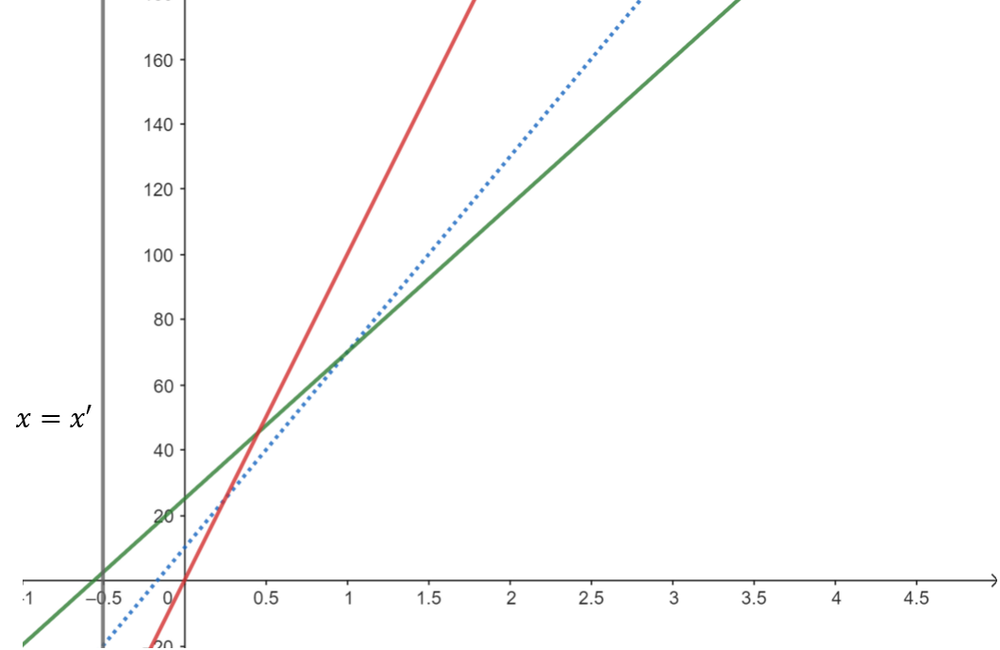

    假設這時最左邊的線過期了，於是我們將它移除：

    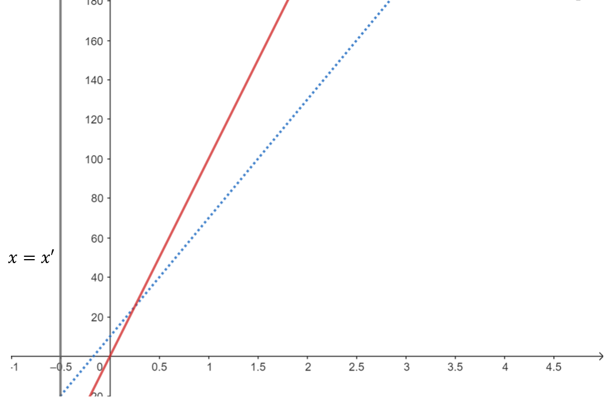

    這時我們發現其實剛剛被我們移除掉的藍色線才能提供最好答案，但我們已經將它移除了。從這個例子我們發現，在加了直線會過期的限制後，我們除了要在直線過期時移除它之外，我們也要更改一下移除不在凸包上直線的策略。

    注意到在綠色線被移除之前，藍色線都不可能提供答案。因此我們要多判斷的是藍色線在綠色線被移除之後，會不會成為可能的轉移來源。具體而言，在我們放入紅色線前，要決定藍色線是否要被移除，而方法是多判斷在綠色線被 pop 時的那一個查詢，藍色線會不會提供比紅色線更好的答案。

    直接來看 code 比較好理解，這邊以這題的情況，假設線過期的條件是 \\(j < i-k\\) 則過期。

    ```cpp
    for(ll i = 1; i <= n; i++){
        while(dq.size() >= 1 && dq[0].idx < i - k) dq.pf();
        while(dq.size() >= 2 && cal(x[i], dq[0]) < cal(x[i], dq[1])) dq.pf();
        dp[i] = cal(x[i], dq[0]);
        pll line(a[i], b[i]);
        while(dq.size() >= 2 
        && cmp(dq[dq.size() - 2], dq[dq.size() - 1], line)
        && cal(x[dq[dq.size() - 2].idx], dq[dq.size() - 1]) <= cal(x[dq[dq.size() - 2].idx], line)) dq.pb();
        dq.eb(line);
    }
    ```

    在加線之前判斷是否要 pop 掉 deque 最後方的線那一部分，我們多加了一個條件判斷 deque 最後方的線是否有可能在它前方的線被 pop 掉後提供答案。由此我們可以保證每一條在 deque 裡面的線都是可能的轉移來源。

其他部分便與上一個例題概念相同，上述做法複雜度一樣為 \\(O(n)\\)。

<details><summary> Solution Code </summary>

```cpp
#include <bits/stdc++.h>
#pragma GCC optimize("O2")
using namespace std;

typedef long long ll;
typedef pair<ll, ll> pll;
#define X first
#define Y second
#define io ios_base::sync_with_stdio(0); cin.tie(0);
#define eb emplace_back
#define pb pop_back
#define pf pop_front
#define N 500005

ll a[N], suf[N], dp[N];

ll cal(ll x, pll line){
    return x * line.X + line.Y;
}
bool cmp(pll line1, pll line2, pll line3){
    return (line3.Y - line1.Y) * (line1.X - line2.X) <= (line2.Y - line1.Y) * (line1.X - line3.X);
}

int main(){
    io
    ll n, k;
    cin >> n >> k;
    for(int i = 1; i <= n; i++){
        cin >> a[i];
    }
    for(int i = n; i >= 1; i--){
        suf[i] = a[i] + suf[i + 1];
    }
    deque <pll> dq;
    dq.eb(0, 0);
    for(ll i = 1; i <= n; i++){
        while(dq.size() >= 1 && dq[0].X < i-k) dq.pf();
        while(dq.size() >= 2 && cal(2 * i, dq[0]) <= cal(2 * i, dq[1])) dq.pf();
        dp[i] = cal(2 * i, dq[0]) - i * i + suf[i + 1];
        pll line(i, dp[i] - i * i);
        while(dq.size() >= 2
            && cal(2 * (dq[dq.size() - 2].X + k), dq.back()) <= cal(2 * (dq[dq.size() - 2].X + k), line)
            && cmp(dq[dq.size() - 2], dq.back(), line)) dq.pb();
        dq.eb(line);
    }
    cout << dp[n] << "\n";
    return 0;
}
```

</details>

#### 小結

以上就是斜率優化的例題與概念，我們再複習一下大致的步驟：

1. 將初始值放入 deque
2. 跑迴圈，從 1 到 n，做下面兩個步驟：

    i. 不斷比較 deque 最前端的兩條線。若第二條線有較好的答案就 pop 掉最前端的線，不斷重複直到最前端的線有最好的答案，或是 deque 中只剩一條線。

    ii. 利用 deque 最前端的線計算 \\(dp[i]\\)。

    iii. 不斷比較 deque 最尾端的線與新的直線。若前者在新的線加入後便不在凸包中就 pop 掉，最後插入新的直線。

雖然步驟都大同小異，但不同題目還是有一些差異，在實作前要特別注意：

- 要注意斜率以及查詢的單調性是遞增或遞減，會影響實作（比較線段時要用大於還是小於等等）。
- 注意題目是否會有轉移範圍的限制。如果有的話，在計算 dp 值之前，過期的線段也要 pop 掉，同時拔掉不在凸包上的點的條件也要做更改。
- 轉移式取 max 與取 min 的差別在於建下凸包或是建上凸包，方法是差不多的。

<!-- #### 另一種思路
// 補上讓 j 為點、i 為線的想法與實作方法 -->

### 斜率單調 & 查詢不單調

上面的題目由於查詢單調，我們才能保證可以只看 deque 前端的線段就找到最小值。那麼，要是查詢不單調該怎麼辦？

我們來看另一個例題：
> [P5785 任務安排](https://www.luogu.com.cn/problem/P5785)
>
> 有 \\(n\\) 個任務，第 \\(i\\) 個任務單獨完成所需的時間為 \\(T_i\\)、費用為 \\(C_i\\)。現在我們可以將任務分批，每批包含相鄰的若干個任務。任務被依序執行，完成一批任務所需的時間是各個任務需要時間的總和，同一批任務會在同一時刻完成。另外，在每批任務開始前，機器需要啟動時間 \\(s\\)。一個任務的 cost 被定義為它的完成時刻乘以它的費用。起始時間為 \\(0\\)，求最小的 total cost。
>
> - \\(1 \leq n \leq 300000\\)
> - \\(-2^8 \leq T_i \leq 2^8\\)
> - \\(0 \leq C_i \leq 2^8\\)
>

先列轉移式。令 \\(F(i)\\) 為完成前 \\(i\\) 個任務的最小 cost。

轉移式為：\\(F(i)=\underset{i>j}{\min}(\Sigma_{k=1}^i T_k \times \Sigma_{k=j+1}^i C_k+s \times \Sigma_{k=j+1}^n C_k+F(j))\\)

其中，\\(s \times \Sigma_{k=j+1}^n C_k\\) 這一項是為了計算 \\(s\\) 所影響的任務完成時刻。由於影響的時間與總共切幾個區間有關，這裡用類似前面例題 [TIOJ 1676 - 烏龜疊疊樂](https://tioj.ck.tp.edu.tw/problems/1676)，使用後綴和的想法，在每多切一個區間出來時就加上後綴因此而產生的 cost。

接下來，我們將轉移式展開：

\\(F(i)=\underset{i>j}{\min}(\Sigma_{k=1}^i T_k \times \Sigma_{k=j+1}^i C_k+s \times \Sigma_{k=j+1}^n C_k+F(j))\\)
\\(=\underset{i>j}{\min}(pre_t(i) \times (pre_c(i)-pre_c(j))+s \times (pre_c(n)-pre_c(j))+F(j))\\)
\\(=\underset{i>j}{\min}(-pre_t(i) \times pre_c(j)-s \times pre_c(j)+F(j))+pre_c(i) \times pre_t(i)+s \times pre_c(n)\\)

其中 \\(pre_t(i)\\) 為 \\(T\\) 的前綴和，即 \\(\Sigma_{k=1}^i T_k\\)；\\(pre_c(i)\\) 為 \\(C\\) 的前綴和，即 \\(\Sigma_{k=1}^i C_k\\)。

我們可以得到：
\\[y=F(i)\\]
\\[x=-pre_t(i)\\]
\\[a=pre_c(j)\\]
\\[b=F(j)-s \times pre_c(j)\\]

\\(pre_c(j)\\) 是遞增的，沒什麼問題。但 \\(pre_t(i)\\) 就不是了。由於 \\(T_i\\) 有可能小於 \\(0\\)，\\(T\\) 的前綴和不具單調性。也就是說，我們的查詢不再單調了。

查詢不再單調，意味著轉移來源不單調，因此我們查詢的時候不能再取最左（右）邊的線來做比較。但是，斜率依然是單調的，因此我們可以改為使用二分搜來尋找答案。我們一樣維護一個斜率有單調性的序列，不過這次我們不再取最前端的直線來計算答案，而是改為使用二分搜。這時我們不再需要 pop 最前段的線，但是在 insert 新的直線到序列最尾端時，我們一樣要將不可能是答案的直線 pop 掉。

至於二分搜要搜什麼呢？注意到我們維護的是一個凸包，凸包上的點的 \\(x\\) 座標是單調的。而每當我們要查詢的時候，我們想找的那條線上的兩個頂點（下圖的灰色點）會在當前查詢的 \\(x\\) 座標（下圖的灰色線）的左右兩側：


因此我們在二分搜時，可以比較當前線段與下一條線段交點的 \\(x\\) 座標，以及當前要查詢的 \\(x\\) 座標，若前者較大則右界改為當前 \\(mid\\)、反之更改左界。

將查詢改為二分搜會讓複雜度多一個 \\(\log\\)，總複雜度是 \\(O(n\log n)\\)。

<details><summary> Solution Code </summary>

此題時間較緊，需要壓一下常數，因此這邊使用陣列來實作。一般情況下，只要可以 push_back 與 pop_back 的資料結構都可以，像是 vector。

```cpp
#include <bits/stdc++.h>
using namespace std;

typedef long long ll;
typedef pair<ll, ll> pll;
#define X first
#define Y second
#define io ios_base::sync_with_stdio(0); cin.tie(0);
#define N 300005

ll pret[N], prec[N];
ll dp[N];
pll v[N];
ll sz;

inline ll cal(ll x, pll line){
    return x * line.X + line.Y;
}
inline bool cmp2(pll p1, pll p2, ll x){
    return (p2.Y - p1.Y) > (p1.X - p2.X) * x;
}
inline pll find_line(ll x){
    int l = 0, r = sz - 2, mid, ans = r + 1;
    while(l <= r){
        mid = (l + r) >> 1;
        if(cmp2(v[mid], v[mid + 1], x)){
            r = mid - 1;
            ans = mid;
        }
        else l = mid + 1;
    }
    return v[ans];
}
inline bool cmp(pll line1, pll line2, pll line3){
    return (__int128)(line3.Y - line1.Y) * (__int128)(line1.X - line2.X) <= (__int128)(line2.Y - line1.Y) * (__int128)(line1.X - line3.X); 
}

int main(){
    io
    ll n, s;
    cin >> n >> s;
    for(int i = 1; i <= n; i++){
        cin >> pret[i] >> prec[i];
        pret[i] += pret[i - 1];
        prec[i] += prec[i - 1];
    }
    v[sz++] = pll(0, 0);
    for(int i = 1; i <= n; i++){
        pll fl = find_line(pret[i]);
        dp[i] = cal(pret[i], fl) + prec[i] * pret[i] + s * prec[n];
        pll line(-prec[i], dp[i] - s * prec[i]);
        while(sz >= 2 && cmp(v[sz - 2], v[sz - 1], line)) sz--;
        v[sz++] = line;
    }
    cout << dp[n] << "\n";
    return 0;
}
```

</details>

### 斜率不單調

斜率不單調的情況更為複雜，我們不能再使用 deque 或是 vector 來維護凸包，以下會介紹幾個解決此問題的方法。

#### CDQ 分治

直接來看一個題目。
> [CSES - Monster Game II](https://cses.fi/problemset/task/2085)
>
> 有 \\(n\\) 個關卡，每關有一個怪物，通關時必須從第一關開始依序通關。打敗一關的怪物需消耗 \\(sf\\) 的 cost，\\(s\\) 為怪物血量，\\(f\\) 為能力值。你會有一個起始的能力值，每到一關，你可以選擇是否打敗該關怪物，並將能力值更新為 \\(f_i\\)。求打敗第 \\(n\\) 關怪物的最小 cost。
>
> - \\(1\leq n\leq 2\times 10^5\\)

令 \\(f(i)\\) 為殺掉第 \\(i\\) 關怪物所需花的最少時間。

轉移式為：\\(F(i)=\underset{i>j}{\min}(F(j)+f_j\times s_i)\\)

題目大致與 [CSES - Monster Game I](https://cses.fi/problemset/task/2084/) 相同，但此題不再保證 \\(f\\) 與 \\(s\\) 的單調性，意即斜率與查詢都不再單調。不過透過 CDQ 分治，我們可以「人為」創造出斜率的單調性。

CDQ 分治的過程就是對於一個序列 \\([l, r]\\)，我們先遞迴解決 \\([l, mid]\\) 的子問題，再處理 \\([l, mid]\\) 對 \\([mid + 1, r]\\) 的貢獻，最後再遞迴處理 \\([mid + 1, r]\\)。

以這題來說，我們會先遞迴左半區間，接著用計算好的左半區間，去更新右半區間的 dp 值，最後再往下遞迴右半區間。

前面提到我們想創造出斜率的單調性，因此在遞迴過程中我們要維護一個斜率單調的序列，且裡面沒有不會被取到的直線。先不論直線如何計算，討論維護的部分。維護的方式類似 merge sort 的過程，只是要注意新增直線到序列尾端時，一樣要做 pop 的動作，將不可能會被取到的直線刪除。

由此，我們在做完遞迴完一個區間時，我們可以得到該區間的所有直線，且依照斜率排序。那麼接下來的問題就是該如何計算 dp 值。如果今天我們左半邊的區間已經處理好了（dp 值皆計算完成且直線依斜率排好），那我們便可以用左半區間去更新右半區間的答案。更新完之後，左半邊的資訊便沒有用了，我們就可以往下遞迴右半區間，重複一樣的動作。

更新的時候就跟斜率單調、查詢不單調時的情況一樣。我們已經有左半邊排序好的序列，現在對右半邊的每個查詢（不單調），我們都要在左半邊的序列中找到最佳解並更新。由於這時斜率是單調的，一樣可以使用二分搜。

總結一下重點：

- 先遞迴左半邊，再來用左半邊的資訊更新右半邊的 dp 值，最後遞迴右半邊。
- 遞迴的時候要一邊對斜率做排序。
- 更新右半區間時，二分搜左半區間詢問最佳解，像斜率單調那時一樣。
- 時間複雜度 \\(O(n\log^2 n)\\)。

<details><summary> Solution Code </summary>

```cpp
#include <bits/stdc++.h>
#pragma GCC optimize("O2")
using namespace std;

typedef pair<int, int> pii;
typedef long long ll;
typedef pair<ll, ll> pll;
#define X first
#define Y second
#define eb emplace_back
#define pb pop_back
#define N 200005
const ll INF = 1e14;

ll dp[N], s[N], f[N];

ll cal(pll line, ll x){
    return x * line.X + line.Y;
}

ll cmp2(pll p1, pll p2, ll x){
    return (p2.Y - p1.Y) > (p1.X - p2.X) * x;
}

bool cmp(pll line1, pll line2, pll line3){
    return (line3.Y - line1.Y) * (line1.X - line2.X) <= (line2.Y - line1.Y) * (line1.X - line3.X); 
}

pll find_line(vector <pll> v, ll x){
    int l = 0, r = v.size() - 2, mid, ans = max(0, r + 1);
    while(l <= r){
        mid = (l + r) >> 1;
        if(cmp2(v[mid], v[mid + 1], x)){
            r = mid - 1;
            ans = mid;
        }
        else l = mid + 1;
    }
    return v[ans];
}

vector <pll> solve(int l, int r){
    vector <pll> v;
    if(l == r){
        v.eb(f[l], dp[l]);
        return v;
    }
    int mid = (l + r) >> 1;
    vector <pll> v1 = solve(l, mid);
    // calculate dp value for (mid, r]
    for(int i = mid + 1; i <= r; i++){
        pll fl = find_line(v1, s[i]);
        dp[i] = min(dp[i], cal(fl, s[i]));
    }
    vector <pll> v2 = solve(mid + 1, r);
    int idx1 = 0, idx2 = 0;
    while(idx1 < v1.size() || idx2 < v2.size()){
        pll pl;
        if(idx2 >= v2.size() || (idx1 < v1.size() && v1[idx1] >= v2[idx2])) pl = v1[idx1++];
        else pl = v2[idx2++];
        while(v.size() >= 2 && cmp(v[v.size() - 2], v.back(), pl)) v.pb();
        v.eb(pl);
    }
    return v;
}

int main(){
    int n;
    cin >> n >> f[0];
    for(int i = 1; i <= n; i++){
        cin >> s[i];
    }
    for(int i = 1; i <= n; i++){
        cin >> f[i];
        dp[i] = INF;
    }
    solve(0, n);
    cout << dp[n] << "\n";
    return 0;
}
```

</details>

#### 李超線段樹

看題目之前，先來介紹這個資料結構。

假設現在我們想在平面座標上做兩個操作（強制在線）：

1. 加入一條形式為 \\(y=ax+b\\) 的直線
2. 詢問 \\(x=k\\) 與所有直線交點的 \\(y\\) 的最大值

看起來像是區間修改、單點查詢的題目。我們考慮線段樹的作法，令左右界為值域，每個節點存的東西是一條直線。接著我們來思考如何插入與查詢。

- **插入**

    如果當前的節點沒有存直線，那我們就直接將要插入的直線存進去。

    如果當前的節點已經存直線了，那我們要想辦法將他們合併起來。假設當前節點的區間是 \\(\[L, R)\\)、中點為 \\(mid=\frac{L+R}{2}\\)。要加進去的直線為 \\(f\\)、在節點中的直線為 \\(g\\)。不失一般性，我們假設 \\(g\\) 的斜率大於 \\(f\\)（如果不是的話就交換，其餘做法相同）。這兩條直線可能會有以下兩種情況：

    1. 在 \\(\[L, R)\\) 中，\\(f\\) 大於 \\(g\\) 的部分較多。

        我們可以將當前區間分為兩個區間：\\(f\\) 比較大的區間與 \\(g\\) 較大的區間，以下稱這兩個區間為 \\(F\\) 和 \\(G\\)，如下圖。我們可以發現 \\(G\\) 一定能被 \\(\[L, mid\]\\) 或 \\(\[mid + 1, R)\\) 其中之一完全包含。我們將 \\(G\\) 向下推，像在線段樹上更新懶惰標記一樣，更新對應的子節點。\\(F\\) 則保留下來存在當前節點。

        

        判斷方式：\\(f\\) 在 \\(mid\\) 的值大於 \\(g\\) 則成立。

    2. 在 \\(\[L, R)\\) 中，\\(f\\) 小於 \\(g\\) 的部分較多。

        與上一個情況相似，這次我們將 \\(G\\) 存於當前節點，將 \\(F\\) 向下推。

        判斷方式：\\(f\\) 在 \\(mid\\) 的值小於 \\(g\\) 則成立。

    若 \\(f\\) 在 \\(mid\\) 的值等於 \\(g\\)，可以歸入上述任一種情況做操作。

    由於我們向下推的時候只會推左或右其中一個子區間，這麼做的複雜度為 \\(O(\log C)\\)，其中 \\(C\\) 是值域大小。

    ```cpp
    void insert(int l, int r, int id, pll line){
        if(l == r){
            if(cal(line, l) < cal(seg[id], l)) seg[id] = line;
            return;
        }
        int mid = (l + r) >> 1;
        if(line.X > seg[id].X) swap(line, seg[id]);
        if(cal(line, mid) <= cal(seg[id], mid)){
            insert(l, mid, id * 2, seg[id]);
            seg[id] = line;
        }
        else{
            insert(mid + 1, r, id * 2 + 1, line);
        }
    }
    ```

- **查詢**

    類似一般線段樹上的區間修改、單點查詢一樣，我們只看包含 \\(k\\) 的那些區間，並從這些線段中取位於 \\(k\\) 的最大值。

    ```cpp
    ll query(int l, int r, int id, ll x){
        if(x < l || x > r) return INF;
        if(l == r) return cal(seg[id], x);
        int mid = (l + r) >> 1;
        ll val = x <= mid ? query(l, mid, id * 2, x) : query(mid + 1, r, id * 2 + 1, x);
        return min(val, cal(seg[id], x));
    }
    ```

---

現在我們來看題目，一樣是 [CSES - Monster Game II](https://cses.fi/problemset/task/2085)，但這次我們考慮李超線段樹的作法。想法很直觀，我們只要先在李超樹上查詢最小值以得到當前 dp 值，再將新的線插入樹中就好。時間複雜度 \\(O(n\log n)\\)。

<details><summary> Solution Code </summary>

```cpp
#include <bits/stdc++.h>
#pragma GCC optimize("O2")
using namespace std;

typedef pair<int, int> pii;
typedef long long ll;
typedef pair<ll, ll> pll;
#define X first
#define Y second
#define N 1000005
const ll INF = 1e18;

ll s[N], f[N];
ll dp[N];
pll seg[N * 4];

ll cal(pll line, ll x){
    return line.X * x + line.Y;
}

void insert(int l, int r, int id, pll line){
    if(l == r){
        if(cal(line, l) < cal(seg[id], l)) seg[id] = line;
        return;
    }
    int mid = (l + r) >> 1;
    if(line.X > seg[id].X) swap(line, seg[id]);
    if(cal(line, mid) <= cal(seg[id], mid)){
        insert(l, mid, id * 2, seg[id]);
        seg[id] = line;
    }
    else{
        insert(mid + 1, r, id * 2 + 1, line);
    }
}

ll query(int l, int r, int id, ll x){
    if(x < l || x > r) return INF;
    if(l == r) return cal(seg[id], x);
    int mid = (l + r) >> 1;
    ll val = x <= mid ? query(l, mid, id * 2, x) : query(mid + 1, r, id * 2 + 1, x);
    return min(val, cal(seg[id], x));
}

int main(){
    int n, x;
    cin >> n >> x;
    for(int i = 1; i <= n; i++){
        cin >> s[i];
    }
    for(int i = 1; i <= n; i++){
        cin >> f[i];
    }
    for(int i = 1; i <= 4e6; i++){
        seg[i] = pll(0, INF);
    }
    insert(1, 1e6, 1, pll(x, 0));
    for(int i = 1; i <= n; i++){
        dp[i] = query(1, 1e6, 1, s[i]); 
        insert(1, 1e6, 1, pll(f[i], dp[i]));
    }
    cout << dp[n] << "\n";
    return 0;
}
```

</details>

#### 動態凸包

動態凸包，顧名思義就是動態維護的凸包，支援的操作有插入直線與詢問在 \\(x\\) 處的最大值。這個東西有模板可以用，應該蠻好找的，因此這邊不討論如何實作，只討論如何使用它。

插入直線與查詢最大值恰好就是我們需要的兩個操作，因此就直接使用即可。如果轉移式是要求最小值，我們就只要把所有東西都加負號並改取最大值就好。

這邊提供使用動態凸包解 [CSES - Monster Game II](https://cses.fi/problemset/task/2085) 的範例 code。模板是使用 kth-competitive-programming 的 [LineContainer](https://github.com/kth-competitive-programming/kactl/blob/main/content/data-structures/LineContainer.h)。時間複雜度一樣是 \\(O(n\log n)\\)。

<details><summary> Solution Code </summary>

```cpp
#include <bits/stdc++.h>
#pragma GCC optimize("O2")
using namespace std;

typedef long long ll;
#define io ios_base::sync_with_stdio(0); cin.tie(0);
#define N 200005

struct Line {
    mutable ll k, m, p;
    bool operator<(const Line& o) const { return k < o.k; }
    bool operator<(ll x) const { return p < x; }
};

struct LineContainer : multiset<Line, less<>> {
    // (for doubles, use inf = 1/.0, div(a,b) = a/b)
    static const ll inf = LLONG_MAX;
    ll div(ll a, ll b) { // floored division
        return a / b - ((a ^ b) < 0 && a % b); }
    bool isect(iterator x, iterator y) {
        if (y == end()) return x->p = inf, 0;
        if (x->k == y->k) x->p = x->m > y->m ? inf : -inf;
        else x->p = div(y->m - x->m, x->k - y->k);
        return x->p >= y->p;
    }
    void add(ll k, ll m) {
        auto z = insert({k, m, 0}), y = z++, x = y;
        while (isect(y, z)) z = erase(z);
        if (x != begin() && isect(--x, y)) isect(x, y = erase(y));
        while ((y = x) != begin() && (--x)->p >= y->p)
            isect(x, erase(y));
    }
    ll query(ll x) {
        assert(!empty());
        auto l = *lower_bound(x);
        return l.k * x + l.m;
    }
};

ll s[N], f[N], dp[N];

int main(){
    io
    ll n, x;
    cin >> n >> x;
    for(int i = 1; i <= n; i++){
        cin >> s[i];
    }
    for(int i = 1; i <= n; i++){
        cin >> f[i];
    }
    LineContainer lc;
    lc.add(-x, 0);
    for(int i = 1; i <= n; i++){
        dp[i] = -lc.query(s[i]);
        lc.add(-f[i], -dp[i]);
    }
    cout << dp[n] << "\n";
    return 0;
}
```

</details>

### 總結

以上就是斜率優化的簡單介紹，最後這裡做個重點整理：

- 斜率優化的功能在於優化特定形式轉移式的轉移複雜度。在這之前，觀察題目並列出、整理轉移式也是很重要的技巧。
- 斜率是否單調會影響凸包維護的方式：單調時可以用 deque、vector；不單調時需要李超線段樹或是動態凸包等等。
- 查詢是否單調會影響尋找轉移來源的方式：單調時可以用單調隊列就好；不單調時需要使用二分搜。
- 許多 dp 優化的題目可以用很多不同的優化方式來做，斜率優化只是其中一種。可以依據實作難度、想法複不複雜等等來決定要使用哪一個。

## Exercises

> [CF 1083E - The Fair Nut and Rectangles](https://codeforces.com/contest/1083/problem/E)
>
> 有 \\(n\\) 個矩形，第 \\(i\\) 個矩形四個頂點的座標分別為 \\((0, 0), (0, y_i), (x_i, 0), (x_i, y_i)\\)。保證沒有任一個矩形包含在另一個矩形中。每個矩形還有一個對應的數字 \\(a_i\\)。現在要選一些矩形，使得他們聯集的面積減掉這些矩形的 \\(a_i\\) 的和最大。
>
> - \\(1 \leq n \leq 10^6\\)

<details><summary> Solution </summary>

先將所有矩形依照 \\(x\\) 座標由大至小 sort，這時 \\(y\\) 座標也會由小至大排好。

令 \\F(i\\) 為考慮前 \\(i\\) 個矩形，且要取第 \\(i\\) 個矩形，所能得到的最大值。

轉移式為：\\(F(i)=\underset{i>j}{\max}(x_i(y_i-y_j)+F(j)-a_i)\\)

\\(=\underset{i>j}{\max}(F(j)-x_iy_j)+x_iy_i-a_i\\)

我們得到：

\\[y=F(i)\\]
\\[x=x_i\\]
\\[a=y_j\\]
\\[b=F(j)\\]

斜率、查詢皆單調，使用單調隊列做斜率優化。此題數字較大，要特別注意 overflow 的問題（可能需要使用 `__int128` 之類的）。

</details>

> [CF 311B - Cats Transport](https://codeforces.com/contest/311/problem/B)
>
> 有 \\(p\\) 個 feeders 想把 \\(m\\) 隻貓接回農場。貓現在分布在各個山上，共有 \\(n\\) 座山，由左至右編號 \\(1\sim n\\)，相鄰的兩座山 \\(i\\) 與 \\(i-1\\) 山隔著 \\(d_i\\) 公尺。每隻貓都會給定其在哪座山上，以及一個時間 \\(t_i\\)，表示經過 \\(t_i\\) 單位時間後貓會開始等待被接走。現在 feeders 要從 \\(1\\) 號山出發往右走，以每單位時間一公尺的速度去接貓，當 feeder 抵達一座山，他會接走該座山中所有正在等待的貓。現在我們要安排 feeders 的出發時間，使得所有貓的等待時間總和最短。
>
> - \\(2 \leq n \leq 10^5\\)
> - \\(1 \leq m \leq 10^5\\)
> - \\(1 \leq p \leq 10^2\\)

<details><summary> Solution </summary>

先將所有貓的 \\(t_i\\) 減掉 \\(h_1\\) 至 \\(h_i\\) 的距離，這樣就可以得到每隻貓最早能被接走時，feeder 的出發時間。

接著將貓照處理過的 \\(t_i\\) 由小至大 sort，題目便轉成如何將序列切成 \\(p\\) 個部分，使得 cost 最小。

令 \\(F(i, j)\\) 為前 \\(i\\) 個 feeder 帶走前 \\(j\\) 隻貓所需的最小 cost。

則轉移式為：\\(F(i, j)=\underset{j>k}{\min}(F(i-1, k)-\Sigma_{p=k+1}^j\space t_p+t_j \times (j-k))\\)

\\(=\underset{j>k}{\min}(F(i-1, k)-suf(k+1)+suf(j+1)+t_{j} \times (j-k))\\)

其中 \\(suf(i)\\) 為後綴和（從 \\(i\\) 加到 \\(n\\)）。

由轉移式我們得到：

\\[y=F(i, j)\\]
\\[x=t_j\\]
\\[a=-k\\]
\\[b=F(i-1, k)-suf(k+1)\\]

斜率、查詢皆單調，可以使用單調隊列做斜率優化。

</details>

> [CF 319C - Kalila and Dimna in the Logging Industry](https://codeforces.com/problemset/problem/319/C)
>
> 有 \\(n\\) 棵樹，第 \\(i\\) 棵樹高度為 \\(a_i\\)。每次使用鋸子砍樹可以使任意棵樹的高度減\\(1\\)，且使用完鋸子後需要充電才能做下一次使用。充電的成本是已經被砍到\\(0\\)的樹中\\(id\\)最大的那棵，的\\(b_i\\)的值。請找出把樹全部砍光的最小成本。
>
> - 保證\\(a_1 = 1, b_n = 0\\)，且\\(a_1 < a_2 < \dots < a_n\\)且\\(b_1 > b_2 > \dots > b_n\\)。
> - \\(1 \le n \le 10^5\\)

<details><summary> Solution </summary>

由於 \\(b_n=0\\)，在砍掉最後一棵樹後，砍所有樹都不需要成本了。因此題目轉變成：砍掉最後一棵樹的最小成本。

令 \\(F(i)\\) 為只砍 index 小於 \\(i\\) 的樹的情況下，砍掉第 \\(i\\) 棵樹的最小 cost。

\\(F(i)=\underset{i>j}{\min}(F(j)+b_j \times a_i)\\)

由轉移式我們得到：

\\[y=F(i)\\]
\\[x=a_i\\]
\\[a=b_j\\]
\\[b=F(j)\\]

斜率、查詢皆單調，可以使用單調隊列做斜率優化。

</details>

> [CF 1715E - Long Way Home](https://codeforces.com/problemset/problem/1715/E)
>
> 有 \\(n\\) 個城市編號 \\(1 \sim n\\)，從城市 \\(u\\) 移動到城市 \\(v\\) 的成本是 \\((u-v)^2\\)。
> 現在 Stanley 想從城市 \\(1\\) 用至多 \\(k\\) 步走到城市 \\(n\\)，請找出最小的成本。
>
> - \\(2 \le n \le 10^5, 1 \le k \le 20\\)

<details><summary> Solution </summary>

令 \\(F(i, j)\\) 代表從城市 \\(1\\) 用 \\(j\\) 步走到城市 \\(i\\) 的最小成本，則：

\\(F(i, j) = \underset{1 \le k \le n}{\min}(F(k, j-1)+i^2+k^2-2ik)\\)

\\(= \underset{1 \le k \le n}{\min}(F(k, j-1)+k^2-2ik)+i^2\\)

由轉移式我們得到：

\\[y=F(i, j)\\]
\\[x=i\\]
\\[a=-2k\\]
\\[b=F(k, j-1)+k^2\\]

斜率、查詢皆單調，可以使用單調隊列做斜率優化。

</details>

> [CSES - Subarray Squares](https://cses.fi/problemset/task/2086)
>
> 將長度 \\(n\\) 的陣列分成 \\(k\\) 個子陣列，每個子陣列的成本是這個子列中數值總和的平方，此分法的總成本為每個子陣列的成本和。
> 請輸出所有分法中的最小成本。
>
> - \\(1 \le k \le n \le 3000\\)

<details><summary> Solution </summary>

令 \\(F(i, j)\\) 為將前 \\(j\\) 個 elements 分成 \\(i\\) 個 subarrays 的最小 cost。

\\(F(i, j)=\underset{j>k}{\min}(F(i-1, k)+(\Sigma_{t=k+1}^{j}x_t)^2)\\)

\\(=\underset{j>k}{\min}(F(i-1, k)+(pre_{j}-pre_k)^2)\\)

\\(=\underset{j>k}{\min}(F(i-1, k)+pre_j^2+pre_k^2-2\times pre_j\times pre_k)\\)

由轉移式我們得到：

\\[y=F(i, j)\\]
\\[x=pre_j\\]
\\[a=-2\times pre_k\\]
\\[b=F(i-1, k)+pre_k^2\\]

斜率、查詢皆單調，可以使用單調隊列做斜率優化。

</details>

> [TIOJ 1921 - 吐鈔機2](https://tioj.ck.tp.edu.tw/problems/1921)
>
> 有 \\(N\\) 台機器，每台機器都有 \\(D_i, P_i, G_i, R_i\\)：售出的日期、購入的價格、每天產出的金額、賣出的價格。給定 \\(C, D\\)：第 \\(0\\) 天持有的金額，停止交易的日期。
> 問在停止交易當天所能持有的最大金額是多少。
>
> - \\(1 \le N \le 10^5\\)
>
> 註：本題與 [ICPC WF 2011](https://onlinejudge.org/index.php?option=onlinejudge&Itemid=8&page=show_problem&problem=3547) 題目非常相似，可以也去看看這題。

<details><summary> Solution </summary>

考慮 \\(F(i, j)\\) 代表能使用的機器只有前 \\(i\\) 種，第 \\(j\\) 天能得到的最大收益。

考慮\\(F(i)\\) 到 \\(F(i+1)\\)的轉移會發現，如果 \\(F(i, D_{i+1}) \ge P_{i+1}\\)，\\(F(i+1)\\) 的函數圖形會是 \\(F(i)\\) 與直線 \\(y = G_{i+1} \times (j-D_{i+1}-1) - P_{i+1} + R_{i+1}\\) 形成的凸包。

不然我們不可能構入此機器，\\(F(i+1) = F(i)\\)。

於是我們只要一個能夠支援加入直線、詢問單點值的資料結構：即動態凸包。

</details>

## References

底下的資源都是在介紹斜率優化，但講解方式不盡相同，可以多參考幾個以更深入了解斜率優化的概念。其中我認為第一個 reference 的講解最清楚詳細，而最後一個 reference 對於李超線段樹的說明也很清楚，建議可以去看看。Codeforces 上面還有更多關於斜率優化的 tutorial 與題單，有興趣的讀者可以自己去搜尋。

- [[Tutorial] Convex Hull Trick - Geometry being useful](https://codeforces.com/blog/entry/63823)
- [【學習筆記】動態規劃—斜率優化 DP（超詳細）](https://www.cnblogs.com/Xing-Ling/p/11210179.html)
- [Oi wiki - 斜率優化](https://oi-wiki.org/dp/opt/slope/)
- [TIOJ 建中培訓講義](https://tioj.ck.tp.edu.tw/uploads/attachment/5/27/5.pdf)
- [Algorithms for competitive programming - Convex hull trick](https://cp-algorithms.com/geometry/convex_hull_trick.html)
- [PEGWiki - Convex hull trick](https://wcipeg.com/wiki/Convex_hull_trick)
- [USACO Guide - Convex Hull Trick](https://usaco.guide/plat/convex-hull-trick?lang=cpp)
- [Oi wiki - 李超線段樹](https://oi-wiki.org/ds/li-chao-tree/)
- [DP optimization - Convex Hull Optimization](https://robert1003.github.io/2020/02/17/dp-opt-convex-hull-trick.html#convex-hull-trick-cht)
- [A Simple Introduction to Li-Chao Segment Tree](https://robert1003.github.io/2020/02/06/li-chao-segment-tree.html)
