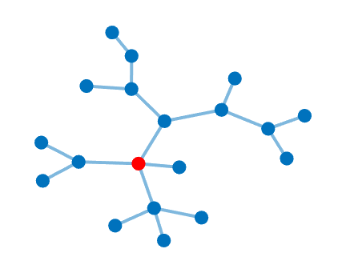
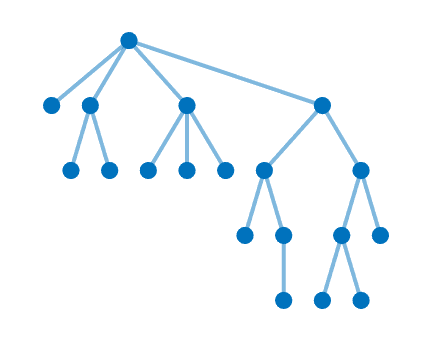
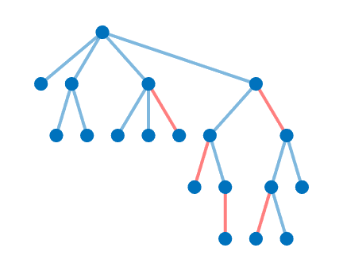
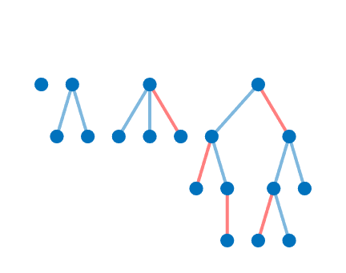
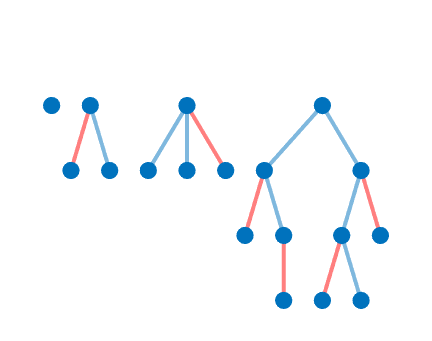
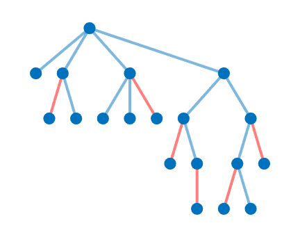
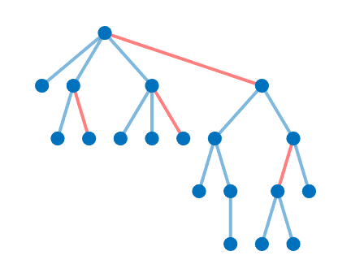
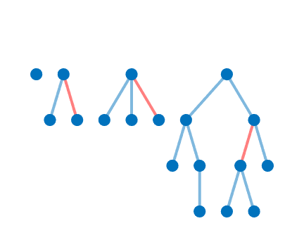
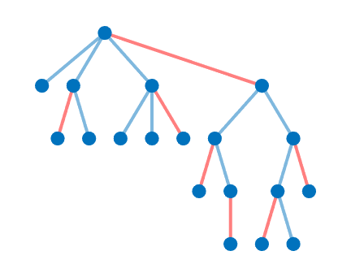
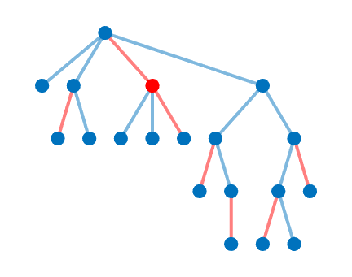

# Dynamic Programming on Trees
從一棵樹上移除一條邊，它就變成兩棵樹；從一棵樹上移除一個度數為\\(d\\)的點，它就變成\\(d\\)棵樹。由於這樣的遞迴性質，不少樹上問題都具有最佳子結構(optimal substructure)，也許就能利用動態規劃(dynamic programming)相關的技巧解出。

當然，就跟傳統DP一樣，不引入例題就無法體會到精髓，所以直接來看幾個經典題。

### Classic Examples
> [CSES - Tree Matching](https://cses.fi/problemset/task/1130)
>
> 給定一棵\\(n\\)個點的樹，找出這棵樹上的最大（邊數）配對，並印出總共有幾個邊。配對的定義是：一個邊集合，其中每個點與至多一條邊相鄰。

許多（無根）樹上問題的第一步，就是隨便選一個點當作根。  


定根之後，來觀察連到根節點的這些邊。根據配對的定義，可能的情形有：
1. 這些邊都不屬於一個（最大）配對。  
     
   此時，把這些邊與根拿走，剩下的圖也是一個配對。  
     
   於是，只要遞迴求出每個子樹的（最大）配對，就能涵蓋這個情形所有可能的配對。這題要求最大配對，所以只要把每個子樹的最大配對合併就是了；總邊數則是每個最大配對的邊數相加。  
   
2. 其中一條邊屬於一個（最大）配對。  
     
   把這些邊與根拿走，剩下的圖還是能保證是一個配對。  
     
   但反過來就不行了，原因也很明顯：假設根是\\(u\\)，而邊\\((u, v)\\)屬於這個配對，就不能再有其它點跟\\(v\\)配對了。  
     
   於是，當遞迴到以\\(v\\)為根的子樹時，只能考慮第1. 種情形的配對；對於其它\\(u\\)的小孩\\(w\neq v\\)，一樣所有可能的配對都可以考慮。

#### Defining a DP State
有了上一節最佳子結構的觀察之後，就能開始設計dp狀態。不妨令\\(dp[1][u]\\)為「以\\(u\\)為根的子樹中，最大配對的邊數」；\\(dp[0][u]\\)的定義差不多，但加入一個限制「\\(u\\)不能是任意配對邊的端點」。  
其實\\(dp[0][u]\\)就是上述第1. 種情形，而\\(dp[1][u]\\)則同時包含兩種情形。
前一節就提過了，寫成數學式的話是：

\\[dp[0][u]=\sum_{v\in child(u)}dp[1][v]\\]

\\(dp[1][u]\\)的轉移式也不複雜，除了最終要與\\(dp[0][u]\\)取較大值外，對\\(u\\)的所有小孩做前一節第2. 種情形，再全部取最大值就可以了。

\\[dp[1][u]=\max\biggl(dp[0][u],\max_{v\in child(u)}\Bigl(1+dp[0][v]+\sum_{w\in child(u),w\neq v}dp[1][w]\Bigr)\biggr)\\]

\\[=\max\biggl(dp[0][u],1+\max_{v\in child(u)}\Bigl(dp[0][v]+\sum_{w\in child(u)}dp[1][w]-dp[1][v]\Bigr)\biggr)\\]

\\[=\max\Bigl(dp[0][u],1+\sum_{v\in child(u)}dp[1][v]+\max_{v\in child(u)}\bigl(dp[0][v]-dp[1][v]\bigr)\Bigr)\\]

#### Implementation Details
筆者習慣0-based indexing，所以樹的輸入會寫成這樣：
```cpp
#define MAXN (int)2e5
// Global array
vector<int> tree[MAXN];
// In main()
for (int i = 1; i < n; ++i) {
    int a, b; cin >> a >> b;  // 1 <= a, b <= MAXN on CSES
    tree[a - 1].push_back(b - 1);
    tree[b - 1].push_back(a - 1);
}
```
接著，隨便選一個點當作根，假設選擇編號為0的點：
```cpp
void DFS(int u, int parent) {
    for (const int &v: tree[u]) if (v != parent)
        DFS(v, u);
}
DFS(0, -1);

```
一個子樹的根可以用這個根節點的編號來代表，所以前一節的dp表會寫成`int dp[2][MAXN];`。

樹DP的轉移通常採用memoization而不是填表，因為要了解一棵樹的整體結構，必定要經過一次（通常是深度優先）搜尋；memoization可以邊DFS邊做，而填表需要先知道轉移順序，也就是需要完整DFS一遍之後才能做，多此一舉。

以下實作中，`tmp`指的是\\(\max_{v\in child(u)}\bigl(dp[0][v]-dp[1][v]\bigr)\\)。  
兩個`for (const int &v: tree[u]) if (v != parent)`迴圈看似會讓複雜度變差，但只有第一個迴圈會遞迴呼叫`DFS`，所以時間複雜度會是好好的\\(\Theta(n)\\)。
```cpp
void DFS(int u, int parent) {
    dp[0][u] = 0;
    for (const int &v: tree[u]) if (v != parent) {
        DFS(v, u);
        dp[0][u] += dp[1][v];
    }
    dp[1][u] = 1; int tmp = -2147483647;
    for (const int &v: tree[u]) if (v != parent) {
        dp[1][u] += dp[1][v];
        tmp = max(tmp, dp[0][v] - dp[1][v]);
    }
    dp[1][u] = max(dp[0][u], dp[1][u] + tmp);
}
```
經過一次DFS之後，因為根的編號為0，所以`dp[1][0]`就是答案。
<details><summary>Solution Code</summary>

```cpp
#include <iostream>
#include <vector>
using namespace std;
#define MAXN (int)2e5
vector<int> tree[MAXN]; int dp[2][MAXN];
void DFS(int u, int parent) {
    dp[0][u] = 0;
    for (const int &v: tree[u]) if (v != parent) {
        DFS(v, u);
        dp[0][u] += dp[1][v];
    }
    dp[1][u] = 1; int tmp = -2147483647;
    for (const int &v: tree[u]) if (v != parent) {
        dp[1][u] += dp[1][v];
        tmp = max(tmp, dp[0][v] - dp[1][v]);
    }
    dp[1][u] = max(dp[0][u], dp[1][u] + tmp);
}
int main() {
    int n; cin >> n;
    for (int i = 1; i < n; ++i) {
        int a, b; cin >> a >> b;
        tree[a - 1].push_back(b - 1);
        tree[b - 1].push_back(a - 1);
    }
    DFS(0, -1);
    cout << dp[1][0] << endl; return 0;
}
```

</details>

#### Discussion
* 如果邊有權重(weight)的話，要找出最大權重配對，假設邊權重皆正（否則直接把非正權的邊刪掉比較容易），那以上討論的轉移式還能輕易套用嗎？如果可以，需要更動哪些細節？
* 假設\\(n\geq2\\)，如果把根定在葉子，此時\\(dp[1][u]\\)的轉移式會變得如何？這樣的轉移式給你什麼啟發？
* 如果邊有權重的話，上一點的討論還會成立嗎？

> Finding the Diameter and a Center of a Tree
>
> 一張圖的直徑(diameter)為圖中任兩點距離中最長的；[^note-1]圓心(center)則為使一個點與其它點最遠的距離最小的點。[^note-2]對於樹，以圓心為樹根，則樹高會最小。[^note-3]給定一棵\\(n\\)個點的樹，請在\\(\Theta(n)\\)的時間內，找出這棵樹的直徑（長度）以及一個圓心。

### Exercises

> [AtCoder Educational DP Contest P - Independent Set](https://atcoder.jp/contests/dp/tasks/dp_p)
>
> 給定一棵樹，每個點可以是白色或黑色，但是相鄰的兩個點不能都是黑色，請計算有幾種塗色方法（除以\\(10^9+7\\)的餘數）。

> [CSES - Finding a Centroid](https://cses.fi/problemset/task/2079)
>
> 給定一棵\\(n\\)個點的樹，找出這棵樹的一個重心。重心的定義是：如果把重心定為根，那麼每個子樹最多有\\(\lfloor\frac n2\rfloor\\)個點（不包含根在重心的那棵子樹）。

## DP on Trees with Rerooting

### "Dynamic Programming" on Trees or "Divide and Conquer" on Trees?

演算法課程會提到，一個可應用DP技巧的問題，一定具有「最佳子結構」跟「重疊子問題」(overlapping subproblems)兩個性質。如果讀者回去看第一節，就會發現筆者並沒有提到「重疊子問題」；事實上，以上所有的例題都沒有重疊子問題的性質。即便一個小子問題的答案被利用多次，它並不是被「多個大子問題」所利用。

那這種技巧憑什麼稱為樹DP？為什麼不叫做樹分治？

其實筆者自己也認為，以上內容應該是樹分治，而不是樹DP。不過，接下來就要介紹一類含有大量重疊子問題，必須用DP來解的問題。

### Examples

> [CSES - Tree Distances II](https://cses.fi/problemset/task/1133)
>
> 給定一棵樹，對於**每個點**計算該點與所有點的距離總和。

如果讀者有讀懂「樹分治」的話，定根之後，對於每棵子樹計算根與所有點的距離總和，應該是足夠輕鬆愉快的。令\\(sz[u]\\)為以\\(u\\)為根的子樹大小（一共有幾個點），\\(in[u]\\)為以\\(u\\)為根的子樹，上述簡化版問題的答案。作為驗收，在往下讀之前，請試著列出它們的轉移式。

<details><summary>參考答案</summary>

\\[sz[u]=1+\sum_{v\in child(u)}sz[v]\\]

\\[in[u]=sz[u]-1+\sum_{v\in child(u)}in[v]\\]

</details>

問題來了：可以利用剛剛求出來的資訊，快速得到原題目的答案嗎？

答案是可以的。

我們已經知道每個點到其後代(descendant)的距離總和，只需要再算出那些不是後代的點的答案，就解決問題了。

令\\(out[u]\\)為所有不是\\(u\\)的後代的點到\\(u\\)的距離總和。（\\(u\\)是它自己的後代，所以不包含在\\(out[u]\\)裡面，雖然這並不重要。）

那麼，\\(in[u]+out[u]\\)就是點\\(u\\)的最終答案。

如果\\(u\\)是根，那麼顯然\\(out[u]=0\\)。否則，有以下三個情形需要討論：

1. \\(u\\)到\\(parent(u)\\)的距離是\\(1\\)。
2. 對於所有\\(parent(u)\\)的proper descendant \\(v\\)（但不是\\(u\\)的後代），\\(u\\)到\\(v\\)的路徑依序會是\\(parent(u)\\)、一個\\(u\\)的sibling \\(w\\)、從\\(w\\)到\\(v\\)的路徑。  
   對於每個這樣的\\(v\\)，前面兩段路徑的長度為\\(2\\)，而這樣的\\(v\\)共有\\(\sum_{w\in sibling(u),w\neq u}sz[w]\\)個。  
   至於最後一段路徑，我們需要計算所有「從一個\\(u\\)的sibling到其後代的距離」總和。類似Tree Matching的第1. 種情形，其實就是把每個sibling的\\(in[w]\\)相加。
3. 對於所有不是\\(parent(u)\\)的proper descendant的節點\\(v\\)，\\(u\\)到\\(v\\)的路徑依序會是\\(parent(u)\\)、\\(parent(parent(u))\\)、從\\(parent(parent(u))\\)到\\(v\\)的路徑。  
   第一段路徑的長度為\\(1\\)，而這樣的\\(v\\)共有\\(n-sz[parent(u)]\\)個；後面兩段路徑，全部囊括在\\(out[parent(u)]\\)裡面。

整理這三種情形，可以得到\\(out[u]\\)的轉移式如下：

\\[out[u]=1+\sum_{v\in sibling(u),v\neq u}(2\times sz[v]+in[v])+(n-sz[parent(u)]+out[parent(u)])\\]

其中

\\[\sum_{v\in sibling(u),v\neq u}(2\times sz[v]+in[v])=\sum_{v\in child(parent(u))}(2\times sz[v]+in[v])-2\times sz[u]-in[u]\\]

<details><summary>Solution Code</summary>

```cpp
#include <iostream>
#include <vector>
using namespace std;
#define MAXN (int)2e5
int n; vector<int> tree[MAXN];
int sz[MAXN]; long long in[MAXN], out[MAXN];
void DFS(int u, int parent) {
    sz[u] = 1; in[u] = -1;
    for (const int &v: tree[u]) if (v != parent) {
        DFS(v, u);
        sz[u] += sz[v]; in[u] += in[v];
    }
    in[u] += sz[u];
}
void DFSout(int u, int parent) {
    long long Sigma = 0;
    if (parent == -1) out[u] = 0;
    for (const int &v: tree[u]) if (v != parent)
        Sigma += (sz[v] << 1) + in[v];
    for (const int &v: tree[u]) if (v != parent) {
        out[v] = 1 + Sigma - (sz[v] << 1) - in[v] + n - sz[u] + out[u];
        DFSout(v, u);
    }
}
int main() {
    cin >> n;
    for (int i = 1; i < n; ++i) {
        int a, b; cin >> a >> b;
        tree[a - 1].push_back(b - 1);
        tree[b - 1].push_back(a - 1);
    }
    DFS(0, -1);
    DFSout(0, -1);
    for (int i = 0; i < n; ++i) cout << in[i] + out[i] << " \n"[i == n - 1];
    return 0;
}
```

</details>

#### Discussion
上述\\(out[u]\\)的轉移式還是太毒。以這題來說，有比分成以上三種情形討論，更容易理解的想法。

* 請證明\\(in[u]+out[u]=in[parent(u)]+out[parent(u)]-sz[u]+(n-sz[u])\\)。
* 這個轉移式給你什麼啟發？

### Exercises

> [CF 1805D - A Wide, Wide Graph](https://codeforces.com/problemset/problem/1805/D)
>
> 給定一棵\\(n\\)個點的樹\\(T\\)，定義\\(G_k\\)為一張\\(n\\)個點的圖，其中任兩點之間有邊若且唯若它們在\\(T\\)中的距離\\(\geq k\\)。對於所有\\(k\in[1,n]\\)，計算\\(G_k\\)有幾個連通塊。

## References
- [DP on Trees - Introduction · USACO Guide](https://usaco.guide/gold/dp-trees?lang=cpp)
- [7. 樹與DP進階 - 2017建中校內培訓講義](https://tioj.ck.tp.edu.tw/uploads/attachment/11/54/7.pdf)
- [DP on Trees - Solving For All Roots · USACO Guide](https://usaco.guide/gold/all-roots?lang=cpp)
- Thomas H. Cormen, Charles E. Leiserson, Ronald L. Rivest, and Clifford Stein.  *Introduction to Algorithms*, third edition, 379, 384.  The MIT Press, 2009.

[^note-1]: [Graph Diameter -- from Wolfram MathWorld](https://mathworld.wolfram.com/GraphDiameter.html)

[^note-2]: [Graph Center -- from Wolfram MathWorld](https://mathworld.wolfram.com/GraphCenter.html)

[^note-3]: [3. 圖論 - 2017建中校內培訓講義](https://tioj.ck.tp.edu.tw/uploads/attachment/11/42/3.pdf)
