## Ford-Fulkerson 算法

* 首先先介紹一個最大流演算法的核心概念之一，增廣路徑(Augmenting Path)
  * 一個路徑 \\(\{u_{1}, u_{2}, ..., u_{n}\}\\)，其中 \\(u_{1}=s\\)，\\(u_{n}=t\\)，\\(c_{f}(u_{i}, u_{i + 1}) > 0\\)。
  * 簡單來說，就是從源點走到匯點的路徑中，若該路徑上所有弧的剩餘容量都大於 0，則該路徑稱作增廣路徑。
  * 以功能來說，增廣路徑的存在，就表示從源點開始還有可流通至匯點的容量可使用。
  * 當圖上達到最大流時，不存在增廣路徑。

* 先介紹一個直覺找最大流的作法
  * 不斷使用 DFS 尋找增廣路徑
    * 若找到增廣路徑，且增廣路徑上所有弧的剩餘容量中的最小值為 \\(c_f\\)，則將增廣路徑上所有弧的剩餘容量減去 \\(c_f\\)，且將所有弧的反向邊的剩餘容量加上 \\(c_f\\)。
    * 將總流量增加 \\(c_f\\)，並持續尋找增廣路徑，當找不到增廣路徑時，演算法結束，此時總流量即為這個圖上的最大流。
  * 以下圖為例。

      <details>
      <summary> 點擊展開圖片（圖中數字代表淨流/容量） </summary>

      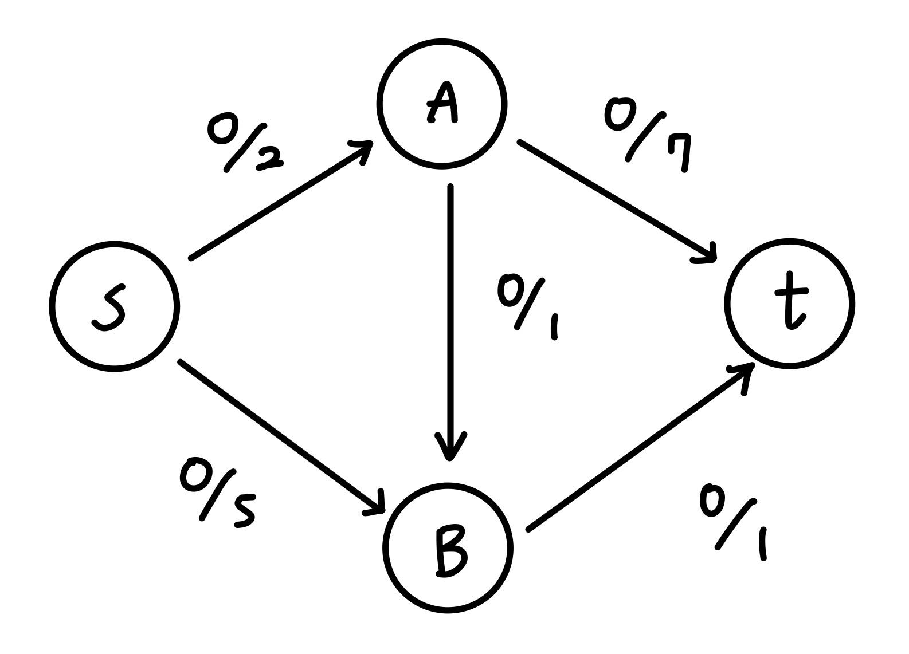

    * 第一次找到的增廣路徑為：{ \\(s \to A\\), \\(A \to B\\), \\(B \to t\\) }，並更新路徑上所有弧。

      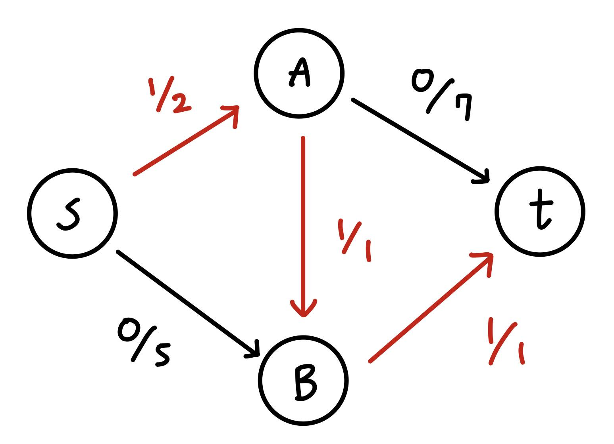

    * 第二次找到的增廣路徑為：{ \\(s \to A\\), \\(A \to t\\) }，並更新路徑上所有弧。

      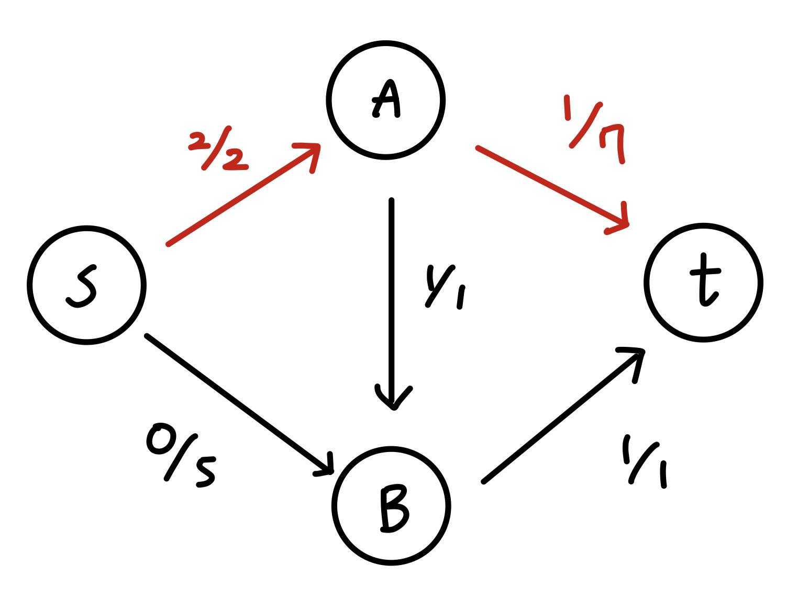

      </details>

  * 此時，圖上已無增廣路徑，總流量為 \\(2\\)，圖上即為最大流……嗎？事實上，此圖的最大流為 \\(3\\)，也就是說，我們找到的增廣路徑組合出錯了，以下是正確的增廣路徑組合之一。

      <details>
      <summary> 點擊展開圖片（圖中數字代表淨流/容量） </summary>

    * 第一次找到的增廣路徑為：{ \\(s \to A\\), \\(A \to t\\) }，並更新路徑上所有弧。

      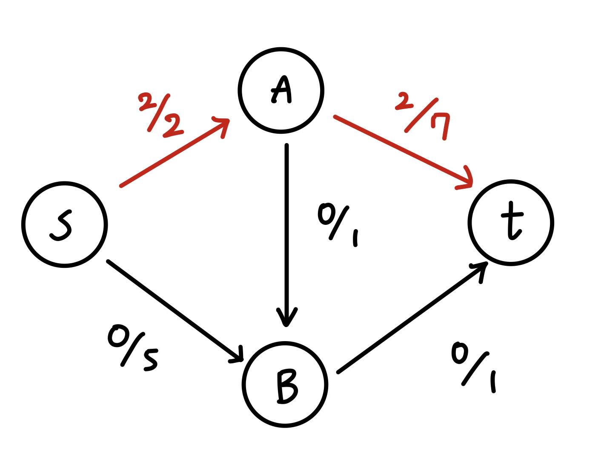

    * 第二次找到的增廣路徑為：{ \\(s \to B\\), \\(B \to t\\) }，並更新路徑上所有弧。

      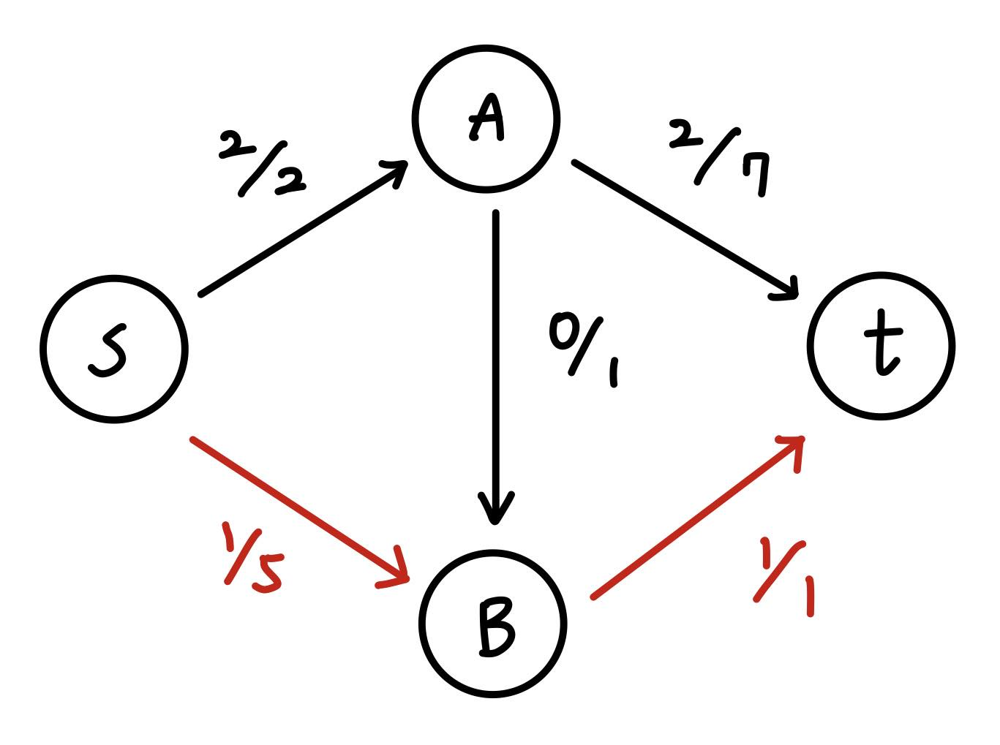

      </details>

    * 如果將上面兩個最後完成的圖拿出來對比，可以發現若在圖一最後的圖上，以路徑 { \\(s \to B\\), \\(B \to A\\), \\(A \to t\\) } 再更新一次流(其中弧 \\(A \to B\\) 增加的流量變成負的)，可以發現就能得到圖二的最終結果。

      <details>
      <summary> 最大流為2的圖一 </summary>

      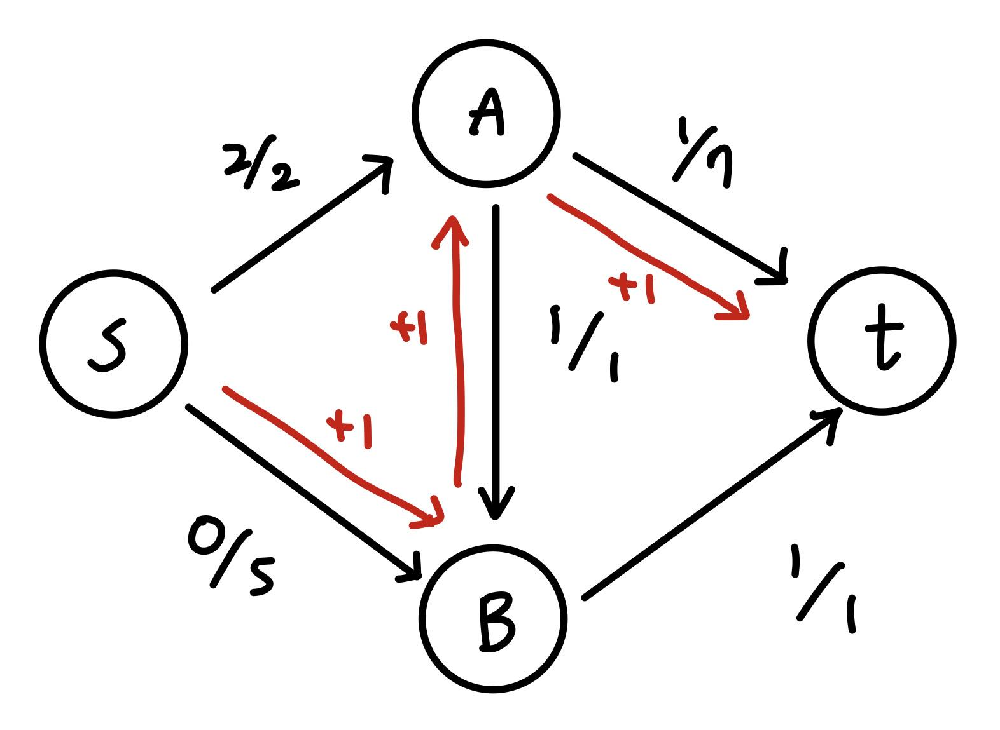

      </details>

      <details>
      <summary> 最大流為3的圖二 </summary>

      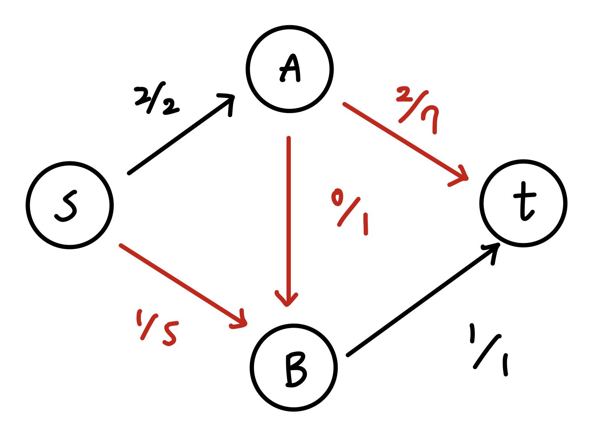

      </details>

    * 為甚麼會發生這種情況呢？其實是因為找到增廣路徑時，對每一條弧來說，最佳解不一定是將流量調整增加路徑上最小的剩餘容量 \\(c_f\\)，所以需要一個除錯的機制，而這個機制正是為所有弧建立「反向邊」，讓當前流量並非最佳的弧有逆推回正確流量的可能。
    * 反向邊：對於一條弧 \\(u \to v\\) 來說，設其剩餘容量為\\(c_f\\)，其反向邊為 \\(v \to u\\) 且剩餘容量為 \\(c - c_f\\)。

    * 演算法過程
      * 為所有弧建立反向邊，若弧的容量為 \\(c\\)，則反向邊的容量為 \\(0\\)，此過程即為將整個網路流圖製作成剩餘網路，並可使用到前面證明出的性質。
      * 進行前文所提到的「不斷使用 DFS 尋找增廣路徑」中的動作。

    * 時間複雜度及正確性分析
      * 尋找一條增廣路徑複雜度為 \\(O(V+E)\\)，最差的情況之下，每次增廣路徑增加的流量為 \\(1\\)，總共要找 \\(F\\) 次增廣路徑( \\(F\\) 為圖上最大的最大流)，演算法總複雜度為 \\(O((V+E)F)\\)，邊數通常較多，可簡化為 \\(O(EF)\\)，請看以下例子。
        <details>

        * 以下為理論上存在的最壞情況，圖片中邊的數值為剩餘容量。

          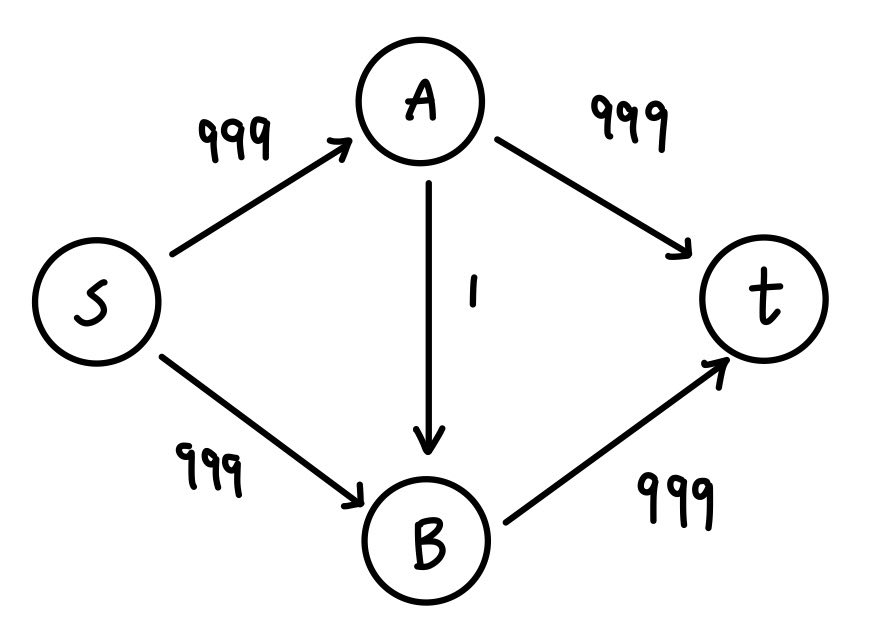

        * 第一次找到的增廣路徑為 {\\(s \to A, \ A \to B, \ B \to t\\)}

          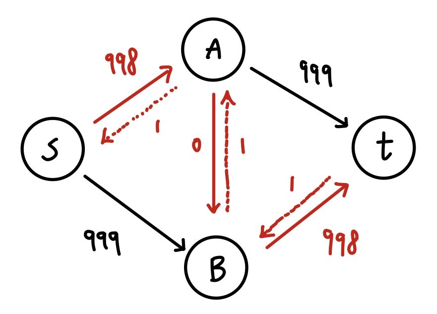

        * 第二次找到的增廣路徑為 {\\(s \to B, \ B \to A, \ A \to t\\)}

          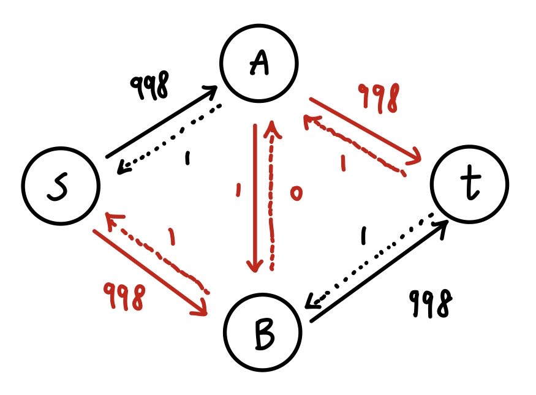

        * 不斷重複同樣動作，直到出現最大流，此時共進行了 1998 次的尋找增廣路徑。

          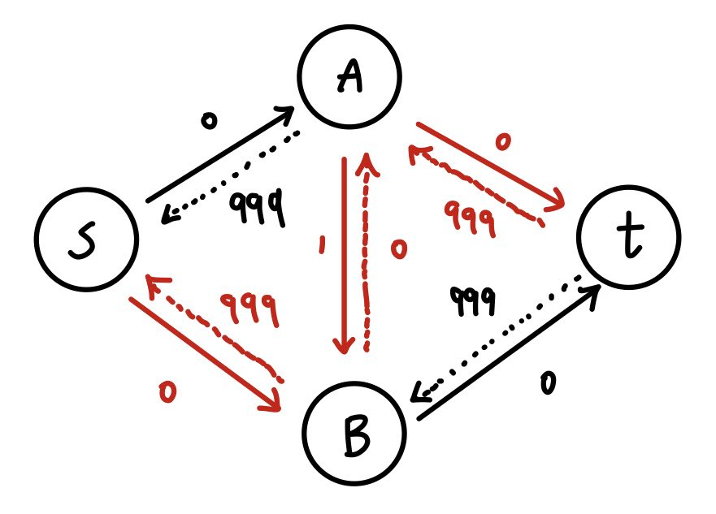

        </details>
    * 根據最大流最小割定理中的條件(1)、(2)，只要在 \\(s, t\\) 之間還存在增廣路徑，則當前網路尚未達到最大流，反之，當 \\(s, t\\) 之間不存在增廣路徑，則當前流量為最大流，故在存在增廣路徑時不斷增加新流量，直至找不到增廣路徑後，當前網路即達到最大流。

    <details>
    <summary> Template Code </summary>

        struct FordFulkerson {
          using ll = long long;
          const ll INF = numeric_limits<ll>::max();
          struct Edge {
            ll to, rev, cap;
          };

          int n, m, s, t;
          vector<vector<Edge>> v;
          vector<bool> vis;

          FordFulkerson(int n, int m, int s, int t) : n(n), m(m), s(s), t(t) {
            for (int i = 1; i <= t + 1; i++)
              v.emplace_back(vector<Edge>{}), vis.emplace_back(false);
          }

          void add_edge(int a, int b, ll cap) {
            v[a].emplace_back(Edge{b, (int)v[b].size(), cap});
            v[b].emplace_back(Edge{a, (int)v[a].size() - 1, 0});
          }

          ll dfs(ll now, ll flow) {
            if (now == t) {
              return flow;
            }
            vis[now] = true;
            for (Edge &e : v[now]) {
              if (!vis[e.to] && e.cap > 0) {
                ll f = dfs(e.to, min(flow, e.cap));
                if (f) {
                  e.cap -= f;
                  v[e.to][e.rev].cap += f;
                  return f;
                }
              }
            }
            return 0;
          }

          ll flow() {
            ll i, j;
            ll ans = 0;
            while (true) {
              for (i = 1; i <= n; i++)
                vis[i] = false;
              vis[s] = false;
              vis[t] = false;
              ll f = dfs(s, INF);
              if (!f)
                break;
              ans += f;
            }
            return ans;
          }
        };

    </details>
  
## Edmonds-Karp 算法

* 基於 Ford-Fulkerson 算法的優化
  * 在前文中 Ford-Fulkerson 算法的時間複雜度分析中，可以發現若使用 DFS 來尋找增廣路徑，可能會存在重複擴充新流量，但每次新增的流量都極小的情況，這也是為甚麼它的複雜度是 \\(O(EF)\\) 的原因，我們會發現若將找增廣路徑的方法改成 BFS，則最後花費的時間和流量沒有關係，亦即時間複雜度和 DFS 的不同，以下為前文 Ford-Fulkerson 算法中所舉的例子。

      <details>
      <summary> 以BFS尋找增廣路徑的過程 </summary>

      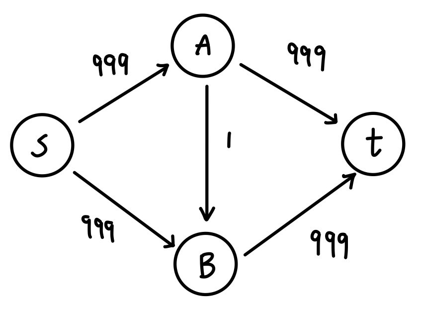

      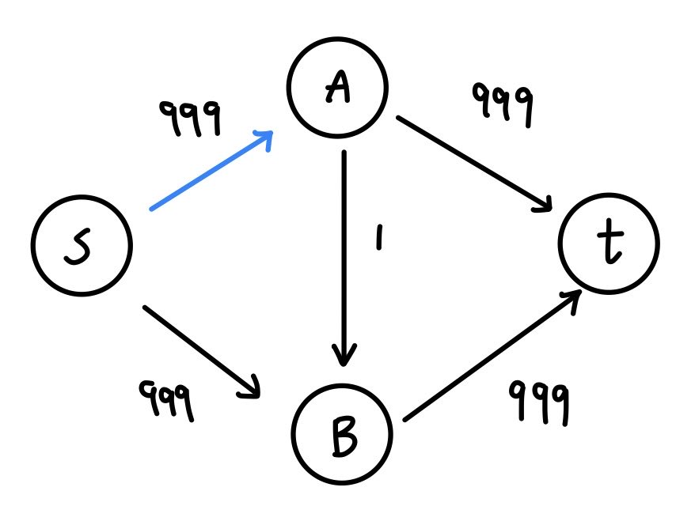

      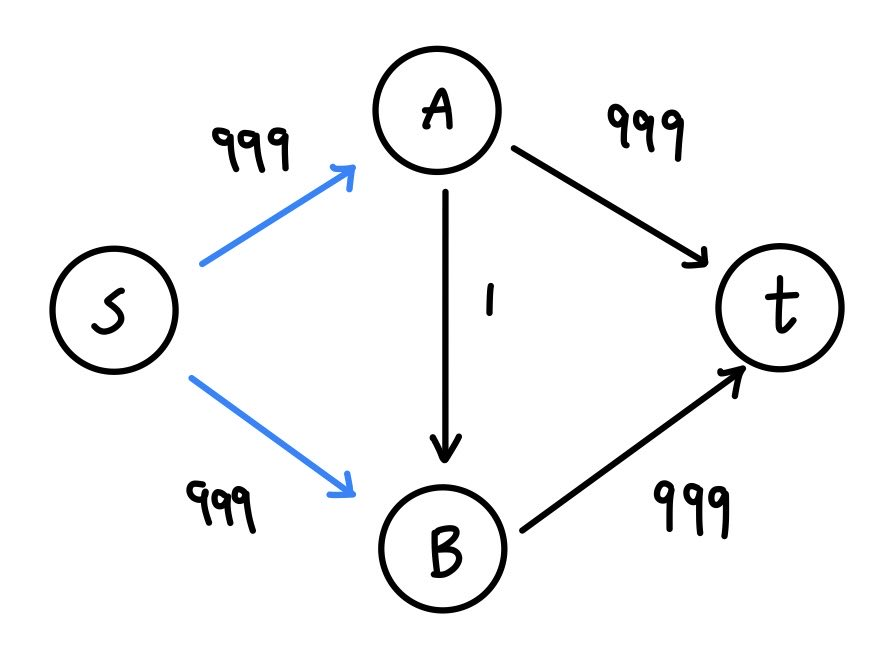

      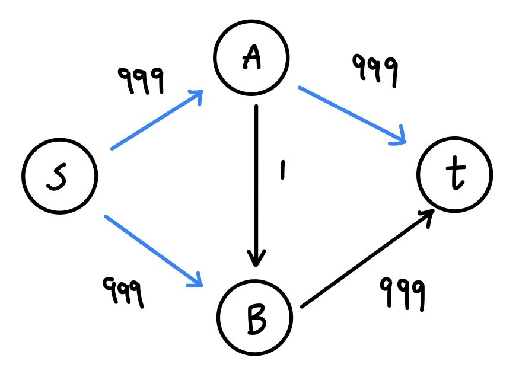

      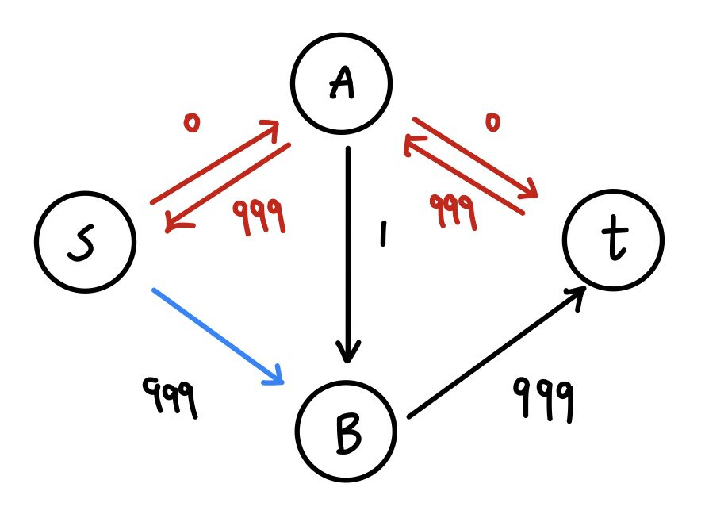

      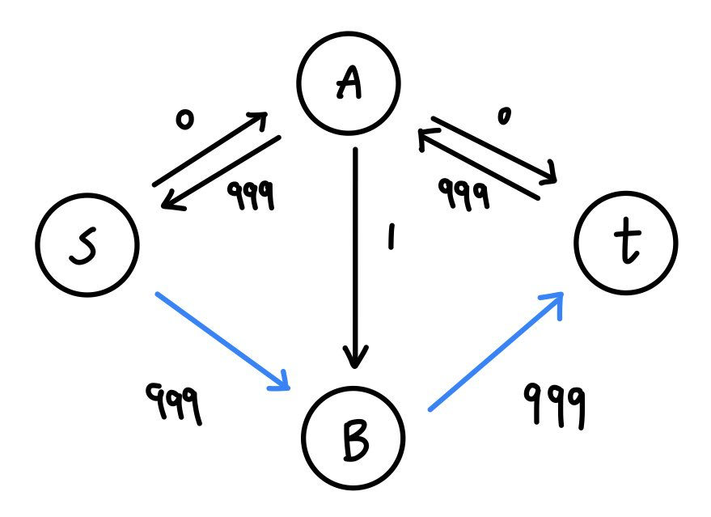

      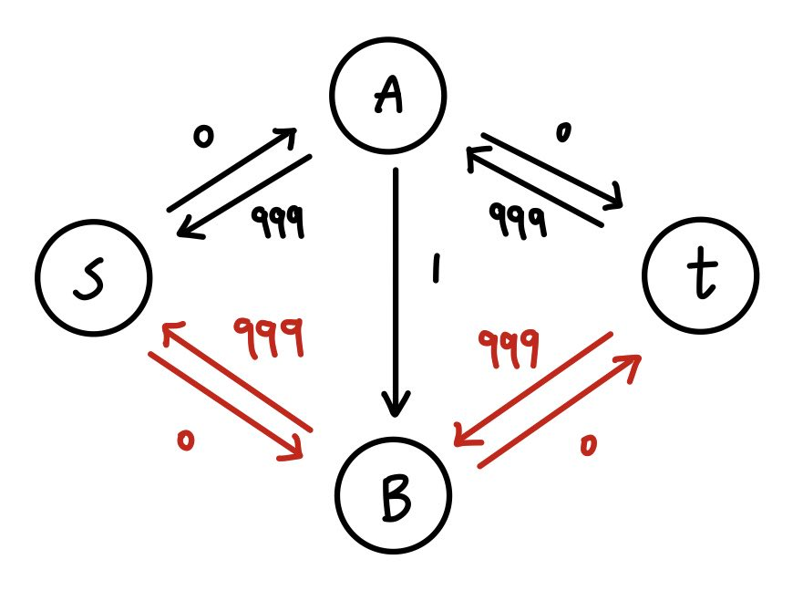

      </details>

  * 除了以上例子之外，還有一種情況在使用 DFS 時會尋找較慢，請看以下例子。
      <details>
      <summary> 另一個例子 </summary>

      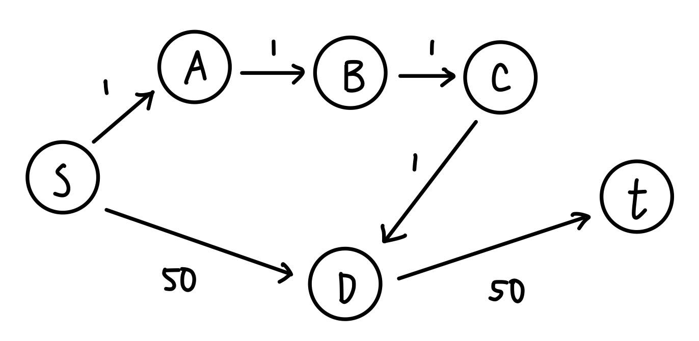

    在此圖中，若用 DFS 的話，會先找到上面那一條路徑，但因為最後最大流只需要底下那條較短的路徑貢獻就好，若是使用 BFS 則會在一開始就找到底下的路徑。

      </details>

* 演算法過程
  * 為所有弧建立反向邊。
  * 不斷使用 BFS 尋找增廣路徑。
    * 若找到增廣路徑，則和 Ford-Fulkerson 算法一樣，將路徑上所有弧減去路徑上的最小剩餘容量 \\(f\\)。
    * 將總流量增加 \\(f\\)，並持續尋找增廣路徑，當找不到增廣路徑時，演算法結束，此時總流量即為這個圖上的最大流。
  * 需要注意的是，在 Ford-Fulkerson 算法中，尋找增廣路徑使用的是 DFS，所以可以邊尋找增廣路徑邊做更改剩餘容量的動作，而這裡使用的是 BFS，所以找增廣路徑的時候，必須同時為每個點紀錄它的上一個點，如此一來，要更改剩餘容量時，即可從匯點利用該紀錄回朔出增廣路徑。
* 時間複雜度及正確性分析
  * 時間複雜度為 \\(O(VE^2)\\)。
  * 以下證明用 BFS 尋找增廣路最多會尋找 \\(O(VE)\\) 次。

    * 需先證明每次尋找的最短增廣路徑長度非遞減。

      * 令 \\(\delta_{f}(s, x)\\) 為增廣路徑擴充前源點到 \\(x\\) 的最短路徑（路徑上剩餘容量皆不為 0），\\(\delta_{f'}(s, x)\\) 為擴充後源點到 \\(x\\) 的最短路徑。

      * 用反證法證明，假設存在某些點，使每次尋找到他們的最短路徑長度遞減，且當中距離原點最近的點為 \\(v\\)，即 \\(\delta_{f'}(s, v) < \delta_{f}(s, v) \……\\) ①，接著我們找到一個點 \\(u\\)，該點為在擴充後的圖上到點 \\(v\\) 的最短路徑中，點 \\(v\\) 的前一個點，即 \\(\delta_{f'}(s, u) + 1 = \delta_{f'}(s, v) \ ...\\) ②，且因為我們選擇的點 \\(u\\) 為擴充後在點 \\(s\\) 的最短路徑上的前一個點，故點 \\(u\\) 並未參與前一次擴充，所以點 \\(u\\) 在擴充後的途中最短路徑並無遞減，即 \\(\delta_{f'}(s, u) \geq \delta_{f}(s, u) \ ...\\) ③，將①②③合併可得 \\(\delta_{f}(s, u) + 1 < \delta_{f}(s, v)\ ...\\) ④。

      * 若邊 \\((u, v) \in G_{f}\\)，根據前面的假設（尋找到的最短路徑遞減）可以推知擴充後 \\(v\\) 的最短路徑比擴充前更短，也就是在擴充前有 \\(\delta_{f}(s, u) + 1 = \delta_{f}(s, v)\\)，但和④矛盾，故邊 \\((u, v) \notin G_{f}\\)。

      * 而因為邊 \\((u, v) \notin G_{f}\\)，且邊 \\((u, v) \in G_{f'}\\)，所以可以推知此次為沿著邊 \\((v, u)\\) 擴充，有 \\(\delta_{f}(s, u) = \delta_{f}(s, v) + 1\\)，但這和④矛盾，故最短路徑遞減的假設錯誤，最短路徑長度非遞減。

    * 接著證明尋找增廣路徑複雜度為 \\(O(VE)\\)

      * 令邊 \\((u, v)\\) 為某次增廣時的關鍵邊(該次增廣剩餘容量最小的一條邊)，則在該次增廣後該邊剩餘容量為 0，從剩餘網路中消失，若要再次出現則須有一次擴充的增廣路徑中含有邊 \\((v, u)\\)。

      * 在關鍵邊為 \\((u, v)\\) 的那一次擴充中，有 \\(\delta_{f}(s, u) + 1 = \delta_{f}(s, v)\\)，而在關鍵邊 \\((v, u)\\) 的那一次擴充中，有 \\(\delta_{f'}(s, u) = \delta_{f'}(s, v) + 1\\)。

        <details>
        <summary> 最短路徑解釋 </summary>

        此範例中的關鍵邊為 \\((2, 3), \quad u = 2, \ \ v = 3 \\)。

        

        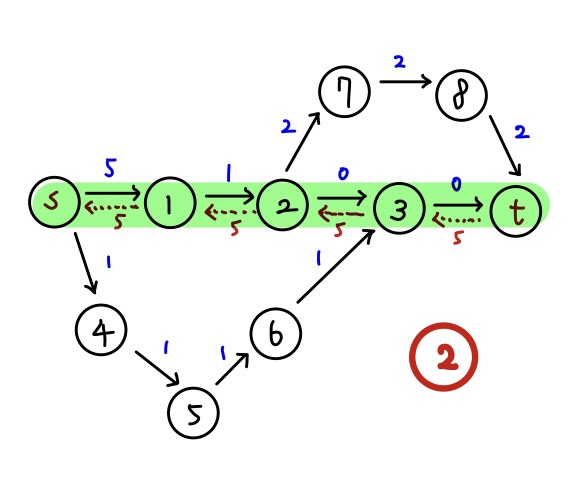

        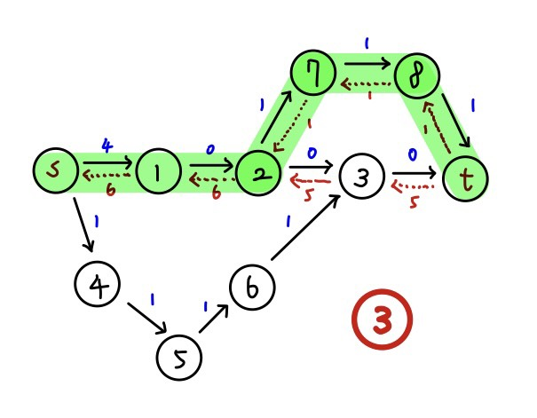

        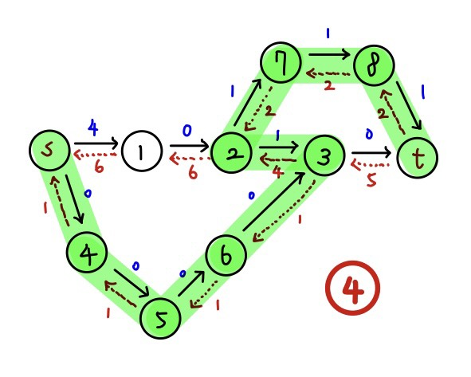

        \\((2, 3)\\) 成為關鍵邊時（圖 1），\\(\delta_{f}(s, 2) = 2, \ \delta_{f}(s, 3) = 3\\)。\\((3, 2)\\) 第一次成為關鍵邊時（圖 1），\\(\delta_{f'}(s, 2) = 5, \ \delta_{f'}(s, 3) = 4\\)。

        </details>

      * 且因為最短增廣路徑長度非遞減，故有 \\(\delta_{f}(s, v) \leq \delta_{f'}(s, v)\\)，將上述兩等式帶入此不等式，\\(\delta_{f}(s, u) + 1 \leq \delta_{f'}(s, u) - 1 \Rightarrow \delta_{f'}(s, u) \geq \delta_{f}(s, u) + 2\\)，可得知邊 \\((u, v)\\) 第二次成為關鍵邊時，最短路徑長度至少為第一次路徑長+2，且最短增廣路長度不超過 \\(|V| - 1\\)，故每條邊成為關鍵邊的次數最多為 \\((|V| - 1) / 2\\)，整張圖上共有 \\(2|E|\\) 條邊（含反向邊），且因為每次找增廣路徑時至少都會有一條關鍵邊，所以最多擴充 \\(|E|(|V| - 1)\\) 次，複雜度為 \\(O(VE)\\)。

  * 尋找一條增廣路徑的複雜度為 \\(O(E)\\)，若每次都尋找最短增廣路，則最多會尋找 \\(O(VE)\\) 次，總複雜度為 \\(O(VE^{2})\\)，而這樣的複雜度和 Ford-Fulkerson 相比，即可忽略掉值域的影響。

  * 和 Ford-Fulkerson 的正確性一樣，根據最大流最小割定理，找不到增廣路徑時，則當前網路上形成最大流。

  <details>
    <summary> Template Code </summary>

      struct EdmondsKarp {
        using ll = long long;
        const ll INF = numeric_limits<ll>::max();
        struct Edge {
          ll to, rev, cap;
        };

        int n, m, s, t;
        vector<vector<Edge>> v;
        vector<bool> vis;
        vector<pair<ll, ll>> pre;
        vector<ll> MinCap;

        EdmondsKarp(int n, int m, int s, int t) : n(n), m(m), s(s), t(t) {
          for (int i = 1; i <= t + 1; i++) {
            v.emplace_back(vector<Edge>{});
            vis.emplace_back(false);
            pre.emplace_back(make_pair(0, 0));
            MinCap.emplace_back(0);
          }
        }

        void add_edge(int a, int b, ll cap) {
          v[a].emplace_back(Edge{b, (int)v[b].size(), cap});
          v[b].emplace_back(Edge{a, (int)v[a].size() - 1, 0});
        }

        bool bfs() {
          int i, j;
          for (i = 0; i <= n; i++)
            MinCap[i] = 0;
          MinCap[s] = INF;
          queue<ll> q;
          q.push(s);

          while (!q.empty()) {
            int now = q.front();
            q.pop();
            for (i = 0; i < (int)v[now].size(); i++) {
              int to = v[now][i].to;
              ll cap = v[now][i].cap;
              if (!MinCap[to] && cap > 0) {
                pre[to] = make_pair(now, i);
                MinCap[to] = min(MinCap[now], cap);
                q.push(to);
              }
            }
            if (MinCap[t])
              break;
          }
          return MinCap[t];
        }
        ll getflow() {
          int now = t;
          while (now != s) {
            ll last = pre[now].first;
            int index = pre[now].second;
            v[last][index].cap -= MinCap[t];
            v[now][v[last][index].rev].cap += MinCap[t];
            now = last;
          }
          return MinCap[t];
        }
        ll flow() {
          int i, j;
          ll ans = 0;
          while (bfs()) {
            ans += getflow();
          }
          return ans;
        }
      };
  </details>

## 題目實作

> [CSES 1694](https://cses.fi/problemset/task/1694)
>
> 有 \\(N\\) 台電腦和 \\(M\\) 個連結，每個連結 \\((a, b, c)\\) 代表 \\(a\\) 電腦單向以速度 \\(c\\) 傳輸資料到 \\(b\\) 電腦，電腦 \\(1\\) 是伺服器，電腦 \\(N\\) 是使用者，請求出使用者最大能從伺服器下載資料的總速度。
>
> * \\(N \leq 500 , \quad M \leq 1000\\)

* 將每台電腦視為點，連結和速度分別視為弧和其容量，建完圖後將源點設為 \\(1\\)，匯點設為 \\(N\\)，最大流即為答案。

    ``` CPP
      int main(){
        int n, m, a, b, c, i;
        while(cin >> n >> m){
          EdmondsKarp ek(n, m, 1, n);
          for(i = 1; i <= m; i ++){
              cin >> a >> b >> c;
              ek.add_edge(a, b, c);
          }
          cout << ek.flow() << '\n';
        }
      }
    ```

  > 有一座城市有 \\(N\\) 棟建築物及 \\(M\\) 個道路，每條道路為雙向連接兩棟建築物，且有其長度，請求出最少需要關閉幾條道路，才能使建築物 \\(1\\) 和建築物 \\(N\\) 之間無法往來。
  >
  > * \\(2 \leq N \leq 500, \quad M \leq 1000\\)

* 此問題等同於求出圖上的最小割，因有最大流等於最小割的性質，將每條邊的容量設為 \\(1\\)，最後求出的最大流即為答案。

    ``` CPP
      int main(){
        int n, m, a, b, i;
        while(cin >> n >> m){
          EdmondsKarp ek(n, m, 1, n);
          for(i = 1; i <= m; i ++){
            cin >> a >> b;
            ek.add_edge(a, b, 1);
          }
          cout << ek.flow() << '\n';
        }
      }
    ```

> 給定 \\(N\\) 個男生和 \\(M\\) 個女生，以及 \\(K\\) 個關係 \\((u, v)\\)，每個關係代表 \\(u\\) 和 \\(v\\) 互相喜歡，且不會出現同性戀的情形，請求出最多的情侶關係組數。
>
> * \\(N, M, K \leq 500 \\)

* 將男生當作 N 個節點，女生當作 M 個節點，分別放在左右兩側，接著從源點對所有男生節點連出一條容量為 1 的邊，再將所有男生和女生有互相喜歡的配對之間連一條容量為 1 的邊，最後再將所有女生節點對匯點連出一條容量為 1 的邊，跑一次最大流算法即為所求。

  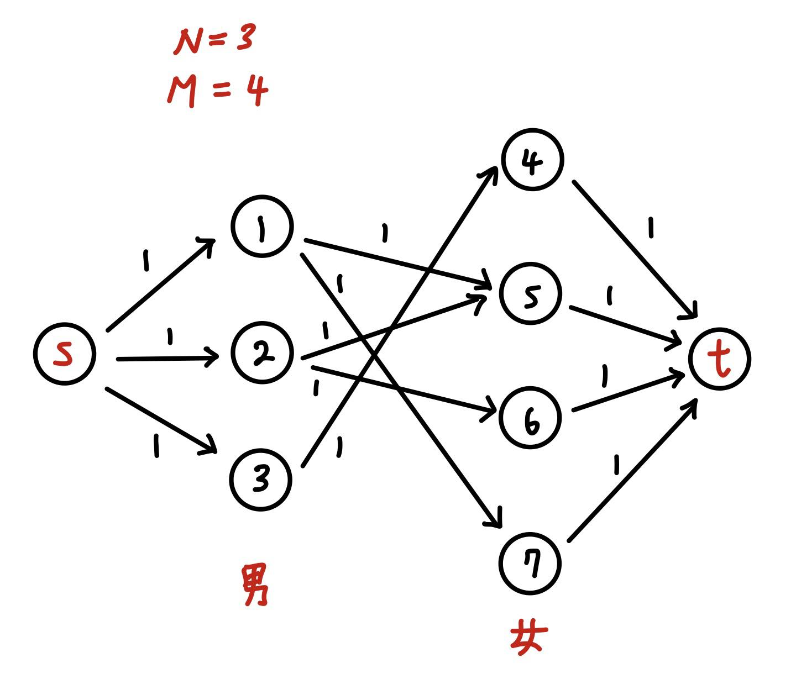

* 原點到男生節點容量為 1 保證了每個男生最多選擇一個女生，而每一個喜歡的關係都連邊代表有很多種選擇，而女生節點到匯點則代表最多被選擇一次。

    ``` CPP
      int main() {
        int n, m, k, a, b, i;
        while(cin >> n >> m >> k){
          int s = n + m + 1;
          int t = n + m + 2;
          EdmondsKarp ek(n, m, s, t);
          for(i = 1; i <= n; i ++) ek.add_edge(s, i, 1);
          for(i = n + 1; i <= n + m; i ++) ek.add_edge(i, t, 1);
          for(i = 1; i <= k; i ++){
            cin >> a >> b;
            ek.add_edge(a, n + b, 1);
          }
          cout << ek.flow() << '\n';
        }
      }
    ```

## References

> * [網路流 - 維基百科](https://zh.wikipedia.org/zh-tw/%E7%BD%91%E7%BB%9C%E6%B5%81)
> * [网络流的基本概念 - 算法竞赛教程](https://www.dotcpp.com/course/1070) (推薦閱讀，此教學文章的內容及證明較為詳細)
> * [最大流最小割定理 - 演算法的分析與證明](https://tmt514.github.io/algorithm-analysis/max-flow/max-flow-min-cut-theorem.html)
> * [Ford-Fulkerson 最大流求解方法](https://www.desgard.com/algo/docs/part4/ch03/2-ford-fulkerson/)
> * [Edmonds-Karp 最大流算法详解](https://www.desgard.com/algo/docs/part4/ch03/4-Edmonds-karp/)
