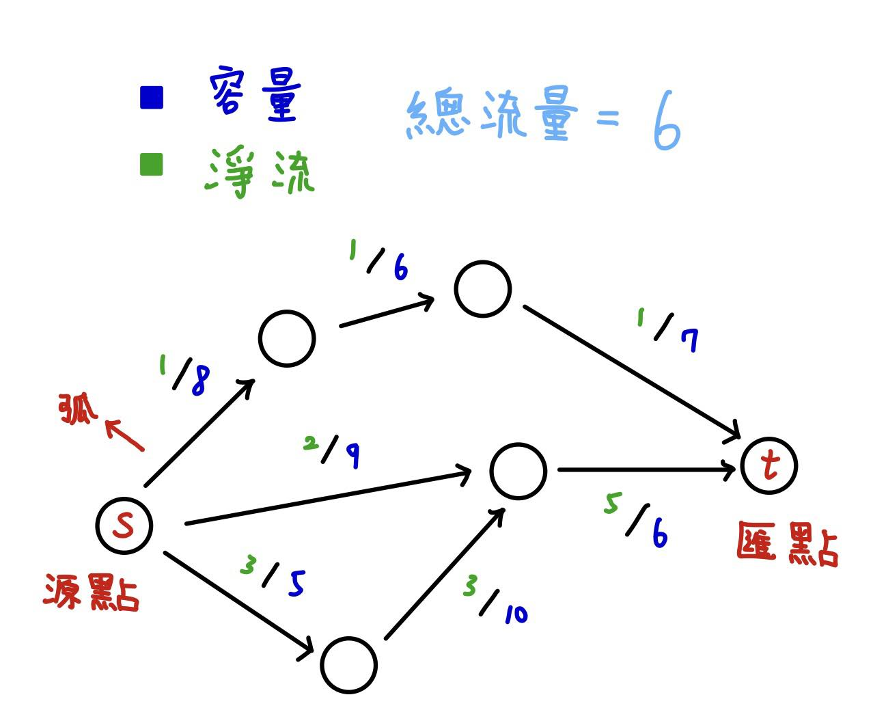
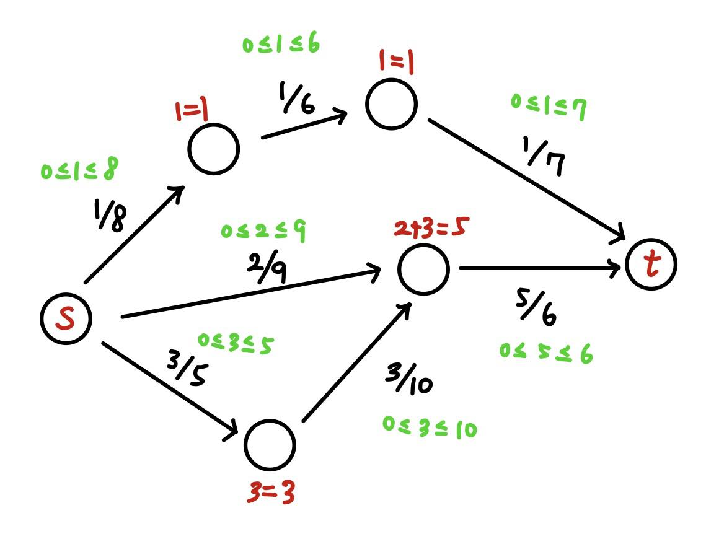
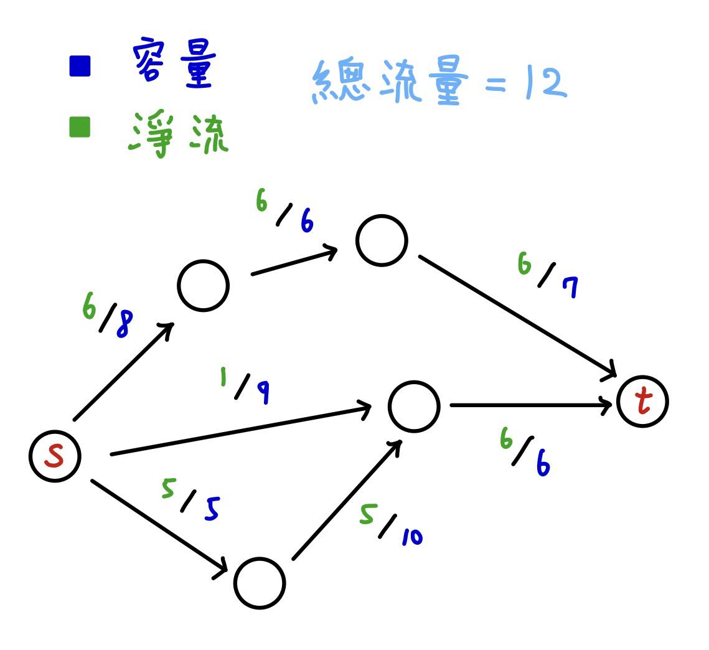
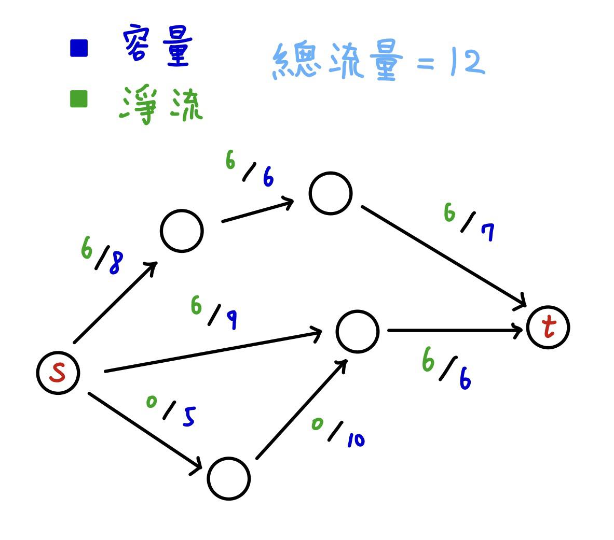
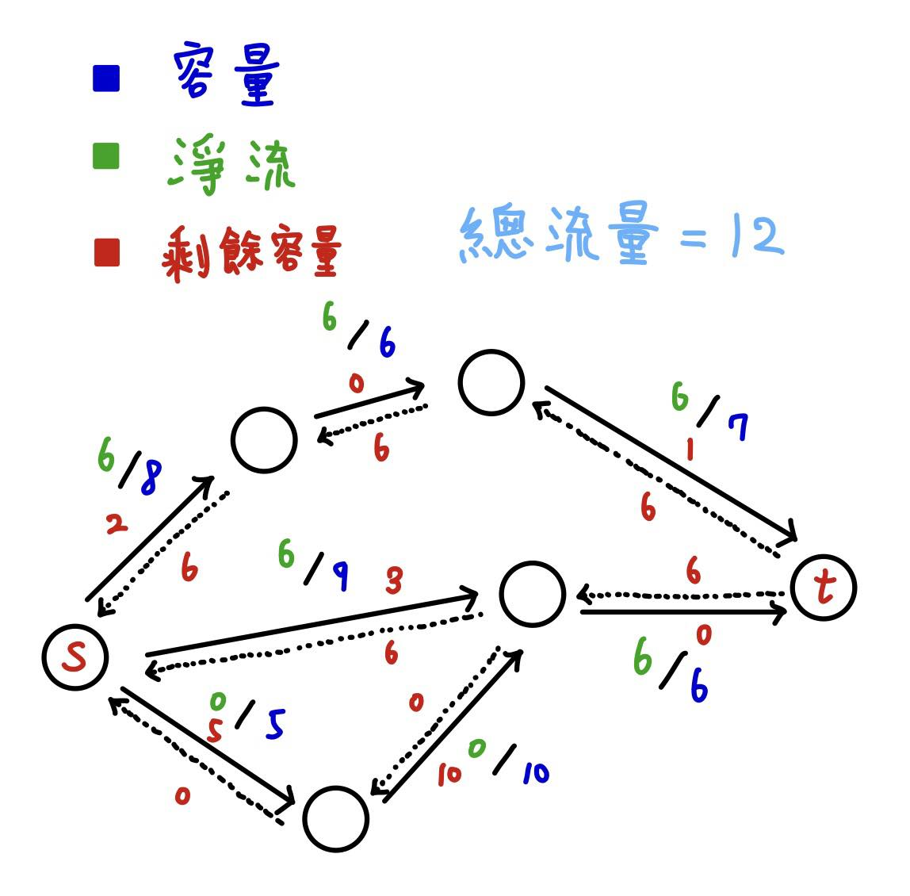
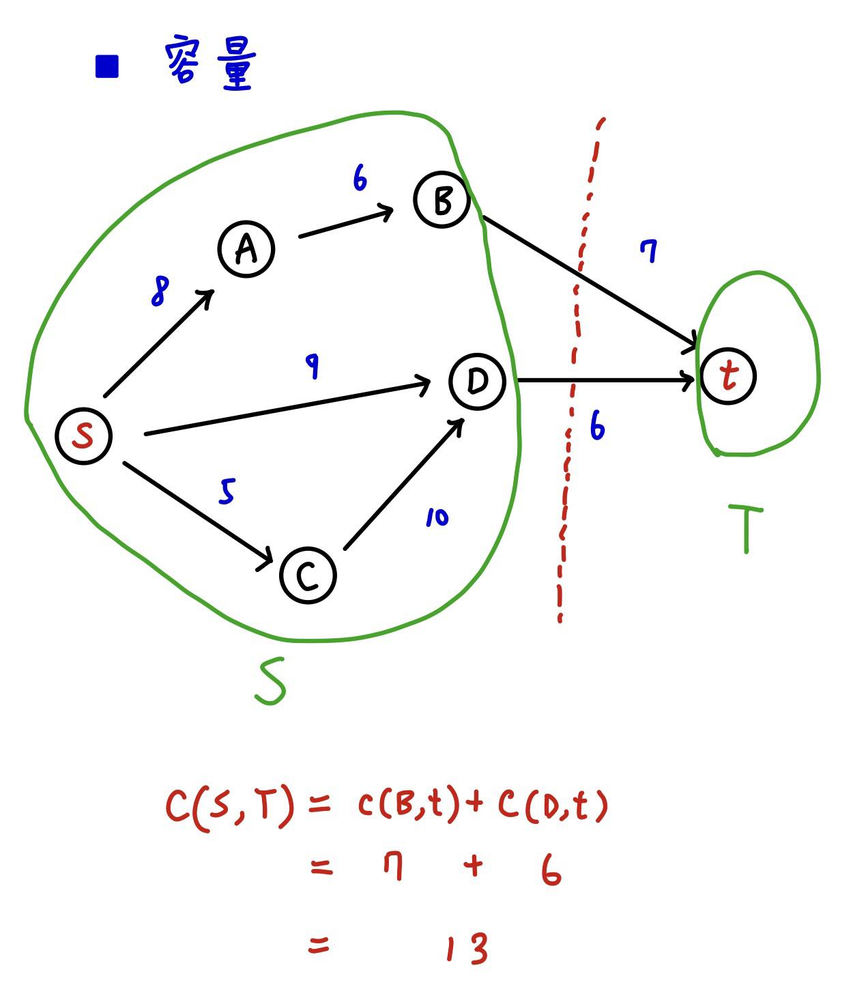
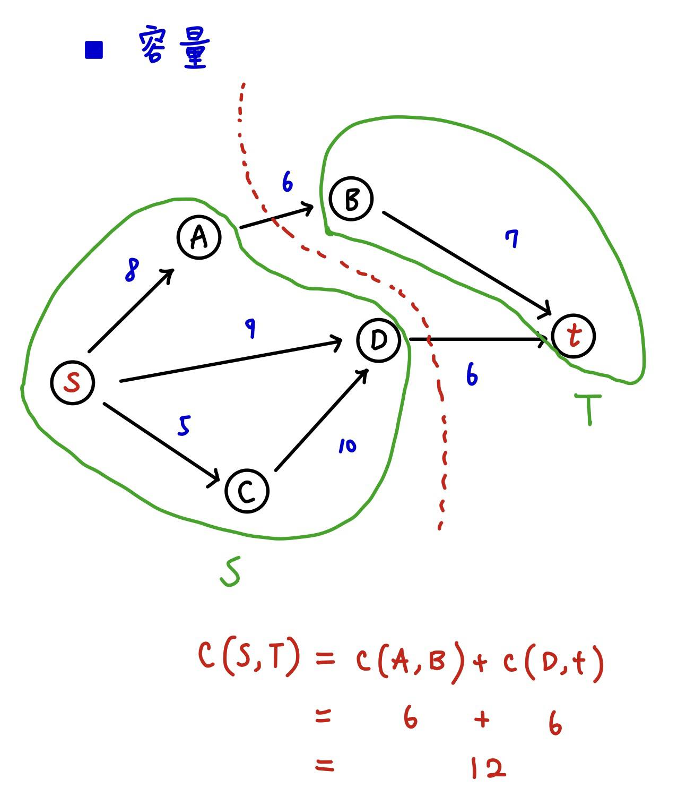

## 網路流及用語介紹

* 什麼是網路流?
  * 以圖論的角度來說，網路流是一張有向圖，每一條邊都有一個容量代表可流過的上限值，可以將邊想像成水管，流過的值即為水的即時流量。
  * 整張圖會有一個源點以及匯點，源點能有無限制的水量供應，並且所有點滿足水流入量等於水流出量。
  * 許多和分配、運輸量、最小花費的題目都可以被轉換成網路流問題，而看出它們可被轉換、以及轉換的過程往往是網路流問題最困難的部分。
* 網路流用語介紹
  * 源點(Source)：擁有無限水量可供應的點，記為 \\(s\\)。
  * 匯點(Sink)：可接收無限水量的點，記為 \\(t\\)。
  * 弧(Arc)：網路流圖上的一條帶權邊 \\((u, v) \in E\\)
  * 淨流：通過一條弧 \\((u, v)\\) 的流量(淨流)，記為 \\(f(u, v)\\)。
  * 容量(Capacity)：能通過一條弧 \\((u, v)\\) 的最大淨流，同時也是邊 \\((u, v)\\) 的權重，記為 \\(c(u, v)\\)。
      

      
 範例圖片 

      

      

  * 網路流圖：
    * 洽有一個源點。
    * 洽有一個匯點。
    * 為一個點和邊的集合，可記為 \\(G(V,E)\\)。
    * \\(\forall u, v \in G(V,E), c(u, v) \geq 0\\)
  * 網路流(Network flow)：一個流量集合 \\(F=\{f(u, v)\}\\)。
  * 可行流：滿足以下條件的網路流稱為可行流
    * 容量限制：\\(0 \leq f(u, v) \leq c(u, v)\\)。
    * 流量守恆：除了源點和匯點，其他點都必須滿足流入量=流出量。
      

      
 可行流範例圖片解釋 

      

      

  * 最大流：所有可行流當中流量最大的即為最大流，可能存在多種。
      

      
 最大流範例 

      
      

      

  * 剩餘容量(Residual Capacity)：記為 \\(c_{f}(u, v) = c(u, v) - f(u, v)\\)
  
  * 剩餘網路(Residual Network)：為由所有弧、其反向邊、不存在的邊，以及所有原本的點所組成的網路流圖，以定義來看的話，有以下關係。
  
    * \\(c_f(u, v) = c(u, v) - f(u, v)\ \ \ u, v \in G\\ \\)
    * \\(c_f(v, u) = f(u, v) \qquad \qquad \quad u, v \in G\\ \\)
    * \\(c_f = 0 \qquad \qquad \qquad \ \ otherwise\\)
    

    
 剩餘網路範例(省略不存在的邊) 

    

    

    接下來的兩個演算法都會用到剩餘網路，也就是一開始都會建立反向邊。

  * 割(Cut)：
    * 割將網路流圖切分成兩集合 \\(S, T\\)，其中 \\(S \cap T = \emptyset\\) 且 \\(S \cup T = G\\)，其中 \\(s \in S\\)，\\(t \in T\\)。
    * 割的容量為所有在集合 \\(S\\) 中的點連向集合 \\(T\\) 中的點的弧容量總和。\\(c(S, T) = \sum_{u \in S} \sum_{v \in T} c(u, v)\\)
    

      
 割範例 

      

      

  * 最小割(Minimum cut)：所有割裡面容量最小的為最小割。
    

      
 最小割範例 

      

      

## [最大流最小割定理(Max Flow Min Cut Theorem)](https://tmt514.github.io/algorithm-analysis/max-flow/max-flow-min-cut-theorem.html)

  此處證明可先閱讀下一篇 Ford-Fulkerson 的算法過程，之後再看此證明會比較容易理解。

* 首先，對於一個網路 \\(G\\) 來說，有以下三項條件等價。

  1.\\(f\\) 是一個 \\(s-t\\) 最大流。

  2.對於流量為 \\(f\\) 的剩餘網路 \\(G_f\\) 中沒有 \\(s\\) 到 \\(t\\) 的增廣路徑。

  3.存在一最小割 \\((S, T)\\)，其容量等於 \\(f\\)，亦即\\( |f|=|c(S, T)| \\)。

* 接下來將會證明這三項條件會同時正確。
  * 條件(1) \\(\implies\\) 條件(2)：
    * 以反證法證明，假設 (1) 正確且 (2) 不正確，代表 \\(s,t\\)之間存在增廣路徑，那麼就可以透過其增加更多流量，和條件 (1) 矛盾，故成立。

  * 條件(2) \\(\implies\\) 條件(3)：
    * 設集合 \\(S\\) 為剩餘網路上 \\(s\\) 能到達的點集合，以及集合 \\(T=V-S\\)，\\((S, T)\\) 為 \\(s-t\\) 割，因為已無增廣路徑，所以 \\(S\\) 中的點流到 \\(T\\) 中的點的邊全都達到飽和狀態，且 \\(T\\) 中的點流到 \\(S\\) 中的點的邊流量全都為 \\(0\\)，\\(\forall x \in S, \ \forall y \in T \\)，\\(f(x, y) = c(x, y) , \ \ f(y, x) = 0 \\)，故 \\( \sum_{x \in S,\ y \in T} \ f(x,\ y)= \sum_{x \in S, \ y \in T} \ c(x, y)= |c(S, T)| = |f| \\)

    

    此圖已無增廣路徑，圖中的紅色邊為飽和的弧，以這三條弧形成的割即為此圖上的最小割，割的容量 \\(c(S, T)\\) 為總流量 \\(f\\)。

  * 條件(3) \\(\implies\\) 條件(1)：
    * 對於一個合法流 \\(f'\\) 來說，其流經的所有邊流量都不超過其容量，故 \\(|f'| \leq c(S, T)\\)，又因 \\(c(S, T) = |f|\\)，故 \\(|f|\\) 為 \\(s-t\\) 最大流。

* 以上證明得出兩個重要結論。
  1. 最大流等於最小割（條件 13）。
  2. 當剩餘網路沒有增廣路徑時，即為最大流（條件 12）。

## 網路流題目範例

* 網路流的題目舉例
  * 給定 \\(N\\) 個男生和 \\(M\\) 個女生，以及 \\(K\\) 個關係 \\((u, v)\\)，每個關係代表 \\(u\\) 和 \\(v\\) 互相喜歡，且不會出現同性戀的情形，請求出最多的情侶關係組數。
  * 有一座城市有 \\(N\\) 棟建築物及 \\(M\\) 個道路，每條道路為雙向連接兩棟建築物，且有其長度，請求出最少需要關閉幾條道路，才能使建築物 \\(1\\) 和建築物 \\(N\\) 之間無法往來。

* 大部分 flow 的題目都會使用模板求解，包括以上這些題目，後面的章節會再介紹算法及提供模板。
