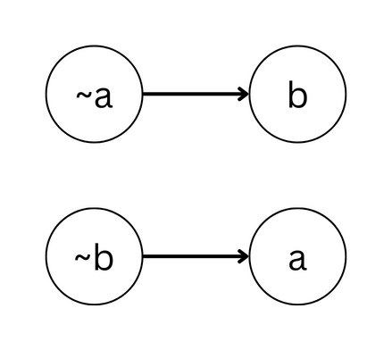
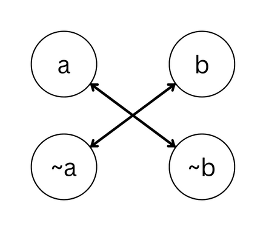

## 2-SAT problem

### Definition 
SAT(Boolean satisfiability problem)中文為滿足性問題，給定一個布林運算式，想辦法assign給每個布林變數一個值(True of False)，使得該運算式為True。

而K-SAT問題為：規定運算式的所有子句，每個子句最多只能包含K個變數

舉例來說，一個2-SAT問題如下: 

\\( (X_1 \lor X_2) \land (\neg X_1 \lor \neg X_3) \land (\neg X_2 \lor X_3) \land (X_3 \lor \neg X_4) \land (\neg X_2 \lor \neg X_3)\\)

這個運算式共有5個子句，而每個子句都各自只包含兩個變數 \
一組可行的解為：
\\( 
	X_1 = True, \
	X_2 = False, \
	X_3 = False, \
	X_4 = True 
\\)


對於K > 2，K-SAT問題已被證明為NP-Complete。
而對於2-SAT問題則存在多項式時間的算法

### Transfer 2-SAT to Graph Problem

對於一個2-SAT問題，根據每個clause的依賴性，可以轉為圖論問題，

舉例來說，考慮clause: \\( a \lor b\\)
若要讓此clause為真，則 \
若\\(a = false\\)，\\(b \\)必為\\( true \\) \
若\\(b = false\\)，\\(a \\)必為\\( true \\) \

所以轉成圖論可以這樣連：


再舉個例子： \\( a \oplus b\\)
若要此clause為真，則 \
若\\(a = false\\)，\\(b \\)必為\\( true \\) \
若\\(b = false\\)，\\(a \\)必為\\( true \\) \
若\\(a = true\\)，\\(b \\)必為\\( false \\) \
若\\(b = true\\)，\\(a \\)必為\\( false \\) \


### Aspvall, Plass & Tarjan Algorithm

成功的將2-SAT轉成圖之後，要怎麼找出一組可行的解呢？
或著，我們可以先想一下，在什麼情況下2-SAT問題可能無解？

我們可以發現，一組2-SAT問題如果有解,若且唯若不存在布林變數\\( X\\), such that \\(X \\)跟\\( \neg X \\)處於同一SCC中。

<details><summary>Proof</summary>

假設在某個強連通分量中，存在一個變數$v$及其否定$¬v$。這表示從節點$v$可以到達節點$¬v$，同時也表示從節點$¬v$可以到達節點$v$。
而這是不可能的，如果要滿足這個條件，必須使變數$v$同時為True與False。
    
</details>

於是我們就得到了一組\\( O(n) \\)檢查2-SAT是不是satisfiable的演算法。跑完Tarjan/Kosaraju找出所有SCC之後，對於所有變數\\(X \\)，檢查\\(X \\)跟\\( \neg X \\)是不是在同一個SCC中就好。

而一組2-SAT問題如果有解，一樣能用\\( O(n) \\)的時間找出一組可行解。

先對所有找到的SCC縮點，接著依照拓樸排序的順序assign值給SCC內的所有點，若\\( X \\)是\\( true\\)，則\\( \neg X\\)自動assign \\( false \\)。當所有Variable都被assign了一個值，就是一組可行解。

<details><summary>Proof</summary>

假設有一個沒有矛盾的強連通分量，我們將一變數$v$設為True，則滿足所有$(v \lor \dots)$子句。
同樣的，將$¬v$設為False，會滿足所有$(¬v \lor \dots)$子句。

由於已經確定了對於所有變數$v$，都不存在必須使$v$同時為True與Fale的情況，我們可以不斷的assign值給變數，直到該SCC內的所有子句滿足為止。

由於縮點後會是一個有向無環圖，代表我們可以依照拓樸排序assign值給各個SCC，而不使整張圖矛盾。
    
</details>

### Template Code

```cpp

struct SAT { // 0-base
  int low[N], depth[N], SCC[N], n, Time, SCCID;
  bool inStack[N], istrue[N];
  stack<int> stk;
  vector<int> G[N], SCC_group[N];
  void init(int _n) {
    n = _n; // assert(n * 2 <= N);
    for (int i = 0; i < n + n; ++i) G[i].clear();
  }
  void add_edge(int a, int b) { G[a].pb(b); }
  int rv(int a) {
    if (a >= n) return a - n;
    return a + n;
  }
  void add_clause(int a, int b) {
    add_edge(rv(a), b), add_edge(rv(b), a);
  }
  void DFS(int u) {
    depth[u] = low[u] = ++Time;
    inStack[u] = 1, stk.push(u);
    for (int v : G[u])
      if (!depth[v])
        DFS(v), low[u] = min(low[v], low[u]);
      else if (inStack[v] && depth[v] < depth[u])
        low[u] = min(low[u], depth[v]);
    if (low[u] == depth[u]) {
      int tmp;
      do {
        tmp = stk.top(), stk.pop();
        inStack[tmp] = 0, SCC[tmp] = SCCID;
      } while (tmp != u);
      ++SCCID;
    }
  }
  bool solve() {
    Time = SCCID = 0;
    for (int i = 0; i < n + n; ++i)
      SCC_group[i].clear(), low[i] = depth[i] = SCC[i] = 0;
    for (int i = 0; i < n + n; ++i)
      if (!depth[i]) DFS(i);
    for (int i = 0; i < n + n; ++i) SCC_group[SCC[i]].pb(i);
    for (int i = 0; i < n; ++i) {
      if (SCC[i] == SCC[i + n]) return false;
      istrue[i] = SCC[i] < SCC[i + n];
      istrue[i + n] = !istrue[i];
    }
    return true;
  }
};

```

## Problems
> [CSES - Giant Pizza](https://cses.fi/problemset/task/1684)
> 
> 詳見原題

<details><summary>Solution</summary>

可看出此題為2-SAT，其中每個人的願望都為以下形式\\( A \lor B \\), \\( A \\)可能為\\( a, \neg a \\), \\( B \\)可能為\\( b, \neg b \\)。

先檢查完所有點與它的negation不在同一SCC中之後，需要構造出一組解。可以利用\\( X \\)與\\( \neg X \\)的對稱性，在拓樸排序的過程中順便assign值給變數。

</details>
    
> [hdu 3062 Party](http://acm.hdu.edu.cn/showproblem.php?pid=3062)
>
> 有\\(N\\)對夫妻被邀請到一個聚會，每對夫妻只有一位可以出席。在\\(2N\\)個人中，有些人之間有矛盾，矛盾關係共有\\( M\\)組，有矛盾的人無法同時出現在聚會上，問聚會上有沒有可能出現\\(N\\)個人？
>
> \\(1 \leq N \leq 10^3,\ 1 \leq M \leq 10^6\\)
    
<details><summary>Solution</summary>

不難看出這是一個2-SAT的問題，只需要把一對夫妻視為一對\\( (X, \neg X) \\)，而每個矛盾關係都是\\( \oplus \\)。
    
</details>