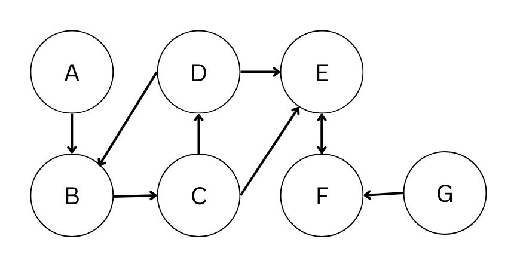
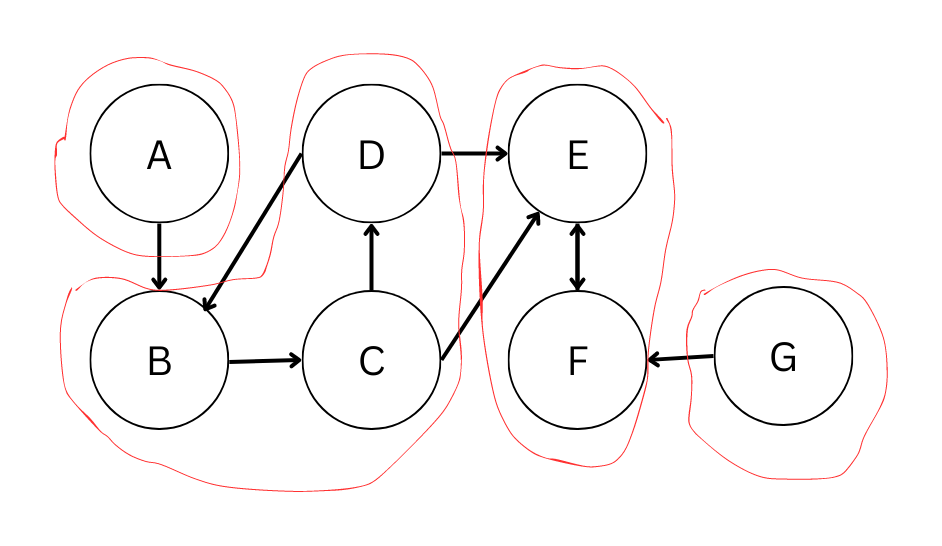
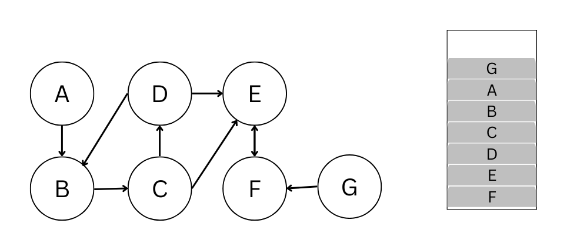
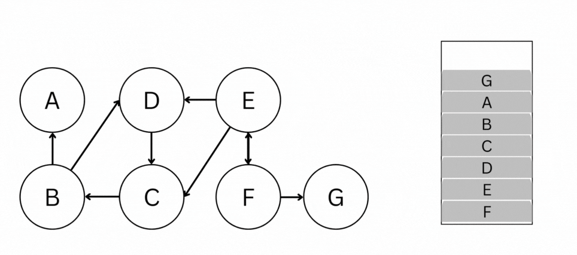
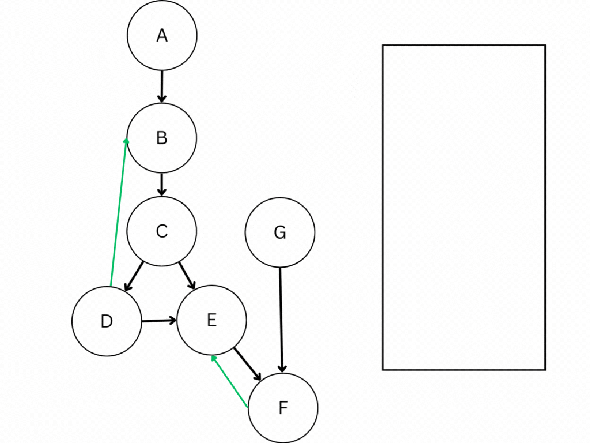

# Strongly Connected Component (強連通分量)

## Introduction

### Definition

在一張有向圖\\(G \\)中，假使兩個節點\\(u \\)跟\\(v \\)之前同時存在路徑\\(path(u,v) \\)和\\(path(v,u) \\)，則我們說 \\(u \\)跟\\(v \\)兩者強連通(strongly connected)。



以上圖為例，\\(B, C, depth \\)為 Strongly Connected，\\(E, F \\)也為 Strongly Connected，但\\(A, B \\)彼此不為 Strongly Connected

### Strongly Connected Component(強連通分量)

根據以上定義(強連通)，我們可以得到強連通分量(Strongly Connected Component, 以下簡稱 SCC)的正式定義：

對於一個有向圖\\(G \\)的強連通分量\\(C \\):
\\(C \\)是\\(G \\)的一個*極大子圖*，使得對於所有\\(C \\)內的節點，兩者互為強連通(\\(\forall u,v \in C, \exists path(u,v),path(v,u) \\))



以同一張圖來說，\\(B, C, depth \\)形成一 SCC，\\(E, F \\)形成一 SCC，故圖中共有\\(4 \\)個 SCC。

#### Property

1. 若\\(u \\)跟\\(v \\)屬於強連通分量\\(C \\)，那麼在\\(path(u,v) \\)和\\(path(v,u) \\)上的所有點，都屬於強連通分量\\(C \\)

設有一點\\(w \\)處於\\(path(u,v) \\)上，則可從點\\(w \\)延路徑到達點\\(v \\)，同時，因為存在\\(path(v,u) \\)，可從點\\(v \\)走到點\\(u \\)再延著\\(path(u,v) \\)到達點\\(w \\)，故點\\(w,v \\)互為強連通（點\\(u,w \\)亦然）。因此，點\\(u,w,v \\)屬於同一強連通分量。

2. 若\\(u \\)跟\\(v \\)互為強連通，且\\(v \\)跟\\(w \\)也互為強連通，則\\(u \\)跟\\(w \\)也相互強連通，且\\( u, v, w \\)屬於同一強連通分量中

節點\\(v \\)跟節點\\(u,w \\)都互為強連通，則可透過\\(path(u,v)+path(v, w)\\)從點\\(u \\)走到點\\(w \\)，反之亦然。因此\\(u \\)跟\\(w \\)為相互強連通，故\\(u,v,w \\)屬於同一強連通分量中。

3. 有向圖\\(G \\)的所有強連通分量兩兩不會有交集

假設存在一點\\(w \\)為 SCC \\(C_1 \\)與\\(C_2 \\)的交點，則根據性質 2. \\(C_1 \\)的所有點應與\\(C_2 \\)的所有點互為強連通(經過\\(w \\))，\\(C_1 \\)與\\(C_2 \\)應屬於同一強連通分量，故交點\\(w \\)必不存在。

4. 倘若將每個 SCC 縮成一個點，產生的新圖為有向無環

假設縮點後產生的新圖\\(G' \\)存在環，則環上的點必為互相連通，應屬於同一個 SCC 中，經縮點操作後應合併為一個點，故圖\\G' \\)上不存在環。

#### Why SCC?

為什麼找出強連通分量那麼重要呢？

因為當我們求出有向圖\\( G\\)的所有 SCC 之後，我們就可以藉由縮點操作，將每個 SCC 縮成一個點。根據性質 4.，縮點操作後產生的圖\\( G' \\)會是一張有向無環圖(DAG)。\
根據 DAG 的一些良好性質，我們就可以利用拓樸排序或是 DP 等技巧，來達成時間更為優異的解題方法。

接下來，會介紹兩種常用的 SCC 演算法，並介紹找出所有強連通分量後，如何進行縮點操作，最後演練幾組例題，示範如何使用 Strongly Connected Component 的觀念來解題。

## Kosaraju's Algorithm

藉由兩次 DFS 求出所有 SCC，好處是 code 比較好寫，但常數較大。

### Detail process & Template code

先對原圖跑一次 DFS，用後序走訪的方式把點丟進 stack 裡。再把 stack 裡的點一個個拿出來在反圖上 DFS。stack 是用來維護每個點的 DFS 完成時間，在 stack 中維護完成時間從大到小。因此，此演算法的核心為:先做一次 DFS 並紀錄每個點的完成時間，接著每次取完成時間最晚的點出來在反圖上做 DFS，能走到的所有點就處於同一個 SCC。

```cpp
class SCC {
private:
  int n, scc_num;
  vector<vector<int>> G, invG;
  stack<int> stk;
  vector<int> SCC;
  vector<bool> vis;
  void DFS1(int u) {
    if (vis[u]) return;
    vis[u] = 1;
    for (int v : G[u]) DFS1(v);
    stk.push(u);
  }
  void DFS2(int u) {
    if (vis[u]) return;
    SCC[u] = scc_num;
    vis[u] = 1;
    for (int v : invG[u]) DFS2(v);
  }
public:
  inline void init( int n_ ) {
    n = n_, scc_num = 0;
    G.clear(); G.resize(n);
    invG.clear(); invG.resize(n);
    vis.assign(n,0);
    SCC.assign(n,-1);
  }
  inline void add_edge(int u, int v) {
    G[u].push_back(v);
    invG[v].push_back(u);
  }
  void solve() {
    for (int i = 0 ; i < n ; i++ )
      if (!vis[i]) DFS1(i);
    vis.assign(n,0);
    while(!stk.empty()) {
  int u = stk.top();
  stk.pop();
      if(!vis[u]) {
        DFS2(u);scc_num++;
      }
    }
  }
  inline int get_id(int x) { return SCC[x]; }
  inline int count() { return scc_num; }
} scc;

```

假設在這張圖上，從點\\(A \\)開始 DFS，DFS1 結束後會長這樣:


DFS2 的過程如下:


### Time complexity and the Correctness

Kosaraju Algo 分成 3 個部份:

1. 原圖 DFS 紀錄完成時間（\\( O(V+E) \\)）
2. 建立反圖\\( G^T \\)（\\( O(V+E) \\)(可以在建立原圖的時候順便做)
3. 反圖上 DFS（\\( O(V+E) \\)）
故總時間複雜度也是\\(O(V+E))

而正確性跟以下性質有關：

性質：

1. \\( G^T\\)跟\\( G \\)的 SCC 集合相同

<details><summary>Proof</summary>

若在圖\\( G \\)中存在路徑\\( u \to v \\)，則在反圖\\( G^T \\)中存在路徑\\( v \to u \\)。同樣的，若在圖\\( G \\)中存在路徑\\( v \to u \\)，則在反圖\\( G^T \\)中存在路徑\\( u \to v \\)。因此，對於點\\(u \\)跟點\\(v \\)，無論在\\(G \\)還是\\(G^T \\)中，都屬於同一個 SCC。

</details>

2. 設點\\( u \\)為 SCC \\( C_u \\)中完成時間最晚的，點\\( v \\)為 SCC \\( C_v \\)中完成時間最晚的，且能從\\( C_u \\)走到\\( C_v \\)，則點\\( u \\)的完成時間一定比\\( v \\)還晚。

<details><summary>Proof</summary>

可參考 [Kosaraju's Proof](https://www.personal.kent.edu/~rmuhamma/Algorithms/MyAlgorithms/GraphAlgor/strongComponent.htm)

</details>

3. 在所有 SCC 中，若\\( C_u \\)的完成時間最晚，則不存在其他\\( C_v \\) s.t \\( C_v \\)能走到\\( C_u\\)。

<details><summary>Proof</summary>

從性質 2 可知

</details>

4. 每次挑完成時間最晚的點出來在反圖上 DFS 可以得到一組 SCC。

重複 4 直到所有點都打上 SCC 編號，可得到圖\\(G \\)上的所有 SCC。

## Tarjan's Algorithm for SCC

圖論大師 Tarjan 發明的求 SCC 算法，基於 DFS Tree 跟定義好的\\( low(x) \\) 跟 \\( depth(x) \\) 函數 \
(此算法跟求 AP & Bridge 的 Tarjan 算法非常相似，有興趣的話可以參考[這篇](../introduction_to_AP_bridge.md))

定義：\
\\( depth(u) \\)為 DFS 造訪順序的時間戳記 \
\\( low(u) \\)為所有點\\( u \\)能夠走到的點中\\( depth(x) \\)的最小值

### Detail process & Template code

如 GIF 所示，在 DFS 的過程中，將點丟進 stack 中，同時更新每個點的\\( low \\)跟\\( depth \\)值，找出所有的 SCC


Tarjan Algo code:

```cpp
struct SCC {
int low[N], depth[N], SCC[N], n, Time, SCCID;
bool inStack[N]; 
stack<int> stk;
vector<int> G[N];
void add_edge(int u, int v) {
G[u].emplace_back(v);
}
void DFS(int u, int fa) {
depth[u] = low[u] = ++Time;
stk.emplace(u); //走過的點丟進stack裡
inStack[u] = 1;
for(int v : G[u]) {
if(!depth[v]) { // Tree edge
  DFS(v,u); //直接往下走
  low[u] = min(low[u], low[v]); //更新
}
else if (inStack[v]) { //Back edge
  low[u] = min(low[u], depth[v]); //更新
}
}
if(depth[u] == low[u]) { //表示u的子樹存在一SCC
int x;
do {
  x = stk.top();
  stk.pop();
  SCC[x] = SCCID;
  inStack[x] = 0; //這個點已經隸屬於某個SCC了，從stack中pop出
} while(x != u); //當前所有在stack中(未縮點)，都屬於此SCC中。
++SCCID;
}
return ;
}
void solve() {
for(int i = 0; i < n; i++) {
low[i] = depth[i] = SCC[i] = 0;
inStack[i] = 0;
}
Time = SCCID = 0;
for(int i = 0; i < n; i++) {
if(!depth[i]) DFS(i, i);
}
}
}

```

### Time complexity and the Correctness

只需要做一次 DFS，因此時間複雜度為: \\( O(V+E) \\)，正確性可以由以下性質得出。

性質：

1. 不存在從一個 SCC 到另一個 SCC 的 Back edge

<details><summary>Proof</summary>

假設 SCC \\( C_u \\)中一點\\( u \\)存在一到 SCC \\( C_v \\)中點\\( v \\)的 Back edge，代表\\( u \\)可以透過\\( u \\)到\\( v \\)的 Tree edge 走到\\( v \\)，而\\( v \\)又可以透過 Back edge 走到\\( u \\)，兩者應屬於同一 SCC 中，故\\( C_u \\)與\\( C_v \\)應為同一 SCC。

</details>

2. 可以存在 SCC 之間的 Cross edge，但是 Cross edge 不會拿來更新答案

<details><summary>Proof</summary>

Cross edge 會可能更新答案的情況只有:走到之前已經 DFS 走過的點，否則這條邊應該要屬於 Tree edge。而在實做上，在 DFS 完前面的點之後，我們已經將 SCC 順便求了出來，所以前面已經形成 SCC 的點，不會在當前的 stack 中，因此不會拿來更新答案。

</details>

## 縮點操作

非常暴力且樸素的作法，建造一個縮點後的圖\\( G' \\)，暴力看過原圖\\( G \\)中的所有邊，圖\\( G' \\)中只存跨越不同 SCC 的邊。

```cpp
void Compress() {
for(int u = 1;u <= n;u++) {
for(int v : G[u]) {
  if(SCC[v] == SCC[u]) continue;
  DAG[SCC[u]].emplace_back(SCC[v]);
}
}
}

```

時間複雜度: \\( O(V+E) \\)

## Problems

>[CSES - Planets and Kingdoms](https://cses.fi/problemset/task/1683)
>
>給定一張 \\( N \\) 個點 \\( M \\) 條邊的有向圖,找出圖上各點各自屬於哪個 SCC
>
>\\(1 \leq N \leq 10^5,\ 1 \leq M \leq 2 \cdot 10^5\\)

<details><summary>Solution</summary>

模板題，只需要跑一次 Tarjan/Kosaraju 把所有點打上 SCC 編號就好。

</details>

>[CSES - Flight Routes Check](https://cses.fi/problemset/task/1682)
>
>給定一張 \\( N \\) 個點 \\( M \\) 條邊的有向圖,問是否任選兩點都能夠互相走到
>
>\\(1 \leq N \leq 10^5,\ 1 \leq M \leq 2 \cdot 10^5\\)

<details><summary>Solution</summary>

模板題，一樣跑一次 Tarjan/Kosaraju，然後看整張圖是不是都屬於同一個 SCC 即可。

</details>

>[CSES - Reachable Nodes](https://cses.fi/problemset/task/2138)
>
>給定一張\\( N \\) 個點 \\( M \\) 條邊的有向圖，詢問每個點能夠走到幾個點(包含自己)
>
>\\(1 \leq N \leq 5 \cdot 10^4,\ 1 \leq M \leq 10^5\\)

<details><summary>Solution</summary>

SCC 模板題
對於點\\(v \\)來說，跟它處於同一 SCC 中的點都是它能夠走到的。\
並且，對於它能走到的其他 SCC \\(C_u \\)，\\(C_u \\)中的所有點都是他能夠走到的。\
因此，只需要先求出所有的 SCC，做完縮點操作後拓樸排序算答案，就能算出每點能走到多少點。

</details>

>[CSES - Reachability Queries](https://cses.fi/problemset/task/2143)
>
>給定一張\\( N \\) 個點 \\( M \\) 條邊的有向圖及\\(Q \\)筆詢問，每次詢問點\\(a \\)能不能走到點\\(b \\)
>
>\\(1 \leq N \leq 5 \cdot 10^4,\ 1 \leq M,Q \leq 10^5\\)

<details><summary>Solution</summary>

跟上一題的解法基本上一樣，但這題需要維護點之間的關係，可以考慮使用 bitset 來維護。

</details>

>[CSES - Coin Collector](https://cses.fi/problemset/task/1686)
>
>有\\(N \\)個房間, \\(M \\)個單向通道，每個房間有一些金幣(\\( K_i\\))。問最多能收集多少金幣？(起點跟終點可以自由選擇)
>
>\\(1 \leq N \leq 10^5,\ 1 \leq M \leq 2 \cdot 10^5, \ 1 \leq K_i \leq 10^9 \\)

<details><summary>Solution</summary>

經典的縮點+DP

首先，因為金幣數一定為正整數，所以對於某個 SCC 來說，走遍該 SCC 內的點一定是最佳走法。因此，可以先做縮點，求出每個 SCC 內的金幣總數。\

縮點後，可得到一張代表所有 SCC 的圖\\( DAG \\)，定義\\( DP[i] \\)為：以\\( C_i \\)內的點為終點所能收集的最多金幣數。\
不難看出 DP 轉移式為: \\( DP[v] = max\{DP[u] + Coins[v]\}, \forall u \to v \\)
因此，就可以在縮點後的圖\\( DAG \\)上做拓樸排序的同時順便 DP。

</details>

## Reference

- 清大競技程式設計二 - 上課講義
- [Strongly Connected Components - GeeksforGeeks](https://www.geeksforgeeks.org/strongly-connected-components/)
- [Tarjan's Algorithm to find Strongly Connected Components - GeeksforGeeks](https://www.geeksforgeeks.org/tarjan-algorithm-find-strongly-connected-components/)
- [演算法筆記 - Connected Component](https://web.ntnu.edu.tw/~algo/ConnectedComponent.html)
- [強連通分量 - OI Wiki](https://oi-wiki.org/graph/scc/)
- [CP Algorithm - strongly connected components](https://cp-algorithms.com/graph/strongly-connected-components.html)
- [Strongly Connected Component](https://www.personal.kent.edu/~rmuhamma/Algorithms/MyAlgorithms/GraphAlgor/strongComponent.htm)
