# Articulation Point and Bridge

## 前言

在此章節中，我們將介紹無向圖上的 AP (Articulation point) 和 bridge，包括他們的定義、相關的演算法和題目。

## Connected & Connected Component

在正式開始我們的主題之前，我們先介紹一些之後會用到的東西。

### Connected(連通)

我們說兩個點 \\(A, B\\) connected，表示 \\(A, B\\) 之間存在一條 path。如下圖例子中，\\(A\\) 跟 \\(B\\) connected，但 \\(A\\) 跟 \\(C\\) 不 connected


### Connected Component(連通分量)

Connected Component 是點的集合，滿足以下條件

- 集合中任兩點都是 connected 的
- 如果兩個點位於不同的 Connected Component，則這兩點必不 connected。  

如下圖的例子，顏色相同的點表示他們屬於相同的 Connected Component，可以看到若是兩個點不同顏色，那他們一定不 connected。而我們不會說紅圈圈起來的那三個點是一個 Connected Component (因為紅圈外還有跟他們連通的點)。

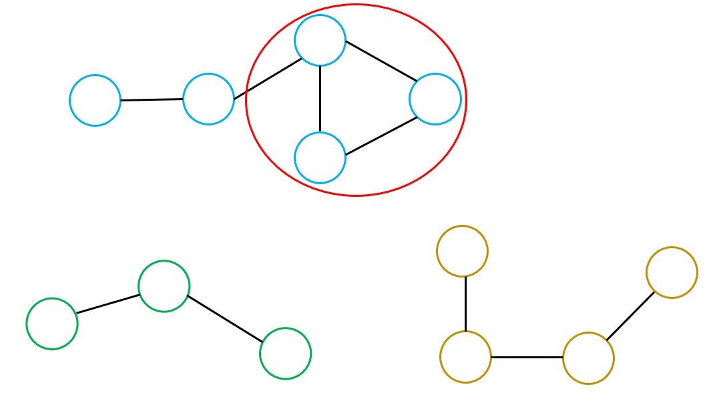

## DFS tree on undirected graph

DFS tree 就如同他的名字，是一棵根據 DFS 的過程長出的 tree。由於其良好的性質，在處理圖相關的問題時是很有用的工具。

考慮以下 DFS 的走訪，那些直接走訪的邊被稱為 tree edge，而其他的邊被稱為 back edge。

```cpp
void DFS(int u) {
    visited[u] = true;
    for(int &v : G[u]) {
        if(!visited[v]) {
            // u->v 為 tree edge
            DFS(v);
        } else {
            // u->v為 back edge
        }
    }
}
```

在定義上，back edge 指的是會回到當前點的祖先的邊。

我們可以看個例子。

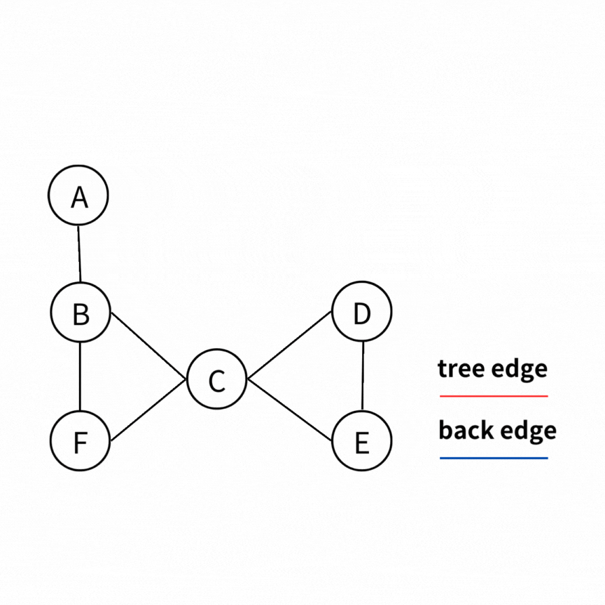

如果把上圖畫成 DFS tree 就會長成如下圖這樣。我們可以發現，正如 back edge 的定義，**一個點可以通過 back edge，回到他的祖先**。


在無向圖上做 DFS tree 時要注意的是: 無向圖的 DFS 會讓一條邊被看到 2 次。例如下圖中，如果我們以 \\( A,B,C,D,E \\) 的順序進行 DFS，那 \\( (E,A) \\)這條邊會首先被 \\( E \\) 看到一次，接著再被 \\( A \\) 看到一次。


所以如果你的 code 只有寫看到一條邊就根據它是 tree edge/back edge 做事，那你有可能會因為看到一條 edge 兩次而做了重複的操作，從而導致 WA。

例如下面的 code 我們想要統計一個點上接出幾條 back edge。當 \\( E \\) 看到 \\( (E,A) \\) 這條邊時，因為 \\( A \\) 點已經被看過，因此 \\( E,A \\) 兩點都會 +1；而當 \\( A \\) 看到 \\( (E,A) \\) 這條邊，因為 \\( E \\) 點已經被看過，因此 \\( E,A \\) 兩點都會 +1。所以最後 \\( A \\) 點跟 \\( E \\) 點都會算出 2 而不是正確答案的 1。

```cpp
void DFS(int u) {
    visited[u] = true;
    for(int &v : G[u]) {
        if(!visited[v]) {
            DFS(v);
        } else {
            backedgeCounter[u]+=1;
            backedgeCounter[v]+=1;
        }
    }
}
```

所以，在無向圖上使用 DFS tree 時，要嘛想辦法處理掉因為看到一條邊兩次帶來的影響(如上面的例子就是把每個點的答案除二)，要嘛讓每條邊都只在第一次被看到的時候做事。

以下給出一個修改方法可以讓每條邊都只在第一次被看到的時候做事。簡單來說就是通過紀錄每個點在 DFS 中的狀態 (還未開始 DFS、已經開始 DFS 但還沒結束、已經結束 DFS)來判斷一條邊是否為第一次被看過。我們用 \\(color[u] = 0,1,2\\) 來表示 \\( u \\) 這個點是在三種狀態中的哪一種。

```cpp
void DFS(int u, int parent) { // call(u,u) at first
    color[u] = 1;
    for(auto &v : G[u]) {
        if(v == parent) continue;// 已經是 tree edge
        if(color[v] == 0) {
            // tree edge
            dfs(v, u);
        } else if(color[v] == 1) {
            // 第一次看到的back edge
            // 在這個例子中當 E 看到 (E,A) 這條邊時會進到這裡
            backedgeCounter[u]+=1;
            backedgeCounter[v]+=1;
        }
        // 在這個例子中，當 A 看到 (E,A) 這條邊時
        // 因為 E 的 DFS 已經結束， color[E] = 2
        // 因此 (E,A) 這條邊不會被算到第 2 次
    }
    color[u] = 2;
}
```

而如果你在 DFS 的過程中有紀錄一個點在 DFS tree 上的深度，那你也可以根據兩點間的深度關係來判斷一條邊是不是第一次被看到。

## AP & Bridge

AP 指的是一張圖 \\(G \\) 移除一個點 \\(v \\) 以及與 \\(v \\) 相連的邊後 Connected Component 的數量變多，則點 \\(v \\) 為 AP。中文常稱之為關節點、割點。例如下圖的 A 點就是 AP  


bridge 指的是一張圖 \\(G \\) 移除一條邊 \\(e \\) 後 Connected Component 的數量變多，則邊 \\(e \\) 為 bridge。中文常稱之為橋。例如下圖的紅色邊就是 bridge


那我們要如何快速找到圖上所有的 AP 跟 bridge 呢？很容易可以想到枚舉每個點或邊，把他拔掉之後看看圖上有沒有多出新的 Connected Component。但這樣做的時間複雜度會是 \\(O((V+E)^2) \\)。不過實際上，我們只要好好觀察圖上的性質就可以在 \\(O(V+E) \\) 的時間做完！以下介紹兩種不同的方法來找出圖上所有的 AP 跟 bridge

## Tarjan's Algorithm to find AP/Bridge

### 觀察 AP 的性質

我們觀察下圖中 \\( C \\) 點的左子樹。你會發現這棵子樹一定要通過 \\( C \\) 點才能走到 \\( C \\) 點的祖先，所以理所當然的，當我們將 \\( C \\) 點移除，整張圖就會斷成兩個 Connected Component。而 \\( C \\) 點就會是 AP。

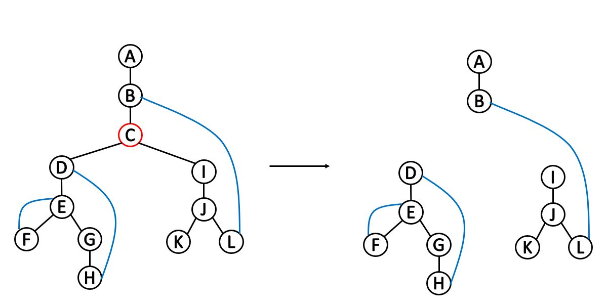

更一般的說，對於一個點 \\(v \\)，如果 \\(v \\) 的某一棵子樹無法在不經過 \\(v \\) 的情況下走到 \\(v \\) 的祖先，那麼 \\(v \\) 一定是 AP。

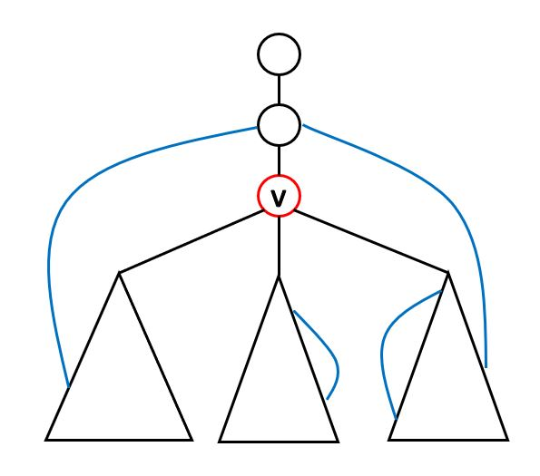

但 root 是沒有祖先的，因此 root 我們要拉出來特別判斷。很明顯，當 root 有至少兩棵子樹的時候，root 一定會是 AP，否則就不是。


那難道不會有如下圖一樣，橫跨兩個子樹的 edge 嗎？這樣的話 \\( C \\) 點就不會是 AP 了。答案是不會。這種橫跨兩個子樹的 edge 會在 DFS 的時候被看成 tree edge。讀者可以稍微思考一下為什麼。

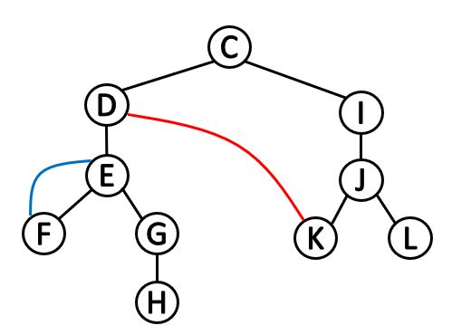

### 觀察 Bridge 的性質

與 AP 的觀察相似。我們觀察下圖中 \\( (C,D) \\) 這條邊，你會發現以 \\( D \\) 為根的子樹一定要通過這條邊才能回到 \\( C \\) 點。所以理所當然的，當我們將 \\( (C,D) \\) 移除，整張圖就會斷成兩個 Connected Component。而 \\( (C,D) \\) 就會是 bridge。

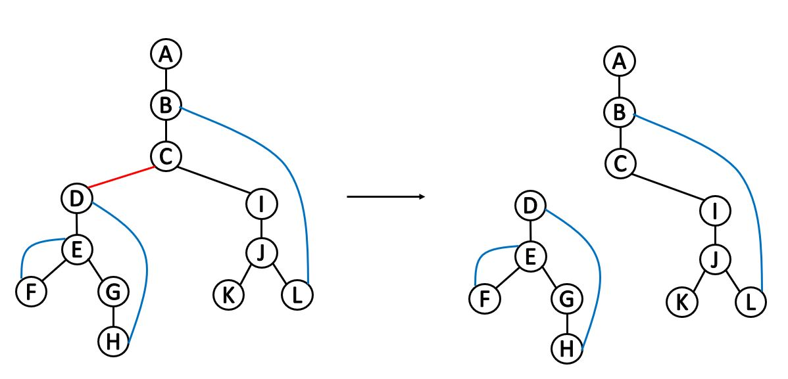

更一般的說，令 \\(u \\) 是 \\( v \\) 的 parent，則對於一條邊 \\( (u,v) \\)，如果 \\( v \\) 的子樹都無法在不經過 \\( (u,v) \\) 的情況下走到 \\( u \\)，那麼 \\( (u,v) \\) 一定是 bridge。


### 演算法

現在我們來看看 Tarjan 是怎麼把這個東西做出來的。

Tarjan 首先定義了兩個函數 \\(depth \\) 跟 \\(low \\)。

\\(depth(v) \\) 表示 \\( v \\) 這個點在 DFS tree 上的深度。

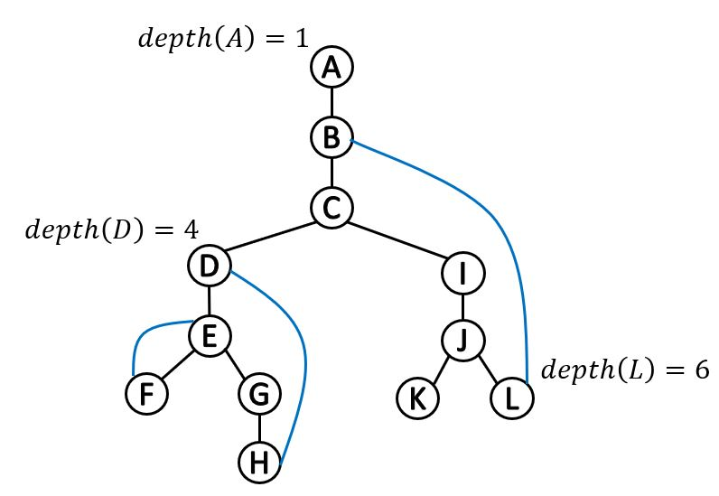

\\( low(v) \\) 表示 \\(v \\) 自己，以及子樹中的點連出去的點當中最小的深度

例如下圖的 \\( C \\) 點，本身的深度是 \\(3\\)，子樹中所有的點深度都 \\(>3\\)，而子樹中連出去的點最淺為 \\( B \\)( \\( L \\) 的鄰點)，深度為 \\(2\\)，因此 \\(low(C) = 2\\)


我們回想一下剛才的圖，發現對於一個點 \\(u \\)，如果他的某個子節點 \\(v \\) 滿足 \\(low(v) \geq depth(u) \\)，那麼 \\(u\\) 就會是 AP。可以看下圖的例子，因為 \\( v \\) 點最多只能走到 \\( u \\) 點的深度，因此 \\( v \\) 點一定得通過 \\( u \\) 點才能走到 \\( u \\) 的祖先。那根據我們剛才的觀察，\\( u \\) 就會是 AP

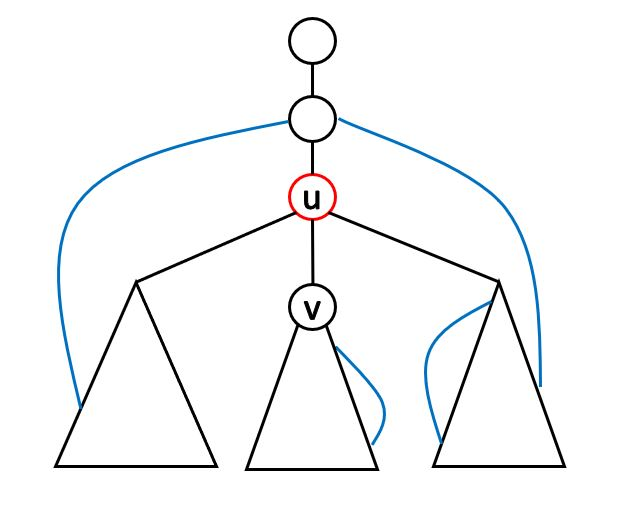

而對於一條邊 \\((u,v)\\)，如果滿足 \\(low(v) > depth(u)\\)，那麼 \\((u,v) \\) 就會是 bridge。與 AP 相似，可以看下圖的例子，因為 \\( v \\) 點所能走到的點都比 \\( u \\) 點深，因此 \\( v \\) 點一定得經過 \\((u,v) \\) 這條邊才能回到 \\(u\\) 點。那根據我們剛才的觀察，\\((u,v) \\) 就會是 bridge

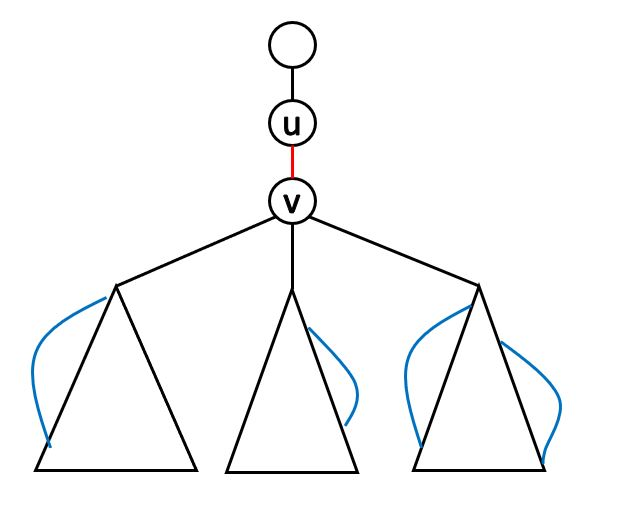

我們現在的問題只剩下如何求出 \\(low(v) \\)。

可以發現，對於一個點 \\(v \\)，如果我們知道他所有子節點的 \\(low \\) 的答案，那麼我們就可以簡單推出 \\(low(v) \\) 的答案，如下圖所示。而要達成這件事情，我們只需在 DFS 的時候用 post order 的順序計算 \\(low \\) 的答案就可以了！


我們整理一下後會發現，對於一條邊 \\( (v,w) \\)：

- 若 \\( (v,w) \\) 為 tree edge，則 \\( low(v) = min(low(v),\ low(w))\\)
- 若 \\( (v,w) \\) 為 back edge，則 \\( low(v) = min(low(v),\ depth(w))\\)

### Time Complexity

在無向圖上隨意挑一個點當起點，做完一次 DFS 之後就能得到答案。因此 Time Complexity 為 \\( O(V+E) \\)

## code

``` cpp
struct AP_bridge {
    vector<int> low, depth;
    vector<vector<int>> G;
    vector<int> AP;
    vector<pair<int, int>> Bridge;
    void init(int n) {
        depth.assign(n+1, 0);
        low.assign(n+1, 0);
        G.assign(n+1, vector<int>());
        AP.clear();
        Bridge.clear();
    }
    
    void add_edge(int u, int v) {
        G[u].emplace_back(v);
        G[v].emplace_back(u);
    }
    
    void solve(int root) {
        dfs(root, root, 1);
    }
    
    void dfs(int u, int parent, int dep) {
        depth[u] = low[u] = dep;
        int child = 0;
        bool isAP = false; 
        
        for(auto &v : G[u]) {
            if(v == parent) continue;
            if(depth[v] == 0) {
                child++;
                dfs(v, u, dep+1);
                low[u] = min(low[v], low[u]);
                if(low[v] >= depth[u]) isAP = true;
                if(low[v] > depth[u]) Bridge.emplace_back(u,v);
            } else {
                low[u] = min(low[u], depth[v]);
            }
        }
    
        if(u == parent && child < 2) isAP = false;
        if(isAP) AP.emplace_back(u);
    }
    
    vector<int> get_AP() {
        return AP;
    }
    
    vector<pair<int, int>> get_bridge() {
        return Bridge;
    }
};
```

## Get Bridge/AP by DFS tree

### 觀察 Bridge 的性質

我們觀察圖中哪些邊絕對不可能是 bridge


- back edge 絕對不會是 bridge。
- **如果\\( (u,v) \\)是 back edge，那麼樹上 \\(u \\) 到 \\( v \\) 的路徑都不會是 bridge**。例如圖中因為有 \\( (F,C) \\) 這條 back edge，因此樹上 \\(F \\) 到 \\(C \\) 的路徑都不會是 bridge。

所以，如果我們每遇到一條 back edge \\( (u,v) \\)，就把樹上 \\(u \\) 到 \\( v \\) 的路徑都標記成不是 bridge，那麼最後那些沒被標記到的邊就會是 bridge。為何？可以看下圖的例子。若是一條邊沒被標記到，就代表沒有 back edge 跨過這條邊，如下圖 \\( (a,b) \\) 這條邊。可以發現，當我們想從 \\( b \\) 回到 \\( a \\) 時，必然只能通過 \\( (a,b) \\) 這條邊。這證明了如果一條邊沒被標記到，那麼它必然是 Bridge。

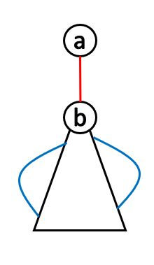

因此問題只剩下：**我們要如何快速標記一條路徑上所有的邊？**

### 快速標記

這個問題我們可以用前綴和的想法來解決。當我們遇到一條 back edge \\( (u,v) \\) 時，就在 \\(u \\) 上 +1，在 \\( v \\) 上 -1。**這代表說有一條 back edge 從 \\(u \\) 開始，在 \\( v \\) 結束**。

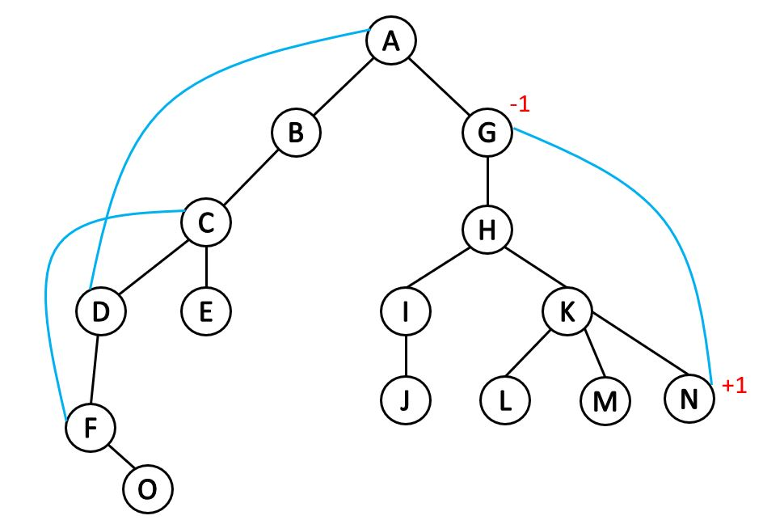

這樣當我們由下而上計算前綴和時，\\(u \\) 到 \\( v \\) 的 path 就全部被標記好了！邊上的前綴和 \\( x \\) 代表了有 \\( x \\) 條 back edge 跨過這條邊。

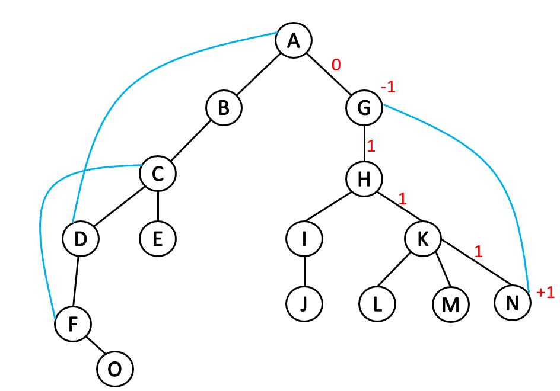

我們接著來看一個比較複雜的例子。如下圖，假設我們已經算出了三條黑色邊的前綴和，那麼想想看綠色邊的前綴和應該如何計算？


我們觀察到跨過綠色邊的 back edge 只會有兩種：

- 所有跨過黑色邊並且跨過 \\( v \\) 的 back edge
- 從 \\( v \\) 出發的 back edge

當然，我們可以根據上面兩點列出式子後算出綠色邊的答案。但我們再觀察一下會發現，我們所要求的東西其實就是：以 \\( v \\) 為根的子樹中，有幾條 back edge 跨過了 \\( v \\)。而要求出這個東西，我們可以從子樹標記總和下手。

### 前綴和 -> 子樹標記總和

對於一條 tree edge \\( (u,v) \\)，我們只要判斷以 \\( v \\) 為根的子樹標記總和是否為 0，若為 0 則 \\( (u,v) \\) 就會是 bridge。

為甚麼？從下圖可以發現，如果一條 back edge 的開始跟結束都在以 \\( v \\) 為根的子樹內，那麼這條 back edge 對子樹總和的貢獻為 0，否則為 1。而當子樹總和不為 0 的時候，\\( (u,v) \\) 顯然不會是 bridge。

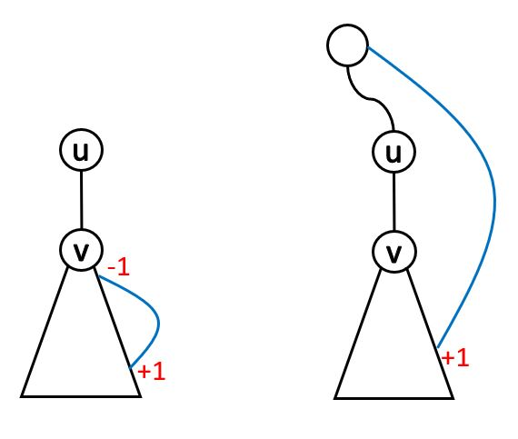

### Time Complexity

我們做完一次 DFS 之後就能得到答案，因此 Time Complexity 為 \\( O(V+E) \\)

### Code

```cpp
struct bridge {
    vector<int> color, sum;
    vector<vector<int>> G;
    vector<pair<int, int>> Bridge;
    void init(int n) {
        color.assign(n+1, 0);
        sum.assign(n+1, 0);
        G.assign(n+1, vector<int>());
        Bridge.clear();
    }
    
    void add_edge(int u, int v) {
        G[u].emplace_back(v);
        G[v].emplace_back(u);
    }
    
    void solve(int root) {
        dfs(root, root);
    }
    
    void dfs(int u, int parent) {
        color[u] = 1;
        for(auto &v : G[u]) {
            if(v == parent) continue;
            if(color[v] == 0) {
                dfs(v, u);
                if(sum[v] == 0) 
                    Bridge.emplace_back(u, v);
                sum[u]+=sum[v];
            } else if(color[v] == 1) {
                sum[u]+=1;
                sum[v]-=1;
            }
        }
        color[u] = 2;
    }
        
    vector<pair<int, int>> get_bridge() {
        return Bridge;
    }
};
```

### 如何找 AP

我們首先回想一下 Tarjan 對 AP 的觀察：

- 對於 root，如果他有至少兩棵子樹的時候，他就一定是 AP，否則就不是。
- 對於一個點 \\(v \\)，如果 \\(v \\) 的某一棵子樹無法在不經過 \\(v \\) 的情況下走到 \\(v \\) 的祖先，那麼 \\(v \\) 一定是 AP。


第一點很好解決。

對於第二點，我們要檢查的其實就是**對於一棵子樹，有沒有 back edge 跨過 \\( v \\)**，如果沒有那 \\( v \\) 就會是 AP。

而這個東西要計算的其實就是：

- \\((v\\) 的子樹標記總和\\()\\) \\(-\\) \\((\\)這顆子樹在 \\( v \\) 結束的 back edge 數量\\()\\)。

為甚麼？因為子樹的標記總和相當於是：這棵子樹有多少條 back edge 還沒結束。像下圖的兩個例子中，子樹標記總和都為 1。而如果這些 back edge 都在 \\(v\\) 結束，那麼這棵子樹顯然一定要通過 \\(v\\) 才能回到 \\(v\\) 的祖先，如下圖左例，那麼 \\( v \\) 就一定會是 AP 了。


### Time Complexity

我們做完一次 DFS 之後就能得到答案，因此 Time Complexity 為 \\( O(V+E) \\)

### Code

```cpp
struct AP {
    vector<int> color, sum, backEdgeEnd;
    vector<vector<int>> G;
    vector<int> AP;
    void init(int n) {
        color.assign(n+1, 0);
        sum.assign(n+1, 0);
        backEdgeEnd.assign(n+1, 0);
        G.assign(n+1, vector<int>());
        AP.clear();
    }
    
    void add_edge(int u, int v) {
        G[u].emplace_back(v);
        G[v].emplace_back(u);
    }
    
    void solve(int root) {
        dfs(root, root);
    }
    
    void dfs(int u, int parent) {
        color[u] = 1;
        bool isAP = false;
        int child = 0;
    
        for(auto &v : G[u]) {
            if(v == parent) continue;
            if(color[v] == 0) {
                child++;
                int backEdgeEndNum = backEdgeEnd[u];
                dfs(v, u);
                if(sum[v] - (backEdgeEnd[u] - backEdgeEndNum) == 0) {
                    isAP = true;;
                }
                sum[u]+=sum[v];
            } else if(color[v] == 1) {
                sum[u]+=1;
                backEdgeEnd[v]+=1; 
            }
        }
        sum[u] -= backEdgeEnd[u];
        color[u] = 2;
        
        if(u == parent && child == 1) isAP = false;
        if(isAP) AP.emplace_back(u);
    }
    
    vector<int> get_AP() {
        return AP;
    }

};
```

## Exercise

> [CSES - Necessary Cities](https://cses.fi/problemset/task/2077)
>
> 給定一張 \\( N \\) 個點 \\( M \\) 條邊的無向圖，要你找出圖上所有的 AP
>
>\\(2 \leq N \leq 10^5,\ 1 \leq M \leq 2 \cdot 10^5\\)

AP 模板題

> [CSES - Necessary Roads](https://cses.fi/problemset/task/2076)
>
> 給定一張 \\( N \\) 個點 \\( M \\) 條邊的無向圖，要你找出圖上所有的 bridge
>
>\\(2 \leq N \leq 10^5,\ 1 \leq M \leq 2 \cdot 10^5\\)

bridge 模板題

>[Codeforce - Two Fairs](https://codeforces.com/contest/1259/problem/E)
>
>\\( t \\) 筆輸入，每筆輸入給定一張 \\( N \\) 個點 \\( M \\) 條邊的無向圖及兩個點 \\(a, b\\)，問有幾對 \\( (x,y) \\) 滿足由 \\(x \\) 到 \\( y \\) 的路徑上一定會經過 \\(a, b\\) 這兩個點。其中 \\( x \neq a,b\\) 且 \\(y \neq a,b \\)。
>
>\\(1 \leq t \leq 4 \cdot 10^4\\)
>
>\\(4 \leq N \leq 2 \cdot 10^5,\ N-1 \leq M \leq 5 \cdot 10^5\\)
>
>保證所有 test case 的 \\( N \\) 的總和不超過 \\(2 \cdot 10^5\\)，\\(M \\) 的總和不超過 \\(5 \cdot 10^5\\)

<details><summary> Solution </summary>

如果 \\( a \\) 或 \\( b \\) 不為 AP 則答案為 0 (拔掉 \\( a \\) 或 \\( b \\) 後整張圖依然連通，代表不存在一定要經過 \\( a \\) 或 \\( b \\) 的 path)

而在 \\(a, b\\) 皆為 AP 的情況下，我們可以將圖上的點分成三個 group:

- 一定要先經過 \\( a \\) 點才能到 \\( b \\) 點(下圖的紅色圓圈，令其中有 \\( i \\) 個點)
- 一定要先經過 \\( b \\) 點才能到 \\( a \\) 點(下圖的綠色圓圈，令其中有 \\( j \\) 個點)
- 可以先到 \\( a \\) 點，也可以先到 \\( b \\) 點(下圖的藍色圓圈，令其中有 \\( k \\) 個點)

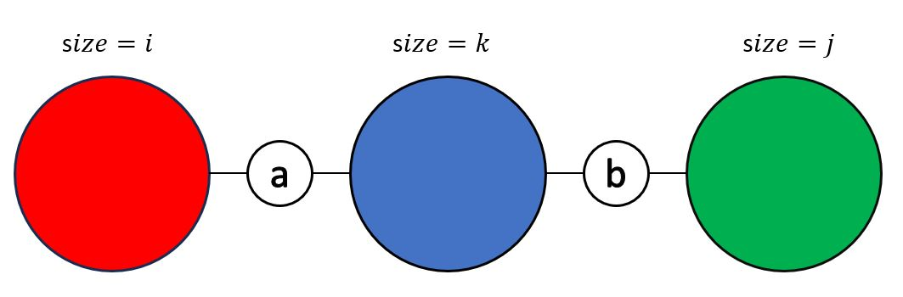

那麼答案就會是 \\(i \times j \\)，現在的問題只剩下我們要如何求出 \\(i,j\\)。

要求出 \\( i \\)，我們可以拔掉 \\( a \\) 點後從 \\( b \\) 點 DFS 出去，沒被走到的點數就會是 \\( i \\)。\\( j \\) 也能用相似的方法求出

</details>

>[Codeforces - Bertown roads](https://codeforces.com/contest/118/problem/E)
>
> 給定一張 \\( N \\) 個點 \\( M \\) 條邊的無向圖，要你幫每一條邊定向後使整張圖上任兩點間都有 path，如果不可能輸出 0。
>
>\\(2 \leq N \leq 10^5,\ N-1 \leq M \leq 3 \cdot 10^5 \\)

<details><summary> Solution </summary>

如果圖上有 bridge，那麼必不可能有解。如下圖，假設 \\( (u,v) \\) 是 bridge，那麼給定方向後 \\(u\\) 走到 \\( v \\) 或 \\( v \\) 走到 \\( u \\) 一定有一個不符合。

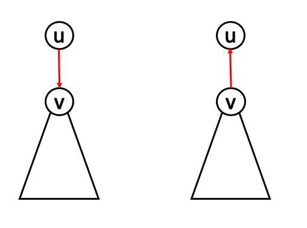

而如果圖上沒有 bridge 則必然有解，我們可以在圖上找出 DFS tree，然後讓 tree edge 向下走，back edge 向上走即可。以下證明這是一個合法的方法。

首先，root 一定可以通過 tree edge 走到其他所有點。

接著，我們證明所有的點都可以回到 root。我們考慮一個不為 root 的點 \\(v\\) 跟他的 parent \\( u \\)，因為圖中不存在 bridge，因此 \\( v \\) 一定能通過某條 back edge 回到 \\( u \\) 或 \\( u \\) 的祖先(如下圖左)，否則 \\( (u,v) \\) 就會是 bridge(如下圖右)。

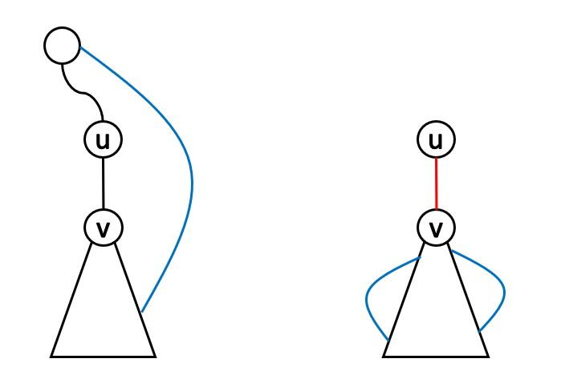

而對於 \\(v\\) 所回到的點 \\( v' \\)，我們發現這又是一個同樣的問題，我們還是可以通過某條 back edge 向上走，重複這個過程直到回到 root。

因此，任意兩點都能通過回到 root 後再由 root 走到對方，得證。

</details>

## Problems

>[Uva - Mining Your Own Business](https://onlinejudge.org/index.php?option=com_onlinejudge&Itemid=8&category=246&page=show_problem&problem=3549)
>
>多筆輸入，每筆輸入給一張有 \\( N \\) 條邊的無向圖，要你選擇盡可能少的點塗黑，使得刪除任一個點後，每個連通分量裡至少有一個黑點。問最少要塗黑幾個點以及有幾種塗法。
>
>\\( N \leq 5 \cdot 10^4 \\)

<details><summary> Hint </summary>

考慮一張把原圖的 AP 全都拔掉的新圖 \\( G' \\)，會發現 \\( G' \\) 中每一個 component 最多只要塗黑 2 個點便能達成題目要求。

因此可以在原圖上將這些 component 都縮成一個點，接著去討論每個 component 應該要塗黑幾個點。

</details>

>[Codeforces - Break Up](https://codeforces.com/problemset/problem/700/C)
>
> 給一張 \\( N \\) 個點 \\( M \\) 條邊的帶權無向圖與兩點 \\(S \\) , \\(T \\)，要你選至多兩條邊刪除後使 \\(S \\) , \\(T \\) 不連通。要求選的邊權重和最小。
>
>\\( N \leq 1000,\ M \leq 30000 \\)

<details><summary> Hint </summary>

如果 \\(S \\) , \\(T \\) 連通的話，那麼考慮這兩點在 DFS tree 上由 tree edge 構成的 path \\( P \\)，\\( P \\) 中至少有一條邊要被砍掉。

注意到這題 \\(N = 1000\\)，而 \\( P \\) 的長度又 \\( \leq N \\)，因此可以想想看要如何通過暴力枚舉被刪除的邊來求答案。

</details>

## Reference

- [CP Algorithm - Connected components](https://cp-algorithms.com/graph/search-for-connected-components.html)
- [演算法筆記 - Connected components](https://web.ntnu.edu.tw/~algo/ConnectedComponent.html)
- [CP Algorithm - cutpoints](https://cp-algorithms.com/graph/cutpoints.html)
- [CP Algorithm - bridge](https://cp-algorithms.com/graph/bridge-searching.html)
- [oi-wiki - cut & bridge](https://oi-wiki.org/graph/cut/)
- [演算法筆記 - AP & bridge](https://web.ntnu.edu.tw/~algo/ConnectedGraph.html#3)
- [Hackerearth - AP & bridge](https://www.hackerearth.com/practice/algorithms/graphs/articulation-points-and-bridges/tutorial/)
- [演算法海牛 - bridge](https://www.facebook.com/algo.seacow/posts/pfbid0PMMPJEWmh3XgFtstTh8pptxjnJKK5jwpeVCQWEmfWVyRKT66LqccAv5DiSZ22zDhl)
- [codeforce blog - AP & bridge](https://codeforces.com/blog/entry/71146)
- [codeforce blog - DFS tree](https://codeforces.com/blog/entry/68138)
- [sylveon slides - AP & Bridge](https://slides.com/sylveon/graph-7#/3)
- IONCAMP 講義
