# BCC-Vertex and BCC-Edge

## 前言

在此章節中，我們將介紹無向圖上的 BCC-Vertex(Bi-connected Component) 和 BCC-Edge(Bridge Connected Component)，包括他們的定義、相關的演算法和題目。

## BCC-Vertex(Bi-connected Component)

BCC-Vertex 指的是沒有 AP 的 Connected Component，在中文常稱之為點雙連通分量。例如下圖中有三個 BCC-Vertex

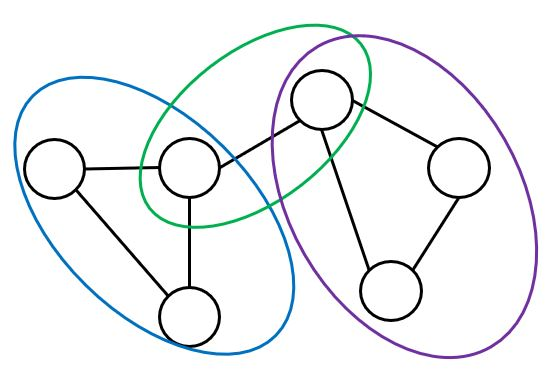

BCC-Vertex 有以下幾個性質:

- 不同的 BCC-Vertex 之間最多共用一個點，而該點必然是圖上的 AP
  - 如果共用超過一個點的話，我們會發現這兩個 BCC-Vertex 實際上是同一個。如下圖，我們發現刪掉這兩個點中的任一個點，整張圖依然彼此連通；而如果刪掉的是某個 BCC-Vertex 內的點，根據 BCC-Vertex 的定義，整張圖也會保持連通。因此得證這兩個 BCC-Vertex 實際上是同一個
  

- 一個至少有三個點的 BCC-Vertex，給定任意兩相異點 \\( a,b \\)，必存在一個同時包含 \\(a,b\\) 兩點的簡單環
  - 首先我們知道，\\( a \\) 點一定會位於某個簡單環中，否則拿掉 \\( a \\) 點後整張圖必不連通。\\( b \\) 點同理。
  - 如果兩個簡單環至少交於兩點，那我們便可以找出一個同時包含 \\(a, b\\) 的簡單環，如下圖。
  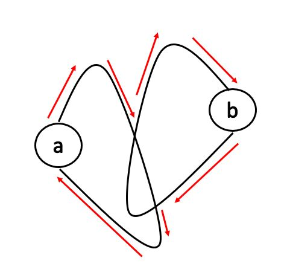
  - 如果兩個簡單環恰交於一點，即下圖的綠點。因為 \\(a, b\\) 位於同一個 BCC-Vertex，因此我們知道，\\( a \\) 的簡單環上一定會有一條不經過綠點的 path 通向 \\( b \\) 的簡單環，否則綠點就會是 AP。那我們便可以找出一個同時包含 \\(a, b\\) 的簡單環，如下圖。
  
  - 如果兩個簡單環沒有交集，根據 BCC-Vertex 的定義，我們知道 \\( a \\) 的簡單環上一定會有通向 \\( b \\) 的簡單環的 path，而且這些 path 至少會從兩個不同的點出發(如果只由一個點出發，那麼那個點就會是 AP，如下圖的紅點)。
  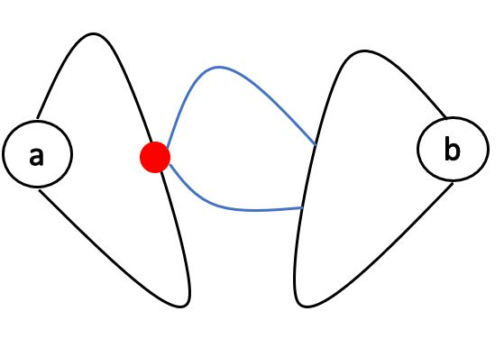
  - 如果我們找到兩條沒有共用點的 path，那我們便可以找出一個同時包含 \\(a, b\\) 的簡單環，如下圖。
  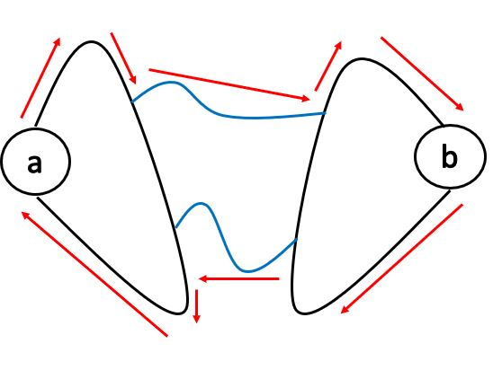
  - 否則，發現我們可以**擴大** \\( a \\) 的簡單環，如下圖。因為 \\( a \\) 的簡單環會不斷往 \\( b \\) 的方向長大，而圖的大小有限，因此我們知道有限回合後，兩個簡單環必定相交。
  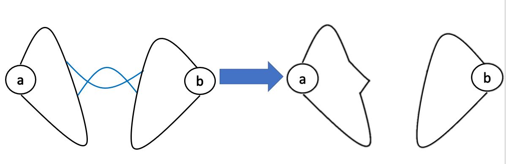
- 一個至少有三個點的 BCC-Vertex，任兩點間至少會有兩條沒有共用邊的簡單路徑。(環上順時針或逆時針走)
- 對於在同一個 BCC-Vertex 中的任意三個相異點 \\( a,b,c \\)，必存在一條簡單路徑依序經過 \\(a,b,c\\) 三點。
  - 因為 \\(a,b\\) 同在一個環上，\\(b,c \\) 同在一個環上，所以我們枚舉兩個環跟三個點的各種位置關係就能得證。以下列舉幾種，紅色的邊代表 \\( a \\) 到 \\( b \\) 到 \\( c \\) 的簡單路徑

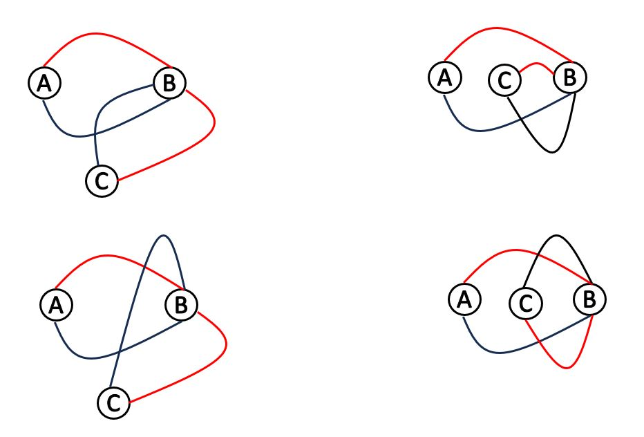

- 把每個 BCC-Vertex 跟 AP 都縮成一個點，根據 BCC-Vertex 與 AP 的連接關係畫成一張新圖，那這張新圖會是一棵樹或森林，且樹上的 AP 跟 BCC-Vertex 會交錯出現
  - 以下是一個縮點的例子
  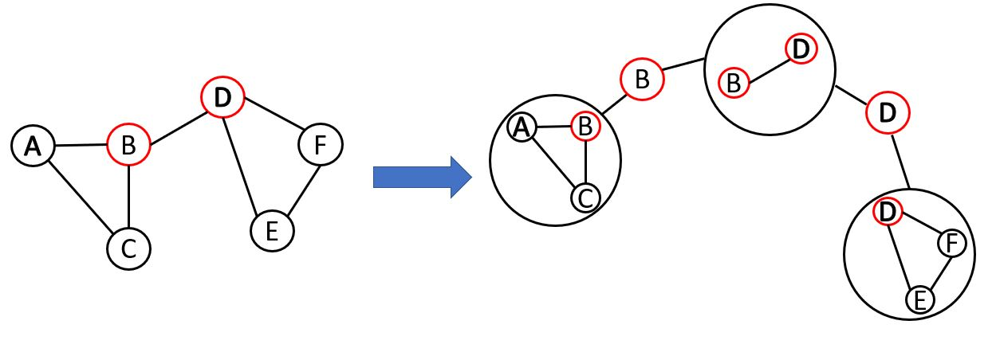
  - 新的圖上不可能有環，否則圖上的 AP 就不會是 AP。
  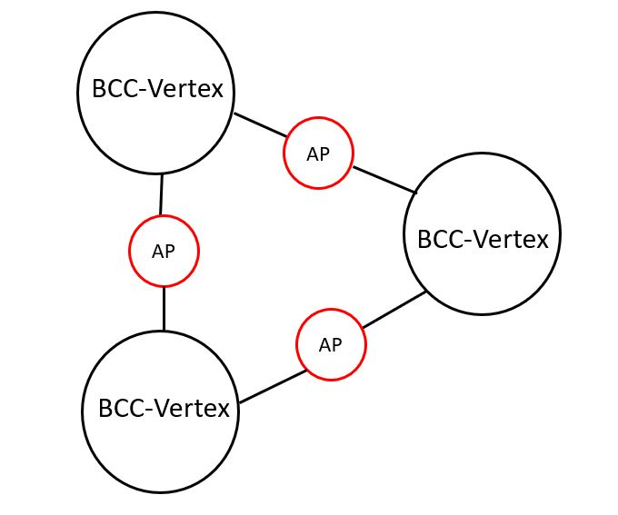
  - 而且樹上的 AP 跟 BCC-Vertex 會交錯出現這點我們可以從第一點推出。

而要如何找出圖上所有的 BCC-Vertex 呢？我們發現:

- 對於那些不是 AP 的點，可以通過 DFS 找出所有與他同屬一個 BCC-Vertex 的點(當我們遇到 AP 時就不要再 DFS 下去即可)
- 對於 AP，只要檢查他周圍的點有沒有 AP，有的話這兩個 AP 就會形成一個 BCC-Vertex。

例如下圖中，\\( A \\) 通過 DFS 可以找到 \\( B,C,D \\)，這四點恰為一個 BCC-Vertex。\\( A \\) 點不會找到 \\( E \\)，因為 \\( D \\) 點是 AP，不會繼續 DFS 下去。而 \\(D \\) 點會檢查到 \\(E \\) 是 AP，因此 \\(D,E\\) 會是一個 BCC-Vertex。

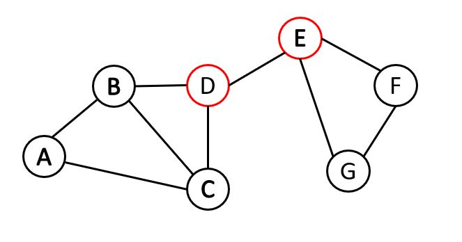

事實上，我們也可以通過修改找 AP 的演算法，在找 AP 的時候順便找出所有的 BCC-Vertex。

### 如何修改

我們可以用 stack 紀錄首次遇到的邊。這樣當我們發現 \\(low(v) \geq depth(u) \\) 時，stack 中 \\( (u,v) \\) 及它上面的邊就會位於同一個 BCC-Vertex 中。就像是下圖 \\( (C,D) \\) 這條邊。

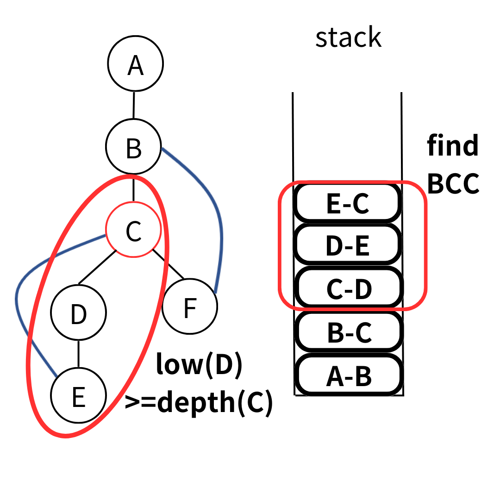

一個完整的例子如下
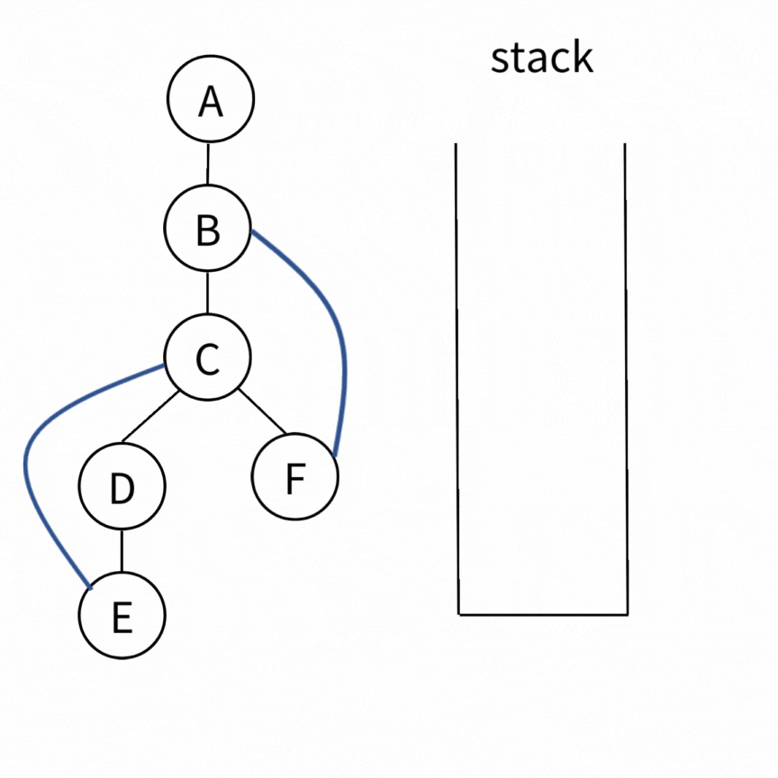

### Time Complexity

做完一次 DFS 就會有答案。而每條邊只會被 push 跟 pop 一次，因此 Time Complexity 為 \\( O(V+E) \\)

### code

```cpp
struct BCC_Vertex {
    vector<int> low, depth;
    vector<vector<int>> G;
    vector<vector<pair<int, int>>> bcc;
    stack<pair<int, int>> stk;
    
    void init(int n) {
        depth.assign(n+1, 0);
        low.assign(n+1, 0);
        G.assign(n+1, vector<int>());
        bcc.clear();
    }
    
    void add_edge(int u, int v) {
        G[u].emplace_back(v);
        G[v].emplace_back(u);
    }
    
    void solve(int root) {
        dfs(root, root, 1);
    }
    
    void dfs(int u, int parent, int dep) {
    
        depth[u] = low[u] = dep;
    
        for(auto &v : G[u]) {
            if(v == parent) continue;
            if(depth[v] < depth[u]) stk.emplace(u,v);
            if(depth[v] == 0) {
                dfs(v, u, dep+1);
                low[u] = min(low[v], low[u]);
                if(low[v] >= depth[u]) {
                    pair<int, int> x;
                    bcc.emplace_back(vector<pair<int, int>>());
                    do {
                        x = stk.top(); stk.pop();
                        bcc.back().emplace_back(x);
                    } while(x != make_pair(u,v));
                }
            } else {
                low[u] = min(low[u], depth[v]);
            }
        }
        
        if(u == parent) {
            while(!stk.empty()) {
                pair<int, int> x;
                bcc.emplace_back(vector<pair<int, int>>());
                do {
                    x = stk.top(); stk.pop();
                    bcc.back().emplace_back(x);
                } while(x.first != 1);
            }
        }
    }
    
    auto get_BCC_Vertex() {
        return bcc;
    }
};
```

## Exercise

> [The 2020 ICPC Asia Taipei-Hsinchu Site Programming Contest pI - Critical Structures](https://codeforces.com/gym/102835/problem/I)
>
>請有興趣的讀者自行去連結查看題目敘述，以免暴雷未來打算模擬這屆台北站當作團練的人。

<details><summary> Solution </summary>

題目要找 AP, bridge, BCC-Vertex 的數量，以及擁有最多邊的 BCC-Vertex 的邊數。

其實就是模板題

</details>

>[Codeforce - Simple Cycles Edges](https://codeforces.com/problemset/problem/962/F)
>
>給定一張 \\( N \\) 個點 \\( M \\) 條邊的無向圖，問那些邊剛好位於一個簡單環上。
>
>\\(1 \leq N \leq 10^5,\ 0 \leq M \leq min(n \cdot (n-1)/2,\ 2.1 \cdot 10^6)\\)

<details><summary> Solution </summary>

我們首先觀察到答案一定不會跨過兩個 BCC-Vertex。因此我們只要對每個 BCC-Vertex 分別檢查即可。

而 BCC-Vertex 中所有的邊要剛好位於一個簡單環上，那代表說我們只要檢查 BCC-Vertex 中點數和邊數是否相等，就能知道一條邊是否恰位於一個簡單環上。

</details>

## BCC-Edge(Bridge Connected Component)

BCC-Edge 指的是沒有 bridge 的 Connected Component，在中文常稱之為邊雙連通分量、橋連通分量。例如下圖我們能找到兩個 BCC-Edge
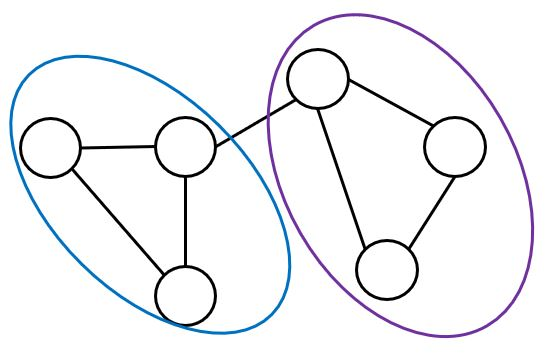

BCC-Edge 有以下幾個性質

- 一個 BCC-Edge 中任一條邊都至少在一個簡單環上。
  - 我們可以反證：如果一條邊 \\((u,v)\\) 不在任何簡單環上，那麼刪掉 \\((u,v)\\) 後 \\( u \\) 跟 \\( v \\) 就不會連通，違反 BCC-Edge 的規定。
- 如果把每個 BCC-Edge 縮成一個點，那麼新得到的圖會是一棵樹或者森林。
  - 因為如果新的圖上有環的話，那個環上所有的點就應在一開始被看成一個 BCC-Edge。如下圖所示，那三個 BCC-Edge 應該要同在一個 BCC-Edge 中。

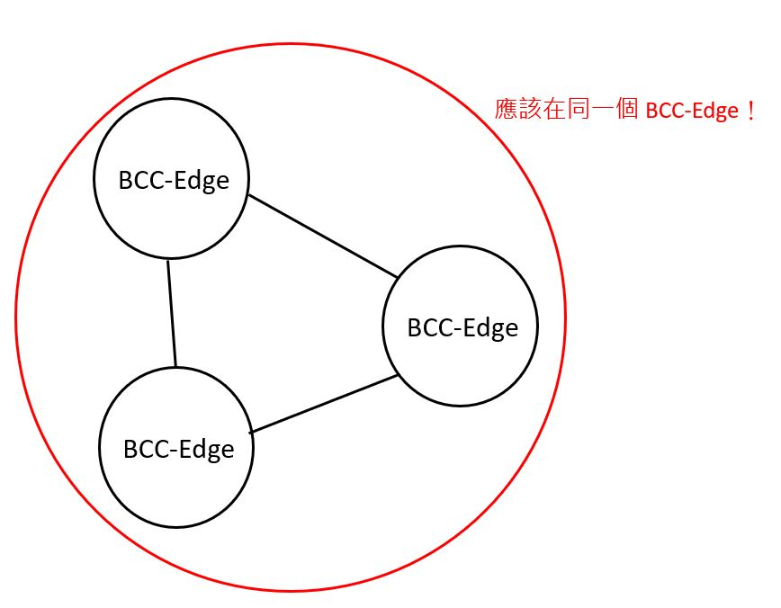

而要如何找出圖上所有的 BCC-Edge？我們可以發現，如果我們拔掉原圖上所有的 bridge，那麼剩下來的每一個 component 就都會是一個 BCC-Edge。


因此我們可以拔掉圖上所有的 bridge 後，DFS 找出那些點同屬一個 BCC-Edge。那有沒有其他方法呢？與 BCC-Vertex 相似，我們可以通過修改找 bridge 的演算法，在找 bridge 的時候順便找出所有的 BCC-Edge。

### 如何修改

跟找 BCC-Vertex 的想法很像。我們用 stack 紀錄走過的點，當我們發現 \\(low(u) == depth(u) \\) 時，我們就發現了橋的下端點。而 stack 中 \\(u \\) 和他上面的點就會位於同一個 BCC-Edge。就像下圖 \\( D \\) 這個點，他是 \\( (C,D) \\) 這條 bridge 的下端點。

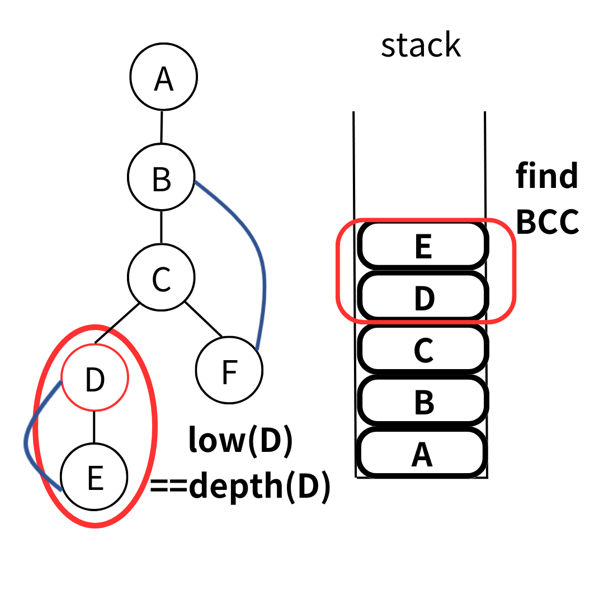

一個完整的例子如下


### Time Complexity

做完一次 DFS 就會有答案。而每個點只會被 push 跟 pop 一次，因此 Time Complexity 為 \\( O(V+E) \\)

### code

```cpp
struct BCC_Edge {
    vector<int> low, depth;
    vector<vector<int>> G;
    vector<vector<int>> bcc;
    stack<int> stk;
    
    void init(int n) {
        depth.assign(n+1, 0);
        low.assign(n+1, 0);
        G.assign(n+1, vector<int>());
        bcc.clear();
        while(!stk.empty()) stk.pop();
    }
    
    void add_edge(int u, int v) {
        G[u].emplace_back(v);
        G[v].emplace_back(u);
    }
    
    void solve(int root) {
        dfs(root, root, 1);
    }
    
    void dfs(int u, int parent, int dep) {
        depth[u] = low[u] = dep;
        stk.emplace(u);
    
        for(auto &v : G[u]) {
            if(v == parent) continue;
            if(depth[v] == 0) {
                dfs(v, u, dep+1);
                low[u] = min(low[v], low[u]);
            } else {
                low[u] = min(low[u], depth[v]);
            }
        }
        
        if(low[u] == depth[u]) {
            bcc.emplace_back(vector<int>());
            int x;
            do {
                x = stk.top(); stk.pop();
                bcc.back().emplace_back(x);
            } while(x != u);
        }
    }
    
    auto get_BCC_Edge() {
        return bcc;
    }
};
```

## Exercise

>[2015 ACM Amman Collegiate Programming Contest pH - Bridges](https://codeforces.com/gym/100712)
>
> \\( T \\) 筆測資，每筆測資會給你一張 \\( N \\) 個點 \\( M \\) 條邊的無向圖，問你在圖上加一條邊後，圖上的 bridge 數量最少為何。
>
> \\(1 \leq T \leq 64\\)
>
> \\(3 \leq N \leq 10^5,\ N-1 \leq M \leq 10^5\\)

<details><summary> Solution </summary>

我們首先把所有的 BCC-Edge 縮點，根據 BCC-Edge 的性質我們會得到一棵樹，樹上的邊都是 bridge。

我們思考如果在樹上 \\( u,v \\) 兩點間加上一條邊後，有哪些邊就不再是 bridge 了。可以發現樹上從 \\( u \\) 到 \\( v \\) path 上的所有邊都不再是 bridge。而我們想要讓最多的 bridge 消失，因此問題就轉換為了求樹的直徑。

</details>

## Problems

>[TIOJ - 圓桌武士](https://tioj.ck.tp.edu.tw/problems/1684)
>
>有 \\( N \\) 個武士和 \\( M \\) 個武士之間倆倆的仇恨關係，如果能選出奇數個武士(至少三個)坐在圓桌邊，且相鄰的兩人不互相仇恨，那他們就可以開會。問有多問有多少位武士永遠不可能開會。
>
>\\( 1 \leq N \leq 1000,\ 1 \leq M \leq 10^6 \\)

<details><summary> Hint </summary>

反過來思考，我們改成找可以和別人開會的武士有誰。我們可以觀察原圖的補圖 (即武士之間的不仇恨關係)，想想看這張補圖上符合怎樣性質的點至少可以參與到一場會議中。

</details>

>[Codeforces - Tourist Reform](https://codeforces.com/contest/732/problem/F)
>
>給定一張 \\( N \\) 個點 \\( M \\) 條邊的無向圖，定義 \\(r_i \\) 為幫每條邊定向後，\\(i \\) 點可以走到的點數。要你給出一種定向方法使得 \\(min_i({r_i})\\) 最大
>
>\\( 2 \leq N \leq 4 \cdot 10^5,\ 1 \leq M \leq 4 \cdot 10^5 \\)

<details><summary> Hint </summary>

找出所有的 BCC-Edge 後，想想看最大化的 \\(min_i({r_i})\\) 至少會等於什麼？

</details>

> [POJ - Road Construction](http://poj.org/problem？id=3352)
>
> 給一張 \\( N \\) 個點 \\( M \\) 條邊的無向圖，保證整張圖連通，問最少要加幾條邊才能使得圖上沒有橋。
>
>\\( 3 \leq N \leq 1000,\ 2 \leq M \leq 1000 \\)

<details><summary> Hint </summary>

跟 BCC-Edge 的練習題有點像，想想看縮點後的樹上 leaf 之間要怎樣加邊。

</details>

## Reference

- [oi-wiki - BCC](https://oi-wiki.org/graph/bcc/)
- [Hackerearth - BCC](https://www.hackerearth.com/practice/algorithms/graphs/biconnected-components/tutorial/)
- [演算法筆記 - Connected Component](https://web.ntnu.edu.tw/~algo/ConnectedComponent.html#2)
- [sylveon slides - BCC](https://slides.com/sylveon/graph-7#/4)
- [算法笔记 - BCC](https://www.cnblogs.com/IltzInstallBI/p/13113566.html)
- [建中培訓講義 - 進階圖論](https://tioj.ck.tp.edu.tw/uploads/attachment/5/33/8.pdf)
- 清大競程上課講義
