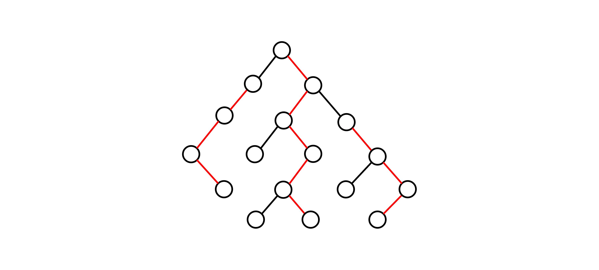
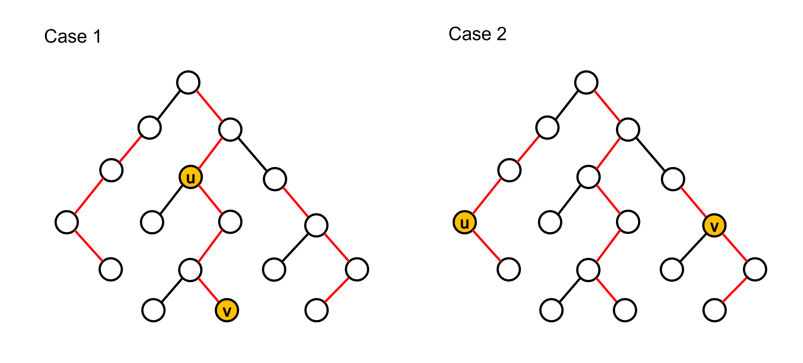

# Lowest Common Ancestor (LCA)

## 前言

在此章節中，我們會介紹經典的最近共同祖先（LCA）問題且分析幾種常見的尋找 LCA 的方法。此外也會提及 LCA 問題與另一經典問題（Range Minimum Query）之間的轉化。

## 定義

給定一棵有 \\( N \\) 個節點的有根樹，對於樹中任一點對 \\( (u,\ v) \\)，其最近共同祖先 \\( LCA(u,\ v) \\) 為同為點 \\( u \\) 和點 \\( v \\) 的祖先中深度最深的點，這邊我們定義點的深度為點到根路徑上所經過的邊數且自己為自己的祖先（為了方便之後討論）。

## 相關性質

- [如果點 \\( u \\) 為點 \\( v \\) 的祖先，那麼 \\( LCA(u,\ v) \\) 為點 \\( u \\)。]
- [如果點對 \\( (u,\ v) \\) 不具祖孫關係，那麼點 \\( u \\) 和點 \\( v \\) 會分別位於 \\( LCA(u,\ v) \\) 的兩個不同子樹內。]
- [\\( LCA(u,\ v) \\) 必定會位於點 \\( u \\) 到點 \\( v \\) 的最短路徑上。]
- [在 DFS 的走訪過程中，必定會先經過 \\( LCA(u,\ v) \\)，接著再經過點 \\( u \\) 和點 \\( v \\)。]

## 常見作法

### Brute Force

一個直觀的做法是先從根開始作一次 DFS，確認出每個點的深度以及父節點。再來藉由預處理過的資訊，把所求點對 \\( (u,\ v) \\) 中深度較深的點先順著其父節點往上抬升到與另一點同深度。此時，若兩點相同則代表找到了 LCA。若不同，我們則需要將兩點繼續往上抬升直到兩點相同為止。

總結一下此作法的時間複雜度：

- 預處理
  - DFS 一次求出每個點的深度以及父節點：\\( O(N) \\)

- 單次查詢
  - 對於點對 \\( (u,\ v) \\)，將深度較深的點抬升至與另一點同深度：\\( O(N) \\)
  - 兩點繼續往上抬升（如果需要）：\\( O(N) \\)

此作法需要花費 \\( O(NQ) \\) 的時間完成所有查詢。

<details><summary> Sample Code </summary>

- 用 adjacency list 來儲存樹的結構。
- `depth[i]` 代表第 \\( i \\) 個節點的深度。
- `parent[i]` 代表第 \\( i \\) 個節點的父節點。
- 樹的根為點 \\( 1 \\) 且根的父節點為 \\( -1 \\)。

```cpp
#include <bits/stdc++.h>
using namespace std;

int main() {
  ios::sync_with_stdio(0);
  cin.tie(0);

  int N, Q;
  cin >> N >> Q;

  vector<int> depth(N + 1, 0), parent(N + 1);
  vector<vector<int>> adj(N + 1);

  for (int i = 2; i <= N; ++i) {
    int p;
    cin >> p;
    adj[i].push_back(p);
    adj[p].push_back(i);
  }

  function<void(int)> dfs = [&](int u) -> void {
    for (int v : adj[u]) {
      if (v == parent[u]) continue;
      depth[v] = depth[u] + 1;
      parent[v] = u;
      dfs(v);
    }
  };

  dfs(1);

  auto jump = [&](int u, int distance) -> int {
    while (distance--) u = parent[u];
    return u;
  };

  auto LCA = [&](int u, int v) -> int {
    if (depth[u] > depth[v]) swap(u, v);
    v = jump(v, depth[v] - depth[u]);
    while (u != v) {
      u = parent[u], v = parent[v];
    }
    return u;
  };

  for (int i = 0; i < Q; ++i) {
    int u, v;
    cin >> u >> v;
    cout << LCA(u, v) << "\n";
  }

  return 0;
}
    
```

</details>

直觀的做法通常很慢，我們可以觀察到在上述做法當中點的抬升是順著父節點一個點一個點慢慢往上，導致抬升的時間複雜度為線性。而我們接下來要介紹另外一種做法 Binary Lifting，中文稱作倍增法，即是針對這一點去做優化。

### Binary Lifting

已知對於任意正整數，我們可以將其表示為二進制。舉例來說，\\( 13 = 1101_2 = 2^3 + 2^2 + 2^0 \\)。基於這個概念，我們可以用來優化點的抬升。假設抬升距離為 13，相較於每次都是距離 1 的抬升，我們可以將點分別抬升距離 1、4 和 8，此做法可以大幅減少抬升的時間複雜度至 \\( O(\log N) \\)。

然而想要完成這種抬升，我們需要在預處理時多紀錄每個點的第 \\( 2^i \\) 個祖先的資訊 \\( (0\leq i\leq\lceil\log N\rceil) \\)，實作上我們可以利用 Dynamic Programming 的概念。假設我們想知道點 \\( u \\) 的第 \\( 2^i \\) 個祖先是誰，我們可以將問題等同於點 \\( u \\) 的第 \\( 2^{i-1} \\) 個祖先的第 \\( 2^{i-1} \\) 個祖先是誰，聽起來有點饒口，不清楚的讀者可以看以下示意圖：


根據這個想法，我們可以列出下列遞迴關係式：

$$  ancestor(u,\ i)= 
    \begin{cases}
        parent(u) & \text {if $i = 0$}
        \newline
        ancestor(ancestor(u,\ i-1),\ i-1) & \text{if $i > 0$}
    \end{cases} $$

這邊 \\( ancestor(u,\ i) \\) 代表點 \\( u \\) 的第 \\( 2^i \\) 個祖先。

利用上述關係式解 DP，我們可以在 \\( O(N\log N) \\) 的時間內預處理完所有點的第 \\( 2^i \\) 個祖先的資訊。而需要進行點的抬升時，我們可以在 \\( O(\log N) \\) 的時間內完成。

除了抬升的優化以外，對於等深度的兩點找 LCA 本身具有單調性，直覺上可以利用二分搜來加速。但在稍早提到的 Brute force 當中，我們並沒有提到相關的操作。原因是因為我們只記錄了每個點的父節點的資訊，在處理二分搜的檢查函數上會花費線性的時間，導致整個二分搜的時間複雜度為 \\( O(N\log N) \\)，明顯沒有比較快。

然而對於倍增法來說，因為我們預處理了所有點的第 \\( 2^i \\) 個祖先的資訊，所以我們可以在 \\( O(1) \\) 常數時間內處理完二分搜的檢查函數，進而讓整體二分搜的時間複雜度降至 \\( O(\log N) \\)。

總結一下整個做法：

- 預處理
  - DFS 一次求出每個點的點深度以及父節點：\\( O(N) \\)
  - 解 DP 找出所有點的第 \\( 2^i \\) 個祖先 \\( (0\leq i\leq\lceil\log N\rceil) \\)：\\( O(N\log N) \\)

- 單次查詢
  - 對於點對 \\( (u, v) \\)，將深度較深的點抬升至與另一點同深度：\\( O(\log N) \\)
  - 二分搜找出等深度兩點的 LCA （如果需要）：\\( O(\log N) \\)

此作法可以在 \\( O((N+Q)\log N) \\) 的時間內完成所有查詢。

<details><summary> Sample Code </summary>

- `depth[i]` 代表第 \\( i \\) 個節點的深度。
- `ancestor[i][j]` 代表第 \\( i \\) 個節點的第 \\( 2^j \\) 個祖先。
- 樹的根為點 \\( 1 \\) 且根的所有祖先節點均為 \\( -1 \\)。

```cpp
#include <bits/stdc++.h>
using namespace std;

int main() {
  ios::sync_with_stdio(0);
  cin.tie(0);

  int N, Q;
  cin >> N >> Q;

  const int logN = ceil(log2(N));

  vector<int> depth(N + 1, 0);
  vector<vector<int>> ancestor(N + 1, vector<int>(logN + 1));
  vector<vector<int>> adj(N + 1);

  for (int i = 2; i <= N; ++i) {
    int p;
    cin >> p;
    adj[i].push_back(p);
    adj[p].push_back(i);
  }

  function<void(int, int)> dfs = [&](int u, int p) -> void {
    ancestor[u][0] = p;

    for (int i = 1; i <= logN; ++i) {
      ancestor[u][i] =
          ~ancestor[u][i - 1] ? ancestor[ancestor[u][i - 1]][i - 1] : -1;
    }

    for (int v : adj[u]) {
      if (v == ancestor[u][0]) continue;
      depth[v] = depth[u] + 1;
      dfs(v, u);
    }
  };

  dfs(1, -1);

  auto jump = [&](int u, int distance) -> int {
    for (int i = 0; i <= logN; ++i)
      if (distance & 1 << i) u = ancestor[u][i];

    return u;
  };

  auto LCA = [&](int u, int v) -> int {
    if (depth[u] > depth[v]) swap(u, v);
    v = jump(v, depth[v] - depth[u]);

    if (u == v) return u;

    for (int i = logN; ~i; --i) {
      if (ancestor[u][i] != ancestor[v][i]) {
        u = ancestor[u][i], v = ancestor[v][i];
      }
    }

    return ancestor[u][0];
  };

  for (int i = 0; i < Q; ++i) {
    int u, v;
    cin >> u >> v;
    cout << LCA(u, v) << "\n";
  }

  return 0;
}

```

</details>

### Tarjan's Offline Algorithm

在介紹此作法之前，我們先 recap 一個稍早提及的最近共同祖先的特性。對於圖中任意點 \\( i \\) 來說，如果點 \\( u \\) 和點 \\( v \\) 分別存在於點 \\( i \\) 的兩個不同子樹內，那麼點 \\( i \\) 會是點對 \\( (u,\ v) \\) 的最近共同祖先。此外，點 \\( u \\) 也會是點對 \\( (u,\ v) \\) 的最近共同祖先（如果點 \\( u \\) 和點 \\( v \\) 為祖孫關係），不是很理解的讀者可以看以下示意圖：


Case 2 明顯正確，這邊我們不細講，我們把目光放在證明 Case 1 上。在 Case 1 中，點 \\( u \\) 和點 \\( v \\) 分別存在於點 \\( i \\) 的兩個不同子樹內，可知點 \\( i \\) 是點 \\( u \\) 和點 \\( v \\) 的共同祖先，而任何深度大於點 \\( i \\) 的點只會最多存在於其的一顆子樹內，不可能同時為點 \\( u \\) 和點 \\( v \\) 的祖先。因此，點 \\( i \\) 會是點 \\( u \\) 和點 \\( v \\) 的最近共同祖先。

基於上述兩個 Case，如果對於任意點對 \\( (u,\ v) \\)，我們可以有效率地找到對應的點 \\( i \\) 使得點 \\( u \\) 和點 \\( v \\) 存在於點 \\( i \\) 的兩個不同子樹內，抑或是確認點 \\( u \\) 和點 \\( v \\) 是否具有祖孫關係，那麼我們就可以知道點 \\( u \\) 和點 \\( v \\) 的最近共同祖先。而此小節要介紹的 Tarjan's offline algorithm 則是基於此想法所衍生出的演算法。

#### How to efficiently find the point \\( i \\) ?

Tarjan 提出的想法是利用 DSU 去維護子樹的結構，並且用一陣列去記錄集合中深度最淺的點，這邊我們稱為集合的祖先節點。一開始，所有點都位於一個獨立的並查集且集合的祖先節點為自己本身，共 \\( N \\) 個集合。接著利用 DFS 去走訪所有點，在 DFS 的走訪過程中，每當一個點 \\( u \\) 搜索完其所有子樹的節點返回其父節點 \\( p \\) 時，將點 \\( u \\) 所處的並查集和點 \\( p \\) 所處的並查集合併，並同時把合併後的集合的祖先節點設為點 \\( p \\)。

對於任意點對 \\( (u,\ v) \\)，假設點 \\( v \\) 剛剛搜索完其所有子樹的節點並準備返回其父節點，同時點 \\( u \\) 處於搜索過的狀態。根據 Tarjan 的想法，此時我們可以知道點對 \\( (u,\ v) \\) 的最近共同祖先為點 \\( u \\) 所在集合的祖先節點。

#### Does Tarjan's idea work？

對於 Case 1，在 DFS 的走訪過程中必定會先搜索點 \\( i \\)，接著依序搜索點 \\( u \\) 、返回點 \\( i \\)、搜索點 \\( v \\)（這邊不失一般性地假設會先搜索點 \\( u \\)）。因此在點 \\( v \\) 剛搜索完其所有子樹節點並準備返回其父節點的當下，點 \\( u \\) 會是搜索過的狀態。而此時，點 \\( u \\) 和點 \\( i \\) 會處於同一並查集且集合的祖先節點為點 \\( i \\)。

而對於 Case 2，DFS 的走訪過程必定會先搜索點 \\( u \\)，接著依序搜索點 \\( v \\)、返回點 \\( u \\)。在點 \\( v \\) 剛搜索完其所有子樹節點準備返回其父節點的當下，點 \\( u \\) 會是搜索過的狀態。此時點 \\( u \\) 所處並查集的祖先節點正好為點 \\( u \\)，因為點 \\( u \\) 尚未搜索完其所有子樹節點，其所處的並查集尚未與其父節點所處的並查集合併，所以點 \\( u \\) 會是其所處並查集的祖先節點。

而在點 \\( u \\) 剛搜索完其所有子樹節點準備返回其父節點的當下，點 \\( v \\) 也會是搜索過的狀態。此時因為點 \\( v \\) 處於點 \\( u \\) 的子樹內，所以點 \\( v \\) 會和點 \\( u \\) 處於同一並查集且集合的祖先節點為點 \\( u \\)。

在以上兩種 Case 當中，可以發現點 \\( u \\) 所處並查集的祖先節點均為所求點對 \\( (u,\ v) \\) 之最近共同祖先，因此 Tarjan 的想法是正確的。至於為什麼此演算法強制離線，因為 Tarjan 的想法是在 DFS 的走訪過程中去觀察子樹的結構。如果事先不知道查詢點對為何，我們就無法在走訪過程中去檢查點對之間的關係。

總結一下此作法的時間複雜度：

- 初始化每個點的並查集和每個集合的祖先節點：\\( O(N) \\)
- DFS 走訪所有點：\\( O(N) \\)
- 每當一點 \\( v \\) 搜索完其所有子樹節點時，檢查所有形式為 \\( (u,\ v) \\) 的查詢點對，點 \\( u \\) 是否為搜索過的狀態。如果已搜索過，則當前查詢點對的最近共同祖先為點 \\( u \\) 所處並查集的祖先節點：\\( O(Q\alpha(N)) \\) --- 每個查詢點對只會被檢查兩次。
- 接著返回其父節點 \\( p \\) 時，將點 \\( v \\) 所處集合和點 \\( p \\) 所處集合合併，並將合併集合的祖先節點設為點 \\( p \\)：\\( O(N\alpha(N)) \\) --- 至多合併 \\( N \\) 次。

以上所有 DSU 的操作都可以用 union-by-rank 和 path compression 來優化。因此針對離線的查詢，Tarjan's algorithm 可以有效率地在 \\( O((N+Q)\alpha(N)) \\) 的時間內完成，相當趨近於線性時間。

<details><summary> Sample Code </summary>

- 用 adjacency list 來儲存樹的結構。
- `ancestor[i]` 代表有著節點 \\( i \\) 作為 representative 的集合的祖先節點。
- `query[i]` 存放所有滿足點對 \\( (i,\ j) \\) 為查詢點對的點 \\( j \\) 以及相對應是第幾個查詢點對。
- `vis[i]` 代表點 \\( i \\) 是否被搜索過。
- `LCA[i]` 代表第 \\( i \\) 個查詢點對的最近共同祖先。

```cpp
#include <bits/stdc++.h>
using namespace std;

struct DSU {
  int N;
  vector<int> parent, size;
  DSU(int N) : N(N) {
    parent.resize(N + 1);
    size.resize(N + 1, 1);
    for (int i = 1; i <= N; ++i) {
      parent[i] = i;
    }
  }
  int find(int x) { return x == parent[x] ? x : parent[x] = find(parent[x]); }
  void unite(int u, int v) {
    u = find(u), v = find(v);
    if (size[u] > size[v]) swap(u, v);
    parent[u] = v;
    size[v] += size[u];
  }
};

int main() {
  ios::sync_with_stdio(0);
  cin.tie(0);

  int N, Q;
  cin >> N >> Q;

  vector<vector<pair<int, int>>> query(N + 1);
  vector<vector<int>> adj(N + 1);
  vector<int> ancestor(N + 1), LCA(Q);
  vector<bool> vis(N + 1, false);

  DSU dsu(N);

  function<void(int)> dfs = [&](int u) -> void {
    vis[u] = 1;
    ancestor[u] = u;

    for (int v : adj[u]) {
      if (vis[v]) continue;
      dfs(v);
      dsu.unite(u, v);
      ancestor[dsu.find(u)] = u;
    }

    for (auto q : query[u]) {
      int v = q.first, query_num = q.second;
      if (!vis[v]) continue;
      LCA[query_num] = ancestor[dsu.find(v)];
    }
  };

  for (int i = 2; i <= N; ++i) {
    int p;
    cin >> p;
    adj[i].push_back(p);
    adj[p].push_back(i);
  }

  for (int i = 0; i < Q; ++i) {
    int u, v;
    cin >> u >> v;
    query[u].push_back({v, i});
    query[v].push_back({u, i});
  }

  dfs(1);

  for (int i = 0; i < Q; ++i) {
    cout << LCA[i] << "\n";
  }

  return 0;
}

```

</details>

### Heavy Path Decomposition

此小節主要關注於如何利用樹重鏈剖分的概念來查詢點對的最近共同祖先，如果讀者對於樹重鏈的定義以及其相關操作還不太清楚的話，建議可以先去觀看相關章節。

這邊我們簡單 recap 一下何謂重鏈，對於一點 \\( u \\) 的子節點 \\( v \\)，如果以點 \\( v \\) 為根的子樹是所有點 \\( u \\) 子樹中 size 最大的，我們稱點 \\( v \\) 為重小孩，點 \\( u \\) 和點 \\( v \\) 相連的邊稱作重邊，由重邊相連所形成的路徑則稱作重鏈，示意圖如下（紅色路徑為重鏈）：



根據定義或是觀察上圖，我們可以知道處於同一重鏈上的任意兩點會具有祖孫關係。藉此特性，我們可以用來查詢任意點對的最近共同祖先。怎麼得出這個結論的呢？以下我們分成兩種 Case 來討論：



對於 Case 1，點 \\( u \\) 和點 \\( v \\) 位於同一重鏈上，兩點具有祖孫關係。因此我們可以知道點 \\( u \\) 為點對 \\( (u,\ v) \\) 的最近共同祖先。

而對於 Case 2，點 \\( u \\) 和點 \\( v \\) 位於不同重鏈上，我們可以透過跳輕邊的方式將點 \\( u \\) 和點 \\( v \\) 調整至同一條重鏈上。假設經過跳輕邊調整之後，點 \\( u \\) 和點 \\( v \\) 分別跳至點 \\( i \\) 和點 \\( j \\)，我們可以得到以下資訊：

- 點 \\( i \\) 和點 \\( j \\) 為祖孫關係，因為位於同一條重鏈上。
- 點對 \\( (i,\ u) \\) 和點對 \\( (j,\ v) \\) 分別為祖孫關係。

沒有頭緒的讀者可以看以下示意圖：


結合上述資訊可知，點 \\( i \\) 為點 \\( u \\) 和點 \\( v \\) 的共同祖先且點 \\( u \\) 和點 \\( v \\) 會在點 \\( i \\) 的不同子樹內，否則點 \\( u \\) 和點 \\( v \\) 在跳上來當前重鏈之前就會在同一重鏈上。因此對於 Case 2，可知點 \\( i \\) 會是點對 \\( (u,\ v) \\) 的最近共同祖先。

總結以下此作法的概念以及時間複雜度：

- 預處理
  - 對樹作重鏈剖分，確認每個點所在的重鏈（一次 DFS 可完成）：\\( O(N) \\)
  - DFS 的過程中同時記錄點深度、父節點、重鏈上深度較淺的點：\\( O(N) \\)

- 單次查詢
  - 透過不斷跳輕邊將查詢點對 \\( (u,\ v) \\) 調整至同一重鏈上：\\( O(\log N) \\)
  - 深度較淺的點即為點對的最近共同祖先

此作法可以在 \\( O(N+Q\log N) \\) 的時間內完成所有查詢。

<details><summary> Sample Code </summary>

- 用 adjacency list 來儲存樹的結構。
- `depth[i]` 代表第 \\( i \\) 個節點的深度。
- `heavyChild[i]` 代表第 \\( i \\) 個節點的重小孩。
- `size[i]` 代表以第 \\( i \\) 個節點為根的子樹大小。
- `top[i]` 代表點 \\( i \\) 所處重鏈上深度最淺的點。
- `parent[i]` 代表第 \\( i \\) 個節點的父節點。

```cpp
#include <bits/stdc++.h>
using namespace std;

int main() {
  ios::sync_with_stdio(0);
  cin.tie(0);

  int N, Q;
  cin >> N >> Q;

  vector<int> depth(N + 1, 0), heavyChild(N + 1), size(N + 1), top(N + 1),
      parent(N + 1);
  vector<vector<int>> adj(N + 1);

  function<void(int, int)> findHeavyChild = [&](int u, int p) -> void {
    size[u] = 1;
    heavyChild[u] = -1;
    parent[u] = p;
    for (int v : adj[u])
      if (v != p) {
        depth[v] = depth[u] + 1;
        findHeavyChild(v, u);
        size[u] += size[v];
        if (heavyChild[u] == -1 || size[v] > size[heavyChild[u]])
          heavyChild[u] = v;
      }
  };

  function<void(int, int, int)> build_link = [&](int u, int p,
                                                 int link_top) -> void {
    top[u] = link_top;
    if (heavyChild[u] == -1) return;
    build_link(heavyChild[u], u, link_top);
    for (int v : adj[u])
      if (v != p && v != heavyChild[u]) build_link(v, u, v);
  };

  function<int(int, int)> LCA = [&](int u, int v) -> int {
    int tu = top[u], tv = top[v];
    while (tu != tv) {
      if (depth[tu] > depth[tv]) {
        u = parent[tu];
        tu = top[u];
      } else {
        v = parent[tv];
        tv = top[v];
      }
    }
    return depth[u] < depth[v] ? u : v;
  };

  for (int i = 2; i <= N; ++i) {
    int p;
    cin >> p;
    adj[i].push_back(p);
    adj[p].push_back(i);
  }

  findHeavyChild(1, -1);
  build_link(1, -1, 1);

  for (int i = 0; i < Q; ++i) {
    int u, v;
    cin >> u >> v;
    cout << LCA(u, v) << "\n";
  }

  return 0;
}

```

</details>

### 轉化成 RMQ 問題

有許多問題可以透過轉化成其他問題的方式來獲得很好的解法，LCA 問題也不是例外。我們可以透過尤拉路徑來將 LCA 問題轉化成另一經典問題（Range Minimum Query），解決 RMQ 問題的同時我們也就解決了 LCA 問題。

#### 建立尤拉路徑

我們可以利用 DFS 走訪來建立尤拉路徑，通常會用一陣列來儲存。在 DFS 的走訪過程中，每經過一個點我們就把該點加入到尤拉路徑，包含返回時所經過的點，不是很清楚的讀者可以看以下示意圖：


觀察尤拉路徑我們可以發現，假設我們想知道點對 \\( (u,\ v) \\) 的最近共同祖先是誰，我們只要沿著尤拉路徑從點 \\( u \\) 到點 \\( v \\) 找路徑上深度最淺的點就會是點對 \\( (u,\ v) \\) 的 LCA，因為從點 \\( u \\) 到點 \\( v \\) 必定會先返回其 LCA，然後再到點 \\( v \\)，在這之間也不會出現比其 LCA 深度更淺的點。比如說如下圖所示，點對 \\( (1,\ 8) \\) 的最近共同祖先就會是從點 \\( 1 \\) 到點 \\( 8 \\) 路徑上深度最淺的點，也就是點 \\( 6 \\)。


因此，透過尤拉路徑我們可以將 LCA 問題轉化成找區間最小值的問題。一般來說，我們會另開一陣列來記錄每個點在尤拉路徑上第一次出現時所對應的 index，方便我們在 \\( O(1) \\) 時間內找到對應的區間。


有了上述預處理好的陣列後，剩下的工作就會是處理 RMQ 問題。對於 RMQ 問題，有許多經典的解法像是線段樹、序列分塊或是 Sparse Table，這邊我們不會細講這些經典解法的概念和實作細節，有興趣的讀者可以去觀看相關的章節。而此小節我們主要關注於如何利用高度分塊來達到 \\( O(N) \\) 預處理、每次查詢 \\( O(1) \\) 的做法。

#### 高度分塊區間最小值查詢

觀察 Depth 陣列我們可以發現，陣列中相鄰的值會剛好差 1。原因是因為在建立尤拉路徑時，我們每次只會往上或是往下走一步，所以在 Euler Tour 陣列中相鄰的點，點深度會剛好差 1。基於此特性，我們可以用來優化區間最小值的查詢。

高度分塊的 RMQ 同樣是基於序列分塊的概念，先將 Depth 陣列分成 \\( \frac{N}{K} \\) 個大小為 \\( K \\) 的塊，每一塊維護該塊最小值所對應到的 index，存放在另開的 Block 陣列中，如下圖所示。


利用分塊查詢的概念，我們會需要進行塊內以及塊之間的最小值搜索。假設我們想知道 Depth 陣列上區間 \\( \left[l,\ r \right] \\) 的最小值，我們可以分成兩種 Case 來討論。如果 \\( l \\) 和 \\( r \\) 屬於同一塊 block，那麼我們只要在該塊裡面從 \\( l \\) 到 \\( r \\) 暴力搜索最小值就好。但如果 \\( l \\) 和 \\( r \\) 屬於不同塊，我們就需要知道區間 \\( \left[l,\ l^{\prime} \right] \\) 的最小值、區間 \\( \left[r^{\prime},\ r \right] \\) 的最小值、\\( l \\) 和 \\( r \\) 中間橫跨過的所有塊的最小值，三個再取最小值即為區間 \\( \left[l,\ r \right] \\) 的最小值。這邊 \\( l^{\prime} \\) 為 \\( l \\) 所屬塊的最後一個 index，\\( r^{\prime} \\) 則為 \\( r \\) 所屬塊的第一個 index。

對於搜索塊之間的最小值，相較於直接遍歷過 \\( l \\) 和 \\( r \\) 中間所有塊，我們可以在 \\(O\left(\frac{N}{K}\log\frac{N}{K}\right) \\) 的時間內先對 Block 陣列建 Sparse Table。基於 RMQ 的特性，之後的查詢可以在 \\( O(1) \\) 時間內辦到 。而對於在塊內搜索最小值，暴力做的話會需要 \\( O(K) \\) 的時間，有沒有更快的作法？

還記得在此小節一開始我們提及的尤拉路徑的特性嗎？藉由該特性，我們其實可以透過像是建立差分數組的方式來將每一塊 block 轉換成大小為 \\( K-1 \\) 的塊，使得新塊內元素只會有 \\( +1 \\) 和 \\( -1 \\) 兩種可能性。舉例來說，假設存在一塊 block A 其內容為 \\( \left[0,1,2,1,0\right] \\)，我們可以將其轉換成內容為 \\( \left[1,1,-1,-1\right] \\) 的新塊。而一般來說我們會將 \\( -1 \\) 轉成 \\( 0 \\)，用 bitmask 的方式來方便紀錄以及識別每一種新塊。

透過此轉換，我們可以發現新塊最多只會有 \\( 2^{K-1} \\) 種。而轉換後有著相同內容的塊，塊內所有區間組合的最小值在塊內所對應的 index offset 都會是相同的，因為新塊內容其實間接說明了原塊內的深度分布。因此，相較於每次查詢時都去暴力搜索塊內的最小值，我們其實可以預處理每一種新塊內所有區間組合的最小值在塊內所對應的 index offset，這部分會花費 \\( O(2^{K-1}K^2) \\) 的時間。針對之後塊內區間搜索最小值的查詢，我們就可以在 \\( O(1) \\) 的時間內查表得知。

而為了比較好的時間複雜度，一般我們會取 \\( K \\) 等於 \\( 0.5\log N \\)，這樣我們就可以把預處理的時間複雜度壓到 \\( O(N) \\)。

總結一下此作法跟整體時間複雜度：

- 預處理
  - DFS 一次建立尤拉路徑，同時記錄 Depth 和 First Occurrence 陣列：\\( O(N) \\)。

  - 將 Depth 陣列分塊，每一塊維護最小值所對應的 index 並存放在 Block 陣列。與此同時，計算每一塊的 bitmask 並存放在另開的 Mask 陣列裡：\\( O(N) \\)。

  - 對 Block 陣列建 Sparse Table：\\(O\left(\frac{N}{K}\log\frac{N}{K}\right) \xrightarrow{K=0.5\log N} O(N) \\)

  - 對於 Mask 陣列裡每一塊的 bitmask，紀錄該塊所有區間組合的最小值在塊內所對應的 index offset：\\( O(2^{K-1}K^2) \xrightarrow{K=0.5\log N} O(\sqrt{N}\log^2N) = O(N) \\)

- 單次查詢
  - 對於查詢點對 \\( (u,\ v) \\)，從 First Occurrence 陣列得知相對應的查詢區間 \\( \left[l,\ r \right] \\)：\\( O(1) \\)。

  - 如果 \\( l \\) 和 \\( r \\) 屬於同一塊 block，先透過 Mask 陣列得知該塊的 bitmask 再去查表：\\( O(1) \\)。

  - 如果 \\( l \\) 和 \\( r \\) 屬於不同塊，先透過 Mask 陣列得知 \\( l \\) 和 \\( r \\) 所屬塊的 bitmask，再去查表得知區間 \\( \left[l,\ l^{\prime} \right] \\) 的最小值、區間 \\( \left[r^{\prime},\ r \right] \\) 的最小值。而對於 \\( l \\) 和 \\( r \\) 中間所有塊的最小值，直接查 Block 陣列的 Sparse Table 就可以知道，最後這三個再取最小值即為區間 \\( \left[l,\ r \right] \\) 的最小值：\\( O(1) \\)。

  - 上面兩種 Case 最後紀錄的都會是最小值所對應到的 index，有了 index 我們就可以利用 Euler Tour 陣列得知點對 \\( (u,\ v) \\) 的最近共同祖先：\\( O(1) \\)。

因此，高度分塊區間最小值查詢可以讓我們在 \\( O(N+Q) \\) 的時間內完成所有查詢。

<details><summary> Sample Code </summary>

- 用 adjacency list 來儲存樹的結構。
- `depth[i]` 代表第 \\( i \\) 個節點的深度。
- `heavyChild[i]` 代表第 \\( i \\) 個節點的重小孩。
- `size[i]` 代表以第 \\( i \\) 個節點為根的子樹大小。
- `top[i]` 代表點 \\( i \\) 所處重鏈上深度最淺的點。
- `parent[i]` 代表第 \\( i \\) 個節點的父節點。

```cpp
#include <bits/stdc++.h>
using namespace std;

int main() {
  ios::sync_with_stdio(0);
  cin.tie(0);

  int N, Q;
  cin >> N >> Q;

  vector<int> depth(N + 1, 0), heavyChild(N + 1), size(N + 1), top(N + 1),
      parent(N + 1);
  vector<vector<int>> adj(N + 1);

  function<void(int, int)> findHeavyChild = [&](int u, int p) -> void {
    size[u] = 1;
    heavyChild[u] = -1;
    parent[u] = p;
    for (int v : adj[u])
      if (v != p) {
        depth[v] = depth[u] + 1;
        findHeavyChild(v, u);
        size[u] += size[v];
        if (heavyChild[u] == -1 || size[v] > size[heavyChild[u]])
          heavyChild[u] = v;
      }
  };

  function<void(int, int, int)> build_link = [&](int u, int p,
                                                 int link_top) -> void {
    top[u] = link_top;
    if (heavyChild[u] == -1) return;
    build_link(heavyChild[u], u, link_top);
    for (int v : adj[u])
      if (v != p && v != heavyChild[u]) build_link(v, u, v);
  };

  function<int(int, int)> LCA = [&](int u, int v) -> int {
    int tu = top[u], tv = top[v];
    while (tu != tv) {
      if (depth[tu] > depth[tv]) {
        u = parent[tu];
        tu = top[u];
      } else {
        v = parent[tv];
        tv = top[v];
      }
    }
    return depth[u] < depth[v] ? u : v;
  };

  for (int i = 2; i <= N; ++i) {
    int p;
    cin >> p;
    adj[i].push_back(p);
    adj[p].push_back(i);
  }

  findHeavyChild(1, -1);
  build_link(1, -1, 1);

  for (int i = 0; i < Q; ++i) {
    int u, v;
    cin >> u >> v;
    cout << LCA(u, v) << "\n";
  }

  return 0;
}

```

</details>

## References

- [https://cp-algorithms.com/graph/lca.html](https://cp-algorithms.com/graph/lca.html)
- [https://cp-algorithms.com/graph/lca_binary_lifting.html](https://cp-algorithms.com/graph/lca_binary_lifting.html)
- [https://cp-algorithms.com/graph/lca_tarjan.html](https://cp-algorithms.com/graph/lca_tarjan.html)
- [解决LCA问题的三种算法](https://blog.csdn.net/qq_43549984/article/details/100144030?spm=1001.2101.3001.6650.2&utm_medium=distribute.pc_relevant.none-task-blog-2%7Edefault%7EBlogCommendFromBaidu%7ERate-2-100144030-blog-7836649.235%5Ev32%5Epc_relevant_increate_t0_download_v2&depth_1-utm_source=distribute.pc_relevant.none-task-blog-2%7Edefault%7EBlogCommendFromBaidu%7ERate-2-100144030-blog-7836649.235%5Ev32%5Epc_relevant_increate_t0_download_v2&utm_relevant_index=5)
- [https://oi-wiki.org/graph/lca/](https://oi-wiki.org/graph/lca/)
- [https://web.ntnu.edu.tw/~algo/Tree2.html#1](https://web.ntnu.edu.tw/~algo/Tree2.html#1)
- [https://www.topcoder.com/thrive/articles/Range%20Minimum%20Query%20and%20Lowest%20Common%20Ancestor](https://www.topcoder.com/thrive/articles/Range%20Minimum%20Query%20and%20Lowest%20Common%20Ancestor)