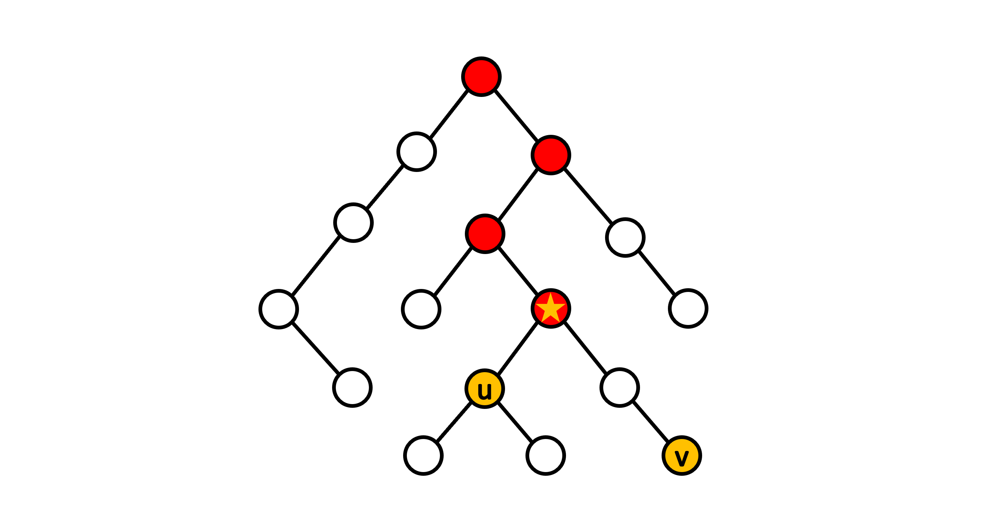

# Lowest Common Ancestor (LCA)

## 前言

在此章節中，我們會介紹經典的最近共同祖先（LCA）問題且整理幾種常見的尋找 LCA 的方法。此外也會提及 LCA 問題與另一經典問題（Range Minimum Query）之間的轉化。

## 定義

給定一棵有 \\( N \\) 個節點的有根樹，對於樹中任一點對 \\( (u,\ v) \\)，其最近共同祖先 \\( LCA(u,\ v) \\) 為同為點 \\( u \\) 和點 \\( v \\) 的祖先中深度最深的點，這邊我們定義點的深度為點到根路徑上所經過的邊數且自己為自己的祖先（為了方便之後討論）。

讀者們可以參考下圖，紅色的點為點 \\( u \\) 和點 \\( v \\) 的共同祖先，其中標星號的點為所有共同祖先中深度最深的點，也就是點 \\( u \\) 和點 \\( v \\) 的最近共同祖先。



## 相關性質

- 如果點 \\( u \\) 為點 \\( v \\) 的祖先，那麼 \\( LCA(u,\ v) \\) 為點 \\( u \\)。
- 如果點對 \\( (u,\ v) \\) 不具祖孫關係，那麼點 \\( u \\) 和點 \\( v \\) 會分別位於 \\( LCA(u,\ v) \\) 的兩個不同子樹內。
- \\( LCA(u,\ v) \\) 必定會位於點 \\( u \\) 到點 \\( v \\) 的最短路徑上且為該路徑上深度最淺的點。
- 在 DFS 的走訪過程中，必定會先經過 \\( LCA(u,\ v) \\)，接著再經過點 \\( u \\) 和點 \\( v \\)。

## 經典題型

> [CSES - Company Queries II](https://cses.fi/problemset/task/1688)
>
> 給定一間擁有 \\( N \\) 名員工的公司且該公司具有樹狀層級制度。除了總經理以外，每名員工都配有一名上司，而你的任務是要處理以下形式的 \\( Q \\) 次詢問：
>
> - 給定 \\( a \\) 和 \\( b \\)，請輸出員工 \\( a \\) 和員工 \\( b \\) 的最近共同上司。
>
> - \\( N,\ Q \leq 2 \times 10^5 \\)

基本上此問題就是在問樹上兩點的最近共同祖先為何，下面我們將介紹幾種常見的作法。

## 演算法

### Brute Force

一個直觀的做法是先從根開始作一次 DFS，確認出每個點的父節點以及時間戳（第一次訪問與最後一次訪問的時間）。接著針對詢問，我們可以藉由預處理好的的資訊暴力往上搜索所求點對 \\( (u,\ v) \\) 中深度較淺的點的祖先，直到當前搜索的點同時也為另一點的祖先，該點即為點對 \\( (u,\ v) \\) 的最近共同祖先。而確認一個點是否為另一點的祖先，我們可以利用時間戳在 \\( O(1) \\) 的時間內得知。

總結一下此作法的時間複雜度：

- 預處理
  - DFS 一次確認出每個點的父節點以及時間戳：\\( O(N) \\)

- 單次查詢
  - 往上搜索點對 \\( (u,\ v) \\) 中深度較淺的點的祖先直到當前搜索的點也為另一點的祖先：\\( O(N) \\)

此作法需要花費 \\( O(NQ) \\) 的時間完成所有查詢。

<details><summary> Sample Code </summary>

- 用 adjacency list 來儲存樹的結構。
- `tin[i]` 代表在 DFS 的過程中，第一次訪問到點 \\( i \\) 的時間。
- `tout[i]` 代表在 DFS 的過程中，最後一次訪問到點 \\( i \\) 的時間。
- `parent[i]` 代表第 \\( i \\) 個節點的父節點。
- 樹的根為點 \\( 1 \\) 且根的父節點為 \\( -1 \\)。

```cpp
#include <bits/stdc++.h>
using namespace std;

int main() {
  ios::sync_with_stdio(0);
  cin.tie(0);

  int N, Q;
  cin >> N >> Q;

  int time = 0;
  vector<int> parent(N + 1, -1), tin(N + 1), tout(N + 1);
  vector<vector<int>> adj(N + 1);

  for (int i = 2; i <= N; ++i) {
    int p;
    cin >> p;
    adj[i].push_back(p);
    adj[p].push_back(i);
  }

  function<void(int)> dfs = [&](int u) -> void {
    tin[u] = ++time;
    for (int v : adj[u]) {
      if (v == parent[u]) continue;
      parent[v] = u;
      dfs(v);
    }
    tout[u] = ++time;
  };

  dfs(1);

  auto is_ancestor = [&](int u, int v) -> bool {
    if (u == -1) return 1;
    return tin[u] <= tin[v] && tout[v] <= tout[u];
  };

  auto LCA = [&](int u, int v) -> int {
    while (!is_ancestor(u, v)) u = parent[u];
    return u;
  };

  for (int i = 0; i < Q; ++i) {
    int u, v;
    cin >> u >> v;
    cout << LCA(u, v) << "\n";
  }

  return 0;
}
    
```

</details>

直觀的做法通常很慢，我們可以觀察到在上述做法當中是順著父節點一個點一個點慢慢往上搜索，導致單次查詢的時間複雜度為線性。而我們接下來要介紹另外一種做法 Binary Lifting，中文稱作倍增法，即是針對這一點去做優化。

### Binary Lifting

已知對於任意正整數，我們可以將其表示為二進制。舉例來說，\\( 13 = 1101_2 = 2^3 + 2^2 + 2^0 \\)。基於這個概念，我們可以用來優化點的抬升。假設抬升距離為 13，相較於每次都是距離 1 的抬升，我們可以將點分別抬升距離 1、4 和 8，此做法可以大幅減少抬升的時間複雜度至 \\( O(\log N) \\)。

然而想要完成這種抬升，我們需要在預處理時多紀錄每個點的第 \\( 2^i \\) 個祖先的資訊 \\( (0\leq i\leq\lfloor\log N\rfloor) \\)，實作上我們可以利用 Dynamic Programming 的概念。假設我們想知道點 \\( u \\) 的第 \\( 2^i \\) 個祖先是誰，我們可以將問題等同於點 \\( u \\) 的第 \\( 2^{i-1} \\) 個祖先的第 \\( 2^{i-1} \\) 個祖先是誰，聽起來有點饒口，不清楚的讀者可以看以下示意圖：


根據這個想法，我們可以列出下列遞迴關係式：

$$ancestor(u,\ i) = \begin{cases} parent(u) & \text {if $i = 0$} \newline ancestor(ancestor(u,\ i-1),\ i-1) & \text{if $i > 0$} \end{cases}$$

這邊 \\( ancestor(u,\ i) \\) 代表點 \\( u \\) 的第 \\( 2^i \\) 個祖先。

利用上述關係式解 DP，我們可以在 \\( O(N\log N) \\) 的時間內預處理完所有點的第 \\( 2^i \\) 個祖先的資訊。等到需要進行點的抬升時，我們即可以在 \\( O(\log N) \\) 的時間內完成。

除了抬升的優化以外，在查詢點對 \\( (u,\ v) \\) 深度較淺的點的祖先中找 LCA 本身具有單調性，直覺上可以利用二分搜來加速。但在稍早提到的 Brute force 當中，我們並沒有提到相關的操作。原因是因為我們只記錄了每個點的父節點的資訊，在處理二分搜的檢查函數上會花費線性的時間，導致整個二分搜的時間複雜度為 \\( O(N\log N) \\)，明顯沒有比較快。

然而對於倍增法來說，因為我們預處理了所有點的第 \\( 2^i \\) 個祖先的資訊，所以我們可以在 \\( O(1) \\) 常數時間內處理完二分搜的檢查函數，進而讓整體二分搜的時間複雜度降至 \\( O(\log N) \\)。

總結一下整個做法：

- 預處理
  - DFS 一次確認出每個點的父節點：\\( O(N) \\)
  - 解 DP 找出所有點的第 \\( 2^i \\) 個祖先 \\( (0\leq i\leq\lfloor\log N\rfloor) \\)：\\( O(N\log N) \\)

- 單次查詢
  - 檢查點對 \\( (u,\ v) \\) 的祖孫關係：\\( O(1) \\)
  - 二分搜找出 LCA（如果需要）：\\( O(\log N) \\)

此作法可以在 \\( O((N+Q)\log N) \\) 的時間內完成所有查詢。

<details><summary> Sample Code </summary>

- `tin[i]` 代表在 DFS 的過程中，第一次訪問到點 \\( i \\) 的時間。
- `tout[i]` 代表在 DFS 的過程中，最後一次訪問到點 \\( i \\) 的時間
- `ancestor[i][j]` 代表第 \\( i \\) 個節點的第 \\( 2^j \\) 個祖先。
- 樹的根為點 \\( 1 \\) 且根的所有祖先節點均為 \\( -1 \\)。

```cpp
#include <bits/stdc++.h>
using namespace std;

int main() {
  ios::sync_with_stdio(0);
  cin.tie(0);

  int N, Q;
  cin >> N >> Q;

  const int logN = __lg(N);

  int time = 0;
  vector<int> tin(N + 1), tout(N + 1);
  vector<vector<int>> ancestor(N + 1, vector<int>(logN + 1));
  vector<vector<int>> adj(N + 1);

  for (int i = 2; i <= N; ++i) {
    int p;
    cin >> p;
    adj[i].push_back(p);
    adj[p].push_back(i);
  }

  function<void(int, int)> dfs = [&](int u, int p) -> void {
    ancestor[u][0] = p;
    tin[u] = ++time;

    for (int i = 1; i <= logN; ++i) {
      ancestor[u][i] =
          ~ancestor[u][i - 1] ? ancestor[ancestor[u][i - 1]][i - 1] : -1;
    }

    for (int v : adj[u]) {
      if (v == ancestor[u][0]) continue;
      dfs(v, u);
    }

    tout[u] = ++time;
  };

  dfs(1, -1);

  auto is_ancestor = [&](int u, int v) -> bool {
    if (u == -1) return 1;
    return tin[u] <= tin[v] && tout[v] <= tout[u];
  };

  auto LCA = [&](int u, int v) -> int {
    if (is_ancestor(u, v)) return u;
    if (is_ancestor(v, u)) return v;

    for (int i = logN; ~i; --i)
      if (!is_ancestor(ancestor[u][i], v)) u = ancestor[u][i];

    return ancestor[u][0];
  };

  for (int i = 0; i < Q; ++i) {
    int u, v;
    cin >> u >> v;
    cout << LCA(u, v) << "\n";
  }

  return 0;
}

```

</details>

### Tarjan's Offline Algorithm

Tarjan 提出的想法是利用 Disjoint Set 來動態地合併子樹，並且用一陣列去記錄集合中深度最淺的點，這邊我們稱為集合的最高點。一開始，所有點都位於一個獨立的並查集且集合的最高點為自己本身，共 \\( N \\) 個集合。接著利用 DFS 去走訪所有點，在 DFS 的走訪過程中，針對經過的每一點 \\( u \\) 我們依序進行以下的操作：

- DFS 遞迴下去搜索點 \\( u \\) 的所有子樹節點
- 遞迴 return 後檢查所有包含點 \\( u \\) 在內的查詢點對，如果另一點為搜索過的狀態，那麼根據 Tarjan 的想法，此時我們可以知道該查詢點對的最近共同祖先為另一點所在集合的最高點。
- 檢查完後將點 \\( u \\) 所處的並查集和其父節點 \\( p \\) 所處的並查集合併
- 將合併後集合的最高點設為點 \\( p \\)

#### Does Tarjan's idea work？

針對任意點對 \\( (u,\ v) \\) 的最近共同祖先，我們可以考慮以下兩種 Case。


對於 Case 1，點 \\( u \\) 和點 \\( v \\) 不具祖孫關係，根據我們稍早提及的最近共同祖先的特性，可知點 \\( u \\) 和點 \\( v \\) 會分別位於 \\( LCA(u,\ v) \\) 的兩個不同子樹內。在 DFS 的走訪過程中，必定會先搜索 \\( LCA(u,\ v) \\)，接著依序搜索點 \\( u \\) 、返回 \\( LCA(u,\ v) \\)、搜索點 \\( v \\)（這邊不失一般性地假設會先搜索點 \\( u \\)）。因此當點 \\( v \\) 遞迴搜索完其所有子樹節點時，點 \\( u \\) 會是搜索過的狀態。此時點 \\( u \\) 和 \\( LCA(u,\ v) \\) 會處於同一並查集且集合的最高點為 \\( LCA(u,\ v) \\)。

而對於 Case 2，點 \\( u \\) 和點 \\( v \\) 具有祖孫關係，點 \\( u \\) 為點對 \\( (u,\ v) \\) 的最近共同祖先。在 DFS 的走訪過程中，必定會先搜索點 \\( u \\)，接著依序搜索點 \\( v \\)、返回點 \\( u \\)。因此當點 \\( v \\) 遞迴搜索完其所有子樹節點時，點 \\( u \\) 會是搜索過的狀態。此時點 \\( u \\) 所處並查集的最高點正好為點 \\( u \\)，因為點 \\( u \\) 尚未搜索完其所有子樹節點，其所處的並查集尚未與其父節點所處的並查集合併，所以點 \\( u \\) 會是其所處並查集的最高點。

而當點 \\( u \\) 搜索完其所有子樹節點時，點 \\( v \\) 也會是搜索過的狀態。此時因為點 \\( v \\) 處於點 \\( u \\) 的子樹內，所以點 \\( v \\) 會和點 \\( u \\) 處於同一並查集且集合的最高點為點 \\( u \\)。

在以上兩種 Case 當中，可以發現對於任意查詢點對 \\( (u,\ v) \\)，Tarjan 的想法都會是正確的。至於為什麼此演算法強制離線，因為 Tarjan 的想法是在 DFS 的走訪過程中去動態合併子樹。如果事先不知道查詢點對為何，我們就無法在走訪過程中去檢查點對之間的關係。

總結一下此作法的時間複雜度，以下所有 Disjoint Set 的操作都有用 union-by-rank 和 path compression 來優化：

- 初始化每個點的並查集和每個集合的最高點：\\( O(N) \\)
- DFS 走訪所有點：\\( O(N) \\)
- 每當一點 \\( u \\) 搜索完其所有子樹節點時，檢查所有包含點 \\( u \\) 在內的查詢點對，另一點是否為搜索過的狀態。如果已搜索過，則當前查詢點對的最近共同祖先為另一點所處並查集的最高點：\\( O(Q\alpha(N)) \\) --- 每個查詢點對只會被檢查兩次。
- 檢查完後將點 \\( u \\) 所處集合和其父節點 \\( p \\) 所處集合合併，並將合併集合的最高點設為點 \\( p \\)：\\( O(N\alpha(N)) \\) --- 所有點的合併次數加起來至多 \\( N \\) 次。

因此針對離線的查詢，Tarjan's algorithm 可以有效率地在 \\( O((N+Q)\alpha(N)) \\) 的時間內完成，相當趨近於線性時間。

<details><summary> Sample Code </summary>

- 用 adjacency list 來儲存樹的結構。
- `ancestor[i]` 代表有著節點 \\( i \\) 作為 representative 的集合的最高點。
- `query[i]` 存放所有滿足點對 \\( (i,\ j) \\) 為查詢點對的點 \\( j \\) 以及相對應是第幾個查詢點對。
- `vis[i]` 代表點 \\( i \\) 是否被搜索過。
- `LCA[i]` 代表第 \\( i \\) 個查詢點對的最近共同祖先。

```cpp
#include <bits/stdc++.h>
using namespace std;

struct DSU {
  int N;
  vector<int> parent, size;
  DSU(int N) : N(N) {
    parent.resize(N + 1);
    size.resize(N + 1, 1);
    for (int i = 1; i <= N; ++i) {
      parent[i] = i;
    }
  }
  int find(int x) { return x == parent[x] ? x : parent[x] = find(parent[x]); }
  void unite(int u, int v) {
    u = find(u), v = find(v);
    if (size[u] > size[v]) swap(u, v);
    parent[u] = v;
    size[v] += size[u];
  }
};

int main() {
  ios::sync_with_stdio(0);
  cin.tie(0);

  int N, Q;
  cin >> N >> Q;

  vector<vector<pair<int, int>>> query(N + 1);
  vector<vector<int>> adj(N + 1);
  vector<int> ancestor(N + 1), LCA(Q);
  vector<bool> vis(N + 1, false);

  DSU dsu(N);

  function<void(int)> dfs = [&](int u) -> void {
    vis[u] = 1;
    ancestor[u] = u;

    for (int v : adj[u]) {
      if (vis[v]) continue;
      dfs(v);
      dsu.unite(u, v);
      ancestor[dsu.find(u)] = u;
    }

    for (auto q : query[u]) {
      int v = q.first, query_num = q.second;
      if (!vis[v]) continue;
      LCA[query_num] = ancestor[dsu.find(v)];
    }
  };

  for (int i = 2; i <= N; ++i) {
    int p;
    cin >> p;
    adj[i].push_back(p);
    adj[p].push_back(i);
  }

  for (int i = 0; i < Q; ++i) {
    int u, v;
    cin >> u >> v;
    query[u].push_back({v, i});
    query[v].push_back({u, i});
  }

  dfs(1);

  for (int i = 0; i < Q; ++i) {
    cout << LCA[i] << "\n";
  }

  return 0;
}

```

</details>

### Heavy Path Decomposition

此小節主要關注於如何利用樹重鏈剖分的概念來查詢點對的最近共同祖先，如果讀者對於樹重鏈的定義以及其相關操作（跳輕邊）還不太清楚的話，建議可以先去觀看相關章節。

這邊我們簡單 recap 一下何謂重鏈，對於一點 \\( u \\) 的子節點 \\( v \\)，如果以點 \\( v \\) 為根的子樹是所有點 \\( u \\) 子樹中 size 最大的，我們稱點 \\( v \\) 為重小孩，點 \\( u \\) 和點 \\( v \\) 相連的邊稱作重邊，由重邊相連所形成的路徑則稱作重鏈，示意圖如下（紅色路徑為重鏈）：


根據定義或是觀察上圖，我們可以知道處於同一重鏈上的任意兩點會具有祖孫關係。藉此特性，我們可以用來查詢任意點對的最近共同祖先。怎麼得出這個結論的呢？以下我們分成兩種 Case 來討論：


對於 Case 1，點 \\( u \\) 和點 \\( v \\) 位於同一重鏈上，兩點具有祖孫關係。因此我們可以知道點 \\( u \\) 為點對 \\( (u,\ v) \\) 的最近共同祖先。

而對於 Case 2，點 \\( u \\) 和點 \\( v \\) 位於不同重鏈上，我們可以透過跳輕邊的方式將點 \\( u \\) 和點 \\( v \\) 調整至同一條重鏈上。假設經過跳輕邊調整之後，點 \\( u \\) 和點 \\( v \\) 分別跳至點 \\( i \\) 和點 \\( j \\)，我們可以得到以下資訊：

- 點 \\( i \\) 和點 \\( j \\) 為祖孫關係，因為位於同一條重鏈上。
- 點對 \\( (i,\ u) \\) 和點對 \\( (j,\ v) \\) 分別為祖孫關係。

沒有頭緒的讀者可以看以下示意圖：


結合上述資訊可知，點 \\( i \\) 為點 \\( u \\) 和點 \\( v \\) 的共同祖先且點 \\( u \\) 和點 \\( v \\) 會在點 \\( i \\) 的不同子樹內，否則點 \\( u \\) 和點 \\( v \\) 在跳上來當前重鏈之前就會在同一重鏈上。因此對於 Case 2，可知點 \\( i \\) 會是點對 \\( (u,\ v) \\) 的最近共同祖先。

總結以下此作法的概念以及時間複雜度：

- 預處理
  - 對樹作重鏈剖分，確認每個點所在的重鏈（一次 DFS 可完成）：\\( O(N) \\)
  - DFS 的過程中同時記錄點深度、父節點、重鏈上深度較淺的點：\\( O(N) \\)

- 單次查詢
  - 透過不斷跳輕邊將查詢點對 \\( (u,\ v) \\) 調整至同一重鏈上：\\( O(\log N) \\)
  - 深度較淺的點即為點對的最近共同祖先

此作法可以在 \\( O(N+Q\log N) \\) 的時間內完成所有查詢。

<details><summary> Sample Code </summary>

- 用 adjacency list 來儲存樹的結構。
- `depth[i]` 代表第 \\( i \\) 個節點的深度。
- `heavyChild[i]` 代表第 \\( i \\) 個節點的重小孩。
- `size[i]` 代表以第 \\( i \\) 個節點為根的子樹大小。
- `top[i]` 代表點 \\( i \\) 所處重鏈上深度最淺的點。
- `parent[i]` 代表第 \\( i \\) 個節點的父節點。

```cpp
#include <bits/stdc++.h>
using namespace std;

int main() {
  ios::sync_with_stdio(0);
  cin.tie(0);

  int N, Q;
  cin >> N >> Q;

  vector<int> depth(N + 1, 0), heavyChild(N + 1), size(N + 1), top(N + 1),
      parent(N + 1);
  vector<vector<int>> adj(N + 1);

  function<void(int, int)> findHeavyChild = [&](int u, int p) -> void {
    size[u] = 1;
    heavyChild[u] = -1;
    parent[u] = p;
    for (int v : adj[u])
      if (v != p) {
        depth[v] = depth[u] + 1;
        findHeavyChild(v, u);
        size[u] += size[v];
        if (heavyChild[u] == -1 || size[v] > size[heavyChild[u]])
          heavyChild[u] = v;
      }
  };

  function<void(int, int, int)> build_link = [&](int u, int p,
                                                 int link_top) -> void {
    top[u] = link_top;
    if (heavyChild[u] == -1) return;
    build_link(heavyChild[u], u, link_top);
    for (int v : adj[u])
      if (v != p && v != heavyChild[u]) build_link(v, u, v);
  };

  function<int(int, int)> LCA = [&](int u, int v) -> int {
    int tu = top[u], tv = top[v];
    while (tu != tv) {
      if (depth[tu] > depth[tv]) {
        u = parent[tu];
        tu = top[u];
      } else {
        v = parent[tv];
        tv = top[v];
      }
    }
    return depth[u] < depth[v] ? u : v;
  };

  for (int i = 2; i <= N; ++i) {
    int p;
    cin >> p;
    adj[i].push_back(p);
    adj[p].push_back(i);
  }

  findHeavyChild(1, -1);
  build_link(1, -1, 1);

  for (int i = 0; i < Q; ++i) {
    int u, v;
    cin >> u >> v;
    cout << LCA(u, v) << "\n";
  }

  return 0;
}

```

</details>

### 轉化成 RMQ 問題

有許多問題可以透過轉化成其他問題的方式來獲得很好的解法，LCA 問題也不是例外。我們可以透過歐拉路徑在線性時間內將 LCA 問題轉化成另一經典問題（Range Minimum Query），解決 RMQ 問題的同時我們也就解決了 LCA 問題。

#### 歐拉路徑

Eulerian path，中文譯作尤拉路徑或是歐拉路徑。在圖論中，我們定義歐拉路徑為圖中滿足剛好經過每一條邊各一次的路徑，而如果同時要求路徑起點和終點必須相同的話，該路徑我們也稱作 Eulerian circuit，中文譯作尤拉或歐拉迴路。然而，並不是所有圖我們都可以在上面找到歐拉路徑或是歐拉迴路，圖必須符合下列條件：

- 無向圖：如果恰有兩點的度數為奇數，則存在歐拉路徑，此二點分別為起終點。如果全部的點度數都是偶數，則存在歐拉迴路。

- 有向圖：如果恰有一點的出度等於入度 + 1、另有一點的入度等於出度 + 1，其餘皆入度等於出度，則存在歐拉路徑，此二點分別為起終點。如果全部的點入度等於出度，則存在歐拉迴路。

而在此小節中，我們主要關心樹上是否存在歐拉路徑，所以我們針對樹來討論。在樹上，我們可以把樹邊想成是一去一回的兩條有向邊，可以發現樹會滿足有向圖中歐拉迴路的條件，代表說我們必定可以在樹上找到歐拉路徑。

確認樹上必有歐拉路徑之後，我們接著馬上來看看如何利用歐拉路徑將 LCA 問題轉化成 RMQ 問題。

#### 建立歐拉路徑

我們可以利用 DFS 走訪來建立歐拉路徑，通常會用一陣列來儲存。在 DFS 的走訪過程中，每經過一個點我們就把該點加入到歐拉路徑，包含返回時所經過的點，不是很清楚的讀者可以看以下示意圖：


觀察歐拉路徑我們可以發現，假設我們想知道點對 \\( (u,\ v) \\) 的最近共同祖先是誰，我們只需要沿著歐拉路徑從點 \\( u \\) 到點 \\( v \\) 找路徑上深度最淺的點就會是點對 \\( (u,\ v) \\) 的 LCA，其中點 \\( u \\) 和點 \\( v \\) 在歐拉路徑上可能會出現很多次，我們取第一次出現即可。比如說如下圖所示，點對 \\( (1,\ 8) \\) 的最近共同祖先就會是沿著歐拉路徑從第一次出現的點 \\( 1 \\) 到第一次出現的點 \\( 8 \\)，路徑上所經過深度最淺的點，也就是點 \\( 6 \\)。


怎麼得出這個結論的呢？我們可以發現在歐拉路徑上從點 \\( u \\) 到點 \\( v \\) 的任意一條路徑，必定會包含點 \\( u \\) 到點 \\( v \\) 的最短路徑。根據稍早提及的最近共同祖先的特性，我們可以知道 \\( LCA(u,\ v) \\) 會位於最短路徑上且為該路徑上深度最淺的點。而除了經過最短路徑之外，我們可能會多經過有在最短路徑上的點的子樹，但由於多經過的這些點深度都比 \\( LCA(u,\ v) \\) 深。因此針對從點 \\( u \\) 到點 \\( v \\) 的任意一條路徑，\\( LCA(u,\ v) \\) 都會是路徑上深度最淺的點，所以在查詢時我們可以選擇任意一條路徑。但為了方便起見，我們可以在不影響結果的情況下針對所有查詢都選擇從第一次出現的點 \\( u \\) 到第一次出現點 \\( v \\) 的路徑。

因此，透過歐拉路徑我們可以將 LCA 問題轉化成找區間最小值的問題。一般來說，我們會另開一陣列來記錄每個點在歐拉路徑上第一次出現時所對應的 index，方便我們在 \\( O(1) \\) 時間內找到對應的區間。


有了上述預處理好的陣列後，剩下的工作就會是處理 RMQ 問題。對於 RMQ 問題，有許多經典的解法像是線段樹、序列分塊或是 Sparse Table，這邊我們不會細講這些經典解法的概念和實作細節，有興趣的讀者可以去觀看相關的章節。而此小節我們主要關注於如何利用高度分塊來達到 \\( O(N) \\) 預處理、每次查詢 \\( O(1) \\) 的做法。

#### O(n) -- O(1) LCQ

觀察 Depth 陣列我們可以發現，陣列中相鄰的值會剛好差 1。原因是因為在建立歐拉路徑時，我們每次只會往上或是往下走一步，所以在歐拉路徑陣列中相鄰的點，點深度會剛好差 1。基於此特性，我們可以用來優化區間最小值的查詢。

高度分塊的 RMQ 同樣是基於序列分塊的概念，先將 Depth 陣列分成 \\( \frac{N}{K} \\) 個大小為 \\( K \\) 的塊，每一塊維護該塊最小值所對應到的 index，存放在另開的 Block 陣列中，如下圖所示（範例中 \\( K = 2 \\)）。


利用分塊查詢的概念，我們會需要進行塊內以及塊之間的最小值搜索。假設我們想知道 Depth 陣列上區間 \\( \left[l,\ r \right] \\) 的最小值，我們可以分成兩種 Case 來討論。如果 \\( l \\) 和 \\( r \\) 屬於同一塊 block，那麼我們只要在該塊裡面從 \\( l \\) 到 \\( r \\) 暴力搜索最小值就好。但如果 \\( l \\) 和 \\( r \\) 屬於不同塊，我們就需要知道區間 \\( \left[l,\ l^{\prime} \right] \\) 的最小值、區間 \\( \left[r^{\prime},\ r \right] \\) 的最小值、\\( l \\) 和 \\( r \\) 中間橫跨過的所有塊的最小值，三個再取最小值即為區間 \\( \left[l,\ r \right] \\) 的最小值。這邊 \\( l^{\prime} \\) 為 \\( l \\) 所屬塊的最後一個 index，\\( r^{\prime} \\) 則為 \\( r \\) 所屬塊的第一個 index。

對於搜索塊之間的最小值，相較於直接遍歷過 \\( l \\) 和 \\( r \\) 中間所有塊，我們可以在 \\(O\left(\frac{N}{K}\log\frac{N}{K}\right) \\) 的時間內先對 Block 陣列建 Sparse Table。基於 RMQ 的特性，之後的查詢可以在 \\( O(1) \\) 時間內辦到 。而對於在塊內搜索最小值，暴力做的話會需要 \\( O(K) \\) 的時間，有沒有更快的作法？

還記得在此小節一開始我們提及的歐拉路徑的特性嗎？藉由該特性，我們其實可以透過像是建立差分數組的方式來將每一塊 block 轉換成大小為 \\( K-1 \\) 的塊，使得新塊內元素只會有 \\( +1 \\) 和 \\( -1 \\) 兩種可能性。舉例來說，假設存在一塊 block A 其內容為 \\( \left[0,1,2,1,0\right] \\)，我們可以將其轉換成內容為 \\( \left[1,1,-1,-1\right] \\) 的新塊。而一般來說我們會將 \\( -1 \\) 轉成 \\( 0 \\)，用 bitmask 的方式來方便紀錄以及識別每一種新塊。

透過此轉換，我們可以發現新塊最多只會有 \\( 2^{K-1} \\) 種。而轉換後有著相同內容的塊，塊內所有區間組合的最小值在塊內所對應的 index offset 都會是相同的，因為新塊內容其實間接說明了原塊內的深度分布。舉例來說，假設存在一塊 block A 其內容為 \\( \left[0,1,0\right] \\)，一塊 block B 其內容為 \\( \left[2,3,2\right] \\)。在經過轉換之後，這兩塊會對應到相同的 bitmask 10，而針對這兩塊內的所有區間組合我們可以發現

- 區間 \\( [1,\ 1] \\)、\\( [2,\ 2] \\) 和 \\( [3,\ 3] \\) 的最小值均分別對應到 index \\( 1 \\)、\\( 2 \\) 和 \\( 3 \\)
- 區間 \\( [1,\ 2] \\) 的最小值均對應到 index \\( 1 \\)
- 區間 \\( [2,\ 3] \\) 的最小值均對應到 index \\( 3 \\)
- 區間 \\( [1,\ 3] \\) 的最小值均對應到 index \\( 1 \\)

因此，相較於每次查詢時都去暴力搜索塊內的最小值，我們其實可以預處理每一種新塊內所有區間組合的最小值在塊內所對應的 index offset，這部分會花費 \\( O(2^{K-1}K^2) \\) 的時間。但針對之後塊內區間搜索最小值的查詢，我們就可以在 \\( O(1) \\) 的時間內查表得知。

而一般為了比較好的時間複雜度，\\( K \\) 我們會取 \\( 0.5\log N \\)，這樣預處理塊內區間最小值的時間複雜度即為

$$
O(2^{K-1}K^2) = O\left( 2^{0.5\log N}\log^2N\right) = O(\sqrt{N}\log^2N) = O(N)
$$

而對 Block 陣列建 Sparse Table 的時間複雜度則為

$$
\begin{aligned}
  O\left(\frac{N}{K}\log\frac{N}{K}\right) &= O\left( \frac{2N}{\log N}\log\frac{2N}{\log N}\right) = O\left[ \frac{2N}{\log N}\left(1+\log\frac{N}{\log N}\right)\right] \newline
  &= O\left( \frac{2N}{\log N}+2N-\frac{2N\log\log N}{\log N}\right) = O(N) \newline
\end{aligned}
$$

兩項預處理的時間複雜度均被壓到 \\( O(N) \\)，這同時也是理論上最佳的時間複雜度。

總結一下此作法跟整體時間複雜度：

- 預處理
  - DFS 一次建立歐拉路徑，同時記錄 Depth 和 First Occurrence 陣列：\\( O(N) \\)。

  - 將 Depth 陣列分塊，每一塊維護最小值所對應的 index 並存放在 Block 陣列。與此同時，計算每一塊的 bitmask 並存放在另開的 Mask 陣列裡：\\( O(N) \\)。

  - 對 Block 陣列建 Sparse Table：\\(O\left(\frac{N}{K}\log\frac{N}{K}\right) \xrightarrow{K=0.5\log N} O(N) \\)

  - 對於 Mask 陣列裡每一塊的 bitmask，紀錄該塊所有區間組合的最小值在塊內所對應的 index offset：\\( O(2^{K-1}K^2) \xrightarrow{K=0.5\log N} O(\sqrt{N}\log^2N) = O(N) \\)

- 單次查詢
  - 對於查詢點對 \\( (u,\ v) \\)，從 First Occurrence 陣列得知相對應的查詢區間 \\( \left[l,\ r \right] \\)：\\( O(1) \\)。

  - 如果 \\( l \\) 和 \\( r \\) 屬於同一塊 block，先透過 Mask 陣列得知該塊的 bitmask 再去查表：\\( O(1) \\)。

  - 如果 \\( l \\) 和 \\( r \\) 屬於不同塊，先透過 Mask 陣列得知 \\( l \\) 和 \\( r \\) 所屬塊的 bitmask，再去查表得知區間 \\( \left[l,\ l^{\prime} \right] \\) 的最小值、區間 \\( \left[r^{\prime},\ r \right] \\) 的最小值。而對於 \\( l \\) 和 \\( r \\) 中間所有塊的最小值，直接查 Block 陣列的 Sparse Table 就可以知道，最後這三個再取最小值即為區間 \\( \left[l,\ r \right] \\) 的最小值：\\( O(1) \\)。

  - 上面兩種 Case 最後紀錄的都會是最小值所對應到的 index，有了 index 我們就可以利用歐拉路徑陣列得知點對 \\( (u,\ v) \\) 的最近共同祖先：\\( O(1) \\)。

因此，\\( O(N) \\) -- \\( O(1) \\) LCQ 可以讓我們在 \\( O(N+Q) \\) 的時間內完成所有查詢。

<details><summary> Sample Code </summary>

- 用 adjacency list 來儲存樹的結構。
- `euler_path[i]` 代表歐拉路徑上的第 \\( i \\) 個點。
- `depth[i]` 代表歐拉路徑上第 \\( i \\) 個點對應的點深度。
- `first_occurrence[i]` 代表點 \\( i \\) 在Eulerian path上第一次出現時所對應的 index。
- `block[i]` 記錄了第 \\( i \\) 個塊內最小值所對應的 index。
- `mask[i]` 代表第 \\( i \\) 個塊的 bitmask。
- `st[i][j]` 記錄了 block 陣列上區間 \\( \left[i,\ i+2^j-1 \right] \\) 中間所有塊的最小值所對應的 index。
- `in_block_RMQ[i][j][k]` 記錄了 bitmask 為 \\( i \\) 的塊，區間 \\( \left[j,\ k \right] \\) 的最小值在塊內所對應的 index offset。
- 以下範例程式碼較為繁複，建議讀者可以花點時間 trace 過一遍。

```cpp
#include <bits/stdc++.h>
using namespace std;

int main() {
  ios::sync_with_stdio(0);
  cin.tie(0);

  int N, Q;
  cin >> N >> Q;

  vector<vector<int>> adj(N + 1);
  vector<int> euler_path, depth, first_occurrence(N + 1);

  for (int i = 2; i <= N; ++i) {
    int p;
    cin >> p;
    adj[i].push_back(p);
    adj[p].push_back(i);
  }

  function<void(int, int, int)> dfs = [&](int u, int p, int d) {
    first_occurrence[u] = euler_path.size();
    euler_path.push_back(u);
    depth.push_back(d);

    for (int v : adj[u])
      if (v != p) {
        dfs(v, u, d + 1);
        euler_path.push_back(u);
        depth.push_back(d);
      }
  };

  dfs(1, -1, 0);

  // precompute the log values
  int M = euler_path.size();
  vector<int> log(M + 1);
  log[1] = 0;
  for (int i = 2; i <= M; ++i) log[i] = log[i / 2] + 1;

  // build block and mask array.
  const int block_size = max(1, log[M] / 2),
            block_cnt = (M + block_size - 1) / block_size;

  vector<int> block(block_cnt), mask(block_cnt, 0);

  for (int i = 0, j = 0, b = 0; i < M; ++i, ++j) {
    if (j == block_size) j = 0, ++b;
    if (j == 0 || depth[i] < depth[block[b]]) block[b] = i;
    if (j > 0 && (i >= M || depth[i] > depth[i - 1])) mask[b] += 1 << (j - 1);
  }

  // build sparse table for block array.
  const int table_size = log[block_cnt] + 1;
  vector<vector<int>> st(block_cnt, vector<int>(table_size));

  for (int i = 0; i < block_cnt; ++i) st[i][0] = block[i];
  for (int j = 1; j < table_size; ++j) {
    for (int i = 0; i < block_cnt; ++i) {
      int ni = i + (1 << (j - 1));
      if (ni >= block_cnt)
        st[i][j] = st[i][j - 1];
      else
        st[i][j] = (depth[st[i][j - 1]] < depth[st[ni][j - 1]] ? st[i][j - 1]
                                                               : st[ni][j - 1]);
    }
  }

  // precompute in-block RMQ for each block
  const int ways = 1 << (block_size - 1);
  vector<vector<vector<int>>> in_block_RMQ(ways);

  for (int i = 0; i < block_cnt; ++i) {
    if (!in_block_RMQ[mask[i]].empty()) continue;

    in_block_RMQ[mask[i]].resize(block_size, vector<int>(block_size));

    for (int j = 0; j < block_size; ++j) {
      in_block_RMQ[mask[i]][j][j] = j;
      for (int k = j + 1; k < block_size; ++k) {
        in_block_RMQ[mask[i]][j][k] = in_block_RMQ[mask[i]][j][k - 1];
        int idx = i * block_size + k;
        if (idx < M &&
            depth[idx] < depth[i * block_size + in_block_RMQ[mask[i]][j][k]])
          in_block_RMQ[mask[i]][j][k] = k;
      }
    }
  }

  auto LCA = [&](int u, int v) -> int {
    u = first_occurrence[u], v = first_occurrence[v];
    if (u > v) swap(u, v);

    int u_block = u / block_size, v_block = v / block_size,
        u_offset = u % block_size, v_offset = v % block_size;

    if (u_block == v_block)
      return euler_path[u_block * block_size +
                        in_block_RMQ[mask[u_block]][u_offset][v_offset]];

    int mn1 = u_block * block_size +
              in_block_RMQ[mask[u_block]][u_offset][block_size - 1];
    int mn2 = v_block * block_size + in_block_RMQ[mask[v_block]][0][v_offset];
    int lca = depth[mn1] < depth[mn2] ? mn1 : mn2;

    if (u_block + 1 < v_block) {
      int sz = log[v_block - u_block - 1];
      int mn3 = st[u_block + 1][sz], mn4 = st[v_block - (1 << sz)][sz];
      int mn = depth[mn3] < depth[mn4] ? mn3 : mn4;
      lca = depth[lca] < depth[mn] ? lca : mn;
    }

    return euler_path[lca];
  };

  // answer queries
  for (int i = 0; i < Q; ++i) {
    int u, v;
    cin >> u >> v;
    cout << LCA(u, v) << "\n";
  }
  return 0;
}

```

</details>

這個方法常數很高，比賽中並不實用，但是個很漂亮的做法可以達到理論上最佳的時間複雜度。

## Exercises

我們來看一些可以使用 LCA 來解的例題。

> [CSES - Distance Queries](https://cses.fi/problemset/task/1135)
>
> 給定一棵有 \\( N \\) 個節點的樹，你的任務是要處理以下形式的 \\( Q \\) 次詢問：
>
> - 給定 \\( a \\) 和 \\( b \\)，請輸出點 \\( a \\) 到點 \\( b \\) 的最短路徑的距離為何。
>
> - \\( N,\ Q \leq 2 \times 10^5 \\)

<details><summary> Solution </summary>

這題是經典的求樹上兩點距離的問題。已知對於任意點對 \\( (u,\ v) \\)，\\( LCA(u,\ v) \\) 必定會位於點 \\( u \\) 到點 \\( v \\) 的最短路徑上。因此針對查詢點對 \\( (a,\ b) \\)，我們可以先找出 \\( LCA(a,\ b) \\)，然後利用點 \\( a \\) 的深度加上點 \\( b \\) 的深度，最後再減去兩倍的 \\( LCA(a,\ b) \\) 的深度，即為點 \\( a \\) 到點 \\( b \\) 的距離。

</details>

> [CF 519E - A and B and Lecture Rooms](https://codeforces.com/contest/519/problem/E)
>
> 題意為給定一棵有 \\( N \\) 個節點的樹，你的任務是要處理以下形式的 \\( Q \\) 次詢問：
>
> - 給定 \\( a \\) 和 \\( b \\)，請輸出樹上有多少點 \\( i \\) 滿足點 \\( a \\) 到點 \\( i \\) 的距離等於點 \\( b \\) 到點 \\( i \\) 的距離。
>
> - \\( N,\ Q \leq 10^5 \\)

<details><summary> Solution </summary>

以下我們可以分成四種 Case 來討論：

- \\( a \\) 等於 \\( b \\)
- 點 \\( a \\) 到點 \\( b \\) 的距離為奇數
- 點 \\( a \\) 到點 \\( b \\) 的距離為偶數且中點為 \\( LCA(a,\ b) \\)
- 點 \\( a \\) 到點 \\( b \\) 的距離為偶數但中點不為 \\( LCA(a,\ b) \\)

對於 Case 1，很明顯答案會是 \\( N \\)。

對於 Case 2，觀察後我們可以發現樹上沒有任何點可以滿足題目要求，所以答案會是 \\( 0 \\)。

對於 Case 3，假設點 \\( A \\) 和點 \\( B \\) 為 \\( LCA(a,\ b) \\) 的小孩且兩點分別為點 \\( a \\) 和點 \\( b \\) 的祖先。我們可以發現從 \\( LCA(a,\ b) \\) 出發往非點 \\( A \\) 和點 \\( B \\) 的方向走的話，能到達的所有點均能滿足題目要求。因此，答案會是 \\( N \\) 減去以點 \\( A \\) 為根的子樹大小和以點 \\( B \\) 為根的子樹大小。

對於 Case 4，假設點 \\( i \\) 為點 \\( a \\) 和點 \\( b \\) 的距離中點且點 \\( b \\) 的深度較點 \\( a \\) 深。我們可以發現從點 \\( i \\) 出發往非點 \\( p \\) 和點 \\( B \\) 的方向走的話，能到達的所有點均能滿足題目要求（這邊點 \\( p \\) 為點 \\( i \\) 的父節點，點 \\( B \\) 為點 \\( i \\) 的小孩且同時為點 \\( b \\) 的祖先）。因此，答案會是以點 \\( i \\) 為根的子樹大小減去以點 \\( B \\) 為根的子樹大小。

</details>

> [CF 609E - Minimum spanning tree for each edge](https://codeforces.com/contest/609/problem/E)
>
> 給定一張有 \\( N \\) 個點和 \\( M \\) 條帶權重邊的連通無向圖，圖中沒有自環及重邊。你的任務是要針對圖中的每一條邊，輸出有包含到該邊的 minimal spanning tree 的權重。
>
> - \\( N \leq 2 \times 10^5 \\)
>
> - \\( N-1 \leq M \leq 2 \times 10^5 \\)

<details><summary> Solution </summary>

根據題意，我們可以分成兩個 Case 來討論。對於 Case 1，如果給定的邊已經位於該圖的最小生成樹上，那麼我們就直接輸出最小生成樹的權重。而對於 Case 2，如果給定的邊不位於最小生成樹上，那麼我們就需要先將給定的邊加入到最小生成樹中，假設給定邊的兩端點為點 \\( u \\) 和點 \\( v \\)。加入的同時，給定邊會和點 \\( u \\) 到 點 \\( v \\) 的最短路徑組合起來形成環。而為了要取 minimal 且維持樹的結構，我們需要移除環上權重最大的邊，這條邊不會是給定的邊，否則給定的邊會符合 Case 1。因此針對 Case 2，我們需要找到點 \\( u \\) 到 點 \\( v \\) 最短路徑上權重最大的邊。

關於為什麼這樣做會給我們 minimal 的結果，有興趣的讀者可以參考本文附上的參考資料。

而針對如何找到點 \\( u \\) 到 點 \\( v \\) 最短路徑上權重最大的邊，我們可以利用 \\( LCA(u,\ v) \\) 將最短路徑拆分成兩條路徑，所求即為兩條路徑上權重最大值的最大值。搭配上 binary lifting 的想法，在預處理點 \\( u \\) 的第 \\( 2^i \\) 個祖先是誰的同時，我們可以多預處理從點 \\( u \\) 到點 \\( u \\) 的第 \\( 2^i \\) 個祖先路徑上最大的權重，遞迴關係式如下：

$$maxWeight(u,\ i) = \begin{cases} w(u,\ parent(u)) & \text {if $i = 0$} \newline maxWeight(maxWeight(u,\ i-1),\ i-1) & \text{if $i > 0$} \end{cases}$$

這邊 \\( maxWeight(u,\ i) \\) 代表點 \\( u \\) 到點 \\( u \\) 的第 \\( 2^i \\) 個祖先路徑上最大的權重，\\( w(u,\ parent(u)) \\) 則代表點 \\( u \\) 和其父節點連邊的權重。

有了該資訊，我們就可以在 \\( O(\log N) \\) 的時間內得知最小生成樹上兩點最短路徑的最大權重。而針對 Case 2，我們輸出的答案就會是最小生成樹的權重減去給定邊兩端點樹上最短路徑的最大權重，最後再加上給定邊的權重。

<details><summary> Sample Code </summary>

```cpp
#include <bits/stdc++.h>
using namespace std;

int main() {
  ios::sync_with_stdio(0);
  cin.tie(0);

  int n, m;
  cin >> n >> m;

  vector<array<int, 3>> edges, queries;

  for (int i = 0; i < m; ++i) {
    int u, v, w;
    cin >> u >> v >> w, --u, --v;
    if (u > v) swap(u, v);
    edges.push_back({w, u, v});
    queries.push_back({w, u, v});
  }

  sort(edges.begin(), edges.end());
  set<array<int, 2>> spanning_tree;
  long long ans = 0;
  vector<vector<array<int, 2>>> adj(n);
  vector<int> p(n), size(n, 1);

  for (int i = 0; i < n; ++i) p[i] = i;

  function<int(int)> find = [&](int x) -> int {
    return x == p[x] ? x : p[x] = find(p[x]);
  };

  auto joint = [&](int a, int b) { return find(a) == find(b); };

  auto unite = [&](int a, int b) {
    a = find(a), b = find(b);
    if (size[a] > size[b]) swap(a, b);
    p[a] = b;
    size[b] += size[a];
  };

  for (array<int, 3>& e : edges) {
    int w = e[0], u = e[1], v = e[2];
    if (joint(u, v)) continue;
    unite(u, v);
    ans += w;
    spanning_tree.insert({u, v});
    adj[u].push_back({w, v});
    adj[v].push_back({w, u});
  }

  int time = 0;
  vector<vector<int>> anc(n, vector<int>(19)), mx(n, vector<int>(19));
  vector<int> d(n, 0), tin(n), tout(n);

  function<void(int, int)> dfs = [&](int u, int p) -> void {
    anc[u][0] = p;
    tin[u] = ++time;
    for (int i = 1; i < 19; ++i) {
      anc[u][i] = ~anc[u][i - 1] ? anc[anc[u][i - 1]][i - 1] : -1;
      mx[u][i] = ~anc[u][i - 1] ? max(mx[u][i - 1], mx[anc[u][i - 1]][i - 1])
                                : mx[u][i - 1];
    }

    for (array<int, 2>& v : adj[u]) {
      if (v[1] ^ p) {
        d[v[1]] = d[u] + 1;
        mx[v[1]][0] = v[0];
        dfs(v[1], u);
      }
    }

    tout[u] = ++time;
  };

  dfs(0, -1);

  auto is_ancestor = [&](int u, int v) -> bool {
    if (u == -1) return 1;
    return tin[u] <= tin[v] && tout[v] <= tout[u];
  };

  auto lca = [&](int u, int v) {
    if (is_ancestor(u, v)) return u;
    if (is_ancestor(v, u)) return v;
    for (int i = 18; ~i; --i)
      if (!is_ancestor(anc[u][i], v)) u = anc[u][i];
    return anc[u][0];
  };

  auto get_max = [&](int u, int d) {
    int res = 0;
    for (int i = 0; i < 19; ++i)
      if (d & 1 << i) {
        res = max(res, mx[u][i]);
        u = anc[u][i];
      }
    return res;
  };

  auto qry = [&](int u, int v) {
    int LCA = lca(u, v);
    int mx1 = get_max(u, d[u] - d[LCA]);
    int mx2 = get_max(v, d[v] - d[LCA]);
    return max(mx1, mx2);
  };

  for (array<int, 3>& q : queries) {
    int w = q[0], u = q[1], v = q[2];
    if (spanning_tree.find({u, v}) != spanning_tree.end()) {
      cout << ans << "\n";
      continue;
    }
    cout << ans - qry(u, v) + w << "\n";
  }
  return 0;
}

```

</details>

</details>

## Summary

在本文當中，我們整理了五種常見的尋找樹上最近共同祖先的方法，分別為：

- 預處理 \\( O(N) \\)、每次查詢 \\( O(N) \\) 的暴力作法。
- 預處理 \\( O(N\log N) \\)、每次查詢 \\( O(\log N) \\) 的倍增法。
- 強制離線 \\( O((N+Q)\alpha(N)) \\) 的 Tarjan's offline algorithm。
- 利用樹重鏈剖分的相關操作達到預處理 \\( O(N) \\)、每次查詢 \\( O(\log N) \\) 的作法。
- 預處理 \\( O(N) \\)、每次查詢 \\( O(1) \\) 的高度分塊區間最小值查詢。

以時間複雜度來看，高度分塊區間最小值查詢的作法應該會是所有作法當中最快的。但由於其實作複雜、常數過大，實際跑起來跟其他做法相比並不會相差甚遠，單純只有理論上的意義。筆者自己比較喜歡使用倍增法來解決 LCA 的相關問題，因為實作上比較簡單，而且想法上也比較直覺。對於大部分 LCA 問題的 problem size 來說，每次查詢 \\( O(\log N) \\) 也算跑得過，因此滿推薦讀者們可以使用倍增法。

## References

- [Lowest Common Ancestor - O(sqrt(N)) and O(log N) with O(N) preprocessing](https://cp-algorithms.com/graph/lca.html)
- [Lowest Common Ancestor - Binary Lifting](https://cp-algorithms.com/graph/lca_binary_lifting.html)
- [Lowest Common Ancestor - Tarjan's off-line algorithm](https://cp-algorithms.com/graph/lca_tarjan.html)
- [Lowest Common Ancestor - Farach-Colton and Bender Algorithm](https://cp-algorithms.com/graph/lca_farachcoltonbender.html)
- [解决LCA问题的三种算法](https://blog.csdn.net/qq_43549984/article/details/100144030?spm=1001.2101.3001.6650.2&utm_medium=distribute.pc_relevant.none-task-blog-2%7Edefault%7EBlogCommendFromBaidu%7ERate-2-100144030-blog-7836649.235%5Ev32%5Epc_relevant_increate_t0_download_v2&depth_1-utm_source=distribute.pc_relevant.none-task-blog-2%7Edefault%7EBlogCommendFromBaidu%7ERate-2-100144030-blog-7836649.235%5Ev32%5Epc_relevant_increate_t0_download_v2&utm_relevant_index=5)
- [最近公共祖先 - OI Wiki](https://oi-wiki.org/graph/lca/)
- [Tree - 演算法筆記](https://web.ntnu.edu.tw/~algo/Tree2.html#1)
- [Range Minimum Query and Lowest Common Ancestor](https://www.topcoder.com/thrive/articles/Range%20Minimum%20Query%20and%20Lowest%20Common%20Ancestor)
- [LCA problems](https://codeforces.com/blog/entry/43917)
- [圖論進階](https://tioj.ck.tp.edu.tw/uploads/attachment/5/33/8.pdf)
