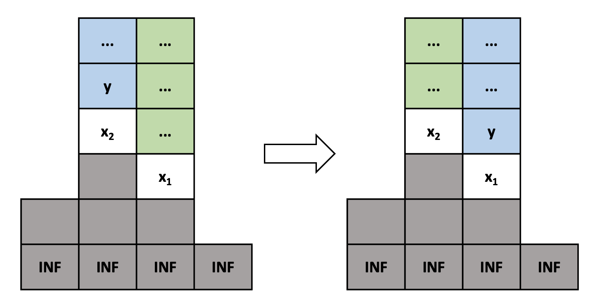
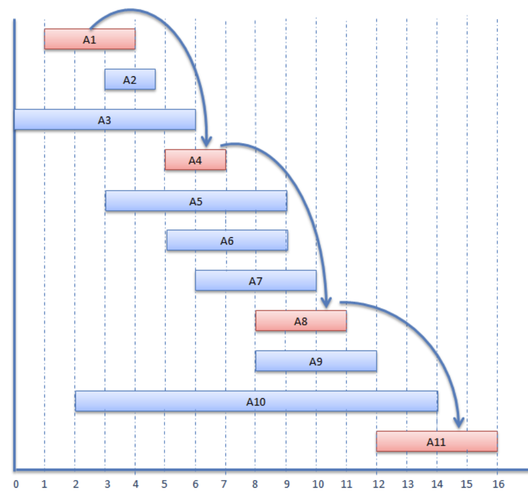

# Basic Greedy

## Elements of Greedy Algorithm

Greedy Algorithm 主要的想法就是對於當前的狀態，要做出一個最佳的選擇，並希望這個選擇最終能讓我們找到整個問題的最佳解。

Greedy Algorithm 通常是由以下兩個性質組成：

- **Greedy-choice property** : 最佳解可以從我當前的 greedy choice 來得出，或者說至少有一組最佳解會包含我做的 greedy choice。
- **Optimal substructure** : 最佳解會包含子問題的最佳解。

Greedy choice 即為我們 Greedy Algorithm 的策略。若滿足上面兩個性質，我們可以持續選擇我們的 Greedy choice，然後將問題轉換成相同問題只是 problem size 變小，直到找到最佳解為止。

這樣講可能很抽象，以下舉幾個題目來方便讀者理解。建議讀者將 Example 中的所有題目都看完並自己想過。

## Examples

> [CSES - Tasks and Deadlines](https://cses.fi/problemset/task/1630)
>
> 要執行 \\( n \\) 個任務。每個任務都有花費時間 \\( d \\) 與死線 \\( t \\)。從時間點 \\( 0 \\) 開始，你一次只能執行一個任務，執行完一個任務後能獲得的獎勵是 \\( d - f \\)，\\( d \\) 是死線，\\( f \\) 是完成時間。請問在可以任意決定任務執行順序的情況下，獎勵最大是多少。

令 \\( d_i \\) 為第 \\(i \\) 個執行的任務的死線，\\( f_i \\) 為第 \\( i \\) 個執行的任務的完成時間，我們要最大化 \\( \sum{d_i - f_i} \\)。

可以發現 \\( \sum{d_i} \\) 其實是固定的我們無法改變它，可以將其先忽略。問題變成要找到一個執行順序最小化 \\( \sum{f_i} \\)。解答是按照花費時間由小到大執行即可，以下來證明為什麼這個演算法是正確的。

### Greedy-choice property

我們的 greedy choice 是花費時間最小的任務第一個執行。以下使用反證法證明必定存在一組最佳解是首先執行花費時間最小的任務。

考慮一個最佳解但第一個執行的不是花費時間最小的任務，我們可以將花費時間最小的任務和第一個交換執行順序，這樣所有在他們之間的任務的結束時間以及執行完第一個任務的時間都會減少，導致獲得一個更好的解與最佳解這個前提矛盾，故得證。

例如，假設四個任務的時間花費為 3, 4, 5, 6：

- 若執行順序為 5 -> 4 -> 3 -> 6，則結束時間分別是 5, 9, 12, 18
- 將最小的和第一個交換，執行順序變成 3 -> 4 -> 5 -> 6，則結束時間分別是 3, 7, 12, 18，這樣 \\( \sum{f_i} \\) 更小。

### Optimal Substructure

接著我們來證明有 Optimal Substruture 的性質，也就是最佳解會包含子問題的最佳解。

原問題是要計算 \\( \sum{f_i} \\) 的最小值。我們首先 greedy choice 了一個花費時間最小的任務來執行之後，假設其時間花費為 \\( d \\)，原問題將變成計算 \\( d × n + \\)剩餘 \\( n - 1 \\) 個任務的 \\( \sum{f_i} \\)。可以輕易用反證法證明一定是取剩餘 \\( n - 1 \\) 個任務的最佳解。故得證此問題有 Optimal Substructure。

由上述兩個性質，我們可以選擇我們的 Greedy choice，也就是選擇當前花費時間最小的任務來執行，因為我們已經證明了至少有一組最佳解會先選他，然後將問題轉換成相同問題但是 problem size 減一，又因為有 Optimal Substurcture，可以重複使用我們的 greedy choice。最終即可找到最佳解。

當然證明 Greedy 演算法的正確性不一定要照著上述的邏輯，例如也可以直接證明按照花費時間由小到大執行能獲得最小值，然後證明將執行順序中花費時間逆序的配對交換會讓答案變好，因此只要序列有逆序的配對就將其交換直到沒有，就會獲得按照花費時間由小到大的順序。

> [CSES - Tower](https://cses.fi/problemset/task/1073)
>
> 你將按照一個順序獲得 \\( n \\) 個方塊。第 \\( i \\) 個方塊有大小 \\( k_i \\)。你將使用這些方塊來建造方塊塔，當有兩個方塊疊在一起時，上面的方塊要比下面的方塊還小。初始沒有任何一座方塊塔，對於依序獲得的每一個方塊，你可以選擇堆在某個方塊塔的頂端之上，或者是當作一個新的塔的底，請問在處理完 \\( n \\) 個方塊後，能構成得塔的數量最少是多少。

作法為對於依序獲得的每一個方塊，將其放置在可以放的塔中頂端數字最小的之上，若不存在可以放的塔，就將其當做新的塔的底。例如下圖：目前有三座塔，要處理大小為 2 的方塊，他可以放在 5 和 3 之上，因為 3 比較小，所以將其放在 3 之上。

我們可以想像永遠都有一個無限大的方塊在最底下，這樣就可以省略不存在可以放的塔的狀況。我們的 greedy choice 為「對於依序獲得的每一個方塊，將其放置在可以放的塔中頂端數字最小的之上」，以下將證明其正確性。

假設有一個最佳解（這裡的最佳解指的是處理方塊的「方式」使得最終塔的數量最少）沒有遵守我們的 greedy choice，也就是說假設我們要處理大小為 \\( y \\) 的方塊，而且 \\( y < x_1 < x_2 \\)，在某個時刻，我們將 \\( y \\) 放在 \\( x_2 \\) 之上而非 greedy choice 會選擇的 \\( x_1 \\) 之上。我們接著要證明，放在 \\( x_1 \\) 之上答案不會比較差，因此必定還是能構成一組最佳解。

如下圖左邊，藍色部分為最佳解中 \\( y \\) 以及它之上的方塊，綠色部分為 \\( x_1 \\) 之上的方塊。可見 \\( y \\) 放在 \\( x_2 \\) 之上而非我們 greedy choice 會選擇的 \\( x_1 \\)。因為 \\( y < x_1 \\)，\\( y \\) 可以被放到 \\( x_1 \\) 之上，而之後所有 \\( y \\) 以上的方塊在處理時也能夠被放在 \\( y \\) 以上。同理，因為 \\( x_1 < x_2 \\)，所有在 \\( x_1 \\) 之上的方塊一定也能被放在 \\( x_2 \\) 之上。因此，我們可以將 \\( y \\) 放到 \\( x_1 \\) 之上而非 \\( x_2 \\)，等同於將最佳解中的藍色與綠色部分交換，成為以下右邊所。這仍然會是合法且能構造出來的解，答案數量也不會比原本的最佳解還糟，故得證。

對於沒有遵守 greedy choice 的最佳解，我們都可以將其轉換成有遵守 greedy choice 的最佳解，故必存在一組最佳解會遵守我們的 greedy choice。因此這個做法能計算出答案。

## Excercises

> [CSES - Movie Festival](https://cses.fi/problemset/task/1629)
>
> 給定 \\( N \\) 部電影以及每一部電影的開始與結束時間，請問在不重疊的情況下，最多能看幾部電影。

Solution

可以提出很多 greedy 的策略，例如先挑最早開始的電影、先挑時間最短的電影等，但是都是錯的。要如何證明一個 greedy 策略是錯誤的呢？最簡單的方式就是找反例。讀者可以自行構造看看前面提的錯誤策略的反例。

正確作法為，將電影按照結束時間由小到大排序，先挑最早結束的電影，接著在不重疊的情況下持續挑最早結束的直到沒有電影可挑為止。如下圖所示：

證明留給讀者練習。

Hint：可以從證明至少有一組最佳解包含結束時間最早的電影開始著手。

> Fractional Knapsack Problem
>
> 有 \\( N \\) 個物品，每個物品都有重量 \\( w_i \\) 和價值 \\( v_i \\)。每個物品也都可以分割，也就是說我可以只取某物品的一半或四分之一。請計算在可裝進重量上限 \\( L \\) 的背包前提下，選出來的物品最大價值總和是多少。

Solution

將物品按照 \\( \frac{v_i}{w_i} \\) 也就是每單位重量的價值排序，優先挑選該值較大的直到不能選。證明留給讀者練習。

Hint: 證明若不按照每單位重量的價值來挑，將挑選順序逆序的部分交換必能得到一組相同或者是更好的解。

> [TIOJ 1072 A.誰先晚餐](https://tioj.ck.tp.edu.tw/problems/1072)
>
> 有一位廚師與 \\( N \\) 位顧客，已知烹煮第 \\( i \\) 位顧客的餐點需要花 \\( C_i \\) 單位時間，第 \\( i \\) 位顧客把他的餐點吃完需要花 \\( E_i \\) 時間，求廚師在一次只能做一道菜，且做完後顧客可以馬上開始吃它的情況下，從廚師開始煮第一道餐點開始，到最後一個人吃完為止，花費時間最少是多少。

Solution

廚師按照吃餐點的速度由慢到快來烹煮。證明留給讀者練習。

> Minimum number of increasing subsequence covering a sequence
>
> 給定一個序列，求該序列最少能被分成幾條遞增子序列使得每個元素都恰好在在某條遞增子序列內。例如：[2, 13, 7, 10, 2, 4] 可以被分成三條遞增子序列 [2, 7, 10], [13], [2, 4]。

Solution

此問題為非常經典的問題，可以參考 [USACO Guide - Longest Increasing Subsequence](https://usaco.guide/gold/lis?lang=cpp#example---pcb) 章節中的解答。注：連結中的題目與上述的不同，但是將包裝拆開後會等價求此問題的解。

## Summary

- Optimal Substructure 通常都很直觀，不會有人特別去證明它。
- 對於沒有 Greedy-choice property 但是有 Optimal substructure 的問題，可以使用 Dynamic Programming 這個技巧來解。
- Greedy 和 Dp 的差異是，對於當前狀態，Greedy 總是能直接做出最終能得到最佳解的選擇，而 Dp 則是得枚舉看看每個選擇，並透過選擇後的子問題的答案來決定哪個選擇才是最佳的。
- 可能會有問題有 Greedy-choice property 但是沒有 Optimal substructure，通常可能是因為難以定義滿足性質的子問題，但這不代表就不能使用 Greedy Algorithm 求出。
- 當比賽遇到題目好像可以用 Greedy 的想法且想不到反例時，可以考慮直接寫寫看，讓結果來驗證正確性，畢竟 AC 時間也是一個會影響比賽結果的因素。但在沒有證明或稍微想過正確性前需要承擔猜錯的風險。如果是練習時，建議要想過並理解為什麼該問題 Greedy 是正確的。

## References

- [Episode 14 - Exchange Arguments By Algorithms Live!](https://www.youtube.com/watch?v=Oq1seKJvfQU)
  - 教你如何證明 Greedy 策略，推薦觀看。
- [[2022 HWTC] Day3 - Greedy & Dynamic programming](https://drive.google.com/file/d/1cks-b5ELqYp2el-V8-WfJxZbb2An8AQ-/view?usp=sharing)
- BF Algo 講義
