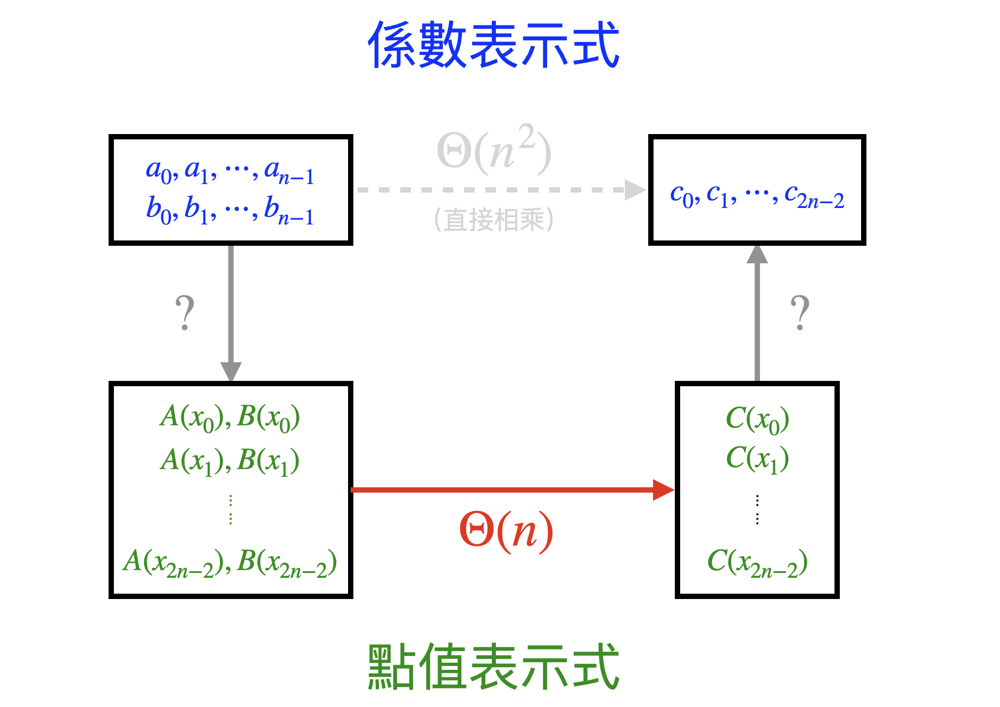
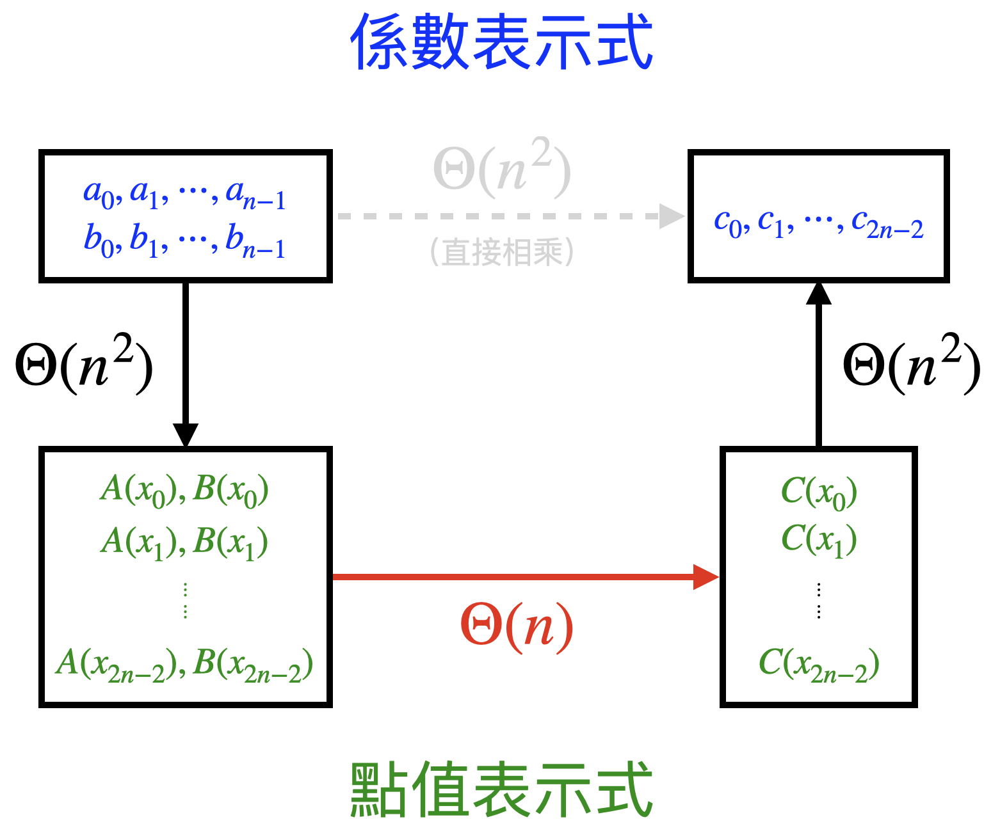
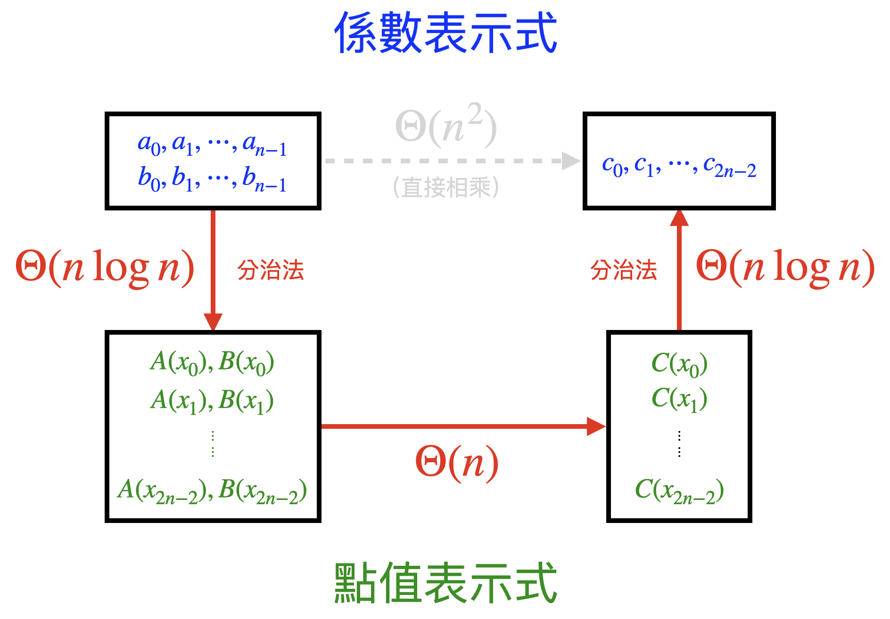

# Fast Fourier Transform (FFT)

本單元介紹快速傅立葉轉換法 (Fast Fourier Transform, 簡稱 FFT). FFT 常被利用於計算兩多項式的相乘，即給定兩個 \\( n \\) 次多項式，求兩多項式的乘積。直覺上有個 \\( \Theta(n^2) \\) 的算法是將係數逐一相乘再相加，而 FFT 利用分治法提供時間為 \\( \Theta(n \log n) \\) 的算法。為了討論方便，我們有以下假設：

- 所有 \\( n \\) 皆為 \\( 2 \\) 的冪次方, 即存在正整數 \\( k \\) 使得 \\( n = 2^k \\).
- 多項式 \\( A(x) \\) 和 \\( B(x) \\) 為被乘式和乘式，次方為 \\( n-1 \\) 次。相乘結果為 \\( 2n-2 \\) 次多項式 \\( C(x) \\).

實作上，若 \\( n-1 \\) 次多項式的 \\( n \\) 不為 \\( 2 \\) 的冪次，我們會將多項式拓展至 \\( m-1 \\) 次，並在新增的次方係數補零，其中 \\( m \\) 為大於 \\( n \\) 且為 \\( 2 \\) 的冪次中最小的數。例如我們會將
$$
5x^4+4x^3+3x^2+2x+1
$$
拓展至
$$
0x^7+0x^6+0x^5+5x^4+4x^3+3x^2+2x+1
$$

若 \\( A(x) \\) 和 \\( B(x) \\) 的次數不同，我們也會將兩多項式拓展至相同次數。

本文首先介紹兩種多項式的表示式，這兩種表示式之間的轉換就是 FFT, 其性質在本文扮演重要的角色。再來介紹 \\( n \\) 次單位根 (The principal nth root of unity) 和范德蒙矩陣 (Vandermonde matrix) 兩個數學工具。這兩個數學工具會在後面操作分治法時有很大的幫助。最後會將所有工具和計算方法合併，得到一個透過 FFT 在 \\( \Theta(n \log n) \\) 時間完成多項式相乘的演算法。

## 多項式表示式

較廣為人用的多項式表示法有以下兩種：

### 係數表示式 (Coefficient representation)

給定 \\( n-1 \\) 次多項式 \\( A(x) = a_0 + a_1x + a_2x^2 + \cdots + a_{n-1}x^{n-1} \\). 我們將係數取出形成一個向量 \\( a = (a_0, a_1, \cdots, a_{n-1}) \\). 該向量即為 \\( A(x) \\) 的係數表示式。係數表示式是兩者中最常被使用的，同時也是 \\( A(x)\\) 和 \\( B(x) \\) 兩多項式最一開始的表示式。

### 點值表示式 (Point-value representation)

給定實數平面上相異且不共 \\( n-2 \\) 次多項式的 \\( n \\) 個點。這 \\( n \\) 個點能唯一決定一個 \\( n-1 \\) 次多項式。若集合 \\( S_A = \\{(x_0, y_0), (x_1, y_1), \cdots, (x_{n-1}, y_{n-1})\\} \\) 中，每個元素皆滿足 \\( y = A(x) \\), 且任何 \\( n-2 \\) 次多項式都無法包含所有點，則我們稱 \\( S_A \\) 為 \\( n-1 \\) 次多項式 \\( A(x) \\) 的點值表示式。注意上述條件讓 \\( S_A \\) 可以不只有 \\( n \\) 個點但至少需要有 \\( n \\) 個點.

點值表示式的好處在於可以花 \\( \Theta(n) \\) 的時間計算多項式相乘。若以點值表示式給定 \\( A(x), B(x) \\) 兩個 \\( n-1 \\) 次多項式，只需要 \\( \Theta(n) \\) 的時間即可得到 \\( C(x) \\) 的點值表示式。

例如給定 \\( S_A, S_B \\) 兩基數為 \\( 2n-1 \\) 關於 \\( n-1 \\) 次多項式 \\( A(x) \\) 和 \\( B(x) \\)的點值表示式
$$
S_A = \\{(x_0, A(x_0)), (x_1, A(x_1)), \cdots, (x_{2n-2}, A(x_{2n-2}))\\}
$$
$$
S_B = \\{(x_0, B(x_0)), (x_1, B(x_1)), \cdots, (x_{2n-2}, B(x_{2n-2}))\\}
$$
將兩集合擁有相同 \\( x \\) 座標的 \\( y \\) 值相乘，得到基數為 \\( 2n-1 \\) 的集合 \\( S_C \\)
$$
S_C = \\{(x_0, A(x_0) \cdot B(x_0)), (x_1, A(x_1) \cdot B(x_1)), \cdots, (x_{2n-2}, A(x_{2n-2}) \cdot B(x_{2n-2}))\\}
$$
該集合就是 \\( C(x) \\) 的點值表示式。

回到起點，我們探究的是利用 FFT 將兩個以係數表示式呈現的多項式相乘，得到以係數表示式呈現的新多項式。目前我們所擁有的工具是在 \\( \Theta(n) \\) 的時間將兩個點值表示式相乘。如下圖，若可以掌握兩種多項式表示式間的轉換，多項式的乘法就完成了。



因此我們要知道兩表示式間如何轉換。

## 兩表示式間的轉換

### 已知 \\( n-1 \\) 次多項式 \\( A(x) \Rightarrow \\) 求 \\( S_A \\) (\\( |S_A| = n \\))

任選 \\( n \\) 個點 \\( x_0, x_1, \cdots, x_{n-1} \\) 並代入 \\( A(x) \\) 即得 \\( S_A = \\{(x_0, A(x_0)), (x_1, A(x_1)), \cdots, (x_{n-1}, A(x_{n-1}))\\} \\)

觀察得每個值 \\( A(x_i) \\) 都是向量 \\( (a_0, a_1, \cdots, a_{n-1}) \\) 和 \\( (1, x_i, x^2_i, \cdots, x^{n-1}_i) \\) 的內積。

因此我們可以把求值的過程表示成下列矩陣計算：

$$
    \left(
    \begin{matrix}
    1 & x_0 & x_0^2 & \cdots & x_0^{n-1} \\\\
    1 & x_1 & x_1^2 & \cdots & x_1^{n-1} \\\\
    1 & x_2 & x_2^2 & \cdots & x_2^{n-1} \\\\
    \vdots & \vdots & \vdots & \ddots & \vdots \\\\
    1 & x_{n-1} & x_{n-1}^2 & \cdots & x_{n-1}^{n-1}
    \end{matrix}
    \right)
    \left(
    \begin{matrix}
    a_0 \\\\
    a_1 \\\\
    a_2 \\\\
    \vdots \\\\
    a_{n-1}
    \end{matrix}
    \right)
    =
    \left(
    \begin{matrix}
    A(x_0) \\\\
    A(x_1) \\\\
    A(x_2) \\\\
    \vdots \\\\
    A(x_{n-1})
    \end{matrix}
    \right)
$$

為了後面方便描述，我們稱左式中的方陣為 \\( V_n \\), 其中下標 \\( n \\) 為方陣大小。

### 已知 \\( S_A ( |S_A| = n ) \Rightarrow \\) 求 \\( n-1 \\) 次多項式 \\( A(x) \\)

使用類似的手法，現在要求的是向量 \\( (a_0, a_1, \cdots, a_{n-1}) \\). 故只需求得 \\( V_n \\) 的反矩陣後即可運算

$$
    \left(
    \begin{matrix}
    1 & x_0 & x_0^2 & \cdots & x_0^{n-1} \\\\
    1 & x_1 & x_1^2 & \cdots & x_1^{n-1} \\\\
    1 & x_2 & x_2^2 & \cdots & x_2^{n-1} \\\\
    \vdots & \vdots & \vdots & \ddots & \vdots \\\\
    1 & x_{n-1} & x_{n-1}^2 & \cdots & x_{n-1}^{n-1}
    \end{matrix}
    \right)^{-1}
    \left(
    \begin{matrix}
    A(x_0) \\\\
    A(x_1) \\\\
    A(x_2) \\\\
    \vdots \\\\
    A(x_{n-1})
    \end{matrix}
    \right)
    =
    \left(
    \begin{matrix}
    a_0 \\\\
    a_1 \\\\
    a_2 \\\\
    \vdots \\\\
    a_{n-1}
    \end{matrix}
    \right)
$$

到這裡，一個很大的瓶頸是：方陣大小如此大的反矩陣要如何計算？一般而言，任意給定相異 \\( n \\) 數 \\( x_0, x_1, \cdots, x_{n-1} \\) 所構成上述的方陣 \\( V_n \\), 其反矩陣的計算相當困難。幸運的是，有了 \\( n \\) 次單位根 (The principal nth root of unity) 和范德蒙矩陣 (Vandermonde matrix), 讓我們可以挑選適當的 \\( x \\) 座標以快速求得反矩陣的值。底下正式為他們做介紹。

## \\( n \\) 次單位根 (The principal nth root of unity)

給定方程式 \\( z^n = 1 \\), 其中 \\( n \\) 為正整數，\\( z \\) 為複數。根據代數基本定理，該方程式有 \\( n \\) 個複數根，分別為 \\( e^{\frac{2 \pi i \cdot 1}{n}}, e^{\frac{2 \pi i \cdot 2}{n}}, \cdots, e^{\frac{2 \pi i \cdot (n-1)}{n}}, e^{\frac{2 \pi i \cdot n}{n}}\\), 其中最後一個數

$$
    e^{\frac{2 \pi i \cdot n}{n}} = e^{2 \pi i} = \cos{2 \pi} + i \sin{2 \pi} = 1
$$

我們定義 \\( \omega_n = e^{\frac{2 \pi i}{n}} \\), 並稱 \\( \omega_n \\) 為 \\( n \\) 次單位根。例如：

\\( \omega_2 \\) 是 \\( 2 \\) 次單位根，且 \\( \omega_2 = e^{\frac{2 \pi i}{2}} = e^{\pi i} = \cos{\pi} + i \sin{\pi} = -1 \\)

\\( \omega_4 \\) 是 \\( 4 \\) 次單位根，且 \\( \omega_4 = e^{\frac{2 \pi i}{4}} = e^{\frac{\pi}{2} i} = \cos{\frac{\pi}{2}} + i \sin{\frac{\pi}{2}} = i \\).

回顧上方的方陣

$$
V_n = \left(
    \begin{matrix}
    1 & x_0 & x_0^2 & \cdots & x_0^{n-1} \\\\
    1 & x_1 & x_1^2 & \cdots & x_1^{n-1} \\\\
    1 & x_2 & x_2^2 & \cdots & x_2^{n-1} \\\\
    \vdots & \vdots & \vdots & \ddots & \vdots \\\\
    1 & x_{n-1} & x_{n-1}^2 & \cdots & x_{n-1}^{n-1}
    \end{matrix}
    \right)
$$

當我們為 \\( n-1 \\) 次多項式挑選 \\( x_0, x_1, \cdots, x_{n-1} \\) 時，只要令 \\( x_i = \omega^i_n \\), 即可得到方陣

$$
V_n = \left(
    \begin{matrix}
    1 & 1 & 1 & \cdots & 1 \\\\
    1 & \omega_n & \omega_n^2 & \cdots & \omega_n^{n-1} \\\\
    1 & \omega_n^2 & \omega_n^4 & \cdots & \omega_n^{2(n-1)} \\\\
    \vdots & \vdots & \vdots & \ddots & \vdots \\\\
    1 & \omega_n^{n-1} & \omega_n^{2(n-1)} & \cdots & \omega_n^{(n-1)(n-1)}
    \end{matrix}
    \right)
$$

該方陣是一種接下來要介紹的范德蒙矩陣。

## 范德蒙矩陣 (Vandermonde matrix) 及其性質

范德蒙矩陣是一個每一列皆為等比數列的矩陣。下面是一個 \\( m \times n \\) 范德蒙矩陣的例子。注意到范德蒙矩陣不一定是方陣，每一列的公比也可以不全相同。

$$ \left( \begin{matrix} 1 & \alpha_1 & \cdots & \alpha_1^{n-1} \\\ 1 & \alpha_2 & \cdots & \alpha_2^{n-1} \\\ \vdots & \vdots & \ddots & \vdots \\\ 1 & \alpha_m & \cdots & \alpha_m^{n-1} \end{matrix} \right)_{m \times n} $$

在 FFT 中，我們聚焦在以下這個特例 \\( V_n \\)：第 \\( i \\) 行和第 \\( i \\) 列的公比均為 \\( \omega_n^{i-1} \\) 且最左上角的元素為 \\( 1 \\) 的范德蒙方陣 \\( V_n \\) 上。注意這裡的行列均為 \\( 1 \\)-based.

$$
V_n = \left(
    \begin{matrix}
    1 & 1 & 1 & \cdots & 1 \\\\
    1 & \omega_n & \omega_n^2 & \cdots & \omega_n^{n-1} \\\\
    1 & \omega_n^2 & \omega_n^4 & \cdots & \omega_n^{2(n-1)} \\\\
    \vdots & \vdots & \vdots & \ddots & \vdots \\\\
    1 & \omega_n^{n-1} & \omega_n^{2(n-1)} & \cdots & \omega_n^{(n-1)(n-1)}
    \end{matrix}
    \right)
$$

由於反矩陣若存在必為一。經過驗證可以得到 \\( V_n \\) 的反矩陣如下

$$
V_n^{-1} = \frac{1}{n}\left(
    \begin{matrix}
    1 & 1 & 1 & \cdots & 1 \\\\
    1 & \omega_n^{-1} & \omega_n^{-2} & \cdots & \omega_n^{-(n-1)} \\\\
    1 & \omega_n^{-2} & \omega_n^{-4} & \cdots & \omega_n^{-2(n-1)} \\\\
    \vdots & \vdots & \vdots & \ddots & \vdots \\\\
    1 & \omega_n^{-(n-1)} & \omega_n^{-2(n-1)} & \cdots & \omega_n^{-(n-1)(n-1)}
    \end{matrix}
    \right)
$$

因 \\( \omega_n^n = 1\\), 故 \\( V_n^{-1} \\) 可以改寫為

$$
V_n^{-1} = \frac{1}{n}\left(
    \begin{matrix}
    1 & 1 & 1 & \cdots & 1 \\\\
    1 & \omega_n^{n-1} & \omega_n^{2(n-1)} & \cdots & \omega_n^{(n-1)(n-1)} \\\\
    1 & \omega_n^{n-2} & \omega_n^{2(n-2)} & \cdots & \omega_n^{(n-1)(n-2)} \\\\
    \vdots & \vdots & \vdots & \ddots & \vdots \\\\
    1 & \omega_n^{1} & \omega_n^{2} & \cdots & \omega_n^{(n-1)\cdot 1}
    \end{matrix}
    \right)
$$

> [ 補充說明 ] 驗證反矩陣的過程中會用到 \\( n \\) 次單位根的四個性質，若讀者有興趣可以自行鑽研：
>
> - 對於所有 \\( n, k \geq 0 \\), \\( d > 0 \\), \\( \omega_{dn}^{dk} = \omega_{n}^k \\).
> - 對於所有正偶數 \\( n \\), \\( \omega_{n}^{n/2} = \omega_{2} = -1 \\).
> - 對於所有正偶數 \\( n \\) 和非負整數 \\( k \\), 我們有 \\( (\omega_{n}^{k+n/2})^2 = (\omega_n^k)^2 \\).
> - \\( \omega_n^0 + \omega_n^1 + \cdots + \omega_n^{n-1} = 0 \\).

有了 \\( n \\) 次單位根和范德蒙矩陣的協助，我們很輕鬆地解決了「求反矩陣」的困擾。不過即便得到一個快速算反矩陣的方法，仍需要 \\( \Theta(n^2) \\) 的時間將方陣中每個元素取倒數。

假設真的有方法能在 \\( \Theta(1) \\) 的時間內取得 \\( V_n^{-1} \\), 瓶頸則會出現在直接進行矩陣乘法上。無論是求向量 \\( (A(\omega_n^0), A(\omega_n^1), A(\omega_n^2), \cdots, A(\omega_n^{n-1})) \\) 或是 \\( (a_0, a_1, \cdots, a_{n-1}) \\) 都需要 \\( \Theta(n^2) \\) 的時間，並沒有做到任何優化。



因此我們仍需要最後一個工具，也就是 FFT 的核心——分治法，幫助我們在 \\( \Theta(n \log{n}) \\) 的時間完成計算。

## 分治法計算

再次回到最初以係數表示法表示的 \\( n-1 \\) 次多項式 \\( A(x) = a_0 + a_1 x + a_2 x^2 + \cdots + a_{n-1} x^{n-1} \\). 我們將次方為奇數及次方為偶數的係數分別取出並形成兩個 \\(\frac{n}{2}-1 \\) 次多項式 \\( A^{[0]}(x) \\) 和 \\( A^{[1]}(x) \\), 其中

$$
    A^{[0]}(x) = a_0 + a_2 \cdot x + a_4 \cdot x^2 + \cdots + a_{n-2} x^{\frac{n}{2}-1}
$$
$$
    A^{[1]}(x) = a_1 + a_3 \cdot x + a_5 \cdot x^2 + \cdots + a_{n-1} x^{\frac{n}{2}-1}
$$

如此一來，原多項式 \\( A(x) \\) 可以表示為

$$
A(x) = A^{[0]}(x^2) + xA^{[1]}(x^2)
$$

觀察發現計算 \\( n \\) 個 \\( A(x) \\) 值（也就是 \\( A(\omega_n^0), A(\omega_n^1), A(\omega_n^2), \cdots, A(\omega_n^{n-1}) \\)）所需的方陣是個 \\( n \\) 階方陣。對應到計算 \\( A^{[0]}(x) \\) 和 \\( A^{[1]}(x) \\), 只需求得 \\( \frac{n}{2} \\) 個值即可，所需的方陣是 \\( \frac{n}{2} \\) 階方陣。

具體而言，以 \\( n = 8 \\) 為例，若我們要計算 \\( A(x) \\) 在

$$
    \omega_8^0, \omega_8^1, \omega_8^2, \cdots, \omega_8^7
$$

的值，則我們只需要計算 \\( A^{[0]}(x) \\) 和 \\( A^{[1]}(x) \\) 在

$$
    \omega_8^0, \omega_8^2, \omega_8^4, \cdots, \omega_8^{14}
$$

的值之後再合併即可。注意到

$$
    \omega_8^0 = \omega_8^{8} = \omega_4^0 = 1 \\\\
    \omega_8^2 = \omega_8^{10} = \omega_4^1 = i \\\\
    \omega_8^4 = \omega_8^{12} = \omega_4^2 = -1 \\\\
    \omega_8^6 = \omega_8^{14} = \omega_4^3 = -i
$$

也就是我們只需要計算 \\( A^{[0]}(x) \\) 和 \\( A^{[1]}(x) \\) 在

$$
    1, i, -1, -i
$$

一共 \\( 4 \\) 個值後做合併。所以計算 \\( A(x) \\) 所需的方陣為

$$
V_8 = \left(
    \begin{matrix}
    1 & 1 & 1 & \cdots & 1 \\\\
    1 & \omega_8 & \omega_8^2 & \cdots & \omega_8^{7} \\\\
    1 & \omega_8^2 & \omega_8^4 & \cdots & \omega_8^{14} \\\\
    \vdots & \vdots & \vdots & \ddots & \vdots \\\\
    1 & \omega_8^{7} & \omega_8^{14} & \cdots & \omega_8^{49}
    \end{matrix}
    \right)
$$

而計算 \\( A^{[0]}(x) \\) 和 \\( A^{[1]}(x) \\) 所需的的方陣為

$$
V_4 = \left(
    \begin{matrix}
    1 & 1 & 1 & 1 \\\\
    1 & \omega_4 & \omega_4^2 & \omega_4^{3} \\\\
    1 & \omega_4^2 & \omega_4^4 & \omega_4^{6} \\\\
    1 & \omega_4^{3} & \omega_4^{6} & \omega_4^{9}
    \end{matrix}
    \right)
$$

因此，欲計算 \\( A(x) \\), 我們只需要計算 \\( A^{[0]}(x^2) \\) 和 \\( A^{[1]}(x^2) \\) 後再合併即可。合併所需時間為 \\( \Theta(n) \\).

若以 \\( T(n) \\) 代表計算 \\( A(x) \\) 在 \\( x = \omega_n^0, \omega_n^1, \cdots, \omega_n^{n-1} \\) 所需的時間，我們可以列出關係式

$$
T(n) = 2T\left(\frac{n}{2}\right) + \Theta(n)
$$

得 \\( T(n) = \Theta(n \log n) \\). 事實上，這個運算就是 FFT.

到目前為止，我們只要再將點值表示式轉換成係數表示式就完成多項式的乘法了


回顧剛才在 \\( \Theta(n \log n) \\) 的時間所做的矩陣運算，理論上是

$$
    \left(
    \begin{matrix}
    1 & 1 & 1 & \cdots & 1 \\\\
    1 & \omega_n & \omega_n^2 & \cdots & \omega_n^{n-1} \\\\
    1 & \omega_n^2 & \omega_n^4 & \cdots & \omega_n^{2(n-1)} \\\\
    \vdots & \vdots & \vdots & \ddots & \vdots \\\\
    1 & \omega_n^{n-1} & \omega_n^{2(n-1)} & \cdots & \omega_n^{(n-1)(n-1)}
    \end{matrix}
    \right)
    \left(
    \begin{matrix}
    a_0 \\\\
    a_1 \\\\
    a_2 \\\\
    \vdots \\\\
    a_{n-1}
    \end{matrix}
    \right)
    =
    \left(
    \begin{matrix}
    A(\omega_n^0) \\\\
    A(\omega_n^1) \\\\
    A(\omega_n^2) \\\\
    \vdots \\\\
    A(\omega_n^{n-1})
    \end{matrix}
    \right)
$$

實際上，我們在實作時所計算的矩陣是

$$
    \left(
    \begin{matrix}
    1 & 1 & 1 & \cdots & 1 \\\\
    1 & \omega_{2n} & \omega_{2n}^2 & \cdots & \omega_{2n}^{2n-1} \\\\
    1 & \omega_{2n}^2 & \omega_{2n}^4 & \cdots & \omega_{2n}^{2(2n-1)} \\\\
    1 & \omega_{2n}^3 & \omega_{2n}^6 & \cdots & \omega_{2n}^{3(2n-1)} \\\\
    \vdots & \vdots & \vdots & \ddots & \vdots \\\\
    1 & \omega_{2n}^{2n-1} & \omega_{2n}^{2(2n-1)} & \cdots & \omega_{2n}^{(2n-1)(2n-1)}
    \end{matrix}
    \right)
    \left(
    \begin{matrix}
    a_0 \\\\
    a_1 \\\\
    \vdots \\\\
    a_{n-1} \\\\
    0 \\\\
    \vdots \\\\
    0
    \end{matrix}
    \right)
    =
    \left(
    \begin{matrix}
    A(\omega_{2n}^0) \\\\
    A(\omega_{2n}^1) \\\\
    \vdots \\\\
    A(\omega_{2n}^{n-1}) \\\\
    A(\omega_{2n}^{n}) \\\\
    \vdots \\\\
    A(\omega_{2n}^{2n-1})
    \end{matrix}
    \right)
$$

這是為了讓 \\( C(x) \\) 的點值表示式有足夠的點可以用。計算所需時間仍為 \\( \Theta(n \log n) \\).

上面是已知 \\( (a_0, a_1, \cdots, a_{n-1}) \\), 求 \\( (A(\omega_{2n}^0), A(\omega_{2n}^1), \cdots, A(\omega_{2n}^{2n-1})) \\)

而接下來是已知 \\( (C(\omega_{2n}^0), C(\omega_{2n}^1), \cdots, C(\omega_{2n}^{2n-1})) \\), 求 \\( (c_0, c_1, \cdots, c_{2n-1}) \\)

理論上已知 \\( 2n-1 \\) 個點就足夠，不過不影響答案和時間，甚至算 \\( 2n \\) 個點實作上會比 \\( 2n-1 \\) 個點簡單。

回顧運算式在等號兩邊要乘上的反矩陣為：

$$
    \frac{1}{2n}\left(
    \begin{matrix}
    1 & 1 & 1 & \cdots & 1 \\\\
    1 & \omega_{2n}^{-1} & \omega_{2n}^{-2} & \cdots & \omega_{2n}^{-(2n-1)} \\\\
    1 & \omega_{2n}^{-2} & \omega_{2n}^{-4} & \cdots & \omega_{2n}^{-2(2n-1)} \\\\
    1 & \omega_{2n}^{-3} & \omega_{2n}^{-6} & \cdots & \omega_{2n}^{-3(2n-1)} \\\\
    \vdots & \vdots & \vdots & \ddots & \vdots \\\\
    1 & \omega_{2n}^{-(2n-1)} & \omega_{2n}^{-2(2n-1)} & \cdots & \omega_{2n}^{-(2n-1)(2n-1)}
    \end{matrix}
    \right)
    =
    \frac{1}{2n}\left(
    \begin{matrix}
    1 & 1 & 1 & \cdots & 1 \\\\
    1 & \omega_{2n}^{2n-1} & \omega_{2n}^{2(2n-1)} & \cdots & \omega_{2n}^{(2n-1)(2n-1)} \\\\
    1 & \omega_{2n}^{2n-2} & \omega_{2n}^{2(2n-2)} & \cdots & \omega_{2n}^{(2n-1)(2n-2)} \\\\
    1 & \omega_{2n}^{2n-3} & \omega_{2n}^{2(2n-3)} & \cdots & \omega_{2n}^{(2n-1)(2n-3)} \\\\
    \vdots & \vdots & \vdots & \ddots & \vdots \\\\
    1 & \omega_{2n}^{1} & \omega_{2n}^{2} & \cdots & \omega_{2n}^{2n-1}
    \end{matrix}
    \right)
$$

因此這裡要做的矩陣計算是：

$$
    \frac{1}{2n}\left(
    \begin{matrix}
    1 & 1 & 1 & \cdots & 1 \\\\
    1 & \omega_{2n}^{2n-1} & \omega_{2n}^{2(2n-1)} & \cdots & \omega_{2n}^{(2n-1)(2n-1)} \\\\
    1 & \omega_{2n}^{2n-2} & \omega_{2n}^{2(2n-2)} & \cdots & \omega_{2n}^{(2n-1)(2n-2)} \\\\
    1 & \omega_{2n}^{2n-3} & \omega_{2n}^{2(2n-3)} & \cdots & \omega_{2n}^{(2n-1)(2n-3)} \\\\
    \vdots & \vdots & \vdots & \ddots & \vdots \\\\
    1 & \omega_{2n}^{1} & \omega_{2n}^{2} & \cdots & \omega_{2n}^{2n-1}
    \end{matrix}
    \right)
    \left(
    \begin{matrix}
    C(\omega_{2n}^0) \\\\
    C(\omega_{2n}^1) \\\\
    \vdots \\\\
    C(\omega_{2n}^{n-1}) \\\\
    C(\omega_{2n}^{n}) \\\\
    \vdots \\\\
    C(\omega_{2n}^{2n-1})
    \end{matrix}
    \right)
    =
    \left(
    \begin{matrix}
    c_0 \\\\
    c_1 \\\\
    \vdots \\\\
    c_{n-1} \\\\
    c_{n} \\\\
    \vdots \\\\
    c_{2n-1}
    \end{matrix}
    \right)
$$

由於這裡要計算的物理量和 FFT 所計算的不同且正好相反，所以這個計算也被稱作 Inverse FFT.

但本質上，兩個運算都是利用分治法，是相同的。具體而言可以把他理解為求多項式

$$
    C(\omega_{2n}^0) + C(\omega_{2n}^1)x + \cdots + C(\omega_{2n}^{n-1})x^{n-1} + C(\omega_{2n}^{n})x^n + \cdots + C(\omega_{2n}^{2n-1})x^{2n-1}
$$

在 \\( x = \omega_{2n}^{0}, \omega_{2n}^{1}, \omega_{2n}^{2}, \cdots, \omega_{2n}^{2n-1} \\) 的值再除以 \\( 2n \\). 因此所需時間為

$$
    \Theta(n \log n) + \Theta(n) = \Theta(n \log n)
$$

將上述所有步驟合併，即可得到完整的多項式乘法.



## 總結

欲計算兩個以係數表示式的多項式相乘，並以係數表示式呈現最後的結果，一共可分為以下三步驟。

- 將兩多項式 \\( A(x), B(x) \\) 的係數表示式利用 FFT 轉換成點值表示式，所需時間 \\( \Theta(n \log n) \\)
- 將對應的點值表示式兩兩相乘，得到 \\( C(x) \\) 的點值表示式，所需時間 \\( \Theta(n) \\)
- 將多項式 \\( C(x) \\) 的點值表示式利用 Inverse FFT 轉換成係數表示式，所需時間 \\( \Theta(n \log n) \\)

故總時間為
$$
    \Theta(n \log n) + \Theta(n) + \Theta(n \log n) = \Theta(n \log n)
$$

## 模板與習題

### 模板

\\( \omega_n \\) 涉及三角函數的計算。為了確保浮點數的精確度，我們使用變數型態 ```double``` 宣告浮點數。

進行乘法時，我們使用 ```long long``` 作為陣列中每個元素的變數型態以為避免長整數溢位。

```cpp
// The function gets passed a vector of coefficients.
// It will compute the FFT or inverse FFT,
// and store the result again in this vector.
// invert = 1 -> inverse FFT
// invert = 0 -> FFT
using cd = complex<double>;
const double PI = acos(-1);

void fft(vector<cd> & a, bool invert) {
    int n = a.size();
    if (n == 1)
        return;

    vector<cd> a0(n / 2), a1(n / 2);
    for (int i = 0; 2 * i < n; i++) {
        a0[i] = a[2*i];
        a1[i] = a[2*i+1];
    }
    fft(a0, invert);
    fft(a1, invert);

    double ang = 2 * PI / n * (invert ? -1 : 1);
    cd w(1), wn(cos(ang), sin(ang));
    for (int i = 0; 2 * i < n; i++) {
        a[i] = a0[i] + w * a1[i];
        a[i + n/2] = a0[i] - w * a1[i];
        if (invert) {
            a[i] /= 2;
            a[i + n/2] /= 2;
        }
        w *= wn;
    }
}

// multiplying two polynomials
vector<long long> multiply(vector<long long> const& a, vector<long long> const& b) {
    vector<cd> fa(a.begin(), a.end()), fb(b.begin(), b.end());
    long long n = 1;
    while (n < a.size() + b.size()) 
        n <<= 1;
    fa.resize(n);
    fb.resize(n);

    fft(fa, false);
    fft(fb, false);
    for (long long i = 0; i < n; i++)
        fa[i] *= fb[i];
    fft(fa, true);

    vector<long long> result(n);
    for (long long i = 0; i < n; i++)
        result[i] = round(fa[i].real());
    return result;
}
```

### 模板題

> [SPOJ - Polynomial Multiplication](https://www.spoj.com/problems/POLYMUL/)
>
> 給定兩個 \\( n \\) 次多項式的係數，輸出兩個多項式相乘的多項式係數。

<details><summary>Solution</summary>

讀取輸入資料後，直接呼叫 ```multipy()``` 即可。

</details>

<details><summary>Solution Code</summary>

```cpp
#include <iostream>
#include <cmath>
#include <complex>
#include <vector>

using namespace std;
using cd = complex<double>;
const double PI = acos(-1);

void fft(vector<cd> & a, bool invert) {
    int n = a.size();
    if (n == 1)
        return;

    vector<cd> a0(n / 2), a1(n / 2);
    for (int i = 0; 2 * i < n; i++) {
        a0[i] = a[2*i];
        a1[i] = a[2*i+1];
    }
    fft(a0, invert);
    fft(a1, invert);

    double ang = 2 * PI / n * (invert ? -1 : 1);
    cd w(1), wn(cos(ang), sin(ang));
    for (int i = 0; 2 * i < n; i++) {
        a[i] = a0[i] + w * a1[i];
        a[i + n/2] = a0[i] - w * a1[i];
        if (invert) {
            a[i] /= 2;
            a[i + n/2] /= 2;
        }
        w *= wn;
    }
}

vector<long long> multiply(vector<long long> const& a, vector<long long> const& b) {
    vector<cd> fa(a.begin(), a.end()), fb(b.begin(), b.end());
    long long n = 1;
    while (n < a.size() + b.size()) 
        n <<= 1;
    fa.resize(n);
    fb.resize(n);

    fft(fa, false);
    fft(fb, false);
    for (long long i = 0; i < n; i++)
        fa[i] *= fb[i];
    fft(fa, true);

    vector<long long> result(n);
    for (long long i = 0; i < n; i++)
        result[i] = round(fa[i].real());
    return result;
}

void solve() {
    long long n;
    cin >> n;
    vector<long long> a(n+1), b(n+1);
    for (long long i = 0; i <= n; ++i) cin >> a[i];
    for (long long i = 0; i <= n; ++i) cin >> b[i];
    vector<long long> result = multiply(a, b);
    for (long long i = 0; i <= (n << 1); ++i) cout << result[i] << " ";   cout << "\n";
    return;
}

int main() {
    long long T;
    cin >> T;
    while(T--)
        solve();
    return 0;
}
```

</details>

### 例題

> [SPOJ - Maximum Self-Matching](https://www.spoj.com/problems/MAXMATCH/)
>
> 給定一個只包含 ```'a'``` , ```'b'``` 和 ```'c'``` 的字串 ```s``` .
>
> 定義 \\( m_{s}(i) \\) 為字串 ```s``` 向右移動 \\( i \\) 個字元後與自己匹配的字元個數，其中 \\( 1 \leq i < \lvert \\) ```s``` \\( \rvert \\).
>
> 求最大的 \\( m_{s}(i) \\) 值。
>
> 設該值為 \\( M \\), 再求所有符合 \\( m_{s}(i) = M \\) 的 \\( i \\) 值。

<details><summary>Solution</summary>

設字串 ```t``` 為將字串中為 ```'a'``` 的位置設為 ```1``` , 其他設為 ```0``` 的字串。

構造一個與 ```t``` 對應的多項式 \\( p_t \\)。例如：

```baaca``` 經構造會得到 ```01101``` , 對應的多項式為 \\( 0x^4 + x^3 + x^2 + 0x + 1 \\).

```acaa``` 經構造會得到 ```1011``` , 對應的多項式為 \\( x^3 + 0x^2 + x + 1 \\).

令 ```r``` 為 ```t``` 的反轉字串，我們同樣地對 ```r``` 構造一個對應的多項式 \\( p_r \\).

將 \\( p_t \\) 和 \\( p_r \\) 相乘得到一個新的多項式，

其中 \\( x^i \\) 的係數就是將字串向右平移 \\( \lvert \\) ```s``` \\( \rvert - 1 - i \\) 單位的成功匹配字元數。

故只需針對 ```'a'``` , ```'b'``` 和 ```'c'``` 各做一次多項式乘法後再將三個多項式相加，

並取 \\( x^0, x^1, \cdots, x^{\lvert s \rvert -2} \\) 項係數的最大值，即為所求的 \\( M \\) 值。

</details>

<details><summary>Solution Code</summary>

```cpp
#include <iostream>
#include <cmath>
#include <complex>
#include <vector>

using namespace std;
using cd = complex<double>;
const double PI = acos(-1);

string s;
int slen;

void fft(vector<cd> & a, bool invert) {
    int n = a.size();
    if (n == 1)
        return;

    vector<cd> a0(n / 2), a1(n / 2);
    for (int i = 0; 2 * i < n; i++) {
        a0[i] = a[2*i];
        a1[i] = a[2*i+1];
    }
    fft(a0, invert);
    fft(a1, invert);

    double ang = 2 * PI / n * (invert ? -1 : 1);
    cd w(1), wn(cos(ang), sin(ang));
    for (int i = 0; 2 * i < n; i++) {
        a[i] = a0[i] + w * a1[i];
        a[i + n/2] = a0[i] - w * a1[i];
        if (invert) {
            a[i] /= 2;
            a[i + n/2] /= 2;
        }
        w *= wn;
    }
}

vector<long long> multiply(vector<long long> const& a, vector<long long> const& b) {
    vector<cd> fa(a.begin(), a.end()), fb(b.begin(), b.end());
    long long n = 1;
    while (n < a.size() + b.size()) 
        n <<= 1;
    fa.resize(n);
    fb.resize(n);

    fft(fa, false);
    fft(fb, false);
    for (long long i = 0; i < n; i++)
        fa[i] *= fb[i];
    fft(fa, true);

    vector<long long> result(n);
    for (long long i = 0; i < n; i++)
        result[i] = round(fa[i].real());
    return result;
}

int main() {
    cin >> s;
    slen = s.length();
    vector<long long> total(slen, 0), p(slen), r(slen), tmp;
    
    for (int i = 0; i < slen; ++i)  p[i] = r[slen - 1 - i] = (s[i] == 'a' ? 1LL : 0LL);
    tmp = multiply(p, r);
    for (int i = 0; i < slen; ++i)    total[i] += tmp[i];

    for (int i = 0; i < slen; ++i)  p[i] = r[slen - 1 - i] = (s[i] == 'b' ? 1LL : 0LL);
    tmp = multiply(p, r);
    for (int i = 0; i < slen; ++i)    total[i] += tmp[i];

    for (int i = 0; i < slen; ++i)  p[i] = r[slen - 1 - i] = (s[i] == 'c' ? 1LL : 0LL);
    tmp = multiply(p, r);
    for (int i = 0; i < slen; ++i)    total[i] += tmp[i];

    int ans = -1;
    for (int i = 0; i < slen-1; ++i)
        if (total[i] > ans)
            ans = total[i];
    cout << ans << "\n";
    for (int i = slen - 1; i >= 0; --i)
        if (total[i] == ans)
            cout << slen - 1 - i << " ";
    if (ans == 0)   cout << slen << " ";
    cout << "\n";
    return 0;
}
```

</details>

### 練習題

> [SPOJ - Ada and Nucleobase](https://www.spoj.com/problems/ADAMATCH/)
>
> 給定兩個 DNA 序列 ```s``` 和 ```r``` , 其中 ```r``` 的長度比 ```s``` 短。
>
> 輸出 ```r``` 在 ```s``` 所有長度為 \\( \lvert \\) ```r``` \\( \rvert \\) 的連續子字串中，hamming distance 的最小值。

<details><summary>Solution</summary>

本題與例題中的 [SPOJ - Maximum Self-Matching](https://www.spoj.com/problems/MAXMATCH/) 類似。差異處只有兩點：

第一是 ```a``` , ```b``` , 和 ```c``` 變成 ```A``` , ```T``` , ```C``` , 和 ```G``` .

第二是 hamming distance 即自己字串的長度扣掉成功匹配的字元數。

</details>

> [Codeforces 958 F3 - Lightsabers (hard)](https://codeforces.com/contest/958/problem/F3)
>
> 給定 \\( n \\) 個介於 \\( 1 \\) 到 \\( m \\) 的正整數，求從 \\( n \\) 個數中任取 \\( k \\) 個數有幾種不同的取法。

<details><summary>Solution</summary>

此題為排列組合中，基本的生成函數操作。

若數字 \\( l \\) 共有 \\( c_l \\) 個，我們可以為 \\( l \\) 構造一個多項式

$$
    p_l(x) = \displaystyle\sum_{j=0}^{c_l} x^j
$$

最後只要求出

$$
    \displaystyle\prod_{l=1}^{m} p_l(x)
$$

的 \\( x^k \\) 項係數即可。

</details>

> [Codeforces 954 I - Yet Another String Matching Problem](https://codeforces.com/problemset/problem/954/I)
>
> 假設有兩個長度相等的字串 ```s``` 和 ```t``` . 我們可以不限次數地做以下操作：
>
> 任選兩個不同的字元 \\( c_1, c_2 \\), 並將 ```s``` 和 ```t``` 中所有的 \\( c_1 \\) 換成 \\( c_2 \\).
>
> 定義兩字串 ```s``` 和 ```t``` 的距離為：使用最少的操作數將 ```s``` 和 ```t``` 變成一樣的字串。
>
> 今天給定兩字串 ```S``` , ```T``` , 兩字串僅包含字元 ```'a'``` , ```'b'``` , ```'c'``` , ```'d'``` , ```'e'``` , ```'f'``` .
>
> 我們要計算每個 ```S``` 中長度為 | ```T``` | 的字串與 ```T``` 的距離。

<details><summary>Solution</summary>

我們先考慮兩字串長度相等時的狀況：

當兩字串長度相等時，我們可以針對相同位置的字元建立無向圖。

無向圖的點為字元，兩字元間有邊表示其中一個字元必須經過操作變成另一個字元。

如此一來，在相同連通塊內的字元都必須變成同一字元。

故這個狀況的答案為相異的字元數扣掉連通塊的數量。

回到原本的問題，我們可以透過 FFT 建邊：

以字元 ```'a'``` , ```'b'``` 為例，

將 ```S``` 中字元為 ```'a'``` 的位置設為 1, 字元不為 ```'a'``` 的位置設為 0.

將 ```T``` 中字元為 ```'b'``` 的位置設為 1, 字元不為 ```'b'``` 的位置設為 0.

若 ```S``` 中有子字串和 ```T``` 至少有一個位置皆為 1, 表示該子字串在進行操作時，

```'a'``` 和 ```'b'``` 其中一個字元會變成另一個，我們稱這個為匹配成功。

針對每對字元計算完匹配成功數後，我們就可以利用 dsu 或 DFS 計算 ```S``` 每個子字串與 ```T``` 的距離。

</details>

## Reference

- Introduction to Algorithms Fourth Edition p. 877 ~ p. 893
- [CP Algorithm, Fast Fourier transform](https://cp-algorithms.com/algebra/fft.html)
- [SPOJ - Polynomial Multiplication](https://www.spoj.com/problems/POLYMUL/)
- [SPOJ - Maximum Self-Matching](https://www.spoj.com/problems/MAXMATCH/)
- [SPOJ - Ada and Nucleobase](https://www.spoj.com/problems/ADAMATCH/)
- [Codeforces 958 F3 - Lightsabers (hard)](https://codeforces.com/contest/958/problem/F3)
- [Codeforces 954 I - Yet Another String Matching Problem](https://codeforces.com/problemset/problem/954/I)
