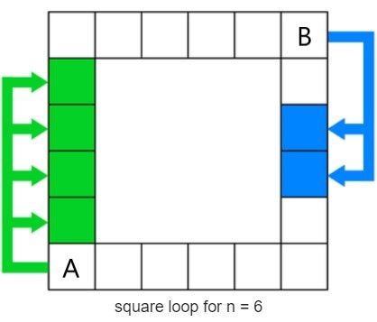
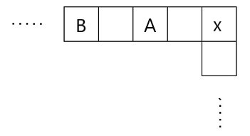
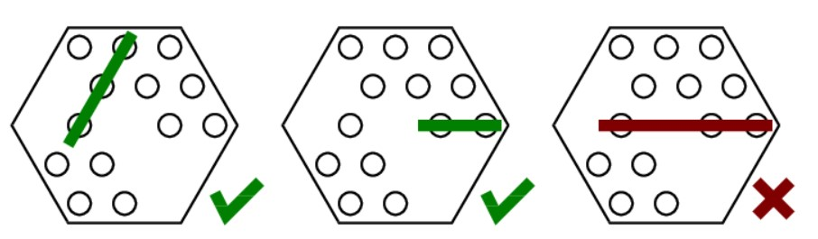

# Game Theory

## Introduction

賽局理論考慮玩家在遊戲中的行為，並研究他們的最佳化策略。

為了更好理解，我們直接看一個例題。

> 有 \\( 100 \\) 顆石頭，兩人輪流取走石頭，每次可以取 \\( 1 \sim 7 \\) 顆，沒有石頭可以拿的人輸。請問誰有必勝的策略。

相信各位讀者可以很快地找出一個策略。那就是先手的玩家必勝，每次取石頭時將剩餘數量為持在 \\( 8 \\) 的倍數。雙方玩家取到最後，先手的玩家必定會取得最後一塊石頭。

簡單地說明一下該策略的正確性。一開始先手的玩家可以取 \\( 4 \\) 顆石頭，剩餘的數量為 \\( 96 \\)，是 \\( 8 \\) 的倍數。而後續的回合中，因為一個人只能取 \\( 1 \sim 7 \\) 顆，若後手的玩家取 \\( x \\) 顆，先手的玩家就取 \\( 8 - x \\) 顆。這樣就可以維持每輪減少 \\( 8 \\) 顆石頭，直到遊戲結束。

## Game States

接下來會定義何謂 **winning state** 與 **losing state**。利用定義好的狀態，我們可以判斷一個玩家在面對某個局勢時會不會獲勝。

- winning state: 當前的玩家可以採用一個最佳化的策略，使得對手不論採取甚麼行動，都無法阻止該玩家獲勝。
- losing state: 當前的玩家不論採取何種行動，都無法阻止對手以某個策略取勝。

換句話說，winning state 至少存在一種行動，使得遊戲局勢落入 losing state。而 losing state 不論採取什麼行動，都會使局勢落入 winning state。

對於 Introduction 章節中提到的取石頭問題，我們其實可以將每個局勢的 game state 定義出來，那麼有沒有必勝策略這件事也就顯而易見了。

首先，當剩下的石頭數為 \\( 0 \\) 時，玩家將自動落敗，為一個 losing state。石頭數量為 \\( 1 \sim 7 \\) 時，為 winning state。因為玩家可以找到一個取法，使得行動結束後局勢變為 losing state。數量為 \\( 8 \\) 時，玩家不論在該回合取幾個石頭，都會轉移到 winning state，因此當下是一個 losing state。按照從小到大的順序填表，便能將所有局勢的狀態定義出來。於是我們發現當石頭數為 \\( 8 \\) 的倍數時，狀態為 losing state，反之則為 winning state。

另外，大多數的題目都保證遊戲在經過有限個回合內會結束。在這種情況下，遊戲的狀態轉移不會有環產生，可以視為一個有向無環圖。按照拓樸排序填表，就能判斷出所有狀態為 losing state 還是 winning state。

### Example

> [CSES 1729 - Stick Game](https://cses.fi/problemset/task/1729)
>
> 考慮一個遊戲，規則為雙方輪流從一堆棍子中移除若干個棍子，若輪到某玩家且他沒有任何合法的方法可以移除棍子時，則對方獲勝。已知整數 \\( n \\)，長度為 \\( k \\) 的整數陣列 \\( p \\)。\\( p \\) 陣列為玩家每回合能挑選移除的棍子個數。試問對於所有的 \\( x\ (1 \leq x \leq n) \\)，在目前還有 \\( x \\) 個棍子的情況下，且雙方都採取最佳化策略，那麼目前的玩家會獲勝還是落敗。
>
> - \\( 1 \leq n \leq 10^6 \\)
> - \\( 1 \leq k \leq 100 \\)
> - \\( p_i \leq n \\)

這題與前面章節的取石頭題目類似。在判斷棍子個數為 \\( x \\) 的狀態時，會用到所有小於 \\( x \\) 的狀態。因此由棍子數量小到大來填表，就不會有問題產生。

時間複雜度為: \\( O(nk) \\)

<details><summary> Solution Code </summary>

```cpp
#include <bits/stdc++.h>
using namespace std;

void solve() {
    int n, k; cin >> n >> k;
    vector<int> moves;
    vector<bool> state(n + 1);
    for (int i = 0; i < k; i++) {
        int x; cin >> x;
        moves.emplace_back(x);
    }
    state[0] = 0; // base case
    for (int i = 1; i <= n; i++) {
        state[i] = 0;
        for (auto m: moves) {
            int new_state = i - m;
            if (new_state >= 0 && state[new_state] == 0) state[i] = 1;
        }
    }
    for (int i = 1; i <= n; i++) {
        cout << (state[i]? 'W' : 'L');
    }
}

int main() {
    ios_base::sync_with_stdio(false);
    cin.tie(NULL);

    solve(); 
}
    
```

</details>

## Invariant

- 不變量(Invariant): 一種不會改變的性質。

在賽局的題目中，必勝方通常可以維持某種不變量。觀察並定義出不變量往往是解賽局題目的關鍵。以 Introduction 拿石頭的題目為例，不變量是在兩人操作結束後，剩餘數量維持在 \\( 8 \\) 的倍數。而後面章節會介紹的 Nim Game，不變量則為兩人操作結束後，所有堆數的 \\( XOR \\) 等於 \\( 0 \\)。

## Exercises

接下來會提供一些有關賽局的題目與解法。這些題目比較沒有固定的解題模式，也不需要特定的定理。但解這些題目往往需要一些觀察力與創新的思維。相信讀者在練習完這些題目後，可以更有效地找到類似問題的切入點。

> [Codeforces Global Round 22 C - Even Number Addicts](https://codeforces.com/contest/1738/problem/C)
>
> 給一個長度為 \\( n \\) 的整數陣列。玩家 A、B 輪流採取行動，由 A 開始。玩家每回合可以將一個數字從陣列中移除。當所有數字都被移除後遊戲結束。若 A 移除的數字和為偶數，那麼 A 獲勝。反之，B 獲勝。題目則問若雙方都採取最佳化策略，那麼誰會獲勝。
>
> - \\( 1 \leq n \leq 100 \\)

可以發現陣列中數字大小並不重要，重要的是奇數偶數的數量各為多少。那麼我們可以用陣列中剩餘奇數個數，剩餘偶數個數，與目前 A 移除數字總和的奇偶性這三項資訊來代表一個 state。

對於當前的局勢，假設陣列剩下 \\( i \\) 個奇數，\\( j \\) 個偶數，且 A 移除的數字總和除以 \\( 2 \\) 的餘數為 \\( k \\)。

let \\( f(i,\ j,\ k) = 0 \\) if state is A's winning state or B's losing state.

let \\( f(i,\ j,\ k) = 1 \\) if state is B's winning state or A's losing state.

在已知由 A 開始的情況，若 \\( n \\) 與 \\( i + j \\) 的奇偶相同，代表現在是 A 的回合，反之則為 B 的回合。因此我們分成兩種情況並列出遞迴關係式:

\\( f(i,\ j,\ k) = \begin{cases} k & \text {$i = 0\ and\ j = 0$} \newline f(i,\ j,\ k) = 1\ and\ (i \geq 1\ and\ f(i - 1,\ j,\ 1 - p))\ and\ (j \geq 1\ and\ f(i,\ j - 1,\ p)) & \text{$ if\ A's\ round $} \newline f(i,\ j,\ k) = 0\ or\ (i \geq 1\ and\ f(i - 1,\ j,\ p))\ or\ (j \geq 1\ and\ f(i,\ j - 1,\ p)) & \text{$ if\ B's\ round $} \end{cases}\\)

填表的過程可以使用 Top-down DP，即可判斷狀態是誰的 winning state。

時間複雜度為: \\( O(N^2) \\)

值得注意的是 A 與 B 的獲勝條件並不相同，我們必須將 A 與 B 的狀態分開討論。但在判斷狀態時的精神是相同的，若能轉移到對手的 losing state，就代表現在這個狀態為 winning state。此題還有其他方式來表達一個局勢，就請讀者自行練習。

<details><summary> Solution Code </summary>

```cpp
#include <bits/stdc++.h> 
using namespace std;
 
int N, odd_count, even_count;
int dp[110][110][2]; // 0 if it's Alice's winning state or Bob's losing state.
                     // 1 if it's Bob's winning state or Alice's losing state.
 
int recur(int i, int j, int k) {
    // i: odd count in the remaining array
    // j: even count in the remaining array
    // k: current parity of the sum of the numbers A removed
    if (dp[i][j][k] != -1) return dp[i][j][k];
    if (i == 0 && j == 0) {
        // base case, all numbers are removed
        return k; 
    }
    int ret;
    // determine whose turn it is 
    if ((N - i - j) % 2 == 0) {
        // Alice's move
        ret = 1; // first assume it's Alice losing state.
        if (i > 0) ret &= recur(i - 1, j, 1 - k);
        if (j > 0) ret &= recur(i, j - 1, k);
        // If this state can transition to Bob's losing state, then change it to Alice's winning state.
    }
    else {
        // Bob's move
        ret = 0; // first assume it's Bob's losing state.
        if (i > 0) ret |= recur(i - 1, j, k);
        if (j > 0) ret |= recur(i, j - 1, k);
        // If this state can transition to Alice's losing state, then change it to Bob's winning state.
    }
    return dp[i][j][k] = ret; 
}
 
void solve(){ 
    cin >> N;
    odd_count = even_count = 0;
    memset(dp, -1, sizeof(dp));
    for (int i = 0; i < N; i++) {
        int x; cin >> x;
        if (abs(x) % 2 == 0) even_count++;
        else odd_count++;
    }
    if (recur(odd_count, even_count, 0) == 0) cout << "Alice\n";
    else cout << "Bob\n";
}       

int main(){
    ios_base::sync_with_stdio(false);
    cin.tie(NULL);
    
    int TestCases; 
    cin >> TestCases;
 
    while (TestCases--) {
        solve();
    }
}
    
```

</details>

> [Zerojudge b902 - 肉墊遊戲](https://zerojudge.tw/ShowProblem?problemid=b902)
>
> 有兩疊墊子，數量各為 \\( x \\) 塊與 \\( y \\) 塊。玩家 A、B 輪流進行行動。每回合可以選擇一疊非空的墊子，並移除 1 塊墊子，或是在這疊墊子的數量不少於另一疊的前提下，將這疊移除和另一疊數量一樣多的墊子(不能為 0)。玩到最後，取走最後一塊墊子的即為勝者。若雙方都採取最佳化策略，那麼誰將獲勝。
>
> - \\( x, y \leq 10^{18} \\)

題目的範圍達到 \\( 10^{18} \\)，用 bottom up 的方式填表判斷每種狀態是否為 winning state 會太慢。但我們可以先試一些數字較小的例子，看能不能從中獲得一些啟發。

不妨先討論其中一疊的數量為 \\( 0 \\) 或 \\( 1 \\) 的情況。因為第二種行動取出的墊子數為兩疊中較少的數量，由此得知之後的回合最多只能取一個墊子。那麼判斷兩疊總和的奇偶，就能判斷誰獲勝。若往奇偶這個方向去想，可以想到當總合為奇數時，兩疊的數量一定是一奇一偶。那麼我們可以選擇從偶數疊中取出一塊，使數量變為 {奇數，奇數}。而不論對手採取甚麼行動，都一定是取出奇數塊的數量，也就會使得場上變為一奇一偶。於是我們可以將數量一奇一偶定義為 winning state，兩疊皆為奇數定義成 losing state。

剩下的只有兩疊皆為偶數的情況了。若當前玩家採取第一種行動，會取出奇數個墊子，使局勢變為一奇一偶，也就是 winning state。但這麼做無疑是一個錯誤的策略，因此雙方玩家只會採取第二種行動。於是在雙方的策略都被確定的情況，我們可以開始探討給定兩疊的數量，誰會獲勝。若兩疊的數量為 \\( x, y\\)，假設 \\( x \geq y \\)，那麼在之後的 \\( \frac{x}{y} \\) 回合都會從數量為 \\( x \\) 那疊中取出墊子。而數量則會變為 \\( x\ mod\ y \\) 與 \\( y \\)。接著再從數量為 \\( y \\) 的那疊開始取，以此類推。可以發現過程和求最大公因數時使用的輾轉相除法極為相似，因此若暴力將行動模擬完，複雜度也只會是 \\( \log(max\lbrace x, y \rbrace) \\)。而取到最後，會有其中一疊數量歸零，若另一疊數量還沒歸零，就可以用奇偶來判斷剩餘回合數。綜上所述，在數量為兩偶時，只要求出遊戲過幾個回合後會分出勝負，且該回合數若是奇數，則當前玩家勝利，反之則落敗。

時間複雜度為: \\( O(\log(max\lbrace x, y \rbrace)) \\)

<details><summary> Solution Code </summary>

```cpp
#include <bits/stdc++.h>
using namespace std;
using ll = long long;

void solve() {
    ll x, y; cin >> x >> y; 
    bool win = false;
    if (x % 2 + y % 2 == 1) win = true; // one odd, one even 
    else if (x % 2 + y % 2 == 2) win = false; // two odds
    else {
        ll cnt_round = 0;
        while (x > 0 && y > 0) {
            if (x < y) swap(x, y);
            cnt_round += x / y;
            x = x % y;
        }
        cnt_round += x + y;
        if (cnt_round % 2 == 1) win = true;
        else win = false;
    }
    if (win) cout << ">//<\n"; // first player wins
    else cout << ">\\\\<\n"; // second player wins
}

int main(){
    ios_base::sync_with_stdio(false);
    cin.tie(NULL);

    ll TestCases = 1;
    cin >> TestCases;
 
    while (TestCases--) {
        solve();
    }
}
    
```

</details>

> [The 2021 Zhejiang University City College Freshman Programming Contest I - If I Catch You](https://codeforces.com/gym/103488/problem/I)
>
> 給一個 \\( n \times n \\) 的正方形棋盤方格，A, B 兩名玩家在正方形邊界的 \\( 4n - 4\ \\) 個格子上輪流進行行動。一開始 A 在左下角，B 在右上角。每個回合可以分成三個依序進行的步驟。首先，B 在目前的格子上放置一個陷阱，且該陷阱會永遠留在方格上。陷阱對 B 不造成任何影響，但 A 在每回合結束後不能停留在任何一個陷阱上(可以經過)。接著 B 以順時針方向走 \\( 2 \sim 3 \\) 格，最後 A 以順時針移動 \\( 1 \sim 4 \\) 格。遊戲結束的條件有以下兩種，且在回合中間也可以被觸發。第一種是 A 順時針方向的 \\( 1 \sim 4 \\) 格都有陷阱，則 B 獲勝。第二種則是 A 與 B 某個時間在同一格上，則 A 獲勝。問在雙方都採取最佳策略的情況下，誰將獲勝 ? 若 B 能獲勝，輸出 \\( -1 \\)，若 A 能獲勝，輸出 A 最少需要幾回合才能獲勝，( 同時 B 也盡全力拖延的情況)。
>
> 
>
> - \\( 1 \leq n \leq 10^5 \\)

可以注意到 A 獲勝的條件為**碰到** B，不一定要從後方趕上。那麼換個思路，若 A 每回合都以最少的步數前進，等待 B 自動追上他，是否也是個不錯的策略呢 ? 出乎意料地，這樣的策略是最佳的。以下會提出證明。

先討論 \\( n = 1 \\) 與 \\( n = 2 \\) 這兩個較特殊的 corner case。

- \\( n = 1 \\) : 場上沒有格子，A 在第 \\( 0 \\) 回合獲勝。
- \\( n = 2 \\) : B 在第一回合便會撞上 A，導致 A 獲勝。

A 可以採用的策略有選擇大步數從後方追擊 B 或是選小步數等待 B 撞上這兩種。這邊先說明一下為什麼 A 不會在選擇一個策略後，中途突然改變策略。雖然聽起來有點理所當然，但筆者認為仍需要提一下，使後續的證明更加順暢且完整。

- 先選大步數，後來改選小步數: 選用大步數後，A 後續要耗費更多的回合才能等到 B 撞上，不會是一個最佳策略。
- 先選小步數，後來改選大步數: 就算 A 有可能因為改變步數而成功躲避一些陷阱，但遇到陷阱的代價也只是該回合少移動一步。那麼直接以最大步數進行每一回合，一定不會比改變步數來得差。

因此 A 只剩下，每回合選最大步數進行追擊，與每回選最小步數等待 B 撞上這兩種策略。

- A 每回合走 \\( 1 \\) 步

  - 就算 B 每回合只走 \\( 2 \\) 步，拖延他撞上 A 的時間，每回合雙方的距離仍會減一。在第 \\( 2n - 4 \\) 個回合結束後，雙方的距離會減少至 \\( 2 \\) (如下圖)。於是在第 \\( 2n - 3 \\) 回合時 B 就會碰到 A，使遊戲結束。另外，A 到遊戲結束時都不會經過 B 的起點，因此不用擔心會踩到陷阱。

- A 每回合走 \\( 4 \\) 步

  - B 看到 A 採取大步數前進時，根據上方的說明，B 會知道 A 採取的是追擊策略。因此除了第一步以外，B 的每個回合都會前進 \\( 3 \\) 步，避免被 A 追上。因此要討論的只有 B 以 \\( 2 \\) 步開局或是以 \\( 3 \\) 步開局這兩種情況
    - B 以 \\( 3 \\) 步開局: 每個回合 A 與 B 的距離只會被拉近 \\( 1 \\)，至少需要 \\( 2n - 2 \\) 個回合，A 才能獲勝，比上述的策略差。
    - B 以 \\( 2 \\) 步開局: 若不考慮陷阱，A 恰好能在第 \\( 2n - 3 \\) 回合結束遊戲。但是 B 在起點以及距離起點 \\( 2 \\) 步的位置都放了陷阱(如下圖)，A 在每回合都前進 \\( 4 \\) 步的情況下，一定會被這兩個陷阱的其中一個阻礙，導致無法在\\( 2n - 3 \\) 個回合以內結束遊戲。
    

綜上所述，A 每回合選擇走一步，等待 B 撞上是一個最佳策略。只需要 \\( 2n - 3 \\) 個回合就會獲勝。

<details><summary> Solution Code </summary>

```cpp

#include <bits/stdc++.h>
using namespace std;

void solve() {
    int n; cin >> n;
    if (n == 1) cout << 0 << '\n';
    else if (n == 2) cout << 1 << '\n';
    else cout << 2 * n - 3 << '\n'; 
}

int main() {
    ios_base::sync_with_stdio(false);
    cin.tie(NULL);

    int testcases; 
    cin >> testcases;
    while (testcases--) {
        solve();
    }
}
    
```

</details>

這邊另外附上一些有關賽局的題目與提示，有興趣的讀者可以練習看看。

> [Codeforces Round 668 B - Tree Tag](https://codeforces.com/contest/1404/problem/B)
>
> 給一棵含有 \\( N \\) 個節點的樹，玩家 A、B 輪流採取行動。已知 A、B 的起始位置的編號以及他們每回合最多可以移動的步數。若由 A 先動，且 A 如果碰到 B (與 B 待在同個節點上) 就獲勝。問在 \\( 10^{100} \\) 回合以內 A 能不能獲勝。
>
> - 保證所有 testcase 的 \\( N \\) 總和不超過 \\( 10^5 \\)

<details><summary> Solution </summary>

若起始位置的距離小於 A 每回合能動的步數，那麼 A 獲勝。

遊戲會進行的回合數很多，B 能一直避開 A 的唯一方法只有在 A 兩側反覆橫跳。那麼 B 可以考慮待在樹上長度最長的鏈。令 A 每回合能動的步數為 \\( x \\)，B 的步數為 \\( y \\)。若 \\( y \leq 2x \\)，則 A 存在一種方法可以抓到 B。另外，若 \\( 2x \geq 樹上長度最長的鏈 \\)，則 A 也可以抓到 B。證明的部分就請讀者自行練習。

時間複雜度為: \\( O(N) \\)

<details><summary> Solution Code </summary>

```cpp

#include <bits/stdc++.h>
using namespace std;

void solve() {
    int N, a, b, x, y;
    cin >> N >> a >> b >> x >> y;
    a--, b--;
    vector<vector<int>> adj(N, vector<int>());
    for (int i = 0; i < N - 1; i++) {
        int u, v; cin >> u >> v;
        u--, v--;
        adj[u].emplace_back(v);
        adj[v].emplace_back(u);
    } 
    vector<int> d(N, -1);
    auto BFS = [&](int root) {
        d.assign(N, -1);
        queue<int> q;
        q.emplace(root);
        d[root] = 0;
        int z = 0;
        while (!q.empty()) {
            int u = q.front(); q.pop();
            z = u;
            for (auto v: adj[u]) {
                if (d[v] == -1) {
                    d[v] = d[u] + 1;
                    q.emplace(v);
                }
            }
        }
        return z;
    };

    int furthest = BFS(a);
    int d_init = d[b];
    BFS(furthest);
    int len = *max_element(d.begin(), d.end());
    if (d_init <= x || y <= 2 * x || len <= 2 * x) cout << "Alice\n";
    else cout << "Bob\n";
}

int main() {
    ios_base::sync_with_stdio(false);
    cin.tie(NULL);

    int testcases; 
    cin >> testcases;
    while (testcases--) {
        solve();
    }
}

```

</details>

</details>

> 給一塊大小為 \\( N \times M \\) 的巧克力。A、B 輪流切巧克力。在切巧克力時只能選其中一塊並分成兩份，且分出來的巧克力長寬都要為整數。沒有可行的切法時則落敗。問從 A 開始，且雙方都採取最佳化策略，那麼誰將獲勝。

<details><summary> Solution </summary>

考慮場上的連通塊數目。每次切巧克力時都會加一，直到變為 \\( N \times M \\) 時遊戲結束。

</details>

> [Codeforces Beta Round 59 E - Sweets Game](https://codeforces.com/contest/63/problem/E)
>
> 將 \\( 19 \\) 塊巧克力放在一個正六邊形的盒子內。A、B 兩人輪流採取行動。每回合可以取若干個連在一起的巧克力並將其移除，且取出的巧克力必須要與正六邊形的其中一個邊平行。沒有巧克力可以移除的一方落敗。問若從 A 開始，且雙方都採取最佳化策略，那麼誰將獲勝。


<details><summary> Solution </summary>

可以注意到巧克力的數目只有 \\( 19 \\) 個。若將每一塊是否取過以 \\( 0 \\) 跟 \\( 1 \\) 來表示，總共只需要 \\( 2 ^ {19} \\) 個 state 就足夠了。因此我們可以從 \\( state\[0\] \\) 依序計算至 \\( state\[2 ^ {19} - 1\] \\)，便可以判斷每個狀態為 winning state 還是 losing state。初始的狀態則為 \\( state\[2 ^ {19} - 1\] \\)。

狀態轉移的時間複雜度經由計算也可以估計。每次取巧克力時有三個方向可以取，若考慮一次取兩塊以上個巧克力，每個方向會有 \\( {3 \choose 2} \times 2 + {4 \choose 2} \times 2 + {5 \choose 2} = 28 \\) 種。因此一次取兩塊以上的取法共有 \\( 84 \\) 種，再加上一次取一塊的 \\( 19 \\) 種，一共是 \\( 103 \\) 種。因此判斷所有狀態的時間複雜度為狀態個數乘上轉移時間，也就是 \\(O (2^{19} \times 103) \\)。

</details>

> [Codeforces Round 573 D - Tokitsukaze, CSL and Stone Game](https://codeforces.com/contest/1191/problem/D)
>
> 有若干堆石頭，每堆石頭的個數為 \\( a_i \\)。兩人輪流採取行動，每回合可以從其中一堆取出一顆石頭。落敗的條件有在輪到某方時所有堆的石頭都被取完，或是某方取完後有某兩堆石頭數相同(個數為 \\( 0 \\)的也要考慮)。兩個條件發生其中之一則玩家落敗。問若從 A 開始，且雙方都採取最佳化策略，那麼誰將獲勝。
>
> - \\( 1 \leq N \leq 10^5 \\)
> - \\( 0 \leq a_i \leq 10^9 \\)

<details><summary> Solution </summary>

首先可以發現，若先手的玩家取完沒有落敗，代表他取完後場上所有堆的個數都不同。因此保證接下來雙方不論怎麼取，都可以一直取石頭，直到各堆石頭個數變為 \\( 0, 1, 2,……, N - 1 \\)。因此若先手不會在第一回合落敗的話，可以利用剩餘回合數的奇偶來判斷誰將獲勝。剩餘的情況即為先手在第一回合不論怎麼取都會直接落敗。我們可以枚舉他所有的取法，看是否都會導致落敗。如果是的話，對手即為勝者。

時間複雜度為: \\( O(N \times \log(N)) \\)

<details><summary> Solution Code </summary>

```cpp

#include <bits/stdc++.h>
using namespace std;
using ll = long long;

void solve() {
    int N; cin >> N;
    ll tot = 0;
    map<int, int> cnt;
    vector<int> a;
    for (int i = 0; i < N; i++) {
        int x; cin >> x;
        tot += x;
        if (x > 0) a.emplace_back(x);
        cnt[x]++;
    }
    bool lose = true;
    for (auto x: a) { // enumerate first round choices
        cnt[x]--;
        cnt[x - 1]++;
        if (cnt[x] == 0) cnt.erase(x);
        if (cnt.size() == N) lose = false; // no repeated values
        cnt[x - 1]--;
        cnt[x]++;
        if (cnt[x - 1] == 0) cnt.erase(x - 1);
    }
    ll rounds_cnt = tot - (N - 1 + 0) * N / 2;
    if (!lose && rounds_cnt % 2 == 1) cout << "sjfnb\n"; // first player wins
    else cout << "cslnb\n";
}

int main() {
    ios_base::sync_with_stdio(false);
    cin.tie(NULL);

    solve();
}

```

</details>

</details>
