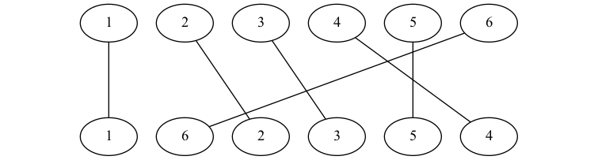

# 逆序對

在離散數學或資訊科學中，所謂逆序對 _(inversion pair, inversion)_，即對於一個排列 _(permutation)_，兩個元素而前者大於後者所構成的對 _(pair)_。逆序對的諸多有趣性質使得其在演算法競賽中可以說是屢見不鮮，經常以各種不太一樣的面貌出現。然而，有鑒於當今網路上不論中文或英文，關於逆序對為主題的文章並不多，因此希望藉由本文做個簡單卻廣泛整理，以俾初學者能夠容易學習。

## 定義

接下來，我們主要會聚焦在 \\([1,n]\\) 的 permutation 的逆序對數量以俾討論，同樣的想法容易推廣到普通的 sequence。

正式來說，我們稱元素對 _(pair of elements)_ \\((\pi(i),\pi(j))\\) 或下標對 _(pair of indices)_ \\((i,j)\\) 是 permutation \\(\pi\\) 的一個逆序對，若且唯若 \\(i<j\land\pi(i)>\pi(j)\\)。對於序列 _(sequence)_ \\(S\\)，我們同樣可以定義 \\((S_i,S_j)\\) 或 \\((i,j)\\) 是 \\(S\\) 的一個逆序對，若且唯若 \\(i<j\land S_i>S_j\\)。

比如說，\\((3,1),(3,2),(5,4),(5,2),(4,2)\\) 這五個 pairs of elements 是 permutation \\(\left(\begin{array}{ccccc}3&1&5&4&2\end{array}\right)\\) 的所有逆序對；若以 pairs of indices 表示則是 \\((1,2),(1,5),(3,4),(3,5),(4,5)\\) 這五個。

---

假若我們嘗試從另一個角度切入，則逆序對本質上可以被當成長度恰好為 \\(2\\)（最短）的遞減子序列 _(decreasing subsequence)_。因此，不意外地，我們可以發現有些最長遞增子序列 _(longest increasing subsequence, LIS)_ 的題目能夠與逆序對相互闡釋、啟發，可謂一體兩面。

## 逆序對數量

逆序對數量就是指一個 permutation (or sequence) 存在多少的逆序對，或者說是所有逆序對所構成的集合的勢 _(cardinality)_（這裡可以姑且視為其大小），\\(\\#\left\\{(i,j)|i<j\land\pi(i)>\pi(j)\forall i,j\in\pi\right\\}\\)。（注意 sequence 的 inversion pair of elements 可能並不唯一。）

舉例而言，排列 \\(\left(\begin{array}{ccccc}1&2&3&4&5\end{array}\right)\\) 沒有任何逆序對，因此其逆序對數為 \\(0\\)；而排列 \\(\left(\begin{array}{ccccc}5&4&3&2&1\end{array}\right)\\) 的所有 \\(\binom{5}{2}=10\\) 對全部都是逆序對，因此其逆序對數為 \\(10\\)。

### 數學意義

由前開兩個例子，我們可以觀察出幾點性質：

0. 逆序對數最小為 \\(0\\)，此時 permutation 或 sequence 恰好是排序好的
1. 逆序對數最大為 \\(\binom{n}{2}\\)，其中 \\(n\\) 為 permutation 或 sequence 的長度，此時 permutation 或 sequence 恰好是完全反序的
2. 由前兩點我們知道逆序對數量必定介於 \\(0\\) 至 \\(\binom{n}{2}\\) 之間，而且可以作為一種衡量排序程度的指標 **sortedness**

此外，考慮一個 permutation 的柯西表示法，如 \\(\left(\begin{array}{ccccc}1&2&3&4&5\\\\3&1&5&4&2\end{array}\right)\\), 則其對應的 _arrow diagram_ 的交點數量就是（最多；或是我們把 \\(n\\) 點共線算成 \\(n-1\\) 個交點）逆序對數量。（另外，選最多線而不相交則是 LIS 長度）



由上圖我們可以知道，permutation \\(\left(\begin{array}{cccccc}1&6&2&3&5&4\end{array}\right)\\) 有 5 個逆序對（而其 LIS 長度為 4）。

#### Kendall's \\(\tau\\) Distance

事實上，Kendall 給出更一般性的定義；對於任兩個 permutations \\(\tau_1,\tau_2\\)，他們的 _Kendall's \\(\tau\\) distance_ 為 \\(K_d(\tau_1,\tau_2)=\\#\left\\{(i,j)|i<j\land(\tau_1(i)<\tau_1(j)\land\tau_2(i)>\tau_2(j)\lor\tau_1(i)>\tau_1(j)\land\tau_2(i)<\tau_2(j))\right\\}\\)。

同理我們容易知道 \\(K_d(\tau_1,\tau_2)\in[0,\binom{n}{2}]\\)，而且極值成立時的條件是類似的。

因此，逆序對數量又可以被當作一個 permutation 與 identity permutation 的 Kendall's \\(\tau\\) distance；反過來說，計算兩個 permutations 的 Kendall's \\(\tau\\) distance，也可以藉由逆序對數量的求法。

Kendall's \\(\tau\\) distance 的一個重點是其代表兩個 permutations 需要經過多少次 swaps 才能從其中一個 permutation 變為另一個。故逆序對數量同時也代表 bubble sort 需要多少次 swaps。

#### Lehmer Code & Inversion Vectors

由於逆序對數量的 upper bound 是 \\(O(n^2)\\) 實在不甚方便，數學家們往往想壓縮逆序對利用一個同樣 \\(O(n)\\) 的向量來描述。因此，對於一個 permutation \\(\pi\\) 我們有以下兩種 vectors：

0. Left inversion count \\(l\\)
    - 對於 \\(i\\) 在左邊的逆序對數量 \\[l(i)=\\#\left\\{j|j<i\land\pi(j)>\pi(i)\right\\}\\]
1. Right inversion count \\(r\\) a.k.a. Lehmer Code \\(L\\)
    - 對於 \\(i\\) 在右邊的逆序對數量 \\[r(i)=\\#\left\\{j|j>i\land\pi(j)<\pi(i)\right\\}\\]

這些 vectors 有一些有趣而重要的性質，包括但不限於可以唯一決定一個排列、可以將排列視作以階乘為底的進位制下的表示法⋯⋯等。其中，在演算法競賽最實用的，莫過於我們容易推得其和即為逆序對數量。

### 演算法意義

由前述 Kendall's \\(\tau\\) distance 的討論，我們可以知道 bubble sort 所需的 swaps 數量就是逆序對數量，故其 worst case time complexity 即為逆序對數量的 upper bound，i.e., \\(\binom{n}{2}=\frac{n(n-1)}{2}=O(n^2)\\)

那麼，求逆序對數量的 lower bound 呢？如果我們考慮 comparison-based 的數法，而這與 comparison-based sorting 一樣，需要至少 \\(O(n\log n)\\) 次比較，證明是其 recursion tree 共有 \\(n!\\) leaves，平衡的樹高為 \\(O(\log n!)=O(n\log n)\\)，具體細節可以參考教科書。現在我們試著論證求逆序對的 recursion tree 也是類似的。注意到由於 comparison-based sorting 的 recursion tree 的每個葉節點都分別對應到兩個不同的 permutations 故其逆序對數量顯然不同，因此我們一定必須走訪到葉節點才能決定逆序對數量。

一些 sub-linearithmic 的演算法可能存在。Dietz (1998) 在 word size 為 logarithmic 的 random-access machine 上能以 \\(O(\frac{\log n}{\log\log n})\\) 而非 \\(O(\log n)\\) 回答一個 rank query。在值域為 \\(O(n)\\) 的情況下，Chan and Pătraşcu (2010) 利用 radix sort 每輪位置改變的元素對數的總和即為逆序對數量，達到 \\(O(n\sqrt{\log n})\\) 的時間複雜度，但實作細節超過本文範圍過多且其實不甚實用。

此外，亦有一些近似的演算法，可以做到 \\(O(n\log\log n)\\) 甚至是 \\(O(n)\\)。

---

實務上，大部分演算法題目通常都是跟逆序對的數量有關。

## 逆序對數量的實作

終於到了實作時間。樸素的暴力枚舉法還是簡單提一下，而 \\(O(n\log n)\\) 作法除了最經典的合併排序法與 BIT 之外，另提供一些其他沒那麼常見的解法供參。

### Brute Force

可以在 bubble sort 的同時紀錄 swap 的數量；一個 sequence \\(S\\) 至多有 \\(\binom{|S|}{2}\\) 個 pair，同時也是逆序對數量的 upper bound，因此只需要枚舉所有 \\((i,j),i<j\\) 並檢查也可以 in-place 算出。

### Divide and Conquer (via Merge Sort)

如何高效地計算逆序對的數量呢？逆序對與排序的關係密不可分、千絲萬縷，因此我們想到分治法是個好策略。一個逆序對不是皆在序列的中點的同側，就是跨越中點。對於皆在中點左或右側的逆序對，我們可以遞迴求出該數量。至於跨越中點的逆序對，我們發現在 merge sort 合併的過程，如果左側有一元素 \\(l_i\\) 大於右側某一元素 \\(r_j\\)，則我們知道左側任何大於 \\(l_i\\) 的元素亦都可以對 \\(r_j\\) 形成逆序對；換句話說，\\(r_j\\) 將貢獻 \\(|l|-i+1\\) _(1-indexed)_ 個逆序對。據此，我們就可以在 \\(O(n\log n)\\) 的時間內計算逆序對的數量了。

舉例來說，對於 permutation \\(\left(\begin{array}{ccccc}1&6&2&3&5&4\end{array}\right)\\)，假設我們已經將左右兩半 \\(\left(\begin{array}{ccc}1&6&2\end{array}\right),\left(\begin{array}{ccc}3&5&4\end{array}\right)\\) 分別排序得 \\(\left(\begin{array}{ccc}1&2&6\end{array}\right),\left(\begin{array}{ccc}3&4&5\end{array}\right)\\) 並計算出逆序對數量各有 \\(1\\)，最終合併時可以發現左側 \\(1,2\\) 不能造成任何逆序對而 \\(6\\) 可以形成 \\(3\\) 個，因此原 permutation 一共有 \\(5\\) 個逆序對。

```cpp
int64_t merge_sort_inversions(vector<int>::iterator begin, vector<int>::iterator end)
{
    if (end - begin == 1)
        return 0;
    auto mid = begin + ((end - begin) >> 1);
    vector<int> left(begin, mid), right(mid, end);
    int64_t inversions = merge_sort_inversions(left.begin(), left.end())
                       + merge_sort_inversions(right.begin(), right.end());
    for (auto itr = left.begin(), jtr = right.begin(); begin != end; begin++)
        if (itr != left.end() && jtr != right.end())
        {
            if (*itr < *jtr)
                *begin = *itr++;
            else
            {
                inversions += left.end() - itr;
                *begin = *jtr++;
            }
        }
        else if (itr != left.end())
            *begin = *itr++;
        else
            *begin = *jtr++;
    return inversions;
}
```

縱使我們使用 in-place merge, 但由於 merge sort 本身修改了陣列，因此若我們需要用到原始陣列，還是無可避免需要 \\(O(n)\\) 額外空間。

### Data Structure: Fenwick Tree (a.k.a. Binary Indexed Tree, BIT)

接著來看一個可能更直觀（但沒那麼受教科書推崇）的想法。對於一個 permutation 中的每一元素，假若我們可以知道與它有關的逆序對數量分別為和，那們整個 permutaion 的逆序對數量也就呼之欲出、易如反掌。因此，我們想到前面提過 permutaions 的 inversion vectors。以 left inversion count 為例，我們只需要在依序維護 permutation 某元素 \\(i\\) 出現權重 \\(w_i\\) 的同時，找出有大於該元素的元素數，也就是 \\(\sum_{i=0}^nw_i\\)。因此，我們需要一個支援高校單點修改、區間查詢的資料結構，而簡單好寫的 Fenwick Tree (a.k.a. Binary Indexed Tree, BIT) 是我們的好朋友。

```cpp
struct bit
{
    vector<int> v;
    bit(int n) : v(n + 1) {}
    static int lowbit(int x) { return x & -x; }
    void update(int x, int val = 1)
    {
        for (int n = v.size() - 1; x <= n; x += lowbit(x))
            v[x] += val;
    }
    int query(int x)
    {
        int y = 0;
        for (; x > 0; x -= lowbit(x))
            y += v[x];
        return y;
    }
    int query(int x1, int x2) { return query(x2) - query(x1 - 1); }
};

int64_t inversions(const vector<int> &p)
{
    int n = p.size();
    bit fenwick_tree(n);
    int64_t y = 0;
    for (int i = 0; i < n; i++)
    {
        y += bit.query(p[i] + 1, n);
        bit.update(p[i]);
    }
    return y;
}
```

那麼假如我們想求的 sequence \\(S\\) 並不是一個 permutation 而且值域很大呢？由於逆序對僅僅關於元素間的相對大小與位置順序，就算我們任意修改 \\(S\\) 的值得到 \\(S'\\)，只要對於任何 \\(i,j\\) 總是有 \\(S_i,S_j\\) 的大小關係與 \\(S'_i,S'_j\\) 相同 (i.e., \\(\text{sgn}(S_i-S_j)=\text{sgn}(S'_i-S'_j)\\forall i,j\\))，則 \\(S,S'\\) 的逆序對數量顯然相等。故我們可以放心**離散化**原 sequence 後，再求其逆序對數量。

### Data Structure: Rank Tree (Query the Rank)

事實上，經過上面的討論，假若我們把 inversion vectors 推廣至一般 sequence，則若我們有個支援動態名次查詢 _(rank query)_ 的資料結構，left inversion count 就可以利用一個元素的 rank 得知在其之前有多少元素大於它。通常，我們可以在二分搜尋樹 _(Binary Search Tree, BST)_ 上二分捜來回答 rank query (& \\(k^\text{th}\\) query)，這種 BST 又被稱為 rank tree 或 order statistic tree。

這種演算法沒那麼受歡迎的原因可能是 C++ STL 內建的二分搜尋樹並不支援 rank query，而自己刻一棵 self-balanced BST 像是 R-B tree、AVL tree、splay tree⋯⋯並不好玩。如果你是 treap 愛好者，在 treap 的每個 node 紀錄 size 就可以二分搜 rank，但記得留意 sequence 可能包含重複元素。

假若 OJ 還有你用的是 GNU 的 `g++`，那麼有個黑魔法：Policy-Based Data Structures _(PBDS)_ 就像是 GNU 擴充的 STL，其中的 `__gnu_pbds::tree<>` 原本跟普通 `std::set<>` (or `std::map<,>`) 沒什麼區別，但在套上 `tree_order_statistics_node_update` 這個 policy 之後 BST 每個 node 都會記錄 order statistic，搖身一變成為一棵貨真價實的 order statistic tree。但注意到 `__gnu_pbds::tree<>` 預設跟 `std::set<>` 一樣會忽略重複元素，我們需要將第三個 template argument `Cmp_Fn` 改為 `less_equal<>` 才能變成像 `std::multiset<>` 的行為。另外，根據筆者自身經驗，雖然 PBDS 很方便，但它的常數往往很大。

```cpp
#include <bits/extc++.h>

using namespace __gnu_pbds;

template <typename K, typename M = null_type, typename Cmp = less<K>, typename T = rb_tree_tag>
using _tree = tree<K, M, Cmp, T, tree_order_statistics_node_update>;

int64_t inversions(const vector<int> &v)
{
    int64_t y = 0;
    _tree<int, null_type, less_equal<int>> t;
    for (int i : v)
    {
        y += t.size() - t.order_of_key(i);
        t.insert(i);
    }
    return y;
}
```

## 練習題

### 幾乎模板題

注意由於逆序對數量的 upper bound 是 \\(O(n^2)\\)，當 \\(n\geq2^{16}=65536\\) 時必須使用諸如 `int64_t` 等 64-bit 整數型別。

- [UVa 13212 How many inversions?](https://onlinejudge.org/index.php?option=com_onlinejudge&Itemid=8&page=show_problem&problem=5135)
- [UVa 10810 Ultra-QuickSort](https://onlinejudge.org/index.php?option=com_onlinejudge&Itemid=8&page=show_problem&problem=1751)
- [UVa 11858 Frosh Week](https://onlinejudge.org/index.php?option=com_onlinejudge&Itemid=8&page=show_problem&problem=2958)

---

- [Codeforces Round 790 (Div. 4) H1. Maximum Crossings (Easy Version)](https://codeforces.com/contest/1676/problem/H1), [Codeforces Round 790 (Div. 4) H2. Maximum Crossings (Hard Version)](https://codeforces.com/contest/1676/problem/H2)

以上這題與前揭 arrow diagram of permutation 的 crossings 相關。而下面這題可以說是非常相似，但考的則是 LIS 而且又更變化而難不少。

- [2021 TOI 1! 入營考 C. 粉刷護欄](https://tioj.ck.tp.edu.tw/problems/2195)

其實 NCPC 2021 Final 也有一題 [LIS](https://e-tutor.itsa.org.tw/e-Tutor/mod/programming/view.php?id=60575).

### 競賽實戰題

- [2021 ICPC Asia TOPC C. A Sorting Problem](https://codeforces.com/gym/103373/problem/C)
  - 題目給的是 permutation 中每個元素的 index，如果我們將元素們與 indices 互換，則原本的操作就變為 swap 相鄰的元素。於是，題目所求的最小數量即相當於 bubble sort swap 數，也就是逆序對數量
- [2022 ICPC Asia Taoyuan Regional C. Distance Calculator](https://e-tutor.itsa.org.tw/e-Tutor/mod/programming/view.php?id=65292)
  > Wonder kingdom has \\(n!\\) cities. Each city is encoded with \\(n\\) number \\(d_1d_2\dots d_n\\) which is a permutation of \\(1 2\dots n\\). The castle of Wonder kingdom is located in the city encoded as \\(1 2\dots n\\). Let \\(a_1a_2\dots a_n\\) and \\(b_1b_2\dots b_n\\) be the codes of cities A and B, respectively. A road with distance one is built between cities A and B in the kingdom if and only if there exists an \\(i,1\leq i<n\\), such that the following two conditions are satisfied.
  >
  > 1. \\(a_i=b_i+1\\) and \\(b_i=a_i+1\\);
  > 2. \\(a_j=b_j\forall j\in\\{1,2,\dots,n\\}\setminus\\{i,i+1\\}\\).
  >
  > One day the king invites all mayors for a meeting in the castle. Please help mayors calculate their travel distance to the castle. Notice that the city of the castle is encoded with \\(1 2 3\dots n\\).
  >
  > #### Constraints
  >
  > - \\(1\leq m\leq50\\)
  > - \\(1\leq n\leq100\\)

### 其他有趣題

- [AtCoder Beginner Contest 190 F - Shift and Inversions](https://atcoder.jp/contests/abc190/tasks/abc190_f)
  - 對於一個 permutation，在每次 rotatation 之後計算出逆序對數量
  - 如果真的每次都重新計算的話，時間複雜度會是 \\(O(n\times n\log n)=O(n^2\log n)\\)
  - 轉念一想，我們其實可以在 \\(O(1)\\) 常數時間內知道一次 rotatation 所造成逆序對數量的變化：將這個元素自首端移除會減少多少？Append 至尾端又會增加多少呢？
- [盧錦隆計算方法設計 2021 Midterm Exam 2 Problem 4](https://drive.google.com/file/d/1UAQ8hliRH6dZk74q78cQzRWOM2Cb6i_G)
  - 有些教科書稱為 **significant inversion pair**. 簡單說就是將原本 inversion 限制為更嚴格的 \\(i<j\land S_i>2S_j\\)
  - 事實上，對我們而言，\\(S_i\\) 要是 \\(S_j\\) 的幾倍都無所謂
  - 不論採用哪種作法都可以，惟注意 merge 的過程可能需要另外抽出來

## References

- Thomas H. Cormen, Charles E. Leiserson, Ronald L. Rivest, and Clifford Stein. 2022. Introduction to Algorithms, Third Edition (4th. ed.). The MIT Press.
- Donald E. Knuth. 1998. The art of computer programming, volume 3: (2nd ed.) sorting and searching. Addison Wesley Longman Publishing Co., Inc., USA.
- Maurice G. Kendall. 1938. A new measure of rank correlation. Biometrika 30, 1–2, 81–93.
- Derrick H. Lehmer. 1960. Teaching combinatorial tricks to a computer. Combinatorial Analysis, 179–193.
- Paul F. Dietz. 1989. Optimal Algorithms for List Indexing and Subset Rank. In Proceedings of the Workshop on Algorithms and Data Structures (WADS '89). Springer-Verlag, Berlin, Heidelberg, 39–46.
- Timothy M. Chan and Mihai Pătraşcu. 2010. Counting inversions, offline orthogonal range counting, and related problems. In Proceedings of the twenty-first annual ACM-SIAM symposium on Discrete algorithms (SODA '10). Society for Industrial and Applied Mathematics, USA, 161–173.
- [Fenwick Tree - Algorithms for Competitive Programming](https://cp-algorithms.com/data_structures/fenwick.html)
- [树状数组 - OI Wiki](https://oi-wiki.org/ds/fenwick/)
- [归并排序 - OI Wik](https://oi-wiki.org/basic/merge-sort/)
- [置换和排列 - OI Wiki](https://oi-wiki.org/math/permulation/)
- [划分树 - OI Wiki](https://oi-wiki.org/ds/dividing/)
