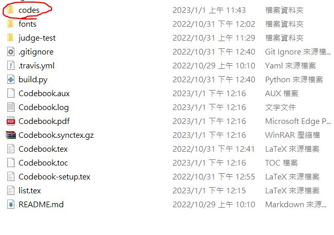

# Codebook 製作

ICPC 以及台灣的各大競技程式比賽，經常允許攜帶 20 到 25 頁 A4 大小的紙本作為參考資料。大學以後的競賽使用的演算法種類繁多，其中不少非常複雜以至於人腦難以記憶，因此大多數的隊伍會將這些演算法記錄在參考資料中，而有 codebook 之名。

有些比賽要求 codebook 的每一頁都要標上頁碼以及學校名稱，以及字體大小要在 50 公分外正常視力範圍的人能夠辨識出內容。為了最佳化 codebook 的文字量，本校隊伍 Jinkela (退休前改名 Angry Crow Takes Flight!) 製作了簡易的 codebook 生成器，提供給本校學生做為參考。

## 1. 下載以及編譯

要使用 Jinkela codebook，請先下載或是 clone [Codebook](https://github.com/Jinkela-Xiao-Zuan-Feng-Mountaineer/Codebook) 這個 repository。

Jinkela codebook 的特點在於無論是 Windows 以及 Linux 環境都能使用，所有的操作都可以在該系統的命令列介面中完成。首先確認自己的電腦有安裝 `python3` 以及 `xelatex`，盡量將兩個套件都安裝到最新的版本，`xelatex` 由於是比較少見的套件，可以參考 `README.md` 中的資訊安裝。

接著打開命列列介面進入 Codebook 的路徑，將 `Codebook.pdf` 刪除後，執行以下指令進行編譯：

```shell
python build.py
```

執行結束後，如果編譯成功會產生一個新的 `Codebook.pdf`，請檢察內容是否正常，如果完全沒有問題就可以進行下一步，否則請將出現的問題透過 [issues](https://github.com/Jinkela-Xiao-Zuan-Feng-Mountaineer/Codebook/issues) 告訴我們。

## 2. Codebook.pdf 內容

`Codebook.pdf` 是最終產生的參考資料，按照順序可以分成 3 個部分：

1. 程式碼以及數學公式<br>
該部分從第一頁開始，到目錄頁結束，佔據了檔案中的絕大部分
2. 目錄頁<br>
該部分通常只有一頁，為 *程式碼以及數學公式* 的目錄
3. 測機用程式碼<br>
有些比賽在正式開始前有個測試執行環境的時間，而且通常不會限制攜帶的參考資料數量，因此可以多帶一份專門測試用的程式碼。當前該部分是本校競技程式設計課程所教授的內容，可以自行研究使用方式。

## 3. 合法的檔案結構

Codebook 的路徑下有三個資料夾：`codes`、`fonts`、`judge-test`。其中 `fonts` 存放的是會用到的字體，而 `judge-test` 中放的是測機用程式碼，會在下一節介紹。這兩個資料夾理論上不會有任何修改，本小節的重點會放在 `codes` 資料夾中。



`codes` 資料夾中存放了所有想要被放進 codebook 中的程式碼以及數學公式，目前支援的格式有：`.cpp`、`.py` 以及 `.tex`。所有檔案都支援中英文的使用，若想要支援其他程式語言請自行學習 latex 語法來完成。

`codes` 資料夾透過其中的子資料夾名稱對檔案進行分類，子資料夾最多只能有一層，而且所有檔案都要放在子資料夾中。舉例來說，以下為 `codes` 其中兩個子資料夾的結構：

```
codes
├── Computational Geometry
│   ├── Geometry.cpp
│   ├── SmallestCircle.cpp
│   ├── delaunay.cpp
│   └── 最近點對.cpp
└── Data Structure
    ├── CDQ_DP.cpp
    ├── DLX.cpp
    ├── Dynamic_KD_tree.cpp
    ├── kd_tree_replace_segment_tree.cpp
    ├── reference_point.cpp
    ├── skew_heap.cpp
    ├── undo_disjoint_set.cpp
    └── 整體二分.cpp
```

可以在生成出來的 `Codebook.pdf` 中的目錄頁找到以下的結構：


透過這個規則，使用者可以自行增減 `codes` 資料夾中的任何資料已完成自己想要的 codebook。

## 4. 設定每頁顯示的欄數、橫版或直版顯示

Jinkela codebook 的另一大特點是可以自由設定每頁顯示的欄數、以及要橫版或直版顯示。想要做到這些設定，請打開 `Codebook-setup.tex`，並在其中找到以下幾行的參數設定：

```tex
\setboolean{UsingGeometryLandscape}{true} % 是否使用橫版頁面
\newcommand{\NumberOfColumn}{4} % 每頁有幾欄
\newcommand{\UniversityName}{National Tsing Hua University} % 學校名稱
\newcommand{\TeamName}{Angry Crow Takes Flight!} % 隊名
```

接著來介紹每個參數的作用：

### UsingGeometryLandscape

Jinkela codebook 使用 geometry landscape 來產生橫版頁面。該參數預設是 true，若將其調成 false 就會使用直版頁面。

```tex
\setboolean{UsingGeometryLandscape}{true} % 使用橫版頁面
\setboolean{UsingGeometryLandscape}{false} % 使用直版頁面
```

### NumberOfColumn

表示每頁有幾欄。一般來說橫版頁面會使用 4 欄或是 3 欄，直版頁面會使用 3 欄或 2 欄。該參數預設是 4，但實際上要達到最佳的程式碼壓縮量，建議使用直版頁面、每頁有 3 欄的樣式。

```tex
\newcommand{\NumberOfColumn}{3} % 每頁有 3 欄
```

### 學校名稱以及隊伍名稱

這個應該最簡單，直接按需求填寫就行了，中英文皆可 (或許其他語言也能正常使用)。

```tex
\newcommand{\UniversityName}{National Tsing Hua University} % 學校名稱
\newcommand{\TeamName}{Angry Crow Takes Flight!} % 隊名
```
