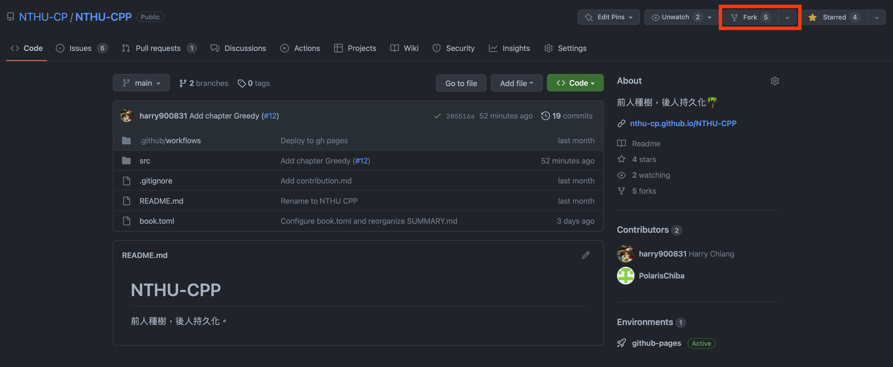
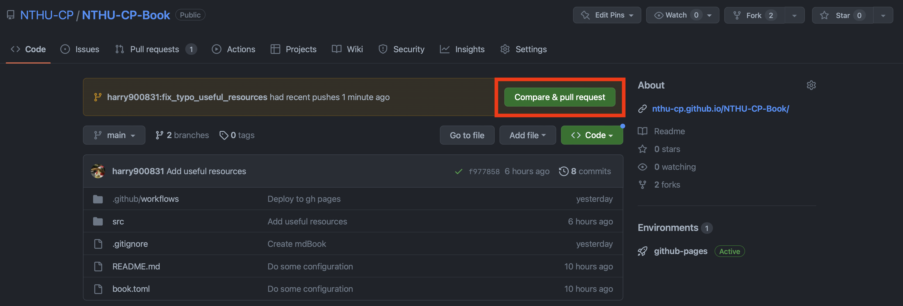
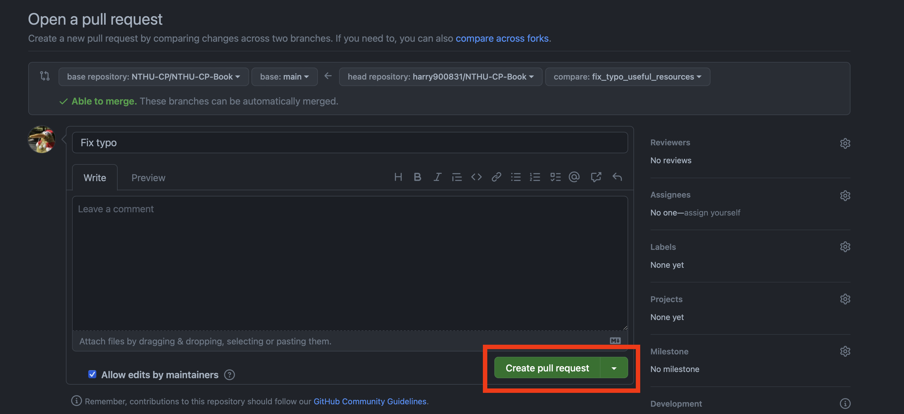

# Contribute to NTHU CPP

> 非常歡迎大家一同協作此專案！想新增或修改什麼就直接開 Issue 或者是 Pull Request 吧！

NTHU CPP 是由 mdBook 製作而成，搭配 GitHub Action，將網站的最新版本部署到 GitHub Pages。

## Before your contribution

- 如果是針對現有文章做修改或補充，請直接發 PR。若改動不小，可以先開個 issue 與作者或管理員討論。
- 若有想新增的章節，請先去 issue 確認是否有人正在撰寫。若沒有，可開一個 issue 並在其中簡述想新增的內容與一些資源，管理員認為沒問題的話會將該 issue assgin 給你，即可開始撰寫並發 PR。
- 也可以去看有 help wanted 標籤的 issue，有興趣的即可留言並著手開始。
- Commit message 請使用英文一句話描述此次的修改，盡量不要超過 50 字，首字母大寫。
- filename 使用底線分詞。
- 因為 mdBook 的設計，請使用 `\\(` `\\)` 來分隔 MathJax 語法。
- Reviewer 的本意是希望能有高品質的內容而非為了充字數而盡快將內容上架。請踴躍的與 reviewer 討論怎麼樣才能有清楚的說明或者是需要補充哪些內容。
- 根據經驗，搭配圖例往往能更清楚的說明事情，請不要使用手繪加拍照。可以使用 powerpoint 或其他應用程式輔助製作圖片。
- 專有名詞盡量使用英文。
- 請將參考資料附在文章最後。
- 若對 Markdown 或是 mdBook 不熟悉的人可以先參考 [mdBook Document](https://rust-lang.github.io/mdBook/format/markdown.html)。
- [防爆雷語法教學](https://gist.github.com/jbsulli/03df3cdce94ee97937ebda0ffef28287)。
- 圖片請放在與 md 檔同位置的 image 資料夾底下。
- 範例題目建議使用目前常用 OJ，例如：CSES, Codeforce, Atcoder 等等。

## Step to contribute

以下提供一個簡單的步驟給想要編輯此專案，但又不熟悉 Git 以及 GitHub workflow 的人。請先 fork [NTHU-CPP](https://github.com/NTHU-CP/NTHU-CPP) 這個 repository。



接著 clone 一份剛剛 fork 的 repository 下來到你的本地環境，checkout 到一個新的 branch，名稱可以自訂，通常是與你要做的修改有關。


```
git clone https://github.com/your_username/NTHU-CPP.git
git checkout -b your_branch_name
```

接著即可開始修改他囉！檔案架構與格式可以參考 [mdBook Documentation](https://rust-lang.github.io/mdBook/)。修改途中/完成時，也記得要把他 render 出來確認自己的改動格式沒問題（需要安裝 mdBook）。

```
mdbook serve --open
```

改動完成後，就 commit 並 push 到存 fork 出來的 repository。請不要將 mdBook render 出來的內容或者是一些非改動相關的檔案加進來。

```
git add file_you_changed
git commit -m "Commit message"
git push origin your_branch_name
```

push 上去之後應該就能在 NTHU CPP 的 repository 或者是 fork 出來的 repository 上看到可以 Compare & pull request。大膽地按下去。

你可以在這邊瀏覽一下自己的 commit 或者是寫一些話給要 review 的人。都沒問題後就可以按下 Create pull request 並等人來 review 囉！



建議需要熟悉 Git 的操作，但也不需要擔心會把整個 repository 搞砸，因為你是在 fork 出來的那份上編輯，也需要通過 review 才能被 merge 進去。

以下附上一些可能有用的參考資料：

- [連猴子都能懂的 Git 入門指南](https://backlog.com/git-tutorial/tw/)
- [與其它開發者的互動 - 使用 Pull Request（PR）- 為你自己學 Git](https://gitbook.tw/chapters/github/pull-request)
