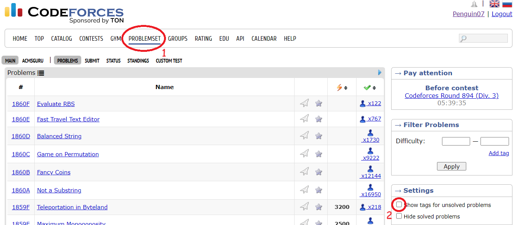
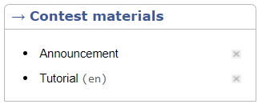
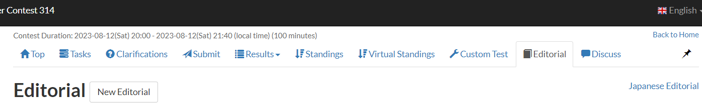

# How to Practice

## Introduction to CP

[競技程式設計介紹](https://hackmd.io/@LittlePants/Hyw_rueGK)

相信會點進這邊的你應該是對競程或多或少有點興趣，但該從何下手練習呢？

## 練題

> 為甚麼不是學習演算法或是資料結構呢？

學習演算法、資料結構固然重要，但是絕大部分的題目都不會用到太困難的科技 (可以參考[這篇](https://codeforces.com/blog/entry/92248))，況且現在大部分的比賽都能夠使用 [Codebook](codebook.md)，因此我不太建議花太多時間學困難的演算法或資料結構，而是把它當作黑箱，了解這個資料結構能夠解決甚麼類型的問題，但不去了解運作的原理。

競程的題目就像是禮盒，出題者會將考點進行包裝，而選手的任務就是透過「觀察」拆掉層層的包裝，然後透過程式解決剩下的問題。簡單來說，可以將「演算法」和「資料結構」想像成工具，而我們的目標是要想辦法將一道題目簡化為手邊工具能夠解決的模樣。因此如果練習過大量的題目，就會對一些常見的技巧或是性質更加熟悉，進而加快解題的速度。

> 我該練習什麼類型和難度的題目呢？

除非在寫模板題，否則我不太建議練習「特定」主題的題目，因為這樣就會對題目有先入為主的概念，知道題目的考點是甚麼方向，這對於練習「觀察」的幫助不大。以 [Codeforces](https://codeforces.com/) 為例，該 OJ 的每道題目都會有標籤，如果不想要在點進題目就被暴雷的話透過以下的方式關掉。

難度的話會建議挑選與自己能力差不多的題目，可以視情況微調，但不建議刷水題或是超難的題目。這就好比你只有國中數學的程度，但一直練習國小的加減乘除或是大學的微積分，是在浪費時間。

同樣用 [Codeforces](https://codeforces.com/) 舉例，在上圖中的 Filter Problems 可以選擇題目的難度，這通常與比賽中有多少人解出該題有關。[AtCoder](https://atcoder.jp/) 沒有內建的題庫，因此可以搭配[這個工具](https://kenkoooo.com/atcoder/#/table/)選題。

> 解不出題目怎麼辦？

先確認自己是否有花心力去思考，而不是放空個 \\( 10 \\) 分鐘就放棄。如果過程中一直沒有進展，可以考慮戳戳看題解，看有沒有性質是自己沒有觀察到的，或者是思考的方向完全錯誤。就算解出來某道題目，也可以去看看題解，因為每道題目可能都存在不同的解法，參考別人的方法對學習也有幫助。

Codeforces 在該題的右下角會有這個東東，點 tutorial 就可以看到題的題解了。

AtCoder 進入題目所在的 contest，上方有 editorial 就可以看場比賽的題解了。

其他 OJ 或許也有，但這邊就只先介紹較多人使用的 OJ。

## 找人討論

身邊有同好一起努力會讓自己更有動力，也可以一起討論題目。如上面所說的，題目可能存在不同的解法，多多討論對學習也有幫助。

偷偷推[讀書會](happy_meeting.md) XD

## References

以下是一些國外的大神寫的關於如何練習或進步的文章，有興趣的同學可以去閱讀

- [Things I don't know](https://codeforces.com/blog/entry/92248)
  - 去學 binary search！
- [Pro Tips - get them while they are free](https://codeforces.com/blog/entry/113785)
- [How to practice Competitive Programming [Um_nik version]](https://codeforces.com/blog/entry/98806)
- [Self-deception: maybe why you're still grey after practicing every day](https://codeforces.com/blog/entry/98621)
  - 心理學
