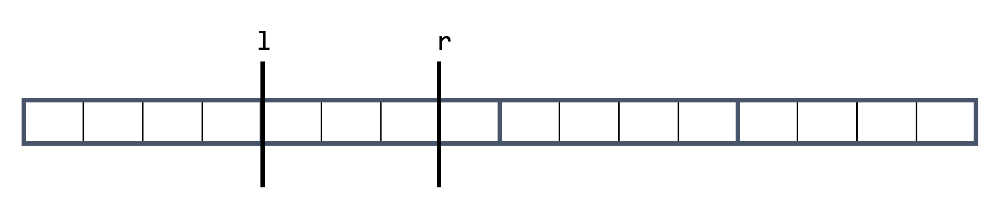
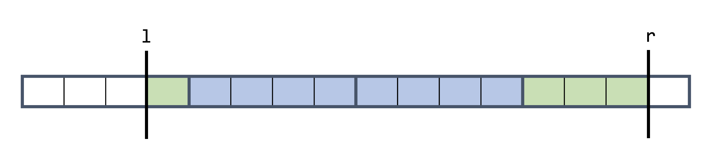
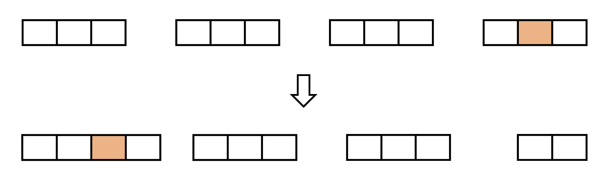
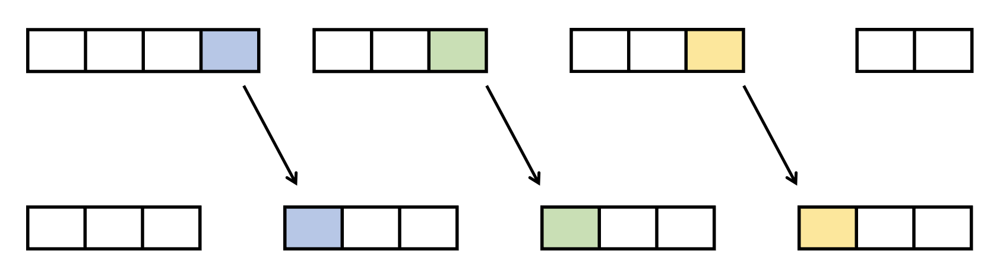

# Square Root Decomposition

## Introduction

此技巧中文常稱之為分塊，概念並不困難，就像是比較優美的暴力。

考慮以下問題：

> [CSES - Dynamic Range Sum Queries](https://cses.fi/problemset/task/1648)
>
> 給定一個長度為 \\( N \\) 的序列 \\( a \\)，並對其進行 \\( Q \\) 筆操作。操作有兩種：
>
> 1. 給定 \\( k, u \\)，將 \\( a_k \\) 修改成 \\( u \\)。
> 2. 給定 \\( l, r \\)，請輸出 \\( a_l + a_{l + 1} + ... + a_r \\)，也就是 \\( l \\) 到 \\( r \\) 的區間和。
>
> - \\( N, Q \leq 2 \times 10^5 \\)

此問題可以使用一些資料結構例如線段樹來得到 \\( O(N + Q\log N) \\) 的解法。但這裡要介紹的是如何使用分塊來解這題。

### 序列分塊

對於一個長度為 \\( N \\) 的陣列，我們先將其每 \\( K \\) 個元素分在同一塊，同時維護每一塊的總和是多少。如下圖，設 \\( K = 4 \\)：


我們先考慮第二種詢問區間和的操作。若 \\( l, r \\) 在同一塊內，如下圖，我們就直接用最暴力的方式遍歷過 \\( l \\) 到 \\( r \\) 之間的元素。最壞的情況下不可能走超過 \\( K \\) 個元素，否則他們就不應該在同一塊，因此此部分的時間複雜度為 \\( O(K) \\)。



若 \\( l, r \\) 不在同一塊內的話，如下圖，對於 \\(l, r \\) 所在的塊，我們一樣使用暴力的方式取得數值總和，也就是綠色部分。此步同上，時間複雜度為 \\( O(K) \\)。

對於 \\( l, r \\) 中間橫跨過的塊，也就是藍色的部分，因為我們有預先計算每一塊的總和分別是多少，因此我們可以遍歷過去中間的每一「塊」，注意到不是遍歷過中間的每一個元素，來取得最終的區間總和。最壞的情況下，中間至多有 \\( \frac{N}{K} \\) 塊，所以此步驟為 \\( O(\frac{N}{K}) \\)。



接著回來看一下第一種操作，也就是單點修改，可以發現我們只需要去修改 \\( a_k \\) 的值，以及 \\( a_k \\) 所在的塊的總和即可，此步可以在 \\( O(1) \\) 辦到。

總結一下此做法，首先預處理原本的陣列維護每一塊的總和是多少，可以在 \\( O(n) \\) 內辦到。對於每一筆操作，時間複雜度為 \\( O(1) + O(K) + O(\frac{N}{K}) \\)。於是此做法的總時間複雜度為 \\( O(N + Q(K + \frac{N}{K})) \\)。

我們最後要討論的問題是，每幾個元素要被分在同一塊？也就是 \\( K \\) 的值該選什麼能讓我們的時間複雜度最好。我們要最小化 \\( K + \frac{N}{K} \\)，一個簡單但不嚴謹的推論是左邊那一項就越大，右邊那一項就越小，反之亦同，因此左右相等時會有最佳的時間複雜度，因此 \\( K \\) 我們取 \\( \sqrt{N} \\) 會讓時間複雜度最好。這個結果其實也可以從國中教的算幾不等式求出。

因此此做法的時間複雜度為：\\( O(N + Q\sqrt{N}) \\)。

<details><summary> Solution Code </summary>

- 以下將 \\( K \\) 的值直接設定成固定值，大約是題目中的 \\( N \\) 的最大值開根號。
- `block_size` 代表一塊有幾個元素。
- `block_num` 帶表總共分成幾塊。
- `block_sum[i]` 就是第 \\( i \\) 塊的總和。
- `block_map[i]` 代表 \\( a_i \\) 屬於哪一塊。
- 另一種實作查詢答案的想法是查 `[1, r]` 的區間和減掉 `[1, l - 1]`。

```cpp
#include <bits/stdc++.h>
using namespace std;

int main() {
  cin.tie(0);
  ios_base::sync_with_stdio(0);

  int n, q;
  cin >> n >> q;

  const int block_size = 450;
  const int block_num = 450;
  vector<int> a(n + 1), block_map(n + 1);
  vector<long long> block_sum(block_num);

  for (int i = 1; i <= n; i++) {
    cin >> a[i];
    block_map[i] = i / block_size;
    block_sum[block_map[i]] += a[i];
  }

  while (q--) {
    int t;
    cin >> t;
    if (t == 1) {
      int k, u;
      cin >> k >> u;
      block_sum[block_map[k]] += u - a[k];
      a[k] = u;
    } else {
      int l, r;
      cin >> l >> r;
      int L = block_map[l], R = block_map[r];
      long long ans = 0;
      if (L == R) {
        for (int i = l; i <= r; i++) {
          ans += a[i];
        }
      } else {
        for (int i = L + 1; i <= R - 1; i++) {
          ans += block_sum[i];
        }
        int it = l;
        while (block_map[it] == block_map[l]) {
          ans += a[it];
          it++;
        }
        it = r;
        while (block_map[it] == block_map[r]) {
          ans += a[it];
          it--;
        }
      }
      cout << ans << '\n';
    }
  }

  return 0;
}
```

</details>

### 操作分塊

除了上述對序列分塊以外，以下將換個角度切入一模一樣的問題。

假如第二種操作，也就是給定 \\( l, r \\) 詢問區間和，我們可以透過預先計算前綴和來達到 \\( O(1) \\) 輸出區間和。但是對於單點修改的操作，我們如果直接去修改紀錄前綴和的陣列，最糟的情況下是修改第一個元素，就會需要花 \\( O(n) \\) 去更新整個前綴和的陣列，這聽起來很糟。

換個想法，我們也可以不修改前綴和陣列，對於每次單點修改的操作，記錄下是哪個位置被更改，以及更改後的差值。這樣每次詢問區間和的操作時，先取得原始陣列的區間和答案，接著跑過之前所有單點修改的操作，判斷一下這次修改的位置有沒有被包含在詢問區間和的 \\( l, r \\) 之間，有的話就更新一下答案。這樣我們能獲得一個 \\( O(1) \\) 單點修改，\\( O(m) \\) 查詢區間和的演算法，\\( m \\) 為在這之前有幾筆單點修改的操作。因為 \\( m \\) 可能很大，因此這個做法依然不夠快。

上述做法的瓶頸在於，建完前綴和後的單點修改次數可能會很多，那我們其實可以設定一個臨界值，當累積的單點修改次數超過臨界值就重建前綴和。概念上就像是對操作分塊。

假設臨界值是 \\( K \\)，這樣每一次區間詢問的時間複雜度為 \\( O(K) \\)，因為至多累積 \\( K \\) 個單點修改的操作。而最糟情況下重建前綴和的次數為 \\( \frac{Q}{K} \\) 次，所以此做法的時間複雜度為 \\( O(N + QK + N\frac{Q}{K}) \\)。若 \\( K \\) 為 \\( \sqrt{N} \\) 則此做法時間複雜度為 \\( O(N + Q\sqrt{N}) \\)。若 \\( K \\) 為 \\( \sqrt{Q} \\)，則此做法時間複雜度為 \\( O((Q + N)\sqrt{Q}) \\)。

<details><summary> Solution Code </summary>

- 一樣先把 `block_size` 設定成一個固定值
- `buf` 存的是累積的單點修改操作

```cpp
#include <bits/stdc++.h>
using namespace std;

int main() {
  cin.tie(0);
  ios_base::sync_with_stdio(0);

  int n, q;
  cin >> n >> q;

  vector<int> a(n + 1);
  vector<long long> pre(n + 1);

  for (int i = 1; i <= n; i++) {
    cin >> a[i];
    pre[i] = pre[i - 1] + a[i];
  }

  const int block_size = 400;
  vector<pair<int, int>> buf;
  while (q--) {
    int t;
    cin >> t;
    if (t == 1) {
      int k, u;
      cin >> k >> u;
      buf.emplace_back(k, u - a[k]);
      a[k] = u;
    } else {
      int l, r;
      cin >> l >> r;
      long long ans = pre[r] - pre[l - 1];
      for (auto [id, val] : buf) {
        if (l <= id && id <= r) {
          ans += val;
        }
      }
      cout << ans << '\n';
    }
    if (buf.size() >= block_size) {
      buf.clear();
      for (int i = 1; i <= n; i++) {
        pre[i] = pre[i - 1] + a[i];
      }
    }
  }

  return 0;
}
```

</details>

我們接著再看一題。

> [CF 445D - Serega and Fun](https://codeforces.com/contest/455/problem/D)  
> 給一個長度為 \\( N \\) 的陣列 \\( A \\)，\\( Q \\) 筆操作，強制在線，有兩種操作：
>
> 1. 給定 \\( l, r \\)，將 \\( l \\) 到 \\( r \\) 的元素向右循環移位，也就是說 \\( a_l, a_{l + 1}, ..., a_{r - 1}, a_{r} \\) 會變成 \\( a_{r}, a_{l}, a_{l - 1}, ..., a_{r - 1} \\)。
> 2. 給定 \\( l, r, k \\)，輸出 \\( l \\) 到 \\( r \\) 之間有幾個元素數值等於 \\( k \\)。
>
> - \\( N, Q \leq 10^5 \\)
> - \\( 1 \leq A_i \leq N \\)

首先，第一個操作，我們可以看成是將第 \\( r \\) 個元素刪掉，並在 \\( l \\) 之前插入數值。

先直接將 \\( A \\) 分塊，每 \\( \sqrt{N} \\) 個元素分成一塊[^note-1]。每一塊都維護一個長度為 \\( N \\) 的陣列 \\( cnt \\)，\\( cnt[i] \\) 代表這一塊中數值 \\( i \\) 的元素有幾個。此處就要花 \\( O(N\sqrt{N}) \\) 的空間。同時每一塊都需要紀錄塊中的元素的順序。

對於第一種操作，將第 \\( r \\) 個元素刪掉。只要找出第 \\( r \\) 個元素在哪一塊內，我們直接將其在該塊紀錄順序的陣列上暴力刪除即可，此處的暴力指的是直接將他後面的元素都往前移動一位，然後更新 \\( cnt \\)。對於在 \\( l \\) 之前插入數值也是用一樣的想法。找到 \\( l \\) 在哪一塊，將其暴力插在 \\( l \\) 之前。我們這樣暴力插入刪除，會一直影響每一塊的元素數量，導致不是每一塊都是恰好 \\( \sqrt{N} \\) 個元素，因此為了找出第 \\( i \\) 個元素在哪，我們需要從第一塊開始遍歷，透過每一塊目前擁有的元素數量來累加，找出第 \\( i \\) 個元素在哪一塊。

對於第二種操作，一樣先找出第 \\( l \\) 個元素與第 \\( r \\) 個元素在哪一塊，他們所在的塊就直接暴力計算答案，接著遍歷過去他們之間的「塊」，直接加總每一塊的 \\( cnt[k] \\)，概念上與前面那題的查詢相似。

這個做法確實能計算出正確答案，但是時間複雜度如何呢？塊的數量是固定的 \\( \sqrt{N} \\)塊，所以找出第 \\( i \\) 個元素在哪以及查詢時遍歷中間所有的塊可以在 \\( O(\sqrt{N}) \\)下做到。

因為一開始是按照每 \\( \sqrt{N} \\) 個元素分成一塊，所以前幾次操作時每一塊的大小都差不多在 \\( \sqrt{N} \\) 左右。因此每一塊內暴力插入刪除以及暴力計算塊內的答案都能在 \\( O(\sqrt{N}) \\) 下辦到。但是隨著操作次數越來越多，可能有一塊一直被插入元素，導致塊內的元素變太多，最慘情況下時間複雜度會退化到 \\( O(N) \\)。我們可以在這邊也應用把操作分塊的想法，每 \\( \sqrt{N} \\) 次操作後，就重新按照順序，把每 \\( \sqrt{N} \\) 個元素分在同一塊。重建的時間複雜度是 \\( O(n) \\)，至多重建 \\( \frac{Q}{\sqrt{N}} \\) 次。這樣子就能保證進行操作時，每一塊至多只會有 \\( 2\sqrt{N} \\) 個元素。

最後來總結一下時間複雜度，一開始 \\( O(N) \\) 分塊，第一種第二種操作都能在 \\( O(\sqrt{N}) \\) 內做到，每 \\( \sqrt{N} \\) 次操作就重新分塊的時間複雜度是 \\( O(N\sqrt{N}) \\)。因此總時間複雜度為，\\( O((Q + N)\sqrt{N}) \\)。

<details><summary> Solution Code </summary>

- 使用 lambda function 純粹是筆者習慣，同學參考就好。
- vector 的 erase 和 insert 的時間複雜度是 \\( O(size) \\)。
- 以下的程式碼為每 `block_size` 次操作就會重新建分塊的序列，追求速度的話可以修改成每 \\( \sqrt{N} \\) 次操作一後再重建分塊的序列，這樣子時間複雜度不變，只是執行時間應該會快一點。
- 注意到，重建分塊序列時，不能直接暴力 \\( O(N\sqrt{N}) \\) 將 `cnt` 陣列歸 0，或是重開一個大小為 \\( O(N\sqrt{N}) \\) 的陣列，這樣會讓總時間複雜度變成 \\( O(N^2) \\)，這是一個初學者常犯的小錯誤。

```cpp
#include <bits/stdc++.h>
using namespace std;

int main() {
  cin.tie(0);
  ios_base::sync_with_stdio(0);

  int block_size = 320;
  int block_num = 320;

  int n; cin >> n;
  vector<int> a(n + 1);
  vector<vector<int>> block(block_num);
  vector<vector<int>> cnt(block_num, vector<int>(n + 1));

  for (int i = 1; i <= n; i++) {
    cin >> a[i];
    int block_id = i / block_size;
    block[block_id].push_back(a[i]);
    cnt[block_id][a[i]]++;
  }

  int q; cin >> q;

  int last_ans = 0;

  auto decode = [&](int& x) {
    x = (x + last_ans - 1) % n + 1;
  };
  auto find_block_id = [&](int id) -> pair<int, int> {
    int res = 0;
    for (int i = 0; i < block_num; i++) {
      if (res + (int) block[i].size() >= id) {
        return {i, res};
      }
      res += block[i].size();
    }
  };

  auto remove = [&](vector<int>& v, vector<int>& c, int id) {
    auto it = v.begin() + id;
    int ret = *it;
    c[ret]--;
    v.erase(it);
    return ret;
  };

  auto insert = [&](vector<int>& v, vector<int>& c, int id, int val) {
    auto it = v.begin() + id;
    c[val]++;
    v.insert(it, val);
  };

  auto rebuild = [&]() {
    vector<vector<int>> new_block(block_num);
    int id = 0;
    for (int i = 0; i < block_num; i++) {
      for (auto it : block[i]) {
        int block_id = id / block_size;
        new_block[block_id].push_back(it);
        cnt[i][it]--;
        cnt[block_id][it]++;
        id++;
      }
    }
    block = new_block;
  };

  for (int p = 1; p <= q; p++) {
    if (p % block_size == 0) rebuild();
    int t, l, r; cin >> t >> l >> r;
    decode(l), decode(r);
    if (l > r) swap(l, r);
    auto [l_bid, l_pre] = find_block_id(l);
    auto [r_bid, r_pre] = find_block_id(r);
    int l_id = l - l_pre - 1, r_id = r - r_pre - 1;
    if (t == 1) {
      if (l == r) continue;
      auto val = remove(block[r_bid], cnt[r_bid], r_id);
      insert(block[l_bid], cnt[l_bid], l_id, val);
    } else {
      int k; cin >> k;
      decode(k);
      int ans = 0;
      if (l_bid == r_bid) {
        for (int i = l_id; i <= r_id; i++) ans += (block[l_bid][i] == k);
      } else {
        for (int i = l_bid + 1; i <= r_bid - 1; i++) ans += cnt[i][k];
        for (int i = l_id; i < (int) block[l_bid].size(); i++) ans += (block[l_bid][i] == k);
        for (int i = 0; i <= r_id; i++) ans += (block[r_bid][i] == k);
      }
      cout << ans << '\n';
      last_ans = ans;
    }
  }

  return 0;
}
```

</details>

上述講的作法是官方的解答，同時運用了對序列分塊與操作分塊的精神。那有沒有其他的方法呢？

會需要對操作分塊的原因是在暴力插入與刪除元素時，每一塊的大小會被改變。也因為每一塊大小會被改變，導致我們會需要如上程式碼的 `find_block_id` 函數來找第 `i` 個元素在哪一塊。

要維持每一塊的大小是 \\( O\sqrt{N} \\)，我們可以在每次操作一結束後，主動調整來維持。假設我們將橘色的元素從第四塊移動到第一塊上，如下圖。



此時第一塊的元素會多一個而第四塊的元素會少一個。我們只要從第一塊開始將最右邊多的那一塊丟給下一塊，下一塊將他最右邊多的那一塊給下一塊，直到少一個的塊被補足為止。



也就是說，第一種操作暴力插入刪除元素後，從 \\( l \\) 所在的塊開始，持續將最後面的元素推到下一塊的開頭，直到 \\( r \\) 所在的塊為止。因為至多 \\( O(\sqrt{N}) \\) 塊，搭配使用能 \\( O(1) \\) 在最前面與最後面插入/刪除的 deque，則這步的時間複雜度為 \\( O(\sqrt{N}) \\)。這樣能保證第一種操作之後還是每 \\( O(\sqrt{N}) \\) 個元素在同一塊。總時間複雜度不變。

這樣做的好處是每一次操作結束後第 `i` 個元素仍然會在第 `i / block_size` 塊上。就不用再額外找第 `i` 塊在哪。也不需要重建序列分塊。

<details><summary> Solution Code </summary>

- 使用 0-based index，這樣才能方便透過 `i % block_size` 取得第 `i` 個元素在第 `i / block_size` 的哪個位置。

```cpp
#include <bits/stdc++.h>
using namespace std;
 
int main() {
  cin.tie(0);
  ios_base::sync_with_stdio(0);
 
  int block_size = 320;
  int block_num = 320;
 
  int n; cin >> n;
  vector<int> a(n + 1);
  vector<deque<int>> block(block_num);
  vector<vector<int>> cnt(block_num, vector<int>(n + 1));
 
  for (int i = 0; i < n; i++) {
    cin >> a[i];
    int block_id = i / block_size;
    block[block_id].push_back(a[i]);
    cnt[block_id][a[i]]++;
  }
 
  int q; cin >> q;
 
  int last_ans = 0;
 
  auto decode = [&](int& x) {
    x = (x + last_ans - 1) % n + 1;
  };
 
  auto remove = [&](deque<int>& deq, vector<int>& c, int id) {
    auto it = deq.begin() + id;
    int ret = *it;
    c[ret]--;
    deq.erase(it);
    return ret;
  };
 
  auto insert = [&](deque<int>& deq, vector<int>& c, int id, int val) {
    auto it = deq.begin() + id;
    c[val]++;
    deq.insert(it, val);
  };
 
  auto balance = [&](int l, int r) {
    for (int i = l; i < r; i++) {
      int val = block[i].back();
      cnt[i + 1][val]++;
      block[i + 1].push_front(block[i].back());
      cnt[i][val]--;
      block[i].pop_back();
    }
  };
 
  auto calc = [&](int l, int r, int k) {
    int ans = 0;
    while (l <= r) {
      if (l % block_size == 0 && l + block_size - 1 <= r) {
        ans += cnt[l / block_size][k];
        l += block_size;
      } else {
        ans += (block[l / block_size][l % block_size] == k);
        l++;
      }
    }
    return ans;
  };
 
  while (q--) {
    int t, l, r; cin >> t >> l >> r;
    decode(l), decode(r);
    if (l > r) swap(l, r);
    l--, r--;
    int l_bid = l / block_size, l_id = l % block_size;
    int r_bid = r / block_size, r_id = r % block_size;
    if (t == 1) {
      if (l == r) continue;
      auto val = remove(block[r_bid], cnt[r_bid], r_id);
      insert(block[l_bid], cnt[l_bid], l_id, val);
      balance(l_bid, r_bid);
    } else {
      int k; cin >> k;
      decode(k);
      last_ans = calc(l, r, k);
      cout << last_ans << '\n';
    }
  }
 
  return 0;
}
```

</details>

筆者自己比較喜歡第一種解法的想法，但會選擇第二種解法來實作。

## Why Square Root Decomposition?

以第一個範例題目來說，分塊作法的時間複雜度有一個根號，比線段樹還差，明明存在時間複雜度更優的作法，那為什麼要用分塊呢？擷取某個中國人的文章[^note-2]:


雖然說他的結論不是很正確，多數題目下帶 \\( \log{N} \\) 的演算法還是能跑的比分塊還快，除非分塊的操作真的很乾淨，或者是出題者沒卡。

但是我們可以知道分塊其實跑得很快，因為沒有遞迴、程式碼乾淨、常數較小。第一個範例題目的 \\( N \\) 最大為 \\( 2 \times 10^5 \\)，分塊的做法能在 0.13s 通過所有測資，並不會比線段樹還差。而且有許多題目是分塊能做但線段樹不能做的。因此這個技巧還滿重要且實用的。

### 序列分塊的思路

  1. 完整的一塊要維護什麼資訊？
  2. 查詢時，左右不完整的塊要怎麼處理？
  3. 如何在不用太快的方法下更新塊的資訊？因為分塊的複雜度已經帶一個根號了，所以只要更新的操作在 \\( O(\sqrt{N}) \\) 下，都不會讓時間複雜度變差。

### 操作分塊的思路

  1. 怎麼快速做沒有修改的版本？
  2. 如果將單一個修改應用到詢問上？
  3. 如何快速的重建維護的資訊？

## Exercises

以下我們來看一些題目。

> [CSES - Dynamic Range Minimum Queries](https://cses.fi/problemset/task/1649)
>
> 給定一個長度為 \\( N \\) 的序列 \\( a \\)，並對其進行 \\( Q \\) 筆操作。操作有兩種：
>
> 1. 給定 \\( k, u \\)，將 \\( a_k \\) 修改成 \\( u \\)。
> 2. 給定 \\( l, r \\)，請輸出 \\( a_l, a_{l + 1}, ..., a_r \\) 的最小值。
>
> - \\( N, Q \leq 2 \times 10^5 \\)

<details><summary> Solution </summary>

查詢區間最小值與查詢區間和的差異在於單點修改時不能 \\( O(1) \\) 達成。不過只要每次單點修改就重新計算該塊的最小值是多少就能做了。適合當作基礎分塊技巧的練習題。

</details>

> [洛谷 P2801 - 教主的魔法](https://www.luogu.com.cn/problem/P2801)
>
> 給定一個長度為 \\( N \\) 的序列 \\( a \\)，並對其進行 \\( Q \\) 筆操作。操作有兩種：
>
> 1. 給定 \\( l, r, w \\)，將 \\( a_l, a_{l + 1}, ..., a_r \\) 都加上 \\( w \\)。
> 2. 給定 \\( l, r, c \\)，輸出 \\( a_l, a_{l + 1}, ..., a_r \\) 中，有多少數字大於等於 \\( c \\)。
>
> - \\( N \leq 10^6 \\)
> - \\( Q \leq 3000 \\)

<details><summary> Solution </summary>

對序列分塊，假設塊的大小是 \\( K \\)。每一塊維護塊內元素排序好的陣列。

對於區間加值操作，被區間完全覆蓋的塊，直接打懶標紀錄整塊加上 \\( w \\)，至多 \\( O(\frac{N}{K}) \\) 塊，所以此步驟的時間複雜度為 \\( O(\frac{N}{K}) \\)。對於左右沒有被區間完整覆蓋而散落的元素，直接暴力在塊中排序好的陣列上找出被區間覆蓋的元素並直接加值。加完值後需要重新排序。因為被加值的元素與沒被加值的元素會形成兩個排序好的序列，可以線性合併他們兩個以獲得整個排序好的陣列。所以此步驟的時間複雜度是 \\( O(K) \\)。

對於區間查詢有多少數字大於等於 \\( c \\)，被區間完全覆蓋的塊直接在塊內元素排序好的陣列上搭配懶標二分搜即可，此步驟的時間複雜度為 \\( O(\frac{N}{K} \times \log K) \\)。對於左右沒有被區間完整覆蓋而散落的元素，直接暴力在塊中查找，此步驟時間複雜度為 \\( O(K) \\)。

總結一下：

- 初始構造每一塊塊內還續好的陣列：\\( O(N\log N) \\)。
- 區間加值：\\( O(\frac{N}{K} + K) \\)
- 查詢：\\( O( \frac{NlogK}{K}+K) \\)

則總時間複雜度：\\( O( N\log N + Q ( \frac {NlogK}{K}+K) ) \\)

- 若取 \\( K = \sqrt{N} \\)，則總時間複雜度為 \\( O( N\log N + Q\sqrt{N}\log N) ) \\)。
- 若取 \\( K = \sqrt{N\log N} \\)，則總時間複雜度為 \\( O( N\log N + Q\sqrt{N\log N}) ) \\)。

這個題目的用意是想展示，並不是所有分塊都是取 \\( O(\sqrt{N}) \\) 為最優。

</details>

> [CF 13E - Holes](https://codeforces.com/contest/13/problem/E)
>
> 給一個長度為 \\( N \\) 的序列 \\( a \\)，代表 \\( N \\) 個洞。若將球放到第 \\( x \\) 個洞，球會跑到第 \\( i + a_x \\) 個洞，接著從第 \\( i + a_x \\) 個洞跑到第 \\( i + a_x + a_{a_x} \\) 個洞，持續直到編號超出 \\( N \\) 為止。本題要處理 \\( M \\) 筆操作。操作有兩種：
>
> 1. 給定 \\( x, y \\)，將 \\( a_x \\) 改成 \\( y \\)。
> 2. 給定 \\( x \\)，請輸出若將球放到第 \\( x \\) 個洞，球總共會通過幾個洞，以及離開這個序列前最後通過的洞的編號。
>
> - \\( 1 \leq N, M \leq 10^5 \\)

<details><summary> Solution </summary>

將洞每連續 \\( \sqrt{N} \\) 個分成一塊。

每個洞都維護這個洞往後跑時，第一個離開當前塊能到達的洞穴編號、這途中經過幾個洞穴以及離開當前塊之前最後經到達的洞邊號。建這個表需要 \\( O(N\sqrt{N}) \\)。

- 對於查詢操作，直接從第 \\( x \\) 個洞開始模擬，每次直接跳到離開當前塊，第一個能到達的位置，並將答案加上這途中經過幾個洞穴。因為至多 \\( \sqrt{N} \\) 個塊，所以此步驟時間複雜度為 \\( O\sqrt{N} \\)。
- 對於修改操作，修改了第 \\( x \\) 個洞維護的值之後，在 \\( x \\) 右邊或者是不在同一塊內的元素不會受影響。但有可能需要修改同一塊內在他左邊的元素維護的值。此步驟可以在 \\( O(\sqrt{N}) \\) 辦到。

總時間複雜度為 \\( O((N + M)\sqrt{N}) \\)。

</details>

> [CF 342E - Xenia and Tree](https://codeforces.com/contest/342/problem/E)
>
> 給一個 \\( N \\) 個點的樹，初始只有第一個點是紅色的。樹上兩點距離為從一點到另一點最少要經過幾條邊。本題要處理 \\( M \\) 個操作。操作有兩種：
>
> 1. 給定 \\( v \\)，將點 \\( v \\) 改成紅色的。
> 2. 給定 \\( v \\)，詢問 \\( v \\) 到最近的紅色點的距離是多少。
>
> - \\( N, M \leq 10^5 \\)

<details><summary> Solution </summary>

本題可以使用 Centroid Decomposition 來解，不過既然這章節是分塊，要來討論一下怎麼用分塊來解這題。

回想操作分塊的思路：

1. 怎麼快速做沒有修改的版本

假設樹初始有一些點是紅色的，我們只要透過從所有紅色點開始 BFS，即可 \\( O(N) \\) 維護每個點到最近的紅色點的距離。

2. 如果將單一個修改應用到詢問上

對於額外被修改成紅色的點，我們直接計算他與詢問的點距離是多少。

樹上給定兩點求距離是一個非常經典的問題，請讀者參考其他章節，或自行研究。總而言之，這裡你可以透過將查詢距離的問題轉換成 LCA 問題後再轉換成 RMQ 問題，然後搭配 Sparse Table 來達到 \\( O(N\log N) \\) 預處理、\\( O(1) \\) 查詢兩點距離的算法。

事實上此處就算是使用倍增法來求 LCA，也就是查詢時會是 \\( O(\log N) \\)，仍然能通過此題。

3. 如何快速的重建維護的資訊

重新從所有紅色的點開始 BFS 即可，此步驟 \\( O(N + M) \\)。

綜上所述，透過操作分塊，我們可以得到一個 \\( O((N + M)\sqrt{N}) \\) 的做法。

</details>

> [CF 446C - DZY Loves Fibonacci Numbers](https://codeforces.com/contest/446/problem/C)
>
> 定義 \\( F_n \\) 為費氏數列第 \\( n \\) 項。\\( F_1 = 1; F_2 = 1; F_n = F_{n - 1} + F_{n - 2} \\)。
>
> 給一個長度為 \\( N \\) 的序列 \\( a \\)，以及 \\( M \\) 筆操作。操作有兩種：
>
> 1. 給定 \\( l, r \\)，對所有 \\( i, (l \leq i \leq r) \\)，將 \\( a_i \\) 加上 \\( F_{i - l + 1} \\)。
> 2. 給定 \\( l, r \\)，輸出 \\( \sum_{i = l}^{r} a_i \bmod {10^9 + 9} \\)。
>
> - \\( N, M \leq 3 \times 10^5 \\)

<details><summary> Solution </summary>

本題的官方解答是利用一些筆者認為很無聊的觀察來得出一個 \\( O(M\log N) \\) 作法。

事實上，你也可以使用操作分塊的想法來做這題。

預處理費氏數列前 \\( N \\) 項的前綴和，就可以快速將一個區間加上費氏數列的操作貢獻給詢問區間和。

查詢區間和就會想到前綴和，可以透過對要區間加費氏數列的左端點與右端點打上標記，從頭掃過去，快速重建前綴和。

可以在 \\( O((N + M)\sqrt{N}) \\) 下解出這題，細節就給讀者自行練習。

</details>

> [LOJ 6284 - 数列分块入门 8](https://loj.ac/p/6284)
>
> 給一個長度為 \\( N \\) 的序列，以及 \\( N \\) 個操作。每次操作給定 \\( l, r, c \\)，請輸出區間 \\( l, r \\) 有多少數字等於 \\( c \\) 並將所有區間 \\(l, r\\) 的元素都改成 \\(c\\)。

<details><summary> Solution </summary>

直接對序列分塊，每一塊維護一個懶人標記，代表這一整塊的元素是否都相同。操作時，對於包含到的塊，直接查看懶標，看整塊是否全等於某個數字，不是的話就進入塊中查看每個元素；是的話直接修改懶標即可。對於被包含到部分的塊，直接到塊中暴力查看與修改。

以上的作法看似非常暴力，因爲直觀上，可能一次操作就會進入很多塊中一個元素一個元素去比較，單一操作的最慘時間複雜度是 \\( O(N) \\)。

這個做法的時間複雜度與到底有幾塊並非整塊相等有關，因為非整塊相等會讓他有機會在未來的操作需要進入塊中查看每個元素。可以發現每一次操作過後，塊內的元素不全部相等的塊的數量最多加二。

因此其實這個做法均攤來看其實是 \\( O(N\sqrt{N}) \\)。證明留給讀者練習。

</details>

> [The 2021 ICPC Asia Taipei Regional Programming Contest pC - Community Service](https://codeforces.com/gym/103443/problem/C)
>
> 請有興趣的讀者自行去連結查看題目敘述，以免暴雷未來打算模擬這屆台北站當作團練的人。

<details><summary> Solution </summary>

這題在當年台北站算是有難度的題目，僅有 14 隊做出來。官解做法複雜度為 \\( O(M\log N) \\)，但是在賽中有隊伍直接使用分塊算法解出這題。

首先因為 \\( n \leq 10^6 \\)，而 \\( e \leq 2 \times 10^5 \\)，所以可以先 relabel，讓序列的大小變成 \\( 2 \times 10^5 \\)。

接著對序列分塊，每一塊需要維護兩種 stack，完整覆蓋到的 stack，稱作 \\(whole\\)，以及部分覆蓋的 stack，稱做 \\(part\\)。每一個元素也要自己維護一個 stack。

每當第一種操作時，就將新增的人 push 到區間完整覆蓋到的塊的 \\( whole \\) 與左右沒完整覆蓋到的元素自己的 stack 上。注意到，左右只包含到部分的塊，會需要 push 到該塊的 \\( part \\) 上。因為有一種可能是第二種操作的區間完整包含這一塊，如果只有 push 進個別的小元素的 stack 內，會沒辦法知道其實他可供選擇。

第二種操作時，對於查詢區間完整覆蓋到的塊，他的 \\( whole \\) 與 \\( part \\) 的 top 會是答案候選人，對於左右區間沒完整覆蓋到的部分，各自元素自己的 stack 的 \\( top \\) 與他們所在的塊的 \\( whole \\) 的 \\( top \\) 會是答案候選人，將所有答案候選人挑最晚加進來的就是答案。

我們同時也需要 lazy 的去 pop stack 的元素。如果每次操作二找到答案後直接將所有 stack 中有他的都刪掉，這樣複雜度非常差。我們可以要開個陣列紀錄每個元素是否已經被刪除了。當每次要求某個 stack 的 top 時，都從他的 top 開始持續 pop 直到碰到第一個還沒被刪除的元素。

綜上所述，因此我們可以在 \\( e\sqrt{e} \\) 的複雜度下解出這題。

這個做法的正確性就請讀者自行思考看看了。

</details>

## Summary

- 就算題目有帶 \\( \log{N} \\) 而非 \\( \sqrt{N} \\) 的做法，仍然可以嘗試看看使用分塊來解。筆者親身經歷也耳聞許多在賽中用分塊來解出標程時間複雜度比分塊好的題目的例子。
- 經驗上來看，\\( N \leq 2 \times 10^5 \\) 且操作很乾淨的話，分塊是有機會通過的，但若 \\( N \leq 5 \times 10^5 \\) 那大概預期解答就不會帶根號了。
- 以出題者的視角來看的話，如果預期的解答不是分塊，記得想想看能不能使用分塊來做，並生能卡掉他的測資。
- 塊的大小不一定每次都是根號，要實際分析每種操作的貢獻才能得出理論最佳值。
- 理論最佳值的大小也不一定跑最快，實際執行時還需要考慮測資的分佈與每種操作的複雜程度，可能將塊的大小設定成多一點或少一點能獲得比較快的執行速度。
- 分塊中的每一塊也可以用類似 lazy tag 的想法，在塊上打標記說有修改，等之後真的需要取得單位元素的值時再推下去。
- 以上的範例程式碼都把塊的大小寫成一個固定的常數，如果是有多筆測資的題目或是要壓常數，最好還是根據輸入的 n 來決定塊的大小比較好。

## References

底下的資源包含許多例題，同學可以去參考看看。

- [[Tutorial] Square Root Techniques](https://codeforces.com/blog/entry/96713)
- [Square Root Decomposition - USACO Guide](https://usaco.guide/plat/sqrt?lang=cpp)
- [Sqrt Decomposition - Algorithms for Competitive Programming](https://cp-algorithms.com/data_structures/sqrt_decomposition.html)
- [SQRT decomposition for beginners](https://codeforces.com/blog/entry/54133)
- [分块算法总结&专题训练](https://blog.csdn.net/BWzhuzehao/article/details/111057797)
- [「分块」数列分块入门 1 – 9 by hzwer](http://hzwer.com/8053.html)
- [SQRT decomposition](https://codeforces.com/blog/entry/23005)
- [<<非常规大小分块算法初探>> - 国家集训队 2017 论文集](https://github.com/enkerewpo/OI-Public-Library/blob/master/IOI中国国家候选队论文/国家集训队2017论文集.pdf)

[^note-1]: 經驗上，多數題目的分塊大小都是 \\( \sqrt{N} \\) 為最佳，所以在想解法時很自然會直接將塊的大小設為根號，但對於一些特殊的算法可能需要取不同的分塊大小。

[^note-2]: [线段树模板?VS 分块【POJ3264】](https://blog.csdn.net/KIKO_caoyue/article/details/83413687)
