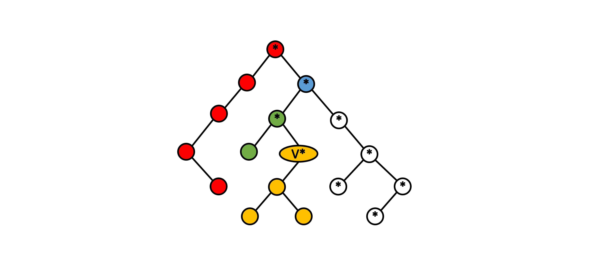
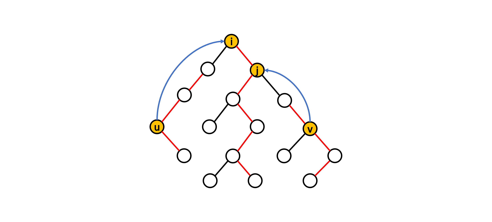

# Lowest Common Ancestor (LCA)

## 前言

在此章節中，我們會介紹經典的最近共同祖先（LCA）問題且分析幾種常見的尋找 LCA 的方法。此外，本章節也會提及 LCA 問題與另一經典問題（Range Minimum Query）之間的轉化。

## 定義

給定一棵有 \\( N \\) 個節點的有根樹，對於樹中任一點對 \\( (u,\ v) \\)，其最近共同祖先為同為點 \\( u \\) 和點 \\( v \\) 的祖先中深度最深的點，這邊我們定義點的深度為點到根路徑上所經過的邊數且自己為自己的祖先（為了方便之後討論）。

## 經典題型

> [CSES - Company Queries II](https://cses.fi/problemset/task/1688)
>
> 給定一間擁有 \\( N \\) 名員工的公司且該公司具有樹狀層級制度。除了總經理以外，每名員工都配有一名上司，而你的任務是要處理以下形式的 \\( Q \\) 次查詢：
>
> - 給定 \\( a \\) 和 \\( b \\)，請輸出員工 \\( a \\) 和員工 \\( b \\) 的最近共同上司。
>
> - \\( N, Q \leq 2 \times 10^5 \\)

基本上此問題就是在問樹上兩點的最近共同祖先為何，下面我們將介紹幾種常見的作法。

## 常見作法

### Brute Force

一個直觀的做法是先從根開始作一次 DFS，確認出每個點的深度以及父節點（根的父節點？）。再來藉由預處理過的資訊，把所求點對 \\( (u,\ v) \\) 中深度較深的點先順著其父節點往上抬升到與深度較淺的點同深度。此時，若兩點相同則代表找到了 LCA。若不同，我們則需要將兩點繼續往上抬升直到兩點相同為止。

總結一下此作法的時間複雜度：

- 預處理
    - DFS 一次求出每個點的點深度以及父節點：\\( O(N) \\)

- 單次查詢
    - 對於點對 \\( (u,\ v) \\)，將深度較深的點抬升至與另一點同深度：\\( O(N) \\)
    - 兩點繼續往上抬升（如果需要）：\\( O(N) \\)

此作法需要花費 \\( O(NQ) \\) 的時間完成所有查詢。

<details><summary> Sample Code </summary>

- 用 adjacency list 來儲存樹的結構。
- `depth[i]` 代表第 \\( i \\) 個節點的深度。
- `parent[i]` 代表第 \\( i \\) 個節點的父節點。
- 樹的根為點 \\( 1 \\) 且根的父節點為 \\( -1 \\)。

```cpp
#include <bits/stdc++.h>
using namespace std;

int main() {
  ios::sync_with_stdio(0);
  cin.tie(0);

  int N, Q;
  cin >> N >> Q;

  vector<int> depth(N + 1, 0), parent(N + 1);
  vector<vector<int>> adj(N + 1);

  for (int i = 2; i <= N; ++i) {
    int p;
    cin >> p;
    adj[i].push_back(p);
    adj[p].push_back(i);
  }

  function<void(int)> dfs = [&](int u) -> void {
    for (int v : adj[u]) {
      if (v == parent[u]) continue;
      depth[v] = depth[u] + 1;
      parent[v] = u;
      dfs(v);
    }
  };

  dfs(1);

  auto jump = [&](int u, int distance) -> int {
    while (distance--) u = parent[u];
    return u;
  };

  auto LCA = [&](int u, int v) -> int {
    if (depth[u] > depth[v]) swap(u, v);
    v = jump(v, depth[v] - depth[u]);
    while (u != v) {
      u = parent[u], v = parent[v];
    }
    return u;
  };

  for (int i = 0; i < Q; ++i) {
    int u, v;
    cin >> u >> v;
    cout << LCA(u, v) << "\n";
  }

  return 0;
}
    
```

</details>

直觀的做法通常很慢，我們可以觀察到在上述做法當中點的抬升是順著父節點一個點一個點慢慢往上，導致抬升的時間複雜度為線性。對於上述問題的 problem size 來說，是一定會吃 TLE 的。因此，我們接下來要介紹的做法 Binary Lifting，中文稱作倍增法，即是針對這一點去做優化。

### Binary Lifting
    
已知對於任意正整數，我們可以將其表示為二進位的數字。舉例來說，\\( 13 = 1101_2 = 2^3 + 2^2 + 2^0 \\)。基於這個概念，我們可以用來優化點的抬升。假設抬升距離為 13，我們可以將點分別抬升距離 1、4 和 8。相較於每次都是距離 1 的抬升，此種做法可以大幅減少抬升的時間複雜度至 \\( O(\log N) \\)。

然而想要完成這種抬升，我們需要在預處理時多紀錄每個點的第 \\( 2^i \\) 個祖先的資訊 \\( (0\leq i\leq\lceil\log N\rceil) \\)，實作上我們可以利用 Dynamic Programming 的概念。假設我們想知道點 \\( u \\) 的第 \\( 2^i \\) 個祖先是誰，我們可以將問題等同於點 \\( u \\) 的第 \\( 2^{i-1} \\) 個祖先的第 \\( 2^{i-1} \\) 個祖先是誰，聽起來有點饒口，我們直接看示意圖：
    

    
根據這個想法，我們可以列出下列遞迴關係式：
    
$$
    ancestor(u,\ i)= 
    \begin{cases}
        parent(u) & \text {if $i = 0$}
        \newline
        ancestor(ancestor(u,\ i-1),\ i-1) & \text{if $i > 0$}
    \end{cases} 
$$
    
這邊 \\( ancestor(u,\ i) \\) 代表點 \\( u \\) 的第 \\( 2^i \\) 個祖先。
    
利用上述關係式解 DP，我們可以在 \\( O(N\log N) \\) 的時間內預處理完所有點的第 \\( 2^i \\) 個祖先的資訊，進而降低抬升的時間複雜度。
    
除了抬升的優化以外，對於等深度的兩點找 LCA 本身具有單調性，直覺上可以利用二分搜來加速。但在稍早提到的直觀做法當中，我們並沒有提到相關的操作。原因是因為在直觀做法當中，我們只記錄了每個點的父節點的資訊，在處理二分搜的檢查函數上會花費線性的時間，導致整個二分搜的時間複雜度為 \\( O(N\log N) \\)，明顯沒有比較快。
    
然而對於倍增法來說，因為我們預處理了所有點的第 \\( 2^i \\) 個祖先的資訊，所以我們可以在 \\( O(1) \\) 常數時間內處理完二分搜的檢查函數，進而讓整體二分搜的時間複雜度降至 \\( O(\log N) \\)，相較起來快上許多。
    
總結一下整個做法：
    
- 預處理
    - DFS 一次求出每個點的點深度以及父節點：\\( O(N) \\)
    - 解 DP 找出所有點的第 \\( 2^i \\) 個祖先 \\( (0\leq i\leq\lceil\log N\rceil) \\)：\\( O(N\log N) \\)

- 單次查詢
    - 對於點對 \\( (u, v) \\)，將深度較深的點抬升至與另一點同深度：\\( O(\log N) \\)
    - 二分搜找出等深度兩點的 LCA （如果需要）：\\( O(\log N) \\)

因此，此作法可以在 \\( O((N+Q)\log N) \\) 的時間內完成所有查詢。
 
<details><summary> Sample Code </summary>

- `depth[i]` 代表第 \\( i \\) 個節點的深度。
- `ancestor[i][j]` 代表第 \\( i \\) 個節點的第 \\( 2^j \\) 個祖先。
- 樹的根為點 \\( 1 \\) 且根的所有祖先節點均為 \\( -1 \\)。

```cpp
#include <bits/stdc++.h>
using namespace std;

int main() {
  ios::sync_with_stdio(0);
  cin.tie(0);

  int N, Q;
  cin >> N >> Q;

  const int logN = ceil(log2(N));

  vector<int> depth(N + 1, 0);
  vector<vector<int>> ancestor(N + 1, vector<int>(logN + 1));
  vector<vector<int>> adj(N + 1);

  for (int i = 2; i <= N; ++i) {
    int p;
    cin >> p;
    adj[i].push_back(p);
    adj[p].push_back(i);
  }

  function<void(int, int)> dfs = [&](int u, int p) -> void {
    ancestor[u][0] = p;

    for (int i = 1; i <= logN; ++i) {
      ancestor[u][i] =
          ~ancestor[u][i - 1] ? ancestor[ancestor[u][i - 1]][i - 1] : -1;
    }

    for (int v : adj[u]) {
      if (v == ancestor[u][0]) continue;
      depth[v] = depth[u] + 1;
      dfs(v, u);
    }
  };

  dfs(1, -1);

  auto jump = [&](int u, int distance) -> int {
    for (int i = 0; i <= logN; ++i)
      if (distance & 1 << i) u = ancestor[u][i];

    return u;
  };

  auto LCA = [&](int u, int v) -> int {
    if (depth[u] > depth[v]) swap(u, v);
    v = jump(v, depth[v] - depth[u]);

    if (u == v) return u;

    for (int i = logN; ~i; --i) {
      if (ancestor[u][i] != ancestor[v][i]) {
        u = ancestor[u][i], v = ancestor[v][i];
      }
    }

    return ancestor[u][0];
  };

  for (int i = 0; i < Q; ++i) {
    int u, v;
    cin >> u >> v;
    cout << LCA(u, v) << "\n";
  }

  return 0;
}

```

</details>
    
上述的兩種做法都是基於比較直觀的想法來實作及優化，我們接下來要介紹一些比較沒那麼直覺的作法。
    
### Tarjan's Offline Algorithm
    
在介紹此作法之前，我們先提及一個最近共同祖先的特性。對於圖中任意點 \\( i \\) 來說，如果點 \\( u \\) 和點 \\( v \\) 分別存在於點 \\( i \\) 的兩個不同子樹內，那麼點 \\( i \\) 會是點對 \\( (u,\ v) \\) 的最近共同祖先。此外，點 \\( i \\) 也會是點對 \\( (i,\ j) \\) 的最近共同祖先（如果點 \\( i \\) 和點 \\( j \\) 為祖孫關係），不是很理解的讀者可以看以下示意圖：
    

    
Case 2 明顯正確，這邊我們不細講，我們把目光放在證明 Case 1 上。在 Case 1 中，點 \\( u \\) 和點 \\( v \\) 分別存在於點 \\( i \\) 的兩個不同子樹內，可知點 \\( i \\) 是點 \\( u \\) 和點 \\( v \\) 的共同祖先，而任何深度大於點 \\( i \\) 的點只會最多存在於其的一顆子樹內，不可能同時為點 \\( u \\) 和點 \\( v \\) 的祖先。因此，點 \\( i \\) 會是點 \\( u \\) 和點 \\( v \\) 的最近共同祖先。
    
基於上述兩個 Case，如果對於任意點對 \\( (u,\ v) \\)，我們可以有效率地找到對應的點 \\( i \\) 使得點 \\( u \\) 和點 \\( v \\) 存在於點 \\( i \\) 的兩個不同子樹內，抑或是確認點 \\( u \\) 和點 \\( v \\) 是否具有祖孫關係，那麼我們就可以知道點 \\( u \\) 和點 \\( v \\) 的最近共同祖先。而此小節要介紹的 Tarjan's offline algorithm 則是基於此想法所衍生出的演算法。
    
#### How to efficiently find the point \\( i \\) ?

Tarjan 提出的想法是利用 DSU 去維護子樹的結構，並且用一陣列去記錄集合中深度較淺的點，這邊我們稱其為集合的祖先節點。一開始，所有點都位於一個獨立的 disjoint set 且集合的祖先節點為自己本身，共 \\( N \\) 個集合。接著利用 DFS 去走訪所有點，在 DFS 的走訪過程中，每當一個點走訪完其所有子樹的節點返回其父節點 \\( p \\) 時，將此點所處於的 disjoint set 和點 \\( p \\) 所處於的 disjoint set 合併，並同時把合併後的集合的祖先節點設為點 \\( p \\)。
    
對於任意點對 \\( (u,\ v) \\)，假設點 \\( v \\) 剛剛走訪完其所有子樹的節點並準備返回其父節點，同時點 \\( u \\) 已經是走訪過的狀態。根據 Tarjan 的想法，此時我們可以知道點對 \\( (u,\ v) \\) 的最近共同祖先為點 \\( u \\) 所在的集合的祖先節點。
    
#### Does Tarjan's idea work？

根據 Tarjan 的想法，如果 DFS 走訪處於點 \\( v \\) 剛走訪完其所有子樹節點且尚未返回其父節點的狀態，那麼獨立集的分布會如同下圖所示：
    

    
上圖中，白色節點為尚未走訪過的節點，每個白色節點會分處不同的 disjoint set。而有著相同顏色的非白節點則代表處於同一個 disjoint set，標星號的節點為其所處 disjoint set 的祖先節點。值得注意的是，對於此狀態來說，點 \\( v \\) 的祖先們會分別處於不同的 disjoint set 且均為所處集合的祖先節點，這邊讀者可以想一下為什麼。
    
根據上圖，我們可知當前狀態的 disjoint set 分布有點 \\( v \\) 所處的集合一個、點 \\( v \\) 的祖先們所處的集合各一個、尚未被走訪過的節點各一個。因此，如果此時點 \\( u \\) 處於走訪過的狀態，可知點 \\( u \\) 會和點 \\( v \\) 或是某個點 \\( v \\) 的祖先處於同一個 disjoint set，示意圖如下：


對於 Case 1，點 \\( u \\) 處於某個點 \\( v \\) 的祖先 \\( p \\) 所處的集合且點 \\( p \\) 為該集合的祖先節點，代表說點 \\( u \\) 存在於點 \\( p \\) 的某個子樹內且該子樹已經走訪完畢並返回點 \\( p \\) 合併了，抑或是點 \\( u \\) 即為點 \\( p \\)。對於前者，可知點 \\( u \\) 和點 \\( v \\) 會分處點 \\( p \\) 的兩個不同子樹內，點 \\( p \\) 為點對 \\( (u,\ v) \\) 的最近共同祖先。而對於後者，點 \\( u \\) 和點 \\( v \\) 為祖孫關係，點 \\( u \\) 為點對 \\( (u,\ v) \\) 的最近共同祖先。
    
而對於 Case 2，點 \\( u \\) 處於點 \\( v \\) 所處的集合當中且點 \\( v \\) 為該集合的祖先節點，代表說點 \\( u \\) 存在於點 \\( v \\) 的某個子樹內且該子樹已經走訪完畢並返回點 \\( v \\) 合併了。因此，可知點 \\( v \\) 和點 \\( u \\) 為祖孫關係，點 \\( v \\) 為點對 \\( (u,\ v) \\) 的最近共同祖先。
    

在以上兩種 Case 當中，可以發現點 \\( u \\) 所在的集合的祖先節點均為所求點對 \\( (u,\ v) \\) 之最近共同祖先，因此 Tarjan 的想法是正確的。至於為什麼此演算法會是 offline，因為 Tarjan 的想法是在 DFS 的走訪過程中去觀察子樹的結構。如果事先不知道查詢點對為何，我們就無法在走訪過程中去檢查點對之間的關係。
    
總結一下此作法的時間複雜度：

- 初始化每個點的 disjoint set 和每個集合的祖先節點：\\( O(N) \\)
- DFS 走訪所有點：\\( O(N) \\)
- 每當一點 \\( v \\) 走訪完其所有子樹節點時，檢查所有形式為 \\( (u,\ v) \\) 的查詢點對，點 \\( u \\) 是否已是走訪過的狀態。如果已走訪過，則將當前查詢點對的最近共同祖先設為點 \\( u \\) 所處集合的祖先節點：\\( O(Q\alpha(N)) \\) --- 每個查詢點對只會被檢查兩次。
- 接著返回其父節點 \\( p \\) 時，將點 \\( v \\) 所處集合和點 \\( p \\) 所處集合合併，並將合併集合的祖先節點設為點 \\( p \\)：\\( O(N\alpha(N)) \\) --- 至多合併 \\( N \\) 次。

以上所有 DSU 的操作都有用 union-by-size 和 path compression 來優化。因此針對 offline 的查詢，Tarjan's algorithm 可以有效率地在 \\( O((N+Q)\alpha(N)) \\) 的時間內完成，相當趨近於線性時間。
    
<details><summary> Sample Code </summary>

- 用 adjacency list 來儲存樹的結構。
- `ancestor[i]` 代表有著節點 \\( i \\) 作為 representative 的集合的祖先節點。
- `query[i]` 存放所有滿足點對 \\( (i,\ j) \\) 為查詢點對的點 \\( j \\) 以及相對應是第幾個查詢點對。
- `vis[i]` 代表點 \\( i \\) 是否被走訪過。
- `LCA[i]` 代表第 \\( i \\) 個查詢點對的最近共同祖先。

```cpp
#include <bits/stdc++.h>
using namespace std;

struct DSU {
  int N;
  vector<int> parent, size;
  DSU(int N) : N(N) {
    parent.resize(N + 1);
    size.resize(N + 1, 1);
    for (int i = 1; i <= N; ++i) {
      parent[i] = i;
    }
  }
  int find(int x) { return x == parent[x] ? x : parent[x] = find(parent[x]); }
  void unite(int u, int v) {
    u = find(u), v = find(v);
    if (size[u] > size[v]) swap(u, v);
    parent[u] = v;
    size[v] += size[u];
  }
};

int main() {
  ios::sync_with_stdio(0);
  cin.tie(0);

  int N, Q;
  cin >> N >> Q;

  vector<vector<pair<int, int>>> query(N + 1);
  vector<vector<int>> adj(N + 1);
  vector<int> ancestor(N + 1), LCA(Q);
  vector<bool> vis(N + 1, false);

  DSU dsu(N);

  function<void(int)> dfs = [&](int u) -> void {
    vis[u] = 1;
    ancestor[u] = u;

    for (int v : adj[u]) {
      if (vis[v]) continue;
      dfs(v);
      dsu.unite(u, v);
      ancestor[dsu.find(u)] = u;
    }

    for (auto q : query[u]) {
      int v = q.first, query_num = q.second;
      if (!vis[v]) continue;
      LCA[query_num] = ancestor[dsu.find(v)];
    }
  };

  for (int i = 2; i <= N; ++i) {
    int p;
    cin >> p;
    adj[i].push_back(p);
    adj[p].push_back(i);
  }

  for (int i = 0; i < Q; ++i) {
    int u, v;
    cin >> u >> v;
    query[u].push_back({v, i});
    query[v].push_back({u, i});
  }

  dfs(1);

  for (int i = 0; i < Q; ++i) {
    cout << LCA[i] << "\n";
  }

  return 0;
}
```                    
</details>
    
### Heavy Path Decomposition（待補）

此小節主要關注於如何利用樹重鏈剖分的概念來查詢點對的最近共同祖先，如果讀者對於樹重鏈的定義以及其相關操作還不太清楚的話，建議可以先去觀看相對應的章節。
    
這邊我們簡單 recap 一下何謂重鏈，對於一點 \\( u \\) 的子節點 \\( v \\)，如果以點 \\( v \\) 為根的子樹是所有點 \\( u \\) 子樹中 size 最大的，我們稱點 \\( v \\) 為重小孩，點 \\( u \\) 和點 \\( v \\) 相連的邊稱作重邊，由重邊相連所形成的路徑則稱作重鏈，示意圖如下（紅色路徑為重鏈）：


根據定義或是觀察上圖，我們可以知道處於同一重鏈上的任意兩點會具有祖孫關係。藉由此特性，我們可以用來查詢任意點對的最近共同祖先。怎麼得出這個結論的呢？以下我們分成兩種 Case 來討論：
    


對於 Case 1，點 \\( u \\) 和點 \\( v \\) 位於同一重鏈上，兩點具有祖孫關係。因此我們可以知道點 \\( u \\) 為點對 \\( (u,\ v) \\) 的最近共同祖先。
    
而對於 Case 2，點 \\( u \\) 和點 \\( v \\) 位於不同重鏈上，我們可以透過跳輕邊將點 \\( u \\) 和點 \\( v \\) 調整至同一條重鏈上。假設經過跳輕邊調整之後，點 \\( u \\) 和點 \\( v \\) 分別跳至點 \\( i \\) 和點 \\( j \\)，我們可以得到以下資訊：

- 點 \\( i \\) 和點 \\( j \\) 為祖孫關係，因為位於同一條重鏈上。
- 點對 \\( (u,\ i) \\) 和點對 \\( (v,\ j) \\) 分別為祖孫關係。

沒有頭緒的讀者可以看以下示意圖：



從上述資訊可知，點 \\( i \\) 為點 \\( u \\) 和點 \\( v \\) 的共同祖先。

## References

- [https://cp-algorithms.com/graph/lca.html](https://cp-algorithms.com/graph/lca.html)
- [https://cp-algorithms.com/graph/lca_binary_lifting.html](https://cp-algorithms.com/graph/lca_binary_lifting.html)
- [https://cp-algorithms.com/graph/lca_tarjan.html](https://cp-algorithms.com/graph/lca_tarjan.html)
- [解决LCA问题的三种算法](https://blog.csdn.net/qq_43549984/article/details/100144030?spm=1001.2101.3001.6650.2&utm_medium=distribute.pc_relevant.none-task-blog-2%7Edefault%7EBlogCommendFromBaidu%7ERate-2-100144030-blog-7836649.235%5Ev32%5Epc_relevant_increate_t0_download_v2&depth_1-utm_source=distribute.pc_relevant.none-task-blog-2%7Edefault%7EBlogCommendFromBaidu%7ERate-2-100144030-blog-7836649.235%5Ev32%5Epc_relevant_increate_t0_download_v2&utm_relevant_index=5)
- [https://oi-wiki.org/graph/lca/](https://oi-wiki.org/graph/lca/)
- [https://web.ntnu.edu.tw/~algo/Tree2.html#1](https://web.ntnu.edu.tw/~algo/Tree2.html#1)